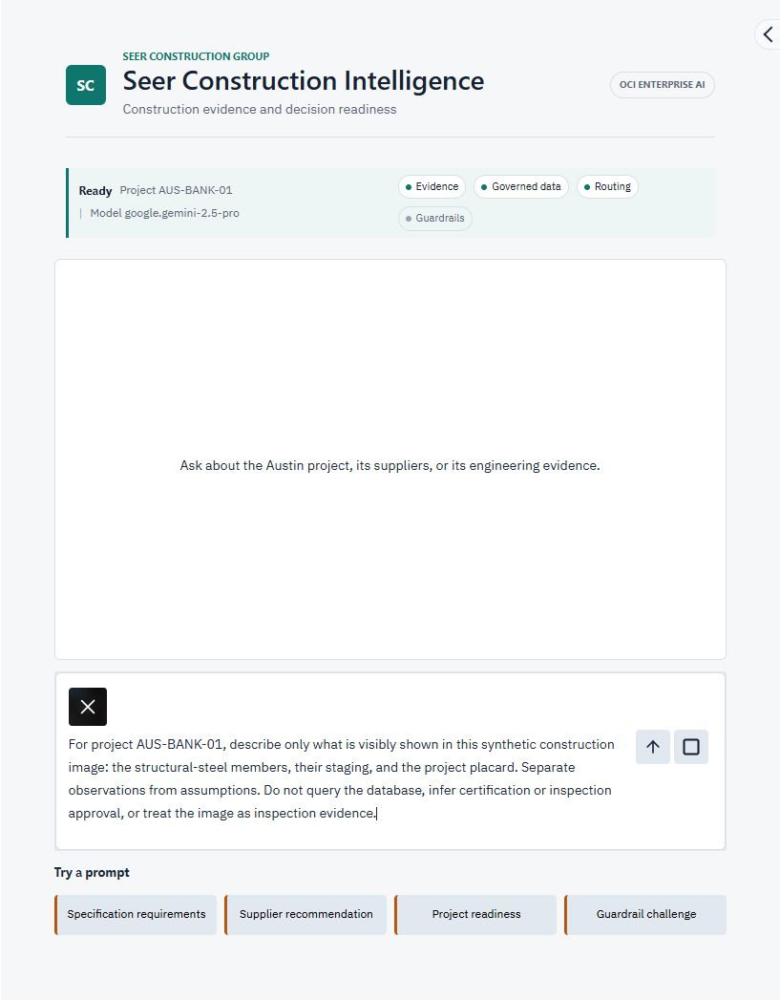

# Lab 4: Model Optimization

## Introduction

In this lab, you enable model routing in Seer Construction Intelligence. Build-path participants implement the routing decision in Python; Launch-path participants enable the equivalent capability in the running application. Text-only questions use the lower-cost model, while image prompts remain on the stronger multimodal model.

Estimated Time: 15 minutes

### Objectives

- Establish a single-model baseline
- Implement or configure a text-versus-image routing decision
- Compare text and image workloads
- Optionally evaluate another model

### Prerequisites

- A running application from Lab 3A or Lab 3B
- Access to both configured models in the workshop region

Follow only the subsection for your chosen application path in Task 2. **Launch (Lab 3B)** uses the running application's configuration panel and requires no Python file edits or completion of Lab 3A. **Build (Lab 3A)** uses your downloaded local sample-app folder and code editor.

## Task 1: Record the baseline

1. Open **Runtime configuration** on the right side of the Launch application. Enable **Specification search** and **Governed project data**, and leave **Model routing** and **Prompt-injection protection** disabled for the baseline. Close the panel and confirm that the runtime bar shows **Routing** disabled. In the Build path, confirm the equivalent `.env` settings, including `OCI_GENAI_MODEL_ROUTING_ENABLED=false`, and restart the local app if you changed them.

2. Select **Supplier recommendation**, submit the prompt, and record the model shown in the runtime bar and the approximate response time.

3. Download the [synthetic structural-steel delivery image](images/austin-steel-delivery-synthetic-consteng.png). Start a fresh conversation (**Reset conversation** in Launch), use the paperclip in the prompt composer to attach the downloaded image, and submit the following prompt. Record the selected model and approximate response time.

    

    ```text
    <copy>
    For project AUS-BANK-01, describe only what is visibly shown in this synthetic construction image: the structural-steel members, their staging, and the project placard. Separate observations from assumptions. Do not query the database, infer certification or inspection approval, or treat the image as inspection evidence.
    </copy>
    ```

    The placard matches the seeded project, asset `STR-AUS-STEEL-01`, supplier Atlas Structural Fabrication, and purchase order `PO-88142`. The image is synthetic, not inspection evidence. Supplier status and readiness must come from governed data; a photograph cannot establish certification, material grade, acceptance, or structural safety.

    Confirm that the attachment preview appears before submitting. Expect observations about the steel, staging, and placard, with assumptions identified separately. Use the same image and prompt for the routed comparison in Task 3. Keep the visual task separate from a database question so the answer does not skip the image description in favor of supplier records.

## Task 2: Enable model routing

### Build path: implement the routing decision

1. In the terminal running your Build application, press Ctrl+C. In your code editor, use **File > Open Folder** to open the extracted sample-app folder from Lab 3A (the folder containing `app.py`, `llm.py`, and `.env`). Open `llm.py` from the editor's file list. Do not edit the ZIP archive or a file in Cloud Shell; these are your local Build files.

2. Find `response_model`. The starter always returns the primary model. Add the following decision immediately below the function definition, indented four spaces so it is inside the function. Keep the existing image-capability check and `return model` below it:

    ```python
    <copy>
    if cfg.get("model_routing_enabled") and not messages_include_images(messages):
        model = cfg.get("cheaper_model") or model
    </copy>
    ```

    This sends text-only requests to the lower-cost model while preserving the multimodal model for image input.

3. In `.env`, set:

    ```text
    <copy>
    OCI_GENAI_MODEL_ROUTING_ENABLED=true
    </copy>
    ```

4. Save both files and restart the application with `python app.py`.

### Launch path: enable the packaged routing policy

1. Open **Runtime configuration** from the right side of the application.

2. Enable **Model routing**. The runtime bar immediately shows **Routing** enabled.

    

3. Close the configuration panel. The same running application and conversation remain available; no restart or replacement Container Instance is required.

## Task 3: Test the routing policy

1. Select **Supplier recommendation** and submit the prompt.

2. Confirm that the runtime bar reports the lower-cost text model for this text-only request.

3. Start another fresh conversation, attach the **same synthetic structural-steel delivery image from Task 1**, and submit the **same prompt**. Confirm that the attachment preview appears and the stronger multimodal model is selected. Compare visible observations with the baseline; do not use an unrelated image from outside the construction-project scope.

    

    A complete answer should describe visible features of the image and distinguish observations from assumptions. A database-only answer is not a successful image-analysis result, even when the selected model is correct.

    After recording the image result, submit this separate text-only follow-up:

    ```text
    <copy>
    For project AUS-BANK-01, return the recommended suppliers with recommendation status, fit score, risk level, and explanation. Do not aggregate document names.
    </copy>
    ```

    Expect governed supplier records and supporting evidence, rather than a conclusion based only on the picture. Routing is based on the current submission: a text-only follow-up can use the lower-cost model even when an earlier message contained an image. Attach the image again in a fresh conversation when comparing image workloads.

    If generated SQL is rejected by the application's project-scope safety check, do not weaken the check or treat the response as proof that data is missing. Reset the conversation, use this narrower supplier prompt, and record the rejection for the facilitator. Open-ended readiness questions can produce more complex SQL than this exercise requires.

    If the assistant refuses this relevant construction image, record the prompt, selected model, and response, then contact the facilitator. Do not interpret refusal as successful image analysis or disable security controls to force an answer.

4. Compare capability, latency, response depth, and grounding with the baseline. Use the same prompts and start a new conversation for each comparison so that earlier image attachments and conversation history do not affect model selection or token usage.

    | Workload | Routing disabled: model / response time | Routing enabled: model / response time | Evidence quality and capability |
    | --- | --- | --- | --- |
    | Supplier recommendation (text only) | | | |
    | Construction image (same image and prompt) | | | |

5. Discuss the cost trade-off: routing moves eligible text requests to the configured lower-cost model while preserving the stronger model for images. The runtime bar shows model selection, not billable token counts. Response time is not a proxy for cost; do not claim a measured saving from latency alone.

6. **Optional quantitative comparison:** If you have captured token usage for every model call, look up the current input and output prices for those exact models on the [Oracle Cloud price list](https://www.oracle.com/cloud/price-list/). Record the model, price date, currency, and unit. For prices per one million tokens, calculate:

    ```text
    Call cost = (input tokens x input price + output tokens x output price) / 1,000,000
    Run cost = sum of call costs for all model calls in that run
    Saving (%) = 100 x (baseline run cost - routed run cost) / baseline run cost
    ```

    Calculate the savings percentage only when the baseline cost is greater than zero. If a model uses another billing unit, use that unit and its corresponding usage instead of the token formula.

    Include tool follow-up calls, not just the final response. Apply any separately priced image input, caching, or service charges according to the model's pricing rules. The packaged app does not currently display complete per-call usage, so a numerical savings calculation is optional and requires separately collected usage; otherwise report the qualitative trade-off only.

## Task 4: Optional additional-model experiment

1. Choose another text-capable model available in the workshop region.

2. For the Build path, set `OCI_GENAI_CHEAPER_MODEL` in `.env` and restart the local app. For the Launch path, edit the generated helper's `CHEAPER_MODEL` value and launch a separate experiment instance.

3. Run the same governed-data prompt across the candidates and record latency, evidence quality, and relative cost. Keep image input on a model that explicitly supports images.

4. Delete an experiment instance when you finish. The workshop's main Launch instance does not need to be replaced for the standard routing exercise.

You may now proceed to Lab 5.

## Learn More

- [OCI Generative AI models](https://docs.oracle.com/en-us/iaas/Content/generative-ai/pretrained-models.htm)

## Acknowledgements

- **Author** — Julien Lehmann - Product Marketing Manager, Yanir Shahak - Senior Principal Software Engineer
- **Contributors** — Oracle LiveLabs Platform Team
- **Last Updated By/Date** — Eli Schilling, October 2026
