# Virtual Machine Deployment

## Introduction

Estimated Lab Time: 20 minutes

### Objectives

In this lab, you will:

* Prepare Cloud Shell
* Launch a Virtual Machine
* Connect to the Virtual Machine
* Test Connectivity

### Prerequisites

* Tasks from the previous labs are completed.
* Appropriate permissions to deploy a Virtual Machine.

### Video Walkthrough

[Quickstart Video](youtube:8WWpGHxvhw4:large)

## Task 1: Prepare Cloud Shell

1. Go to the top right hand corner of the UI and click on **Developer Tools -> Cloud Shell**
    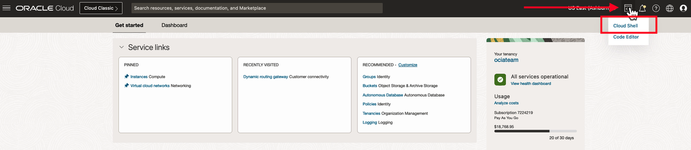
2. If you are prompted to start a Cloud Shell tutorial, type in **n** and press enter.
    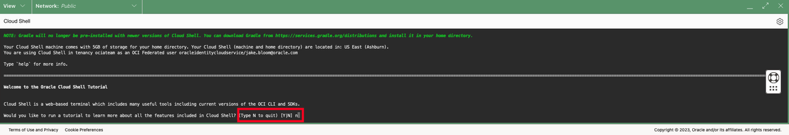
3. Generate a new SSH key by running the **ssh-keygen** command. Leave all of the values as their default (empty).
    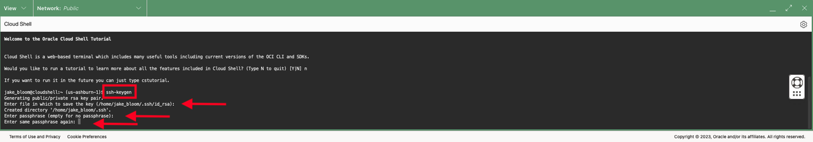
4. Run **cat ~/.ssh/id_rsa** to copy the contents of the public key to your clipboard. The SSH Public Key will be used in the next task when creating a virtual machine so that we can authenticate over SSH.
    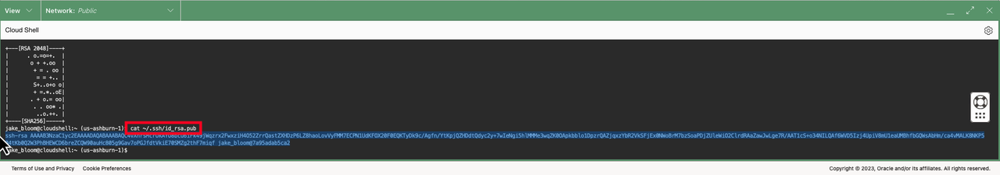

## Task 2: Launch a Virtual Machine

1. From the Navigation Menu, under **Compute**, click on **Instances**.
    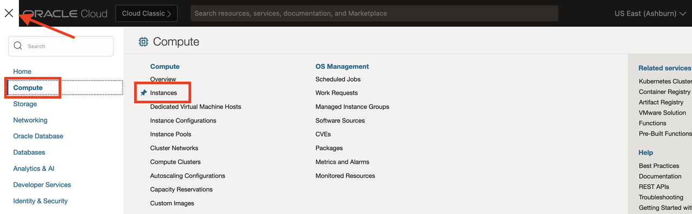
2. On the **Create Instance**
    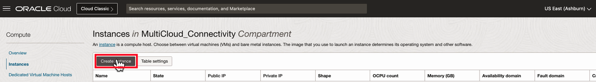
3. Set a **Name** and the **Compartment** for the instance.
    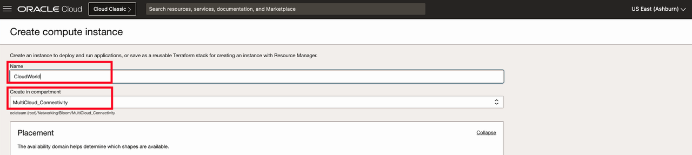
4. Verify the Network Configuration:
    * Under **Networking: Virtual Cloud Network** - Verify the correct compartment and select the **VCN created in Lab 1**.
    * Under **Networking: Subnet** , **Select an existing subnet** and select the the Public Subnet of the VCN.
    * Under **Public IPv4 Address** - Select "Assign a Public IPv4 Address".
        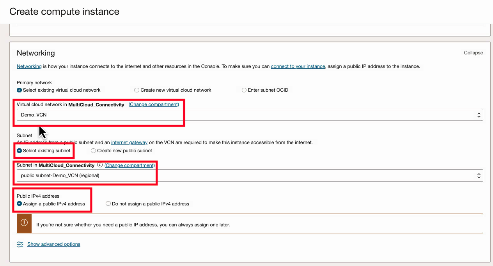
5. Under **Add SSH Keys**, select "Paste Public Keys" and paste the public key you created from the Cloud Shell instance from the first task in this lab.
    
6. Click **Create**.
    
7. Once the Virtual Machine is "Running", copy the **Public IPv4 Address**, and note that the username of the instance is **opc**.
    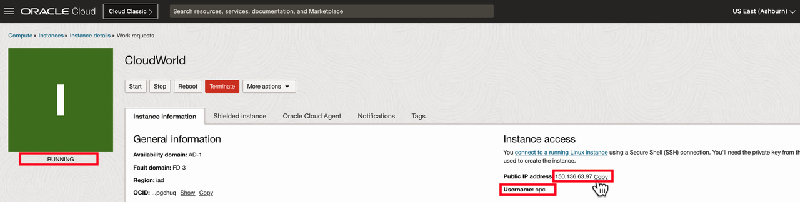

## Task 3: Log into the Virtual Machine with Cloud Shell

1. In the bottom left corner of the UI, click on **Restore** to restore the Cloud Shell session.
    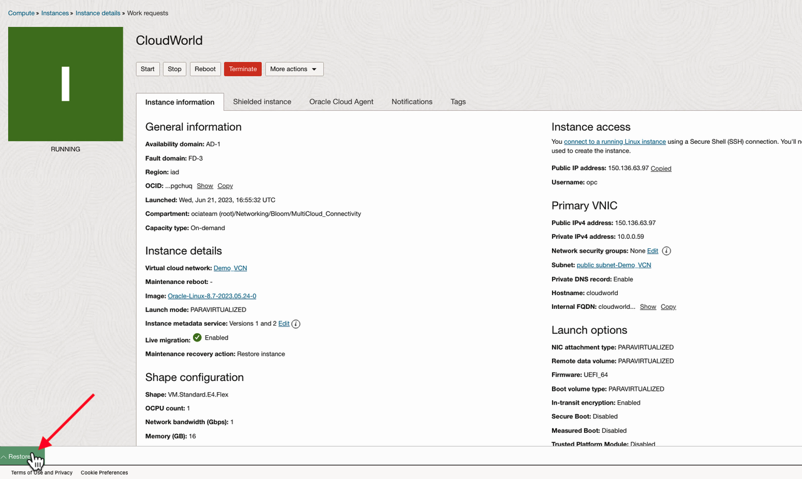
2. Run the following command **ssh opc@_publicip_** where **_publicip_** is the public IP address of your Virtual Machine. Accept the ECDSA fingerprint. You are now connected to the Virtual Machine with SSH through Cloud Shell.
    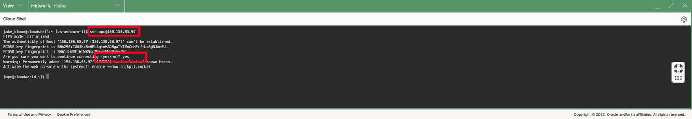
3. You may now **proceed to the next lab**.

## Acknowledgements

* **Author** - <Name, Title, Group> Jake Bloom, Principal Solution Architect, OCI Networking
* **Last Updated By/Date** - <Name, Month Year> Jake Bloom, August 2023
