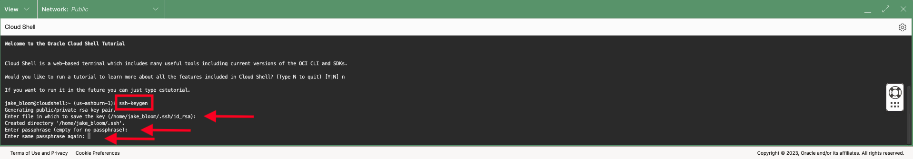
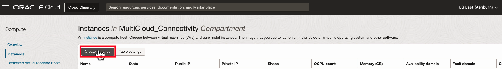
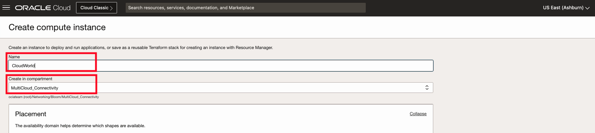
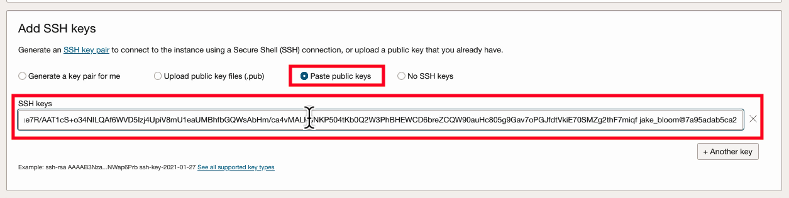
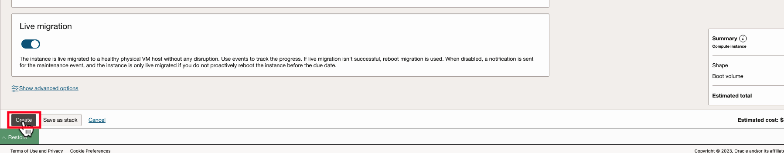
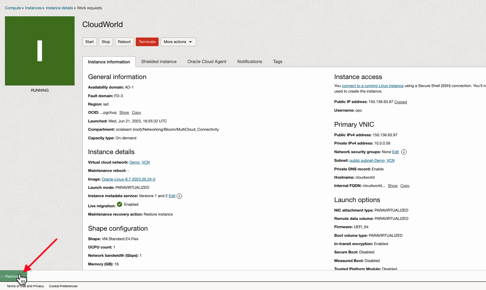

# Verify MultiCloud Connectivity

## Introduction

In this lab we will deploy the a Virtual Machine and then use it to test and verify connectivity over the FastConnect. Be aware that this lab will connect to Azure as the 3rd party cloud provider. The steps to connect other cloud providers such as AWS and GCP will follow a similar process.

Estimated Lab Time: 20 minutes

### Objectives

In this lab, you will:

* Prepare Cloud Shell
* Launch a Virtual Machine within the VCN created in Lab 1
* Connect to the Virtual Machine
* Test Connectivity

## Task 1: Prepare CloudShell

1. Go to the top right hand corner of the UI and click on **Developer Tools -> Cloud Shell**
    

2. If you are prompted to start a Cloud Shell tutorial, type in **n** and press enter.

    

3. Generate a new SSH key by running the **ssh-keygen** command. Leave all of the values as their default (empty).
    
    

4. Run **cat ~/.ssh/id_rsa** to copy the contents of the public key to your clipboard. This will be used in the next step when creating a virtual machine.
    

## Task 2: Launch a Virtual Machine

1. From the Navigation Menu, under **Compute**, click on **Instances**.

    

2. On the **Create Instance**

    

3. Set a Name and lab Compartment for the instance.

    

4. Verify the Network Configuration:

    1. Under **Networking: Virtual Cloud Network** - Verify the correct compartment and select the VCN created earlier in the lab.
    2. Under **Networking: Subnet** , **Select an existing subnet** and select the the Public Subnet of the VCN created earlier in the lab.
    3. Under **Public IPv4 Address** - Select "Assign a Public IPv4 Address".

    

5. Under **Add SSH Keys**, select "Paste Public Keys" and paste the public key you created from the Cloud Shell instance from the first task in this lab.

    

6. Click **Create**.

    

7. Once the Virtual Machine is "Running", copy the **Public IPv4 Address**, and note that the username of the instance is **opc**.

    

## Task 3: Log into the Virtual Machine with Cloud Shell

1. In the bottom left corner of the UI, click on **Restore** to restore the Cloud Shell session.

    

2. Run the following command **ssh opc@_publicip_** where *publicip* is the public IP address of your Virtual Machine. Accept the ECDSA fingerprint. You are now SSH'd into the Virtual Machine via Cloud Shell. In the next step we will run a series of tests to verify connectivity with the 3rd party cloud provider.

    

## Video Walkthrough

Virtual Machine QuickStart:[Quickstart Video](youtube:8WWpGHxvhw4:large)