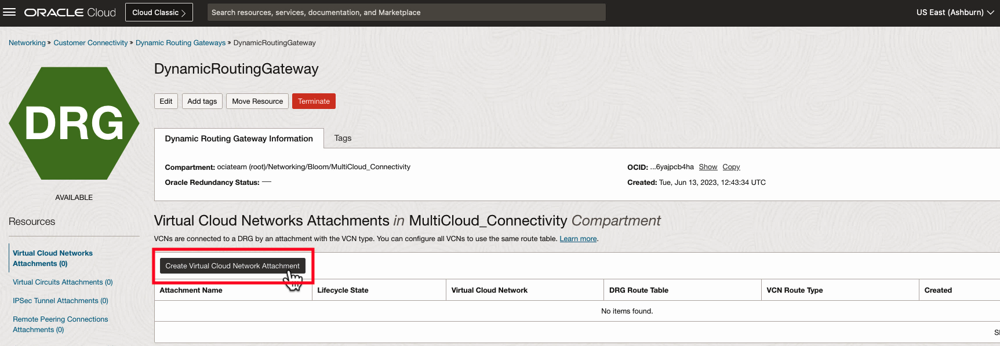
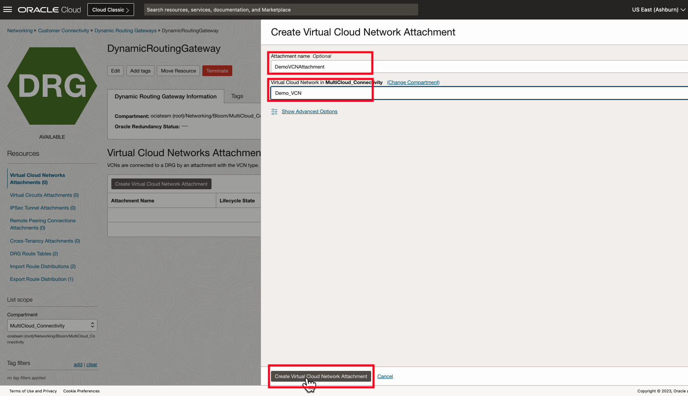

# Dynamic Routing Gateway Deployment

## Introduction

Estimated Lab Time: 10 minutes

### About Dynamic Routing Gateway (DRG)

A DRG acts as a virtual router, providing a path for traffic between your on-premises networks, cloud provider infrastructure and VCNs, and can also be used to route traffic between VCNs. Using different types of attachments, custom network topologies can be constructed using components in different regions and tenancies. Since the DRG is a logical construct, it has redundancy backed by physical hardware in an Oracle region and high scalability. [Visit our documentation](https://docs.oracle.com/en-us/iaas/Content/Network/Tasks/Overview_of_VCNs_and_Subnets.htm) for more information on Dynamic Routing Gateways.

### Objectives

In this lab you will:

* Build a Dynamic Routing Gateway (DRG) to serve as a private connectivity gateway for the VCN deployed in the previous lab.

### Video Walkthrough

[DRG Walkthrough](youtube:PwcLY9fmU3k:large)

## Task 1: Deploy a Dynamic Routing Gateway (DRG)

1. From the Oracle Cloud Home Page, navigate to **Networking -> Customer Connectivity -> Dynamic Routing Gateway**.
  
2. Click **Create a Dynamic Routing Gateway**.
  
3. Give the DRG a distinct name and make sure it's deploying in the correct compartment. Click **Create Dynamic Routing Gateway** and wait for the DRG to go into an "Available" state.
  
4. Under **Resources** go to **Virtual Cloud Network Attachments** and click **Create Virtual Network Attachment**.
  
5. Optionally give the attachment a name, and then select the name of the VCN you created in the previous step. Verify the VCN attachment lifecycle state is **Attached**.
  
6. You may now **proceed to the next lab**.

## Acknowledgements

* **Author** - Jake Bloom, Principal Solution Architect, OCI Networking
* **Last Updated By/Date** - Jake Bloom, August 2023
