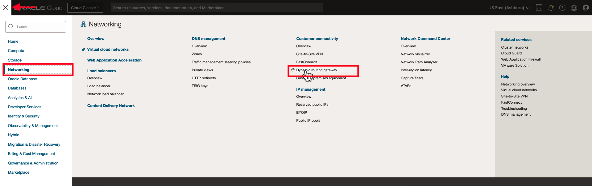
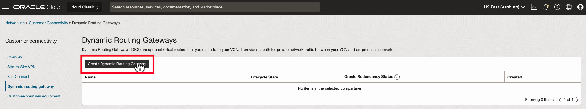
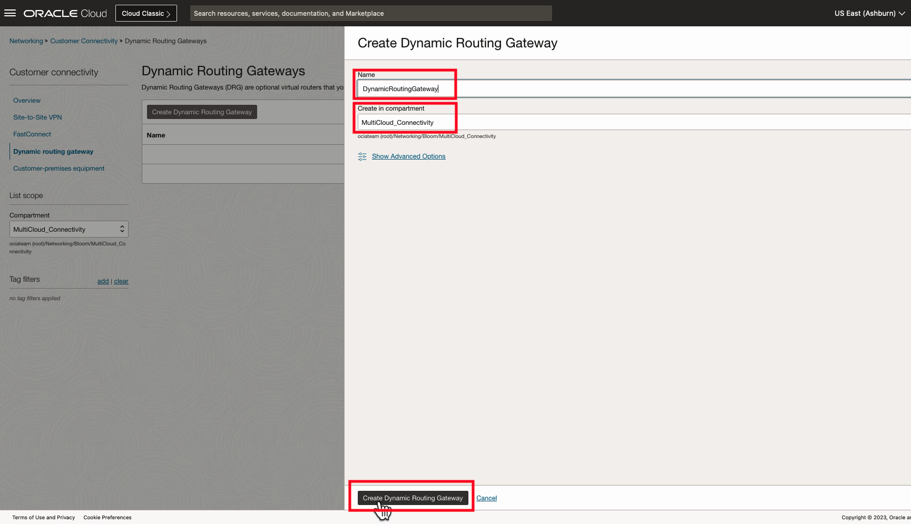

# Deploy a Dynamic Routing Gateway (DRG)

## Introduction

In this lab you will build a Dynamic Routing Gateway (DRG) to serve as a connectivity gateway for the VCN deployed in the previous lab.

Estimated Lab Time: 10 minutes

### About Dynamic Routing Gateway (DRG)

A DRG acts as a virtual router, providing a path for traffic between your on-premises networks and VCNs, and can also be used to route traffic between VCNs. Using different types of attachments, custom network topologies can be constructed using components in different regions and tenancies.

### Objectives

In this lab, you will:

* Deploy a Dynamic Routing Gateway
* Attach the Dynamic Routing Gateway to the VCN created in the previous lab

## Video Walkthrough

[DRG Walkthrough](youtube:PwcLY9fmU3k:large)

## Task 1: Deploy a Dynamic Routing Gateway (DRG)

1. From the Oracle Cloud Home Page, navigate to **Networking -> Customer Connectivity -> Dynamic Routing Gateway**.

  

2. Click **Create a Dynamic Routing Gateway**.

  

3. Give your DRG a distinct name and make sure it's deploying in the compartment where the other networking objects are deployed. Click **Create Dynamic Routing Gateway** and wait for the DRG to go into an "Available" state.
  

4. Under **Resources** go to **Virtual Cloud Network Attachments** and click **Create Virtual Network Attachment**.

  

5. Optionally give the attachment a name, and then select the name of the VCN you created in the previous step. Move on to the next step when the VCN attachment Lifecycle State moves to "Attached".

  