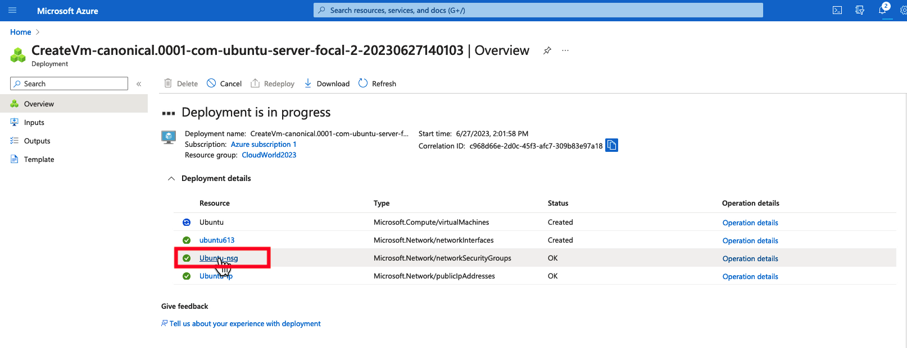
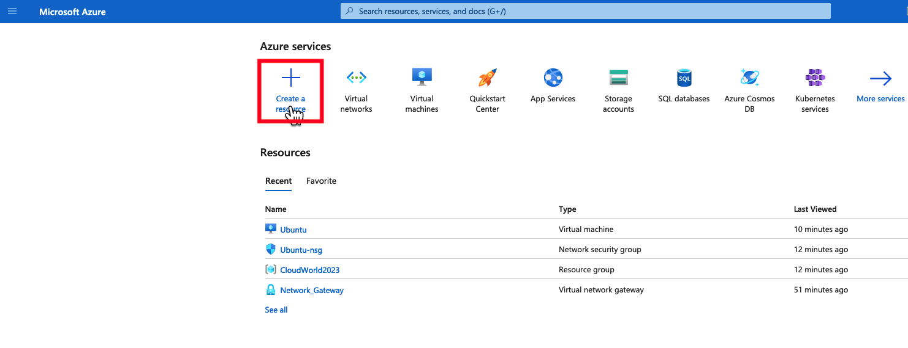

<if type="Interconnect">

# 
**Estimated Time: 30 minutes**

In this lab, you will:

* Use the Microsoft Azure Console to deploy the required network resources for the Azure Interconnect.
* Use the Microsoft Azure Console to deploy a virtual machine to test and verify connectivity with Oracle Cloud.
* Use the Oracle Cloud Console to create a FastConnect to directly connect to Azure ExpressRoute.

## About FastConnect

FastConnect allows customers to connect directly external environments such as 3rd party cloud providers and on-premise data centers to their Oracle Cloud Infrastructure (OCI) virtual cloud network via dedicated, private, high-bandwidth connections.

## Prerequisites

This lab assumes you have:

* Unrestricted lab access to your Microsoft Azure tenancy
* The OCI and Azure region you are connecting are [supported Azure InterConnect regions](https://learn.microsoft.com/en-us/azure/virtual-machines/workloads/oracle/oracle-oci-overview#region-availability).

## Video Walkthrough

[Azure Quickstart Video](youtube:97dyUveTasQ:large)

## Task 1: Deploy an Azure VNet and Virtual Network Gateway

1. Log into the Azure portal and click **Create Resource**.
    
2. Under the Create Resource menu, navigate to **Networking -> Virtual Network Gateway** and click **Create**.
    
3. For the new Virtual Network Gateway, give it a **Name**. Set the Gateway Type to **ExpressRoute**. Under **Virtual Network** select **Create Virtual Network**. Complete the following fields.

    |                  **Field**              |    **Vaue**  |
    |----------------------------------------|:------------:|
    |Name |    Azure_VNET    |
    |Resource Group |  _ChooseExistingORCreateANewOne_    |
    |Address Range|    10.100.0.0/16    |
    |Subnet Name|  azure_subnet  |
    |Address Range|  10.100.0.0/24  |

    Verify the configuration, and then select **OK**.
    
4. Optionally, add Public IP address, Select **Create New**. Give the public IP address a **Name** and select the **SKU**. Then select **Review + create**.
    
5. Verify the configuration, and then click **Create**.
    
6. When your deployment says **Your deployment is complete**, move to the next task. **The Azure Virtual Network Gateway can take anywhere from 15-45 minutes to deploy.**
    

## Task 2: Deploy an Azure VM

1. From the Azure Portal main page, select **Create a Resource**.
    
2. Under Virtual Machine, select **Create**.
    
3. Under Create a virtual machine, select your **Resource Group**. Set the **Virtual Machine Name** and **Region**. Verify the image is **Ubuntu Server 20.04 LTS**
    
4. Optionally add the public key from Oracle Cloud Cloud Shell, and then click **Review + create**.
    
5. Verify the configuration, and then click **Create**.
    
6. While the Virtual Machine is deploying, modify the Network Security Group by clicking **Ubuntu-nsg**.
    
7. Select **Inbound Security Rules**.
    
8. Set Source and Destination to **Any**. Set the Source and Destination port ranges to "*". Set the Protocol to **ICMP**. Set the Action to **Allow**. Select **Add** to add the inbound security rule to the Network Security Group.
    
9. Go back to the Virtual Machine status by selecting the parent level object in the UI.
    
10. When the Virtual Machine status changes to "Complete", select **Go to Resource**.
    
11. Under Networking, notate the **Private IP Address** of the virtual machine. This will be our target to verify that connectivity works between Oracle Cloud and Azure later in the lab.
    

## Task 3: Deploy Azure ExpressRoute

1. From the Azure Portal homepage, click on **Create a Resource**.
    
2. In the search box, search for **ExpressRoute**.
    
3. Find the ExpressRoute resource, and click **Create**.
    
4. Under the **Basics** tab, select the proper **Resource Group** and give the ExpressRoute a **Name**. Click **Next: Configuration**.
    
5. Under the Configuration tab, select **Oracle Cloud FastConnect** as the Provider. Select your Oracle Cloud region in Peering Location (this example uses the OCI Ashburn Region). Select the bandwidth you want the ExpressRoute circuit to have. Select **Standard** for the SKU. Click **Review + create**.
    
6. Review the configuration, and then click **Create**.
    
7. Wait for the deployment to complete. Afterwards, click **Go to resource**.
    
8. Find the Service Key for the ExpressRoute circuit and copy it to your clipboard. You will use this in Task 4 to connect ExpressRoute to FastConnect.
    

## Task 4: Configure Oracle Cloud FastConnect

1. From the Oracle Cloud Home Page, navigate to **Networking -> Customer Connectivity -> FastConnect**.
    
2. Click on **Create FastConnect**.
    
3. Select **FastConnect Partner** for the connection type. Under the Partner dropdown menu, select **Microsoft Azure: ExpressRoute**. Click **Next**.
    
4. Complete the following fields:

    |                  **Field**              |    **Vaue**  |
    |----------------------------------------|:------------:|
    |NAME |    OCI Azure Interconnect    |
    |COMPARTMENT |  *Choose your lab compartment*    |
    |Virtual Circuit Type|    Private Virtual Circuit    |
    |Dynamic Routing Gateway|  DynamicRoutingGateway  |
    |Provisioned Bandwidth|    1 Gbps    |
    |Partner Service Key|    *service_key_from_Azure*    |
    |Customer Primary BGP IPv4 Address|    169.254.0.2/30    |
    |Oracle Primary BGP IPv4 Address|    169.254.0.1/30    |
    |Customer Secondary BGP IPv4 Address|    169.254.1.2/30    |
    |Oracle Secondary BGP IPv4 Address|    169.254.1.1/30   |

5. Verify your configuration looks similar to the following, and then click **Create**:
    
    
6. When the FastConnect status is "Provisioned" proceed to the next task.
    

## Task 5: Associate Azure ExpressRoute to Azure Virtual Network Gateway

1. Go back to the ExpressRoute in the Azure Portal. Go to **Connections -> Add**.
    
2. Under the **Basics** tab, add the **Resource Group**. Set the Connection type to **ExpressRoute**. Set the Name to **OCI\_Azure_Connection**. Set the region to **East US**. Click **Next: Settings**.
    
3. Under the **Settings** tab, select the Virtual Network created earlier in the lab. Select the ExpressRoute circuit created earlier in the lab. Click **Review + create**.
    
4. Verify the configuration, and click **Create**.
    

## Task 6: Verify FastConnect Routing

1. Go back to the Oracle Cloud Console. On the FastConnect, click on the **Dynamic Routing Gateway** resource.
    
2. Click on **DRG route tables**, and select **Autogenerated Drg Route Table for VCN attachments**.
    
3. Click **Get all route rules**.
    
4. Verify the 10.100.0.0/16 route is populated. Seeing this route in the route table confirms that OCI is able to see the Azure network over the FastConnect connection.
    
5. Congratulations! This is major mile stone. In the next lab we will deploy a virtual machine and verify traffic traverses the private connection between Oracle Cloud and Azure.

</if>

<if type="Megaport">

# 

**Estimated Time: 30 minutes**

In this lab, you will:

* Use the Megaport portal to build a private connection.
* Use the Oracle Cloud Console to create a FastConnect Connection to Megaport

## About FastConnect

FastConnect allows customers to connect directly external environments such as 3rd party cloud providers and on-premise data centers to their Oracle Cloud Infrastructure (OCI) virtual cloud network via dedicated, private, high-bandwidth connections.

## Prerequisites

This lab has the following prerequisites:

* Access to the Megaport portal.
* A 3rd party cloud provider with the following:
    * Properly connected and configured 3rd party cloud to the Megaport Cloud Router after completing Task 2 in this lab. [MCR documentation](https://docs.megaport.com/cloud/mcr/)
    * Non-overlapping Private IP space between clouds.
    * A virtual machine deployed in the private network with ICMP (Ping) and SSH accessibility.

> This lab does not walk through the steps to connect additional cloud providers to Megaport. It is recommended to go through Megaport's [MCR documentation](https://docs.megaport.com/cloud/mcr/) for your additional cloud provider of choice and attach the cloud provider to MCR.

## Video Walkthrough

[Megaport Quickstart Video](youtube:G0CySk4mlqs:large)

## Task 1: Configure Oracle Cloud FastConnect

1. From the Navigation Menu, navigate to **Networking -> Customer Connectivity -> FastConnect**. Click on **Create FastConnect**.
  
2. Select **Create FastConnect**.
  
3. Make sure **FastConnect Partner** is selected, and the click on the **Partner** Dropdown menu. Select **Megaport: Service** and click **Next**.
  
4. Complete the following fields:

    |                  **Field**              |    **Vaue**  |
    |----------------------------------------|:------------:|
    |NAME |    Megaport_1   |
    |COMPARTMENT |  *Choose your lab compartment*    |
    |Virtual Circuit Type|    Private Virtual Circuit    |
    |Dynamic Routing Gateway|  DynamicRoutingGateway  |
    |Provisioned Bandwidth|    1 Gbps    |
    |Customer Primary BGP IPv4 Address|    169.254.0.2/30    |
    |Oracle Primary BGP IPv4 Address|    169.254.0.1/30    |
    |Customer BGP ASN|    133937    |

5. Verify your configuration matches the following, and then click **Create**.
  

## Task 2: Add Oracle Cloud FastConnect to Megaport MCR
Get location details for the POPS
1. Under **Next Steps**, click **Complete connection**
  
2. Use your Megaport credentials to authenticate with Megaport within the Oracle Cloud console. Click **Login to Megaport**.
  
3. Under **Configure connection** and select **Megaport Cloud Router**. Your configuration should look similar to the example below.
  
4. Under **Oracle virtual cross connect details** and set a name, location and rate limit for the connection similar to the configuration below.
  
5. Review the configuration, accept the agreement and then click **Complete connection**.
  
6. When the provisioning process is complete, the BGP state will be UP. **This process takes ~15 minutes.**
  

## Task 3: Establish Connectivity with Additional Cloud Providers

1. Navigate to https://portal.megaport.com and login.
  
2. Under **Services**, find the new Cloud Router that was provisioned in the previous task. Verify that the status of the CloudRouter and VXC to Oracle Cloud are in a healthy status as indicated by the green icons. Afterwards, click **Connection** to add an additional cloud provider to the CloudRouter.
  
3. Under **Chose Destination Type** select **Cloud**.
  
4. Under **Select Provider**, search for the additional cloud provider you would like to establish connectivity with. Follow the steps on the screen to set up the additional cloud provider. (The example below is looking to connect with Azure). It is also recommended to follow the steps in the [MCR documentation](https://docs.megaport.com/cloud/mcr/) to properly set up the other cloud provider.
  . 
5. When the 3rd party cloud is properly connected to the Megaport Cloud Router, proceed to the next step.

## Learn More

*(optional - include links to docs, white papers, blogs, etc)*

* [URL text 1](http://docs.oracle.com)
* [URL text 2](http://docs.oracle.com)

</if>