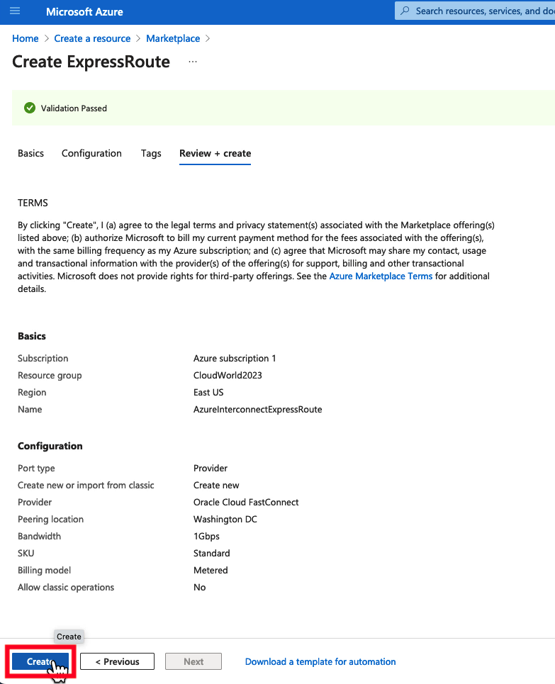
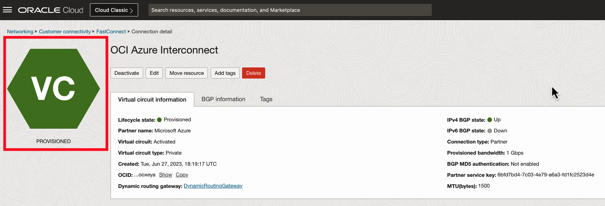
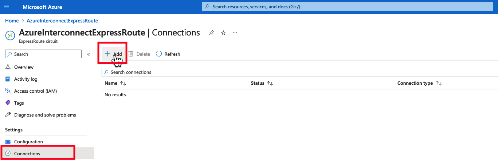

<if type="Interconnect">


# Azure Interconnect Deployment

## Introduction

Estimated Time: 30 minutes

### About FastConnect

FastConnect allows customers to connect directly external environments such as 3rd party cloud providers and on-premise data centers to their Oracle Cloud Infrastructure (OCI) virtual cloud network via dedicated, private, high-bandwidth connections. [Visit our documentation](https://docs.oracle.com/en-us/iaas/Content/Network/Tasks/Overview_of_VCNs_and_Subnets.htm) for more information on FastConnects.

### Objectives

In this lab, you will:

* Use the Microsoft Azure Console to deploy the required network resources for the Azure Interconnect.
* Use the Microsoft Azure Console to deploy a virtual machine to test and verify connectivity with Oracle Cloud.
* Use the Oracle Cloud Console to create a FastConnect and connect directly to Azure ExpressRoute.

### Prerequisites

This lab assumes you have:

* Tasks from the previous labs are completed.
* Administrative Azure Cloud access to provision networking and compute resources.
* The OCI and Azure region you are connecting are [supported Azure InterConnect regions](https://learn.microsoft.com/en-us/azure/virtual-machines/workloads/oracle/oracle-oci-overview#region-availability).

### Video Walkthrough

[Azure Quickstart Video](youtube:97dyUveTasQ:large)

## Task 1: Deploy an Azure VNet and Virtual Network Gateway

1. Log into the Azure portal and click **Create Resource**.
    
2. Under the Create Resource menu, navigate to **Networking -> Virtual Network Gateway** and click **Create**.
    
3. For the new Virtual Network Gateway, give it a **Name**. Set the Gateway Type to **ExpressRoute**. Under **Virtual Network** select **Create Virtual Network**. Complete the following fields.

    |                  **Field**              |    **Value**  |
    |----------------------------------------|:------------:|
    |Name |    Azure_VNET    |
    |Resource Group |  _ChooseExistingORCreateANewOne_    |
    |Address Range|    10.100.0.0/16    |
    |Subnet Name|  azure_subnet  |
    |Address Range|  10.100.0.0/24  |

    Verify the configuration, and then select **OK**.
    
4. Select **Create New**. Give the public IP address a **Name** and select the **SKU**. Then select **Review + create**.
    
5. Verify the configuration, and then click **Create**.
    
6. When your deployment says **Your deployment is complete**, move to the next task. **The Azure Virtual Network Gateway can take anywhere from 15-45 minutes to deploy.**
    

## Task 2: Deploy an Azure Virtual Machine

1. From the Azure Portal main page, select **Create a Resource**.
    
2. Under Virtual Machine, select **Create**.
    
3. Under Create a virtual machine, select your **Resource Group**. Set the **Virtual Machine Name** and **Region**. Verify the image is **Ubuntu Server 20.04 LTS**
    
4. Add your public key from Oracle Cloud Cloud Shell, and then click **Review + create**.
    
5. Verify the configuration, and then click **Create**.
    
6. While the Virtual Machine is deploying, modify the Network Security Group by clicking **Ubuntu-nsg**.
    
7. Select **Inbound Security Rules**.
    
8. Set Source and Destination to **Any**. Set the Source and Destination port ranges to "*". Set the Protocol to **ICMP**. Set the Action to **Allow**. Select **Add** to add the inbound security rule to the Network Security Group.
    
9. Go back to the Virtual Machine status by selecting the parent level object in the UI.
    
10. When the Virtual Machine status changes to "Complete", select **Go to Resource**.
    
11. Under Networking, notate the **Private IP Address** of the virtual machine. This will be our target to verify that connectivity works between Oracle Cloud and Azure later in the lab.
    

## Task 3: Deploy an Azure ExpressRoute

1. From the Azure Portal homepage, click on **Create a Resource**.
    
2. In the search box, search for **ExpressRoute**.
    
3. Find the ExpressRoute resource, and click **Create**.
    
4. Under the **Basics** tab, select the proper **Resource Group** and give the ExpressRoute a **Name**. Click **Next: Configuration**.
    
5. Under the Configuration tab, select **Oracle Cloud FastConnect** as the Provider. Select your Oracle Cloud region in Peering Location (this example uses the OCI Ashburn Region). Select the bandwidth you want the ExpressRoute circuit to have. Select **Standard** for the SKU. Click **Review + create**.
    
6. Review the configuration, and then click **Create**.
    
7. Wait for the deployment to complete. Afterwards, click **Go to resource**.
    
8. Find the Service Key for the ExpressRoute circuit and copy it to your clipboard. You will use this in Task 4 to connect ExpressRoute to FastConnect.
    

## Task 4: Configure an Oracle Cloud FastConnect

1. From the Oracle Cloud Home Page, navigate to **Networking -> Customer Connectivity -> FastConnect**.
    
2. Click on **Create FastConnect**.
    
3. Select **FastConnect Partner** for the connection type. Under the Partner dropdown menu, select **Microsoft Azure: ExpressRoute**. Click **Next**.
    
4. Complete the following fields:

    |                  **Field**              |    **Value**  |
    |----------------------------------------|:------------:|
    |NAME |    OCI Azure Interconnect    |
    |COMPARTMENT |  _OCILabCompartment_    |
    |Virtual Circuit Type|    Private Virtual Circuit    |
    |Dynamic Routing Gateway|  DynamicRoutingGateway  |
    |Provisioned Bandwidth|    1 Gbps    |
    |Partner Service Key|    _servicekeyfromAzure_    |
    |Customer Primary BGP IPv4 Address|    169.254.0.2/30    |
    |Oracle Primary BGP IPv4 Address|    169.254.0.1/30    |
    |Customer Secondary BGP IPv4 Address|    169.254.1.2/30    |
    |Oracle Secondary BGP IPv4 Address|    169.254.1.1/30   |

5. Verify your configuration looks similar to the following, and then click **Create**:
    
    
6. When the FastConnect status is "Provisioned" proceed to the next task.
    

## Task 5: Associate Azure ExpressRoute to Azure Virtual Network Gateway

1. Go back to the ExpressRoute in the Azure Portal. Go to **Connections -> Add**.
    
2. Under the **Basics** tab, add the **Resource Group**. Set the Connection type to **ExpressRoute**. Set the Name to **OCI\_Azure_Connection**. Set the region to **East US**. Click **Next: Settings**.
    
3. Under the **Settings** tab, select the Virtual Network created earlier in the lab. Select the ExpressRoute circuit created earlier in the lab. Click **Review + create**.
    
4. Verify the configuration, and click **Create**.
    

## Task 6: Verify FastConnect Routing

1. Go back to the Oracle Cloud Console. On the FastConnect, click on the **Dynamic Routing Gateway** resource.
    
2. Click on **DRG route tables**, and select **Autogenerated Drg Route Table for VCN attachments**.
    
3. Click **Get all route rules**.
    
4. Verify the 10.100.0.0/16 route is populated. Seeing this route in the route table confirms that OCI is able to see the Azure network over the FastConnect connection.
    
5. Congratulations! This is a major milestone. In the next lab we will deploy a virtual machine and verify traffic traverses the private connection between Oracle Cloud and Azure.

## Acknowledgements

* **Author** - Jake Bloom, Principal Solution Architect, OCI Networking
* **Last Updated By/Date** - Jake Bloom, August 2023

</if>

<if type="Megaport">


# Megaport (MCR) Deployment

## Introduction

Estimated Time: 30 minutes

### About FastConnect

FastConnect allows customers to connect directly external environments such as 3rd party cloud providers and on-premise data centers to their Oracle Cloud Infrastructure (OCI) virtual cloud network via dedicated, private, high-bandwidth connections. [Visit our documentation](https://docs.oracle.com/en-us/iaas/Content/Network/Tasks/Overview_of_VCNs_and_Subnets.htm) for more information on FastConnects.

### Objectives

In this lab, you will:

* Use the Megaport portal to build a private connection.
* Use the Oracle Cloud Console to create a FastConnect Connection to Megaport

### Prerequisites

This lab has the following prerequisites:

* Tasks from the previous labs are completed.
* Access to the Megaport portal.
* A 3rd party cloud provider with the following:
  * Properly connected and configured 3rd party cloud to the Megaport Cloud Router after completing Task 2 in this lab. [MCR documentation](https://docs.megaport.com/cloud/mcr/)
  * Non-overlapping Private IP space between clouds.
  * A virtual machine deployed in the private network with ICMP (Ping) and SSH accessibility.

> **Note:** This lab does not walk through the steps to connect additional cloud providers to Megaport. It is recommended to go through Megaport's [MCR documentation](https://docs.megaport.com/cloud/mcr/) for your additional cloud provider of choice and attach the cloud provider to MCR.

### Video Walkthrough

[Megaport Quickstart Video](youtube:G0CySk4mlqs:large)

## Task 1: Configure Oracle Cloud FastConnect

1. From the Navigation Menu, navigate to **Networking -> Customer Connectivity -> FastConnect**. Click on **Create FastConnect**.
  
2. Select **Create FastConnect**.
  
3. Make sure **FastConnect Partner** is selected, and the click on the **Partner** Dropdown menu. Select **Megaport: Service** and click **Next**.
  
4. Complete the following fields:

    |                  **Field**              |    **Value**  |
    |----------------------------------------|:------------:|
    |NAME |    Megaport_1   |
    |COMPARTMENT |  _Choose your lab compartment_    |
    |Virtual Circuit Type|    Private Virtual Circuit    |
    |Dynamic Routing Gateway|  DynamicRoutingGateway  |
    |Provisioned Bandwidth|    1 Gbps    |
    |Customer Primary BGP IPv4 Address|    169.254.0.2/30    |
    |Oracle Primary BGP IPv4 Address|    169.254.0.1/30    |
    |Customer BGP ASN|    133937    |

5. Verify your configuration matches the following, and then click **Create**.
  

## Task 2: Add Oracle Cloud FastConnect to Megaport MCR

1. Under **Next Steps**, click **Complete connection**
  
2. Use your Megaport credentials to authenticate with Megaport within the Oracle Cloud console. Click **Login to Megaport**.
  
3. Under **Configure connection** and select **Megaport Cloud Router**. Your configuration should look similar to the example below.
  
4. Under **Oracle virtual cross connect details** set a name, location and rate limit for the connection similar to the configuration below.
  
5. Review the configuration, accept the agreement and then click **Complete connection**.
  
6. When the provisioning process is complete, the BGP state will be UP. **This process takes ~15 minutes.**
  

## Task 3: Establish Connectivity with Additional Cloud Providers

1. Navigate to <https://portal.megaport.com> and login.
  
2. Under **Services**, find the new Cloud Router that was provisioned in the previous task. Verify that the status of the CloudRouter and VXC to Oracle Cloud are in a healthy status as indicated by the green icons. Afterwards, click **Connection** to add an additional cloud provider to the CloudRouter.
  
3. Under **Chose Destination Type** select **Cloud**.
  
4. Under **Select Provider**, search for the additional cloud provider you would like to establish connectivity with. Follow the steps on the screen to set up the additional cloud provider. (The example below is looking to connect with Azure). It is also recommended to follow the steps in the [MCR documentation](https://docs.megaport.com/cloud/mcr/) to properly set up the other cloud provider.
  .
5. Verify the 3rd party cloud is properly connected to the Megaport Cloud Router.
6. You may now **proceed to the next lab**.

## Acknowledgements

* **Author** - Jake Bloom, Principal Solution Architect, OCI Networking
* **Last Updated By/Date** - Jake Bloom, August 2023

</if>

<if type="Equinix">


# Equinix (Network Edge) Deployment

## Introduction

Estimated Time: 30 minutes

### About FastConnect

FastConnect allows customers to connect directly external environments such as 3rd party cloud providers and on-premise data centers to their Oracle Cloud Infrastructure (OCI) virtual cloud network via dedicated, private, high-bandwidth connections. [Visit our documentation](https://docs.oracle.com/en-us/iaas/Content/Network/Tasks/Overview_of_VCNs_and_Subnets.htm) for more information on FastConnects.

### Objectives

In this lab, you will:

* Use the Equinix Fabric Console to deploy the required network resources to connect Oracle Cloud to Equinix.
* Use the Oracle Cloud Console to create a FastConnect to directly connect to Equinix Fabric.
* SSH to the VyOS Virtual Router establish connectivity between cloud providers.

### Prerequisites

This lab assumes you have:

* Tasks from the previous labs are completed.
* Access to the Equinix Fabric portal with permissions to create new connections and deploy a Network Edge.
* A [Public SSH RSA Key](https://deploy.equinix.com/developers/docs/metal/accounts/ssh-keys/) uploaded to the Equinix console. The SSH Keypair from the previous lab can be used.
* An [Access Control List Template](https://docs.equinix.com/en-us/MicroContent/Interconnection/NE/microcontent/NE-access-control-list/how-to-create-access-control-list.htm) allowing your public IP address and allows SSH (TCP port 22) in the Equinix Console.

### Video Walkthrough

[Equinix Network Edge Quickstart Video](youtube:2A5jZrqhK9I:large)

## Task 1: Deploy an Equinix Network Edge

1. Log into the Equinix portal. Navigate to **Network Edge** and click **Create Virtual Device**.
    
2. Under **Add New Edge Device**, scroll to the bottom of the page to find the **VyOS** virtual router. Click **Select and Continue**.
    
3. Under **Select Device Type**, select **Single Device** and click **Begin Creating Edge Devices**.
    
4. Under **Select Edge Device Location**, select **Ashburn**. Scroll down to **Select Billing Account** and verify the correct billing account is used. Afterwards, click **Next: Device Details**.
    
5. Under **Device Details**, fill in a **Device Name** and **Host Name Prefix**. Afterwards, click **Next: Additional Services Details**.
    
6. Under **Add Users**, create a memorable username under **Username** and add your public SSH RSA key under **SSH RSA Public Keys**. Under **Access Control List Templates** select your existing template. Make sure that your public IP address is allowed on the Access Control Template, and that TCP port 22 is allowed. Click **Next: Review**.
    
7. Review the device configuration. Review and Access the Order Terms, and then click **Create Virtual Device**.
    
8. Under **See your device in your dashboard**, click **Go to the device**.
    
9. Continue to the next task when the green indicator is on the VyOS Virtual Router.
    

## Task 2: Create a FastConnect Connection

1. From the Oracle Cloud Console, go to the navigation menu and click on **Networking -> Customer Connectivity -> FastConnect**.
    
2. Under **FastConnect Connections**, verify you are in the correct compartment for this lab and click **Create FastConnect**.
    
3. Under **Connection Type**, select **FastConnect Partner**. Under **Partner**, select **Equinix: Fabric**.
    
4. Set the FastConnect Parameters as seen below.
    
5. Copy the OCID of the Virtual Circuit and move to the next task.
    

## Task 3: Create a Connection to the Equinix Network Edge

1. Go back to the Network Edge in the Equinix console. Under **Virtual Device Details -> Connections** the **Virtual Connections** list should be empty. Click **Create Connection** to establish a private connection from Oracle Cloud to VyOS. 
    
2. Scroll down to **Oracle Cloud** and click **Select Service**. Scroll down again and click **Create Connection**.
    
    
3. Select the parameters indicated below and move to the next step.
    
4. Under **Connection Information -> Virtual Circuit Name** create a unique name for this connection to OCI. Under **Virtual Circuit OCID**, add the OCID of the Virtual Circuit you created in Task 2. 
    
5. Click **Submit Order** on the next page.
    
6. Navigate to **See this Connection in your Inventory -> Go to My Inventory**!
    
7. Verify the connection has been added to the Equinix portal and then proceed to the next task.
    

## Task 4: Establish Connectivity with Additional Cloud Providers

1. An additional private connection will need to be made between your Network Edge and additional cloud provider that you choose. For most cloud providers, you will be able to click **Create Connection** and follow the steps within the Equinix portal to connect to your additional cloud provider. You can also follow the [Equinix Network Edge Documentation](https://docs.equinix.com/en-us/Content/Interconnection/NE/landing-pages/NE-landing-main.htm) for further guidance on this connectivity.

    The lab assumes you made the following setup on the additional cloud provider. See the **Azure Interconnect** section if you need an example how to do this configuration on the other cloud providers.

    * A BGP interface with the IP address of 169.254.1.1/30.
    * The BGP ASN number is 64512.
    * The private IP address space is 10.100.0.0/16
    * A virtual machine is deployed in the private IP space, and ICMP (ping) is allowed.
    * Proper routing is configured to get traffic from the virtual machine to the private connection service.

## Task 5: Configure VyOS Virtual Router (Network Edge)

1. Navigate to your Network Edge and verify there is a connection for OCI and for your additional cloud provider.
    
2. Navigate to **Details**, and then scroll down to **IP Address** to get the public IP address of the network edge.
    
    
3. Navigate back to the Oracle Cloud console and go back to the Cloud Shell instance.
    
4. With the username created in Task 1 of the lab, ssh into the VyOS Network Edge. The command will look something like this. **ssh username@vyos\_public\_ip**. The SSH RSA keypair is used to authenticate the session, so no password will be needed to connect to the appliance.
    
5. Copy the configuration below to your clipboard, and paste in into the SSH session. This will start the BGP process on the VyOS router and setup connections from the Network Edge to the cloud providers. This configuration assumes the additional cloud provider's AS is 64512 and the remote IP address is 169.254.1.1.
        ```text
        <copy>
        config
        set interfaces ethernet eth2 address 169.254.0.2/30
        set protocols bgp 65001 address-family ipv4-unicast
        set protocols bgp 65001 neighbor 169.254.0.1 address-family ipv4-unicast
        set protocols bgp 65001 neighbor 169.254.0.1 remote-as 31898
        set interfaces ethernet eth3 address 169.254.1.2/30
        set protocols bgp 65001 neighbor 169.254.1.1 address-family ipv4-unicast
        set protocols bgp 65001 neighbor 169.254.1.1 remote-as 64512
        commit;save;exit
        </copy>
        ```

    > **Note:** If your BGP connection requires a password, add this to the BGP neighbor configuration. **set protocols bgp 65001 neighbor 169.254.1.1 password 'passwordgoeshere'**

    
6. Run the command **show ip bgp sum** in the VyOS router. You can confirm the configuration is working if the **Up/Down** status of each neighbor has a timer indicating it's uptime, and **PrxRcd** has a number greater than zero.
    

7. If you've gone this far, congratulations! This is a major mile stone in this lab. Go ahead and proceed to the next lab.

## Acknowledgements

* **Author** - Jake Bloom, Principal Solution Architect, OCI Networking
* **Last Updated By/Date** - Jake Bloom, August 2023

</if>

<if type="PacketFabric">


# PacketFabric (Network Edge) Deployment

## Introduction

Estimated Time: 30 minutes

### About FastConnect

FastConnect allows customers to connect directly external environments such as 3rd party cloud providers and on-premise data centers to their Oracle Cloud Infrastructure (OCI) virtual cloud network via dedicated, private, high-bandwidth connections. [Visit our documentation](https://docs.oracle.com/en-us/iaas/Content/Network/Tasks/Overview_of_VCNs_and_Subnets.htm) for more information on FastConnects.

### Objectives

In this lab, you will:

* Use the PacketFabric Console to deploy the required network resources to connect Oracle Cloud to PacketFabric.
* Use the Oracle Cloud Console to create a FastConnect to directly connect to PacketFabric.
* SSH to the VyOS Virtual Router establish connectivity between cloud providers.

### Prerequisites

This lab assumes you have:

* Tasks from the previous labs are completed.
* Access to the PacketFabric portal with permissions to create new connections and deploy a Network Edge.
* A [Public SSH RSA Key](https://deploy.equinix.com/developers/docs/metal/accounts/ssh-keys/) uploaded to the PacketFabric console. The SSH Keypair from the previous lab can be used.
* An [Access Control List Template](https://docs.equinix.com/en-us/MicroContent/Interconnection/NE/microcontent/NE-access-control-list/how-to-create-access-control-list.htm) allowing your public IP address and allows SSH (TCP port 22) in the Equinix Console.

### Video Walkthrough

[PacketFabric Network Edge Quickstart Video](youtube:2A5jZrqhK9I:large)

## Task 1: Deploy an PacketFabric Network Edge

1. Log into the Equinix portal. Navigate to **Network Edge** and click **Create Virtual Device**.
    
2. Under **Add New Edge Device**, scroll to the bottom of the page to find the **VyOS** virtual router. Click **Select and Continue**.
    
3. Under **Select Device Type**, select **Single Device** and click **Begin Creating Edge Devices**.
    
4. Under **Select Edge Device Location**, select **Ashburn**. Scroll down to **Select Billing Account** and verify the correct billing account is used. Afterwards, click **Next: Device Details**.
    
5. Under **Device Details**, fill in a **Device Name** and **Host Name Prefix**. Afterwards, click **Next: Additional Services Details**.
    
6. Under **Add Users**, create a memorable username under **Username** and add your public SSH RSA key under **SSH RSA Public Keys**. Under **Access Control List Templates** select your existing template. Make sure that your public IP address is allowed on the Access Control Template, and that TCP port 22 is allowed. Click **Next: Review**.
    
7. Review the device configuration. Review and Access the Order Terms, and then click **Create Virtual Device**.
    
8. Under **See your device in your dashboard**, click **Go to the device**.
    
9. Continue to the next task when the green indicator is on the VyOS Virtual Router.
    

## Task 2: Create a FastConnect Connection

1. From the Oracle Cloud Console, go to the navigation menu and click on **Networking -> Customer Connectivity -> FastConnect**.
    
2. Under **FastConnect Connections**, verify you are in the correct compartment for this lab and click **Create FastConnect**.
    
3. Under **Connection Type**, select **FastConnect Partner**. Under **Partner**, select **Equinix: Fabric**.
    
4. Set the FastConnect Parameters as seen below.
    
5. Copy the OCID of the Virtual Circuit and move to the next task.
    

## Task 3: Create a Connection to the PacketFabric Edge

1. Go back to the Network Edge in the Equinix console. Under **Virtual Device Details -> Connections** the **Virtual Connections** list should be empty. Click **Create Connection** to establish a private connection from Oracle Cloud to VyOS. 
    
2. Scroll down to **Oracle Cloud** and click **Select Service**. Scroll down again and click **Create Connection**.
    
    
3. Select the parameters indicated below and move to the next step.
    
4. Under **Connection Information -> Virtual Circuit Name** create a unique name for this connection to OCI. Under **Virtual Circuit OCID**, add the OCID of the Virtual Circuit you created in Task 2. 
    
5. Click **Submit Order** on the next page.
    
6. Navigate to **See this Connection in your Inventory -> Go to My Inventory**!
    
7. Verify the connection has been added to the Equinix portal and then proceed to the next task.
    

## Task 4: Establish Connectivity with Additional Cloud Providers

1. An additional private connection will need to be made between your Network Edge and additional cloud provider that you choose. For most cloud providers, you will be able to click **Create Connection** and follow the steps within the PacketFabric portal to connect to your additional cloud provider. You can also follow the [PacketFabric Network Edge Documentation](https://docs.equinix.com/en-us/Content/Interconnection/NE/landing-pages/NE-landing-main.htm) for further guidance on this connectivity.

    The lab assumes you made the following setup on the additional cloud provider. See the **Azure Interconnect** section if you need an example how to do this configuration on the other cloud providers.

    * A BGP interface with the IP address of 169.254.1.1/30.
    * The BGP ASN number is 64512.
    * The private IP address space is 10.100.0.0/16
    * A virtual machine is deployed in the private IP space, and ICMP (ping) is allowed.
    * Proper routing is configured to get traffic from the virtual machine to the private connection service.

## Task 5: Configure VyOS Virtual Router (Network Edge)

1. Navigate to your Network Edge and verify there is a connection for OCI and for your additional cloud provider.
    
2. Navigate to **Details**, and then scroll down to **IP Address** to get the public IP address of the network edge.
    
    
3. Navigate back to the Oracle Cloud console and go back to the Cloud Shell instance.
    
4. With the username created in Task 1 of the lab, ssh into the VyOS Network Edge. The command will look something like this. **ssh username@vyos\_public\_ip**. The SSH RSA keypair is used to authenticate the session, so no password will be needed to connect to the appliance.
    
5. Copy the configuration below to your clipboard, and paste in into the SSH session. This will start the BGP process on the VyOS router and setup connections from the Network Edge to the cloud providers. This configuration assumes the additional cloud provider's AS is 64512 and the remote IP address is 169.254.1.1.
        ```text
        <copy>
        config
        set interfaces ethernet eth2 address 169.254.0.2/30
        set protocols bgp 65001 address-family ipv4-unicast
        set protocols bgp 65001 neighbor 169.254.0.1 address-family ipv4-unicast
        set protocols bgp 65001 neighbor 169.254.0.1 remote-as 31898
        set interfaces ethernet eth3 address 169.254.1.2/30
        set protocols bgp 65001 neighbor 169.254.1.1 address-family ipv4-unicast
        set protocols bgp 65001 neighbor 169.254.1.1 remote-as 64512
        commit;save;exit
        </copy>
        ```

    > **Note:** If your BGP connection requires a password, add this to the BGP neighbor configuration. **set protocols bgp 65001 neighbor 169.254.1.1 password 'passwordgoeshere'**

    
6. Run the command **show ip bgp sum** in the VyOS router. You can confirm the configuration is working if the **Up/Down** status of each neighbor has a timer indicating it's uptime, and **PrxRcd** has a number greater than zero.
    

7. If you've gone this far, congratulations! This is a major mile stone in this lab. Go ahead and proceed to the next lab.

## Acknowledgements

* **Author** - Shawn Moore, Principal Solution Architect, OCI Networking
* **Last Updated By/Date** - Shawn Moore, January 2024

</if>