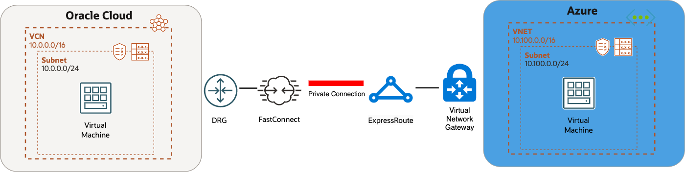

# Introduction

## About this Workshop

Oracle Cloud Infrastructure (OCI) Networking is a core tenet of a MultiCloud architecture. This Hands On Lab will walk through the steps required to connect with 3rd party cloud providers. The networking resources deployed in this lab will include a VCN, DRG and FastConnect. Be aware that this lab is used to deploy a simple configuration and additional network and security considerations would need to be made to deploy these services in a production environment.

Be sure to review [Overview of Networking](https://docs.cloud.oracle.com/iaas/Content/Network/Concepts/overview.htm) to gain a full understanding of the network components and their relationships.

### Prerequisites

This lab assumes you have:

* Administrative Access to an Oracle Cloud Tenancy

* **Option 1 -**  Access to a [FastConnect Partner](https://www.oracle.com/cloud/networking/fastconnect/providers/) that is available in your OCI region and your preferred 3rd party cloud service provider.

* **Option 2 -** Access to an Azure subscription with resources deployed in a supported Azure Interconnect region [Supported regions are documented here](https://learn.microsoft.com/en-us/azure/virtual-machines/workloads/oracle/oracle-oci-overview#region-availability).

    > **Note:** If your OCI or Azure region does not support Azure Interconnect use **Option 1** to connect to Azure.

### Objectives

In this workshop, you will learn how to:

* Deploy a Virtual Cloud Network (VCN)
* Deploy a Dynamic Routing Gateway (DRG)
* Setup a FastConnect Connection
* Verify MultiCloud Connectivity

## OCI Reference Acronym List

**DRG** - Dynamic Routing Gateway

**VCN** - Virtual Cloud Network

**OCI** - Oracle Cloud Infrastructure