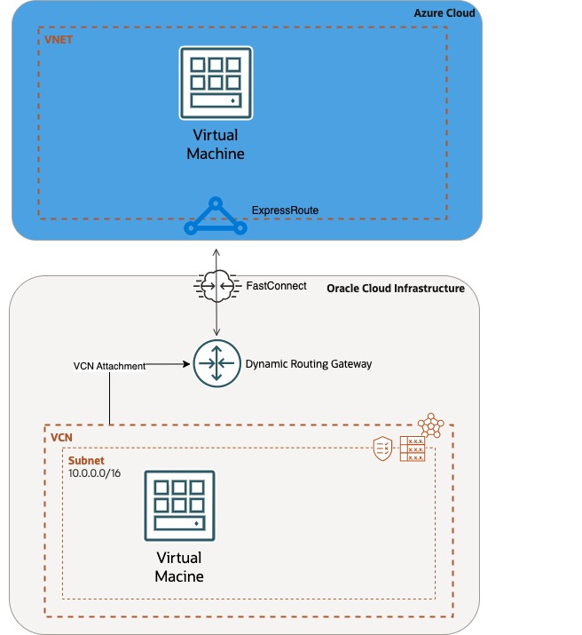
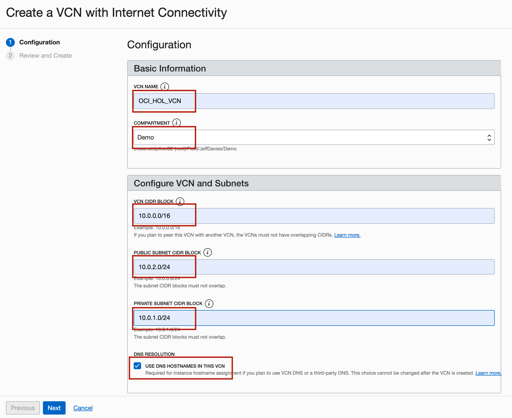
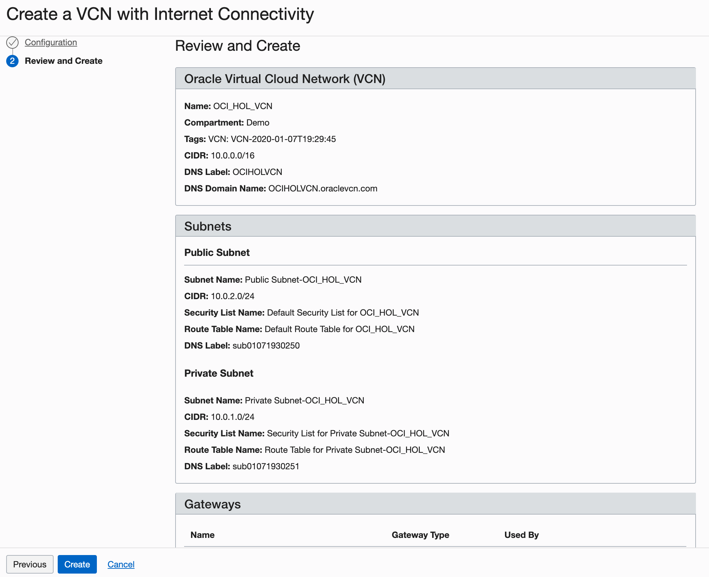

# Virtual Cloud Network

## Table of Contents

[Overview](#overview)

[Prerequisites](#prerequisites)

[1.) Deploy a Virtual Cloud Network (VCN)](#deploy-a-virtual-cloud-network-vcn)

[2.) Deploy a Dynamic Routing Gateway (DRG)](#deploy-a-dynamic-routing-gateway-drg)

[3.) Create a Private Connection with FastConnect](#create-a-private-connection-with-fastconnect)

[4.) Verify Connectivity Between Cloud Providers](#verify-connectivity)

## Overview

(I probably need to add a description of the network objects we are deploying here)

Oracle Cloud Infrastructure (OCI) Networking is a core tenet of a Multi-Cloud architecture. This lab will deploy the required networking resources within OCI to connect with other cloud providers. The high level constructs of this lab include a VCN, DRG and FastConnect to connect to another other cloud providers. Be aware that this lab is used to deploy a simple configuration and additional network and security considerations will need to be made to deploy these services in a production environment.

Be sure to review [Overview of Networking](https://docs.cloud.oracle.com/iaas/Content/Network/Concepts/overview.htm) to gain a full understanding of the network components and their relationships.

NOTE: This lab will connect to Azure as the 3rd party cloud platform. The steps to integrate connect other cloud providers such as AWS and GCP will follow a very similar process.

OCI Reference Acronym List:

**DRG** - Dynamic Routing Gateway

**VCN** - Virtual Cloud Network

**OCI** - Oracle Cloud Infrastructure

## Prerequisites

To sign in to the Console, you need the following:

- Tenant, User name and Password
- URL for the Console: [https://console.us-ashburn-1.oraclecloud.com/](https://console.us-ashburn-1.oraclecloud.com/)
- Oracle Cloud Infrastructure supports the latest versions of Google Chrome, Firefox and Internet Explorer 11. ***It does not support the Edge browser***.

## Reference Diagram

## Deploy a Virtual Cloud Network (VCN)

In this section you will build a Virtual Cloud Networking (VCN) using VCN Quickstart Wizard.

Create a VCN on Oracle Cloud Infrastructure:

1. On the Oracle Cloud Infrastructure Console Home page, under the Quick Actions header, click on Set up a network with a wizard.

    

    
Click to reveal image

    
    
    

2. Select **VCN with Internet Connectivity**, and then click **Start VCN Wizard**.
    

    
Click to reveal image

    
    

3. Complete the following fields:

    |                  **Field**              |    **Vaue**  |
    |----------------------------------------|:------------:|
    |VCN NAME |OCI_HOL_VCN|
    |COMPARTMENT |  Choose the ***Demo*** compartment you created in the [Identity Lab](../Identity_Access_Management/IAM_HOL.md)
    |VCN CIDR BLOCK|10.0.0.0/16|
    |PUBLIC SUNBET CIDR BLOCK|10.0.2.0/24|
    |PRIVATE SUBNET CIDR BLOCK|10.0.1.0/24
    |USE DNS HOSTNAMES IN THIS VCN| Checked|

    Your configuration should look similar to the following:
    

    
Click to reveal image

    
    

4. Press the **Next** button at the bottom of the screen.

5. Review your settings to be sure they are correct.

    

    
Click to reveal image

    
    

6. Press the **Create** button to create the VCN. I will take a moment to create the VCN and a progress screen will keep you apprised of the workflow.

    

    
Click to reveal image

    
    

7. Once you see that the creation is complete (see previous screenshot), click on the **View Virtual Cloud Network** button and verify that the VCN is in a "Provisioned" state.

Video of the VCN deployment process for your reference:

Click to reveal video

<video src="../vcn/files/1-vcn-quickstart.mp4" controls title="Title"></video>

## Deploy a Dynamic Routing Gateway (DRG)

To configure a Dynamic Routing Gateway (DRG), walk through the following steps:

1. In the Navigation Menu, go to **Networking -> Customer Connectivity -> Dynamic Routing Gateway**.

2. Click **Create a Dynamic Routing Gateway**. Give your DRG a distinct name and make sure it's deploying in the compartment where the other networking objects are deployed. Click **Create Dynamic Routing Gateway** and wait for the DRG to go into an "Available" state.

3. Under **Resources** go to **Virtual Cloud Network Attachments** and click **Create Virtual Network Attachment**. Optionally give the attachment a name, and then select the name of the VCN you created in the previous step. Move on to the next step when the VCN attachment Lifecycle State moves to "Attached".

Video of the DRG deployment process for your reference:

Click to reveal video

<video src="files/2-drg-deployment.mp4" controls title="Title"></video>

## Create a Private Connection with FastConnect

Azure Interconnect

***This example is a connection to Microsoft Azure which is an Oracle Cloud Infrastructure partner and can provide direct connectivity. There are also many [FastConnect Partners](https://www.oracle.com/cloud/networking/fastconnect/providers/)
 that can extend Oracle Cloud Infrastructure to other cloud providers.***

In this section, we will deploy the Oracle Cloud Infrastructure FastConnect service to extend private connectivity outside of Oracle Cloud Infrastructure.

1. From the Naviation Menu, navigate to **Networking -> Customer Connectivity -> FastConnect**. Click on **Create FastConnect**.

2. Make sure **FastConnect Partner** is selected, and the click on the **Partner** Dropdown menu. Select **Microsoft Azure: ExpressRoute** and click **Next**.

3. Complete the following fields:

    |                  **Field**              |    **Vaue**  |
    |----------------------------------------|:------------:|
    |NAME |    Connection_To_Azure    |
    |COMPARTMENT |  *Choose your lab compartment*    |
    |Virtual Circuit Type|    Private Virtual Circuit    |
    |Dynamic Routing Gateway|  *DRG from previous step*  |
    |Provisioned Bandwidth|    1 Gbps    |
    |Partner Service Key|    *service_key_from_Azure*    |
    |Customer Primary BGP IPv4 Address|    169.254.0.2/30    |
    |Oracle Primary BGP IPv4 Address|    169.254.0.1/30    |
    |Customer Secondary BGP IPv4 Address|    169.254.1.2/30    |
    |Oracle Secondary BGP IPv4 Address|    169.254.1.1/30   |

Video of the FastConnect deployment process for your reference:

Click to reveal video

<video src="files/3-fastconnect-deployment.mp4" controls title="Title"></video>

(WIP) MegaPort

[Getting Started Doc](https://docs.megaport.com/cloud/megaport/oracle/)
[FastConnect MegaPort Integration](https://blogs.oracle.com/cloud-infrastructure/post/simple-guide-oci-megaport-now-integrated)

Build a MegaPort Connection

Click to reveal video

## Verify Connectivity

In this section, we will deploy the a Virtual Machine and then use it to test and verify FastConnect connectivity.

Prepare CloudShell

1. Go to the top right hand corner of the UI and click on **Developer Tools -> Cloud Shell**

2. Generate a new SSH key by running the **ssh-keygen** command. Leave all of the values as their default (empty).

3. Run the command **cat ~/.ssh/id_rsa** and copy the contents to your clipboard or a note space. This will be used in the next step when creating a virtual machine.

Launch a Virtual Machine

1. On the Home Page under **Launch Resources**, click on **Create a VM Instance**.

2. On the **Create Compute Instance** page, most of the options will be left as default except for the following.

    |                  **Field**              |    **Vaue**  |
    |----------------------------------------|:------------:|
    |Name |    Connectivity_Test_Instance    |
    |Create in Compartment |  *lab compartment*    |

    Verify the Network Configuration:

    1. Under **Networking: Virtual Cloud Network** - Verify the correct compartment and select the VCN created earlier in the lab.
    2. Under **Networking: Subnet** - Select the Public Subnet of the VCN.
    3. Under **Public IPv4 Address** - Select "Assign a Public IPv4 Address".

    Add the Public SSH Key:

    1. Under **Add SSH Configuration**, select "Paste Public Keys" and add the public key you created from the CloudShell instance.

    Click **Create** and wait for the instance state to be "Running". Make note of the Public IPv4 Address of the instance under **Primary VNIC**.

Log into the Virtual Machine with CloudShell

1. Go back to the CloudShell instance by navigating to the top right of the OCI Console and going UI and click on **Developer Tools -> Cloud Shell**

2. Run the following command **ssh opc@*public_ip***, where public_ip is the public IP address of your Virtual Machine. Now you are logged in via SSH to the virtual machine. In the next step we will run a series of tests to verify connectivity with the 3rd party cloud provider.

Click to reveal video

<video src="files/4-cloudshell-and-instance-setup.mp4" controls title="Title"></video>

**TODO**

Test Connectivity to Azure
Ping Test
Traceroute Test

## Summary

In this lab, you deployed the OCI network constructs necessary to set up a MultiCloud environment. After setting up the enviornment, we tested and verified the connectivity over the FastConnect by connecting to the private IP address of the Azure instance. I hope you enjoyed the lab! To extend your learning beyond this lab, take a look at the following.

[Azure Interconnect Overview](https://www.oracle.com/cloud/azure/interconnect/)

[Reference Architecture- Azure InterConnect](https://docs.oracle.com/en/solutions/oci-azure/index.html#GUID-84688C94-C76D-404F-AAAF-5AC091E2FAD6)

[Reference Architecture - Deploy a multicloud split-stack solution across OCI, AWS and GCP](https://docs.oracle.com/en/solutions/oci-aws-gcp-multicloud/index.html#GUID-FD1D132A-9B50-403E-9B79-BE80A3DB1A7F)

[Blog - Step By Step Guide Interconnecting OCI and Azure](https://blogs.oracle.com/cloudmarketplace/post/step-by-step-guide-interconnecting-oracle-cloud-infrastructure-and-microsoft-azure)