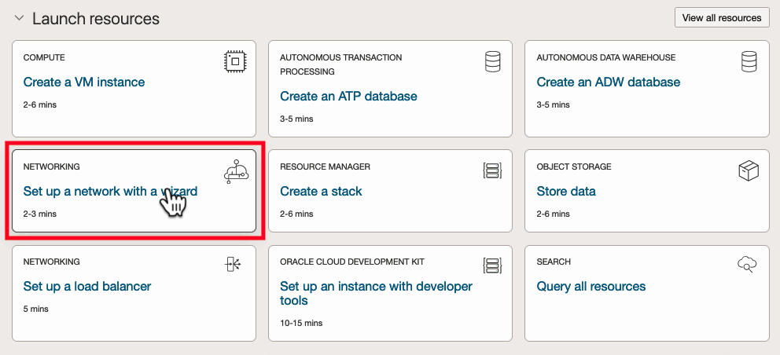
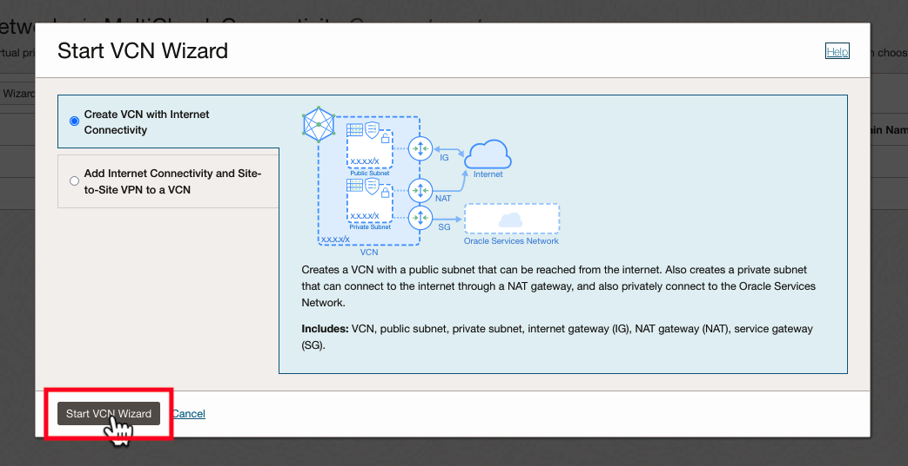
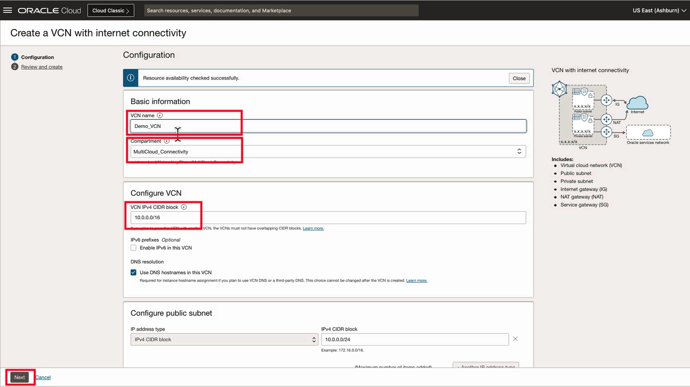
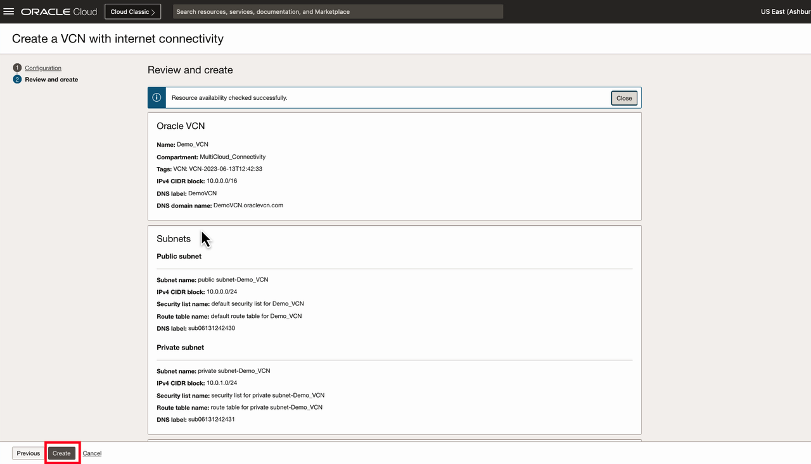
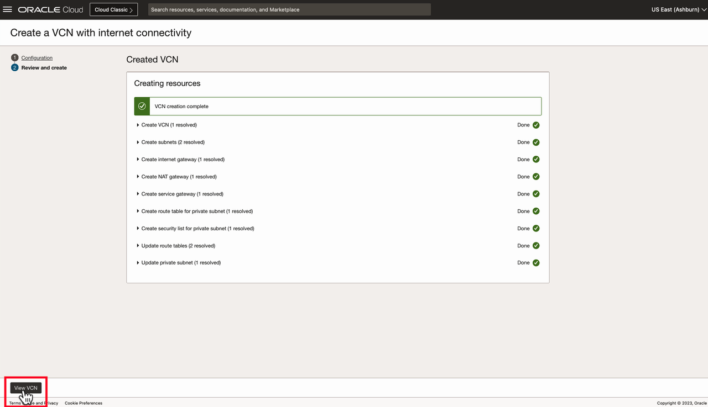

# Setup a Virtual Cloud Network

**Estimated Time: 10 minutes**

In this lab, you will build a Virtual Cloud Network (VCN) to create a private network using the VCN Wizard.

About Virtual Cloud Networks (VCNs)

Oracle Cloud Infrastructure (OCI) Virtual Cloud Networks (VCNs) provide customizable and private cloud networks in Oracle Cloud Infrastructure (OCI). Just like a traditional data center network, the VCN provides customers with complete control over their cloud networking environment. This includes assigning private IP address spaces, creating subnets and route tables, and configuring stateful firewalls.

## Video Walkthrough

[VCN Quickstart Video](youtube:svGxVEifOe0:large) 

## Task 1: Deploy a VCN (Virtual Cloud Network)

> **The VCN Wizard will automatically create the required dependencies for the VCN, such as route tables, subnets and gateways**

1. On the Oracle Cloud Infrastructure Console Home page, under the Quick Actions header, click on Set up a network with a wizard.
  
2. Select **VCN with Internet Connectivity**, and then click **Start VCN Wizard**.
  
3. The default parameters for the VCN quickstart will be used. Verify your configuration looks similar to the following, and press the **Next** button at the bottom of the screen :
  
4. Overview the configuration, then press the **Create** button at the bottom of the screen.
    
5. When VCN creation is complete, click on **View VCN**. Proceed to the next lab.
    

## Acknowledgements

* **Author** - <Name, Title, Group> Jake Bloom, Principal Solution Architect, OCI Networking
* **Last Updated By/Date** - <Name, Month Year> Jake Bloom, July 2023