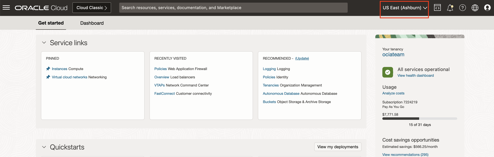
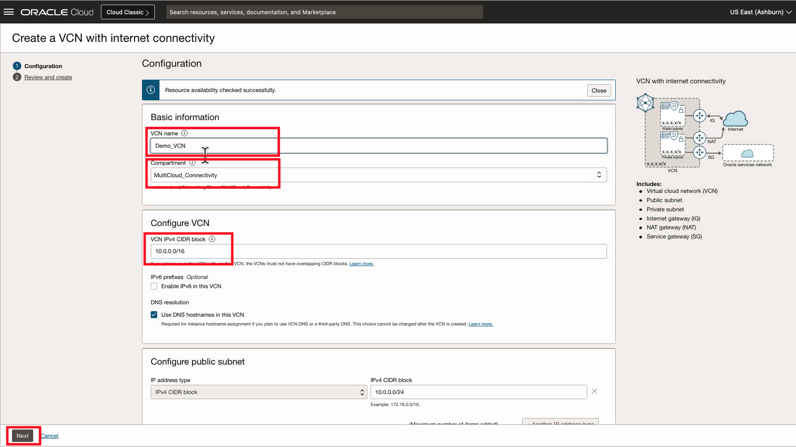
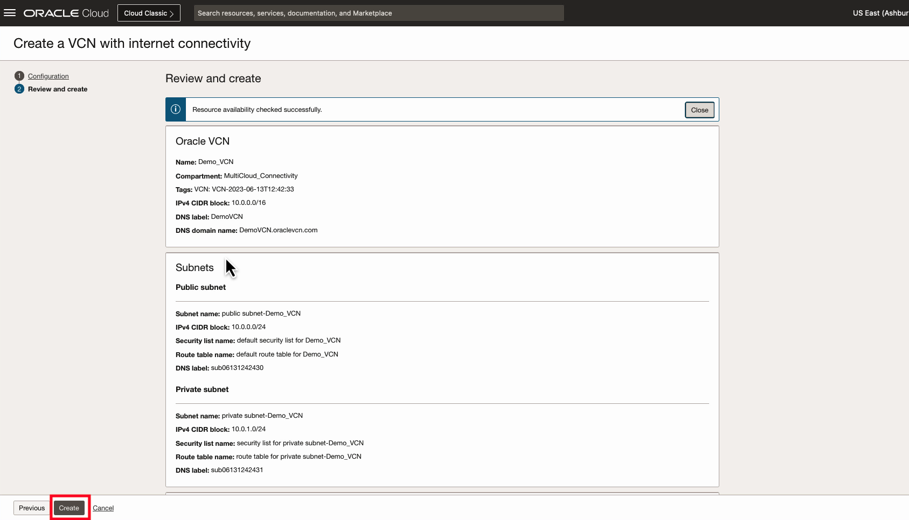

# Virtual Cloud Network Deployment

## Introduction

Estimated Time: 10 minutes

### About Virtual Cloud Networks (VCNs)

Virtual Cloud Networks (VCNs) provide customizable and private cloud networks in Oracle Cloud Infrastructure (OCI). Just like a traditional data center network, the VCN provides customers with complete control over their cloud networking environment. This includes assigning private IP address spaces, creating subnets and route tables, and configuring stateful firewalls. [Visit our documentation](https://docs.oracle.com/en-us/iaas/Content/Network/Tasks/Overview_of_VCNs_and_Subnets.htm) for more information on Virtual Cloud Networks.

### Objectives

In this lab, you will:

* Build a Virtual Cloud Network (VCN) using the VCN Wizard.

[VCN Quickstart Video](youtube:svGxVEifOe0:large)

## Task 1: Deploy a VCN (Virtual Cloud Network)

1. Log into the Oracle Cloud console and select the **Ashburn** region.
  
2. On the Oracle Cloud Infrastructure Console Home page, under the Quick Actions header, click on **Set up a network with a wizard**.
  
3. Select the compartment when you want the objects for this Hands on Lab to be deployed. This lab will deploy resources in the **MultiCloud_Connectivity** compartment.
  

    > **Note:** If you would deploy these lab resources in a new compartment you can follow the [Create an Oracle Cloud Infrastructure Compartment](https://docs.oracle.com/en/cloud/paas/integration-cloud/oracle-integration-oci/creating-oci-compartment.html#GUID-C0FA329C-7CB8-4727-9E68-2E6A214038CD) documentation.

4. Select **VCN with Internet Connectivity**, and then select **Start VCN Wizard**.
  
5. The default parameters for the VCN quickstart will be used. Verify your configuration looks similar to the following, and select **Next**.
  
6. Overview the configuration, then select **Create**.
    
7. When VCN creation is complete, click on **View VCN**.
    
8. You may now **proceed to the next lab**.

## Acknowledgements

* **Author** - Jake Bloom, Principal Solution Architect, OCI Networking
* **Last Updated By/Date** - Jake Bloom, August 2023
