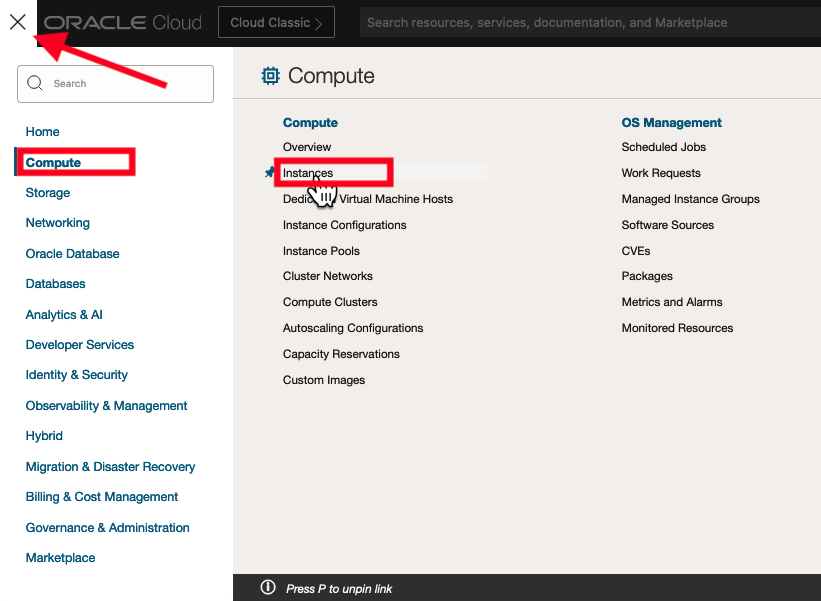
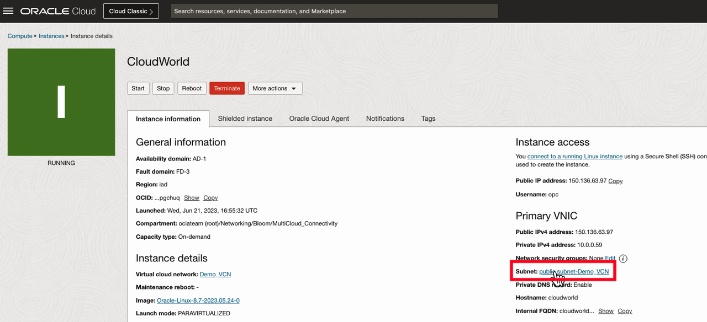
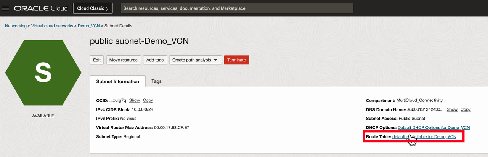
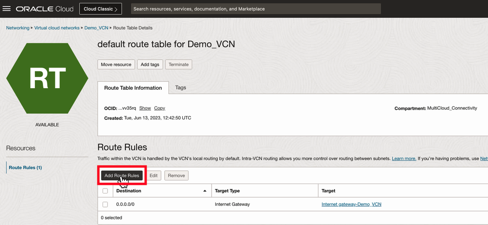
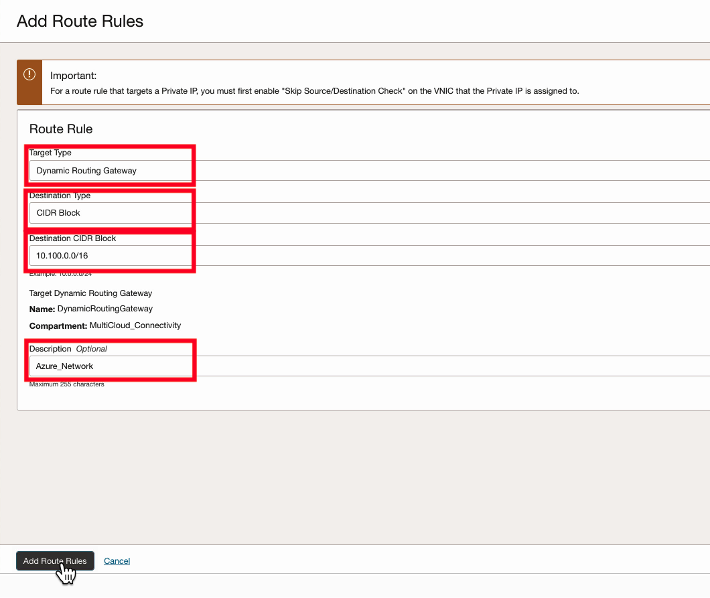
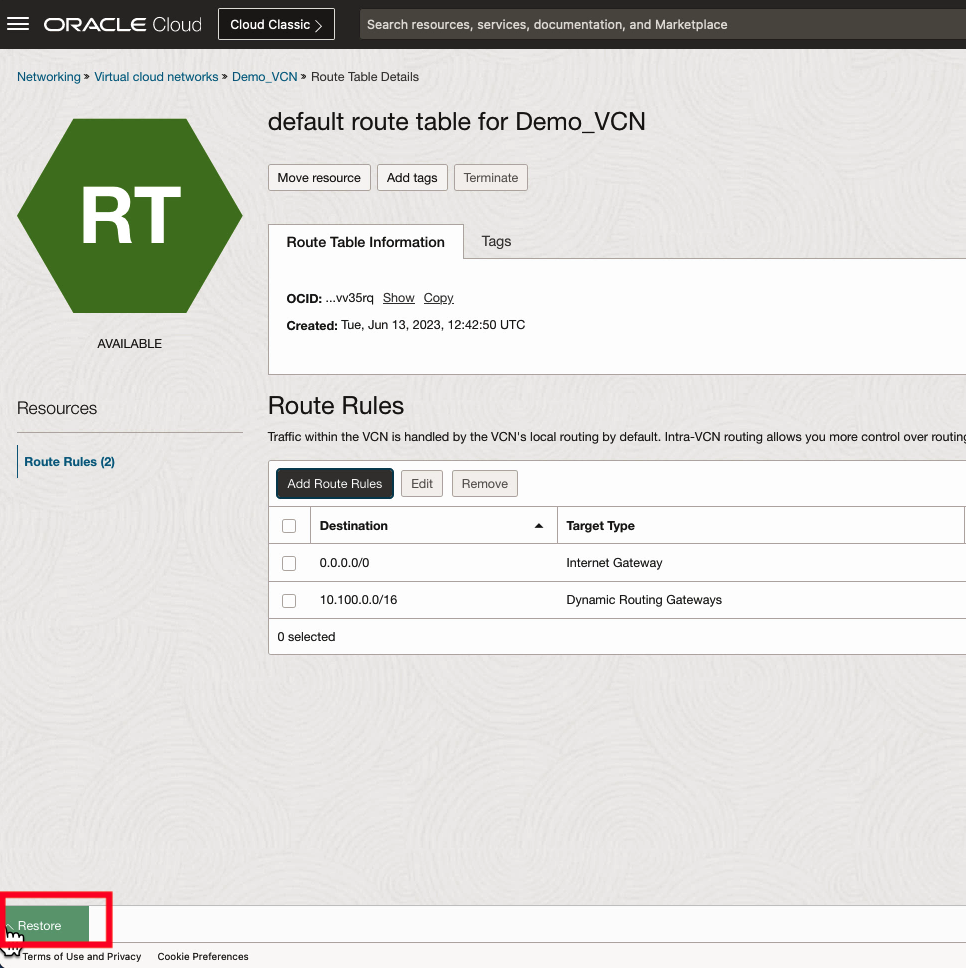
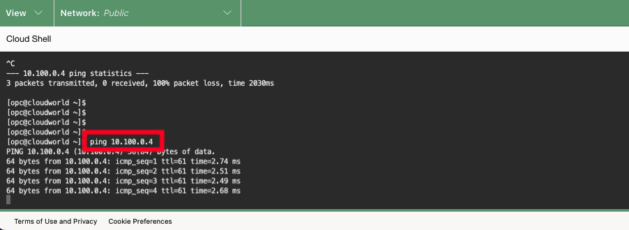

# Verify MultiCloud Connectivity

**Estimated Lab Time: 10 minutes**

In this lab, you will:

* Update the VCN Route Table
* Verify private connectivity between Oracle Cloud and your external cloud provider.

## Video Walkthrough

[Verify Connectivity Video](youtube:oTcQNfchMKc:large)

## Task 1 : Update VCN Route Table

1. From the Oracle Cloud homepage, open up the navigation menu in the top left hand corner. Navigate to **Compute -> Instances**.
    
2. Select the name of the Virtual Machine that was deployed the previous lab.
    
3. Select the subnet that the Virtual Machine is deployed to.
    
4. Select the route table this subnet is associated with.
    
5. Click **Add Route Rules**.
    
6. On the Route Rule, add **Dynamic Routing Gateway** as the Target Type. **CIDR Block** as the Destination Type. **10.100.0.0/16** as the Destination CIDR Block, and an option description.
    

## Task 2: Test Connectivity

1. Restore your Cloud Shell session that has an active SSH session to your Oracle Cloud virtual machine.
    
2. Run the command **ping _ip address_**, where **_ip address_** is the IP address of your external cloud provider's virtual machine private IP address.
    

## Acknowledgements

* **Author** - <Name, Title, Group> Jake Bloom, Principal Solution Architect, OCI Networking
* **Last Updated By/Date** - <Name, Month Year> Jake Bloom, July 2023
