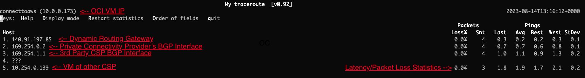

# Verify MultiCloud connectivity

## Introduction

Estimated Lab Time: 10 minutes

### Objectives

In this lab, you will:

* Update the VCN Route Table
* Verify private connectivity between Oracle Cloud and your external cloud provider.

### Video Walkthrough

[Verify Connectivity Video](youtube:oTcQNfchMKc:large)

## Task 1 : Update VCN Route Table

1. From the Oracle Cloud homepage, open up the navigation menu in the top left hand corner. Navigate to **Compute -> Instances**.
    
2. Select the name of the Virtual Machine that was deployed the previous lab.
    
3. Select the subnet that the Virtual Machine is deployed to.
    
4. Select the route table this subnet is associated with.
    
5. Click **Add Route Rules**.
    
6. On the Route Rule, add **Dynamic Routing Gateway** as the Target Type. **CIDR Block** as the Destination Type. **10.100.0.0/16** as the Destination CIDR Block, and an option description.
    

## Task 2: Test Connectivity

1. Restore your Cloud Shell session that has an active SSH session to your Oracle Cloud virtual machine.
    
2. Run the command **ping ipaddress**, where **ipaddress** is the IP address of your external cloud provider's virtual machine private IP address.
    
3. Run the command **mtr ipaddress**, where **ipaddress** is the IP address of your external cloud provider's virtual machine private IP address. This command will show you all of the hops your traffic takes, confirms that you are going over the private connection and gives some basic packet statistic information.

    > **Note:** **Click on the image below to explode the view.**
    
4. Congratulations! You've completed the lab. You can now destroy the objects created in this lab, such as the Virtual Machines, FastConnect, DRG and VCN.

## Acknowledgements

* **Author** - Jake Bloom, Principal Solution Architect, OCI Networking
* **Last Updated By/Date** - Jake Bloom, August 2023
