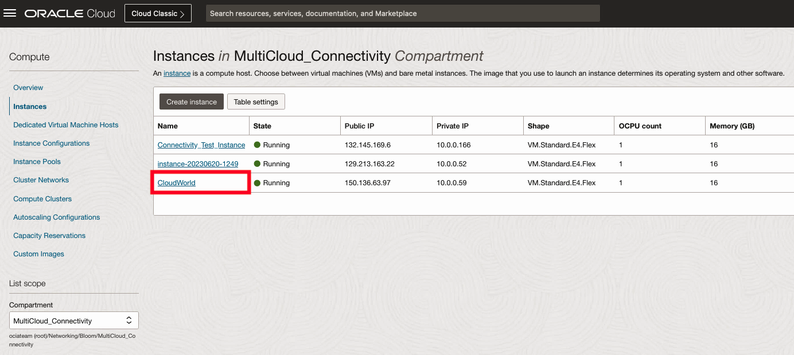

# Verify MultiCloud Connectivity

## Introduction

In this lab we will update the route table of the Virtual Cloud Network (VCN) and test end to end connectivity from Oracle Cloud to the external cloud provider, verifying that MultiCloud connectivity has been established.

Estimated Lab Time: 20 minutes

### Objectives

In this lab, you will:

* Update the VCN Route Table
* Verify end to end connectivity with your external cloud provider.

## Video Walkthrough

TODO

## Task 1 : Update VCN Route Table

1. From the Oracle Cloud homepage, open up the navigation menu in the top left hand corner. Navigate to **Compute -> Instances**.
    
2. Select the name of the Virtual Machine that was deployed the previous lab.
    
3. Select the subnet that the Virtual Machine is deployed to.
    
4. Select the route table this subnet is associated with.
    
5. Click **Add Route Rules**.
    
6. On the Route Rule, add **Dynamic Routing Gateway** as the Target Type. **CIDR Block** as the Destination Type. **10.100.0.0/16** as the Destination CIDR Block, and an option description.
    

## Task 2: Test Connectivity

1. Restore your Cloud Shell session that has an active SSH session to your Oracle Cloud virtual machine.
    
2. Run the command **ping _ipaddress_**, where _ipaddress_ is the IP address of your external cloud provider's virtual machine private IP address.
    

3. Congratulations! I hope you enjoyed the lab!

## Acknowledgements

* **Author** - <Name, Title, Group> Jake Bloom, Principal Solution Architect, OCI Networking
* **Contributors** -  <Name, Group> -- optional
* **Last Updated By/Date** - <Name, Month Year> Jake Bloom, June 2023