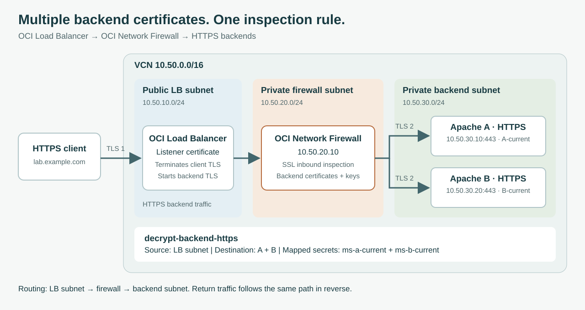

# Introduction

## About this Workshop

Renewing a web server certificate should not require a simultaneous change on the firewall inspecting its HTTPS traffic. OCI Network Firewall supports multiple certificates in one SSL inbound inspection decryption rule, allowing the current and renewed certificates to coexist during rotation.

In this workshop, we configure one rule for two Apache backends with different certificates. We then clone the active firewall policy, add a renewed certificate for backend A to the clone, associate that policy with the firewall, update Apache, and retire the old certificate reference. The firewall is ready for the replacement before the server starts using it.

Oracle describes overlapping certificates as enabling **zero-downtime certificate rotation** for ingress decryption. The workflow adds a new mapped secret while preserving the existing mappings, separating firewall preparation from the server certificate cutover. See the [Network Firewall release notes](https://docs.oracle.com/en-us/iaas/releasenotes/network-firewall/release-notes-2026-02-20.htm).

**Looking for certificate renewal?** Select **Lab 4: Rotate or Renew a Certificate Before It Expires** in the workshop menu.

Estimated Workshop Time: 35 minutes after the supporting resources are ready. Allow additional time to provision resources and wait for firewall deployment or policy updates. Labs 2-4 retain the original 30-minute focus on firewall configuration and certificate rotation.

### Objectives

- Configure SSL inbound inspection with two mapped secrets in one rule.
- Clone the active policy, add the renewed certificate, and associate the clone with the firewall.
- Rotate the Apache backend certificate and retire the old mapping.

### Prerequisites

- An OCI tenancy and region supporting multiple certificate inspection.
- Permissions to manage the required networking, Compute, LB, Network Firewall, Vault secrets, and IAM policies.
- Access to the backend certificates, complete CA chains, and matching private keys.
- Familiarity with the OCI Console and basic HTTPS configuration.

## Architecture

The OCI Load Balancer (LB) accepts client HTTPS and establishes a separate HTTPS connection to the selected Apache backend. OCI Network Firewall sits **after the LB**, between the LB and backend subnets, and inspects these backend connections.

The firewall therefore needs the **Apache backend certificates and their private keys**. The LB's public listener certificate belongs to a different TLS connection. Enable backend SSL on the LB; forwarding plain HTTP would leave no backend TLS traffic to decrypt.

| Component | Example configuration |
| --- | --- |
| VCN | `10.50.0.0/16` |
| Public LB subnet | `10.50.10.0/24` |
| Private firewall subnet | `10.50.20.0/24`; firewall IP `10.50.20.10` |
| Private backend subnet | `10.50.30.0/24` |
| Apache backend A | `10.50.30.10:443`; certificate A-current |
| Apache backend B | `10.50.30.20:443`; certificate B-current |

Use your own addresses and certificate identities. Both backends can share one inspection rule even though their certificates differ.

## Workshop Outline

- Lab 1: Prepare the VCN, Apache Servers, and Load Balancer.
- Lab 2: Create the Firewall Policy and Two Mapped Secrets.
- Lab 3: Configure Multiple Certificate Inspection.
- Lab 4: Rotate or Renew a Certificate Before It Expires.

## Learn More

- [Multiple Certificate Support for SSL Inbound Inspection](https://blogs.oracle.com/cloud-infrastructure/oci-firewall-multiple-cert-ssl-inspection)
- [Network Firewall Certificate Rotation Release Notes](https://docs.oracle.com/en-us/iaas/releasenotes/network-firewall/release-notes-2026-02-20.htm)

## Acknowledgements

- **Author** - Luis Catalán Hernández (Cloud Infrastructure Networking Black Belt)
- **Last Updated By/Date** - Luis Catalán Hernández, September 2026

You may now proceed to the next lab.
