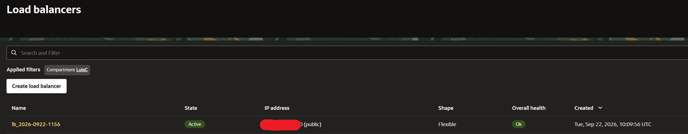
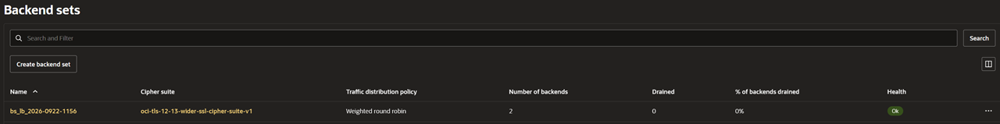
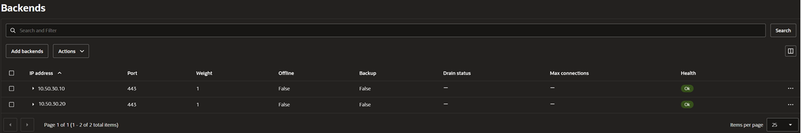

# Prepare the VCN, Apache Servers, and Load Balancer

## Introduction

Prepare or confirm the supporting environment for inspecting HTTPS between an OCI Load Balancer and two Apache backends. Use the linked guides for provisioning; the detailed labs focus on Network Firewall and certificate rotation.

Estimated Time: 5 minutes

### Objectives

- Identify the required VCN subnets and backend HTTPS connections.
- Confirm that both Apache backends are healthy through the load balancer.

### Prerequisites

- An OCI tenancy and permission to create the required networking, Compute, and Load Balancer resources.
- Two different backend certificates, their CA chains, and matching private keys.
- Supporting resources prepared before starting the timed firewall labs; provisioning time is additional.

## Task 1: Prepare the supporting resources

Use the following guides to prepare the architecture. Web server and LB configuration are outside this workshop's scope.

| Resource | Preparation and reference |
| --- | --- |
| VCN and subnets | Create the three subnets shown in the Introduction. Follow [Create and Configure a Virtual Cloud Network](https://docs.oracle.com/en/learn/lab_virtual_network/index.html). |
| Compute instances | Deploy two Oracle Linux instances in the backend subnet. Follow [Creating an Instance](https://docs.oracle.com/en-us/iaas/Content/Compute/Tasks/launchinginstance.htm). |
| Apache web servers | Install Apache and configure HTTPS with a different certificate on each backend. Follow [Install the Apache Web Server](https://docs.oracle.com/en/learn/apache-install/#introduction), including **Securing the web service**. |
| OCI Load Balancer | Follow [Creating a Load Balancer](https://docs.oracle.com/en-us/iaas/Content/Balance/Tasks/managingloadbalancer_topic-Creating_Load_Balancers.htm) and [Configuring SSL Handling](https://docs.oracle.com/en-us/iaas/Content/Balance/Tasks/managingcertificates.htm#configuring-ssl-handling). Configure frontend HTTPS and backend SSL on port 443, with CA trust for both backend certificates. |

## Task 2: Confirm backend connectivity and health

1. Allow the required HTTPS traffic through the relevant security lists, NSGs, and host firewalls. Confirm the LB reports a healthy status.

    

2. Confirm that the backend set includes both Apache servers, with backend SSL enabled on port 443 and CA trust for both certificates.

    

3. Confirm that both backends are healthy and reachable through the LB before continuing.

    

## Acknowledgements

- **Author** - Luis Catalán Hernández (Cloud Infrastructure Networking Black Belt)
- **Last Updated By/Date** - Luis Catalán Hernández, September 2026

You may now proceed to the next lab.
