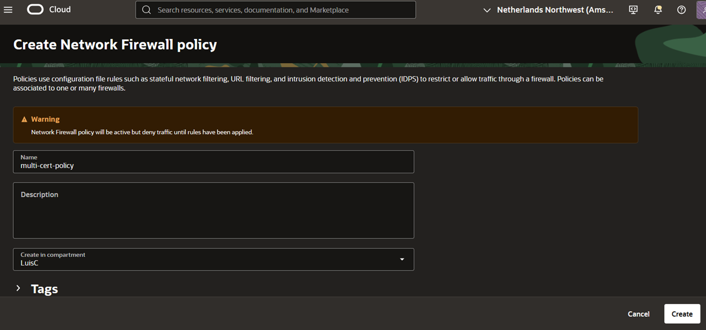
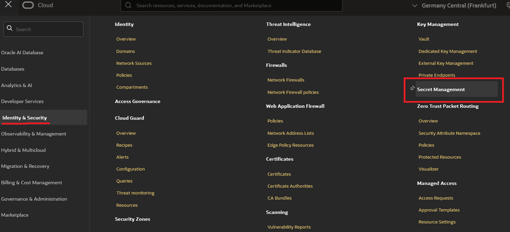
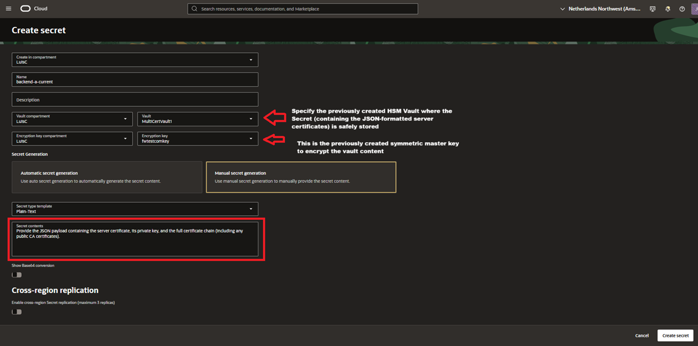
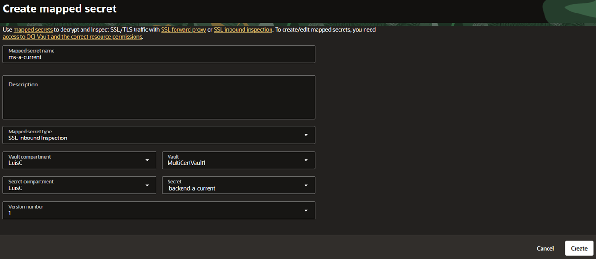
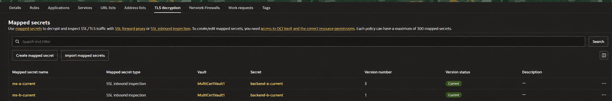

# Create the Firewall Policy and Two Mapped Secrets

## Introduction

A mapped secret links a certificate stored in Vault to the firewall policy. Create one for each backend certificate; multiple certificate support is configured later by selecting both mappings in the same decryption rule.

Estimated Time: 10 minutes

### Objectives

- Create the Network Firewall policy and authorize its Vault access.
- Store the two backend certificates and create one mapped secret for each.

### Prerequisites

- All previous labs successfully completed.
- Permissions to manage Network Firewall policies, Vault secrets, encryption keys, and the required IAM policy.
- The current certificates, matching private keys, and complete CA chains for both Apache backends.

## Task 1: Create the policy and store the certificates

1. In the OCI Console, open **Identity & Security**, then **Network Firewall policies**. Create a policy named `multi-cert-policy` in your compartment and record its OCID.

    

2. Follow [Set Up Network Traffic Decryption and Inspection](https://docs.oracle.com/en-us/iaas/Content/network-firewall/setting-up-certificate-authentication.htm) to create or reuse a vault and symmetric encryption key, and grant this firewall policy permission to read the secrets.
3. Create two Vault secrets using the documented certificate JSON format:

    | Vault secret | Contents |
    | --- | --- |
    | `backend-a-current` | A-current certificate, its matching private key, and CA chain |
    | `backend-b-current` | B-current certificate, its matching private key, and CA chain |

    

    Each payload uses `caCertOrderedList` for the CA certificates and `certKeyPair` for the server certificate and key. For help preparing this format, see [Create Compatible Certificate JSON for OCI Network Firewall](https://docs.oracle.com/en/learn/setup-certificate-authentication-oci-network-fw/index.html).

    

## Task 2: Map each secret to the policy

1. Open `multi-cert-policy` and select **TLS decryption**.
2. Under **Mapped secrets**, select **Create mapped secret**.
3. Complete the fields for backend A:

    | Field | Value |
    | --- | --- |
    | Mapped secret name | `ms-a-current` |
    | Mapped secret type | **SSL Inbound Inspection** |
    | Vault compartment and vault | Where the certificate secret is stored |
    | Secret compartment and secret | `backend-a-current` |
    | Version number | Version containing A-current |

    

4. Select **Create**. Repeat for backend B, using `ms-b-current` and `backend-b-current`.
5. Confirm both mappings appear in the policy. See [Create a Mapped Secret](https://docs.oracle.com/en-us/iaas/Content/network-firewall/mapped-secret-create.htm) for field descriptions.

    

## Acknowledgements

- **Author** - Luis Catalán Hernández (Cloud Infrastructure Networking Black Belt)
- **Last Updated By/Date** - Luis Catalán Hernández, September 2026

You may now proceed to the next lab.
