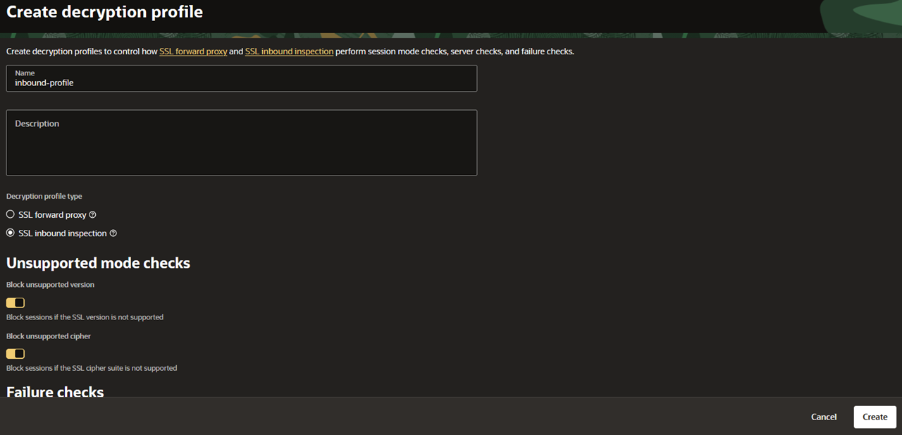
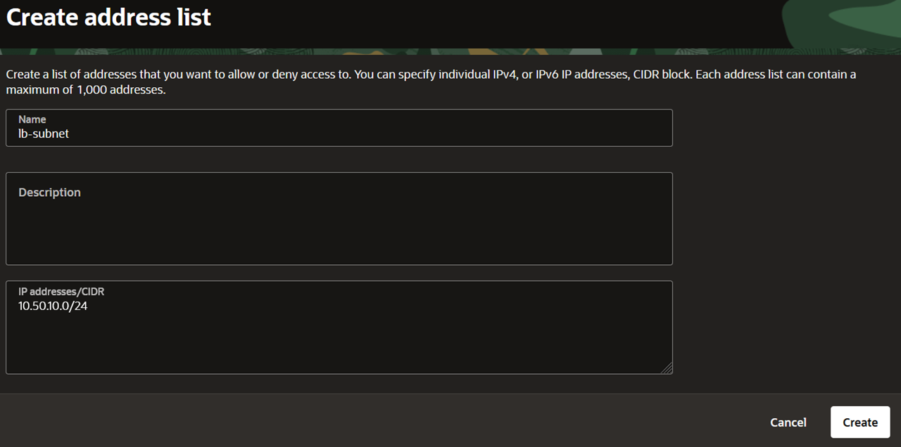
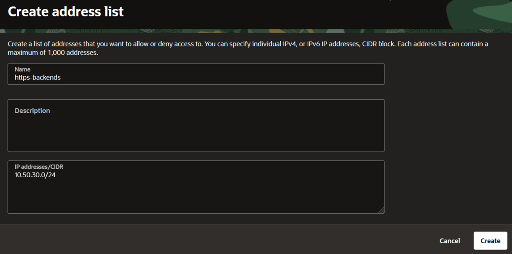
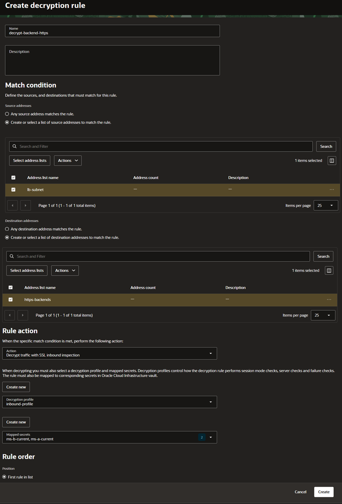
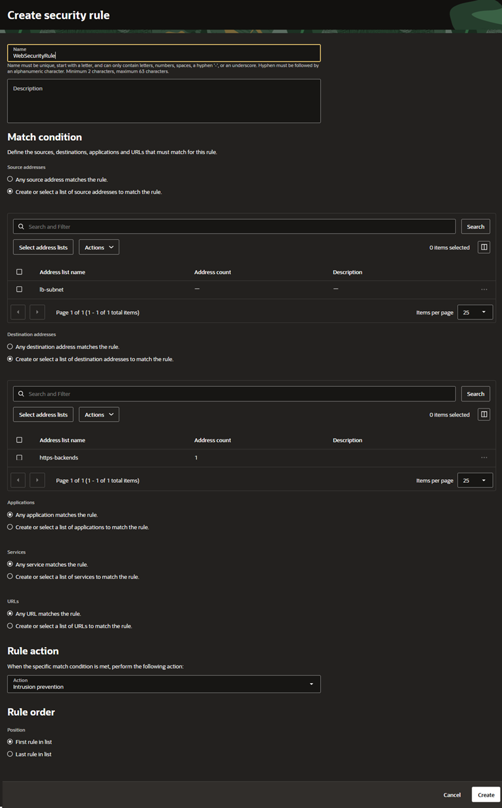

# Configure Multiple Certificate Inspection

## Introduction

Select both backend certificates in one SSL inbound inspection rule, create the security rule, and route the LB-to-backend connections through OCI Network Firewall.

Estimated Time: 10 minutes

### Objectives

- Create one decryption rule using both current mapped secrets.
- Configure the security rule with Intrusion Prevention.
- Deploy the firewall and route forward and return backend traffic through it.

### Prerequisites

- All previous labs successfully completed.
- Permission to create the firewall, configure routing, and enable firewall logging.
- Time for firewall provisioning in addition to the estimated hands-on time.

## Task 1: Create the decryption profile and rule

1. Under **TLS decryption**, create a profile named `inbound-profile` with type **SSL Inbound Inspection**. Select the required checks for unsupported TLS versions, unsupported ciphers, and insufficient resources. See [Create a Decryption Profile](https://docs.oracle.com/en-us/iaas/Content/network-firewall/decryption-profile-create.htm).

    

2. Create address lists `lb-subnet` containing `10.50.10.0/24` and `https-backends` containing `10.50.30.0/24`.

    

    

3. Open **Rules**, select **Create decryption rule**, and enter:

    | Setting | Value |
    | --- | --- |
    | Name | `decrypt-backend-https` |
    | Source addresses | `lb-subnet` |
    | Destination addresses | `https-backends` |
    | Action | **Decrypt traffic with SSL inbound inspection** |
    | Decryption profile | `inbound-profile` |
    | Mapped secrets | **Select both `ms-a-current` and `ms-b-current`** |
    | Order | Before any broader matching decryption rule |

    

4. Save the rule. The current [decryption rule documentation](https://docs.oracle.com/en-us/iaas/Content/network-firewall/decryption-rule-create.htm) supports selecting multiple mapped secrets in the Console.

    The firewall uses the certificate matching the protected backend within this rule's certificate list. Certificate order is irrelevant. Two identical rules with different certificates would not provide fallback, because the firewall does not search later rules for a matching certificate. See the [feature announcement](https://blogs.oracle.com/cloud-infrastructure/oci-firewall-multiple-cert-ssl-inspection).

## Task 2: Create the security rule

**Security rules are enforced after decryption rules.** Decryption and permission to pass traffic are separate policy decisions. A policy supports up to **10,000 security rules**. The first matching security rule determines the action; traffic with no matching security rule is dropped. See [Network Firewall Policies](https://docs.oracle.com/en-us/iaas/Content/network-firewall/policies.htm).

1. In **Rules**, select **Create security rule**. Use `WebSecurityRule` as the name, select `lb-subnet` as the source and `https-backends` as the destination, and set **Rule action** to **Intrusion Prevention**. Make sure both address lists are selected before saving.

    

2. Place this rule before any broader matching security rule and save it. See [Create a Security Rule](https://docs.oracle.com/en-us/iaas/Content/network-firewall/security-rule-create.htm).

## Task 3: Deploy the firewall and direct traffic through it

1. [Create the Network Firewall](https://docs.oracle.com/en-us/iaas/Content/network-firewall/firewall-create.htm) in the firewall subnet and associate `multi-cert-policy`. Wait for deployment to complete.
2. Configure [intra-VCN routing](https://docs.oracle.com/en-us/iaas/Content/network-firewall/network-firewall-routing-traffic.htm) using the firewall's actual private IP:

    | Subnet route table | Destination | Next hop |
    | --- | --- | --- |
    | LB subnet | `10.50.30.0/24` | Firewall private IP |
    | Backend subnet | `10.50.10.0/24` | Firewall private IP |
    | Firewall subnet | LB and backend subnets | Implicit local routing |

3. Preserve the LB's internet route and allow the inspected flows through the firewall subnet's security rules. Confirm both backends remain healthy. Forward and return traffic must cross the firewall.

4. Enable firewall logging, including threat logs, as required for Intrusion Prevention. Follow [Logging Firewall Activity](https://docs.oracle.com/en-us/iaas/Content/network-firewall/logs.htm). Confirm both backends remain healthy through the inspected path before starting certificate renewal.

## Acknowledgements

- **Author** - Luis Catalán Hernández (Cloud Infrastructure Networking Black Belt)
- **Last Updated By/Date** - Luis Catalán Hernández, September 2026

You may now proceed to the next lab.
