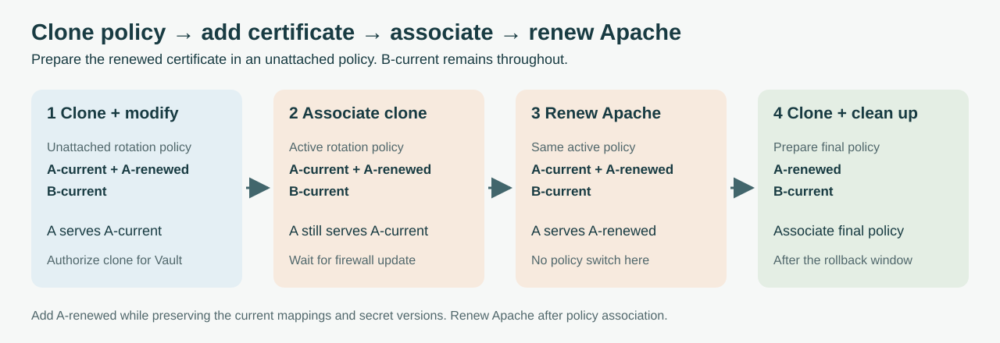
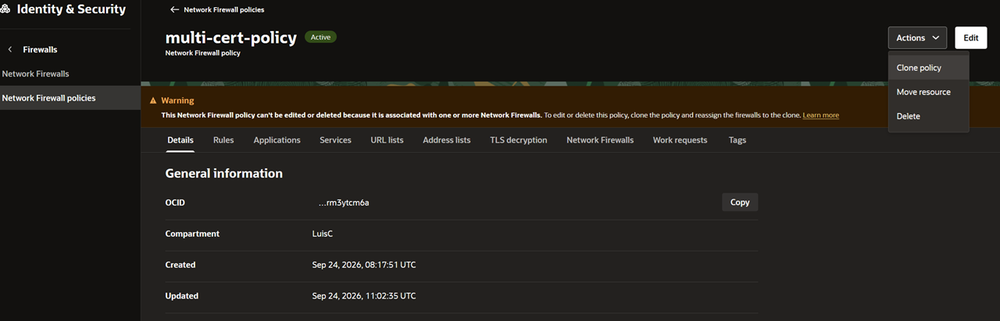
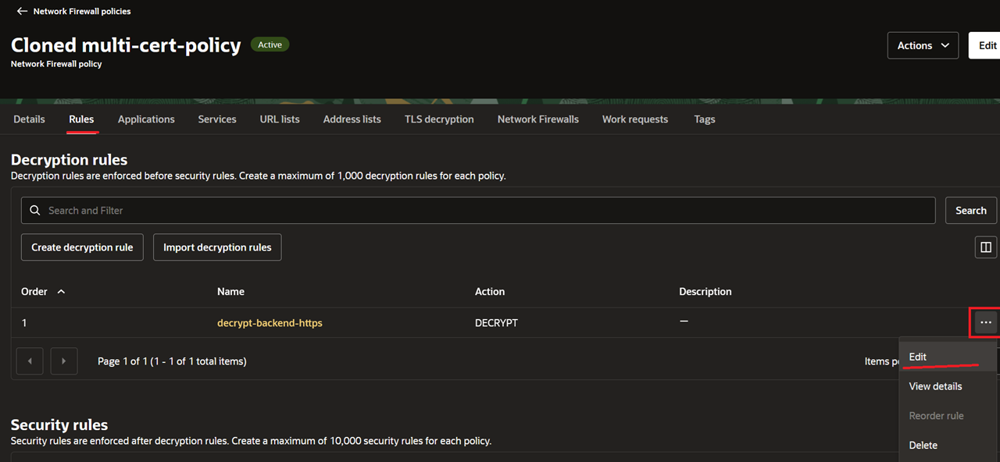
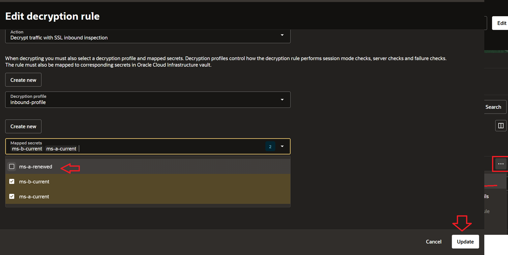
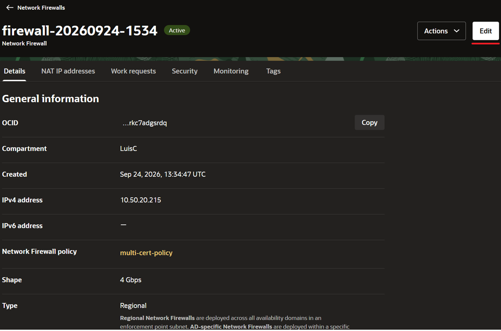
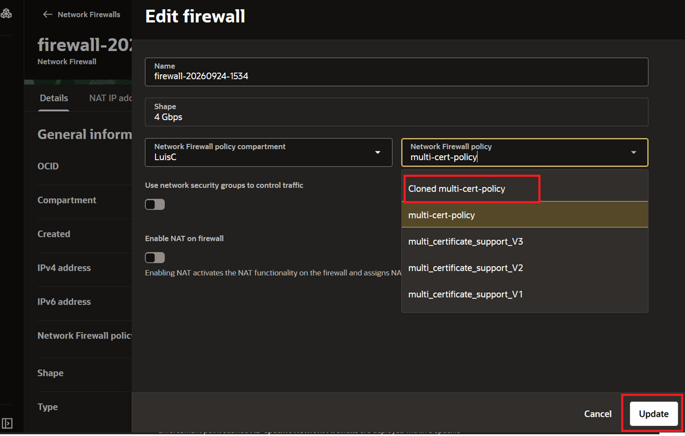

# Rotate or Renew a Certificate Before It Expires

## Introduction

**Use case:** A backend certificate is about to expire. Renew it while keeping the current certificate available during the transition. This section covers the complete process: prepare the firewall, renew the Apache certificate, and retire the old mapping.

Backend A's certificate is approaching expiry. Obtain A-renewed with the **same Common Name (CN), Subject Alternative Names (SANs), and intended usage**, but a later expiration date. Use the same issuing CA for this exercise and retain its matching private key. Keep A-current valid and installed on Apache during firewall preparation.

The object we **clone is the OCI Network Firewall policy**. An associated policy cannot be edited directly; the changes are made in a new policy and then applied by associating that policy with the firewall. See [Change a Firewall Policy](https://docs.oracle.com/en-us/iaas/Content/network-firewall/edit-policy.htm).

Estimated Time: 10 minutes

### Objectives

- Add a renewed certificate without replacing the current mapped secret.
- Associate the prepared policy before renewing Apache.
- Retire the old mapping after the certificate transition and rollback window.

### Prerequisites

- All previous labs successfully completed.
- A renewed backend A certificate with the same CN, SANs, and intended usage, a later expiration date, and its matching private key.
- The original certificate still valid, plus access to update Apache and confirm LB backend health.

## Rotation Workflow

## Task 1: Clone the policy currently associated with the firewall

1. Open **Network Firewall policies** and select the active `multi-cert-policy`.
2. Select **Actions → Clone policy**. Name the copy `multi-cert-policy-rotation`, select the compartment, and select **Create Network Firewall policy**.
3. Open the cloned policy. It includes the original mappings, profiles, rules, and lists. Confirm `ms-a-current`, `ms-b-current`, and `decrypt-backend-https` are present. See [Clone a Firewall Policy](https://docs.oracle.com/en-us/iaas/Content/network-firewall/clone-policy.htm).
4. Record the clone's new policy OCID. If the Vault access IAM policy from Lab 2 is restricted to the original policy OCID, extend it to authorize the cloned policy before deployment. The clone must be able to read all referenced secrets.

    The firewall continues using `multi-cert-policy` while you prepare the unattached clone.

    

## Task 2: Add the renewed certificate to the cloned policy

1. Create a new Vault secret `backend-a-renewed` containing A-renewed, its matching private key, and CA chain, following Lab 2.
2. In **`multi-cert-policy-rotation`**, open **TLS decryption → Mapped secrets → Create mapped secret**.
3. Enter `ms-a-renewed`, select **SSL Inbound Inspection**, and choose the new Vault secret and its certificate version. Select **Create**.

    

4. Still in the clone, edit `decrypt-backend-https` and add `ms-a-renewed`. Keep all three references selected:

    - `ms-a-current`
    - `ms-a-renewed`
    - `ms-b-current`

5. Save the rule. Keep the existing mappings, their Vault secret versions, match conditions, rule order, and security rules unchanged. The only addition is `ms-a-renewed` and its reference in the decryption rule.

    

## Task 3: Associate the updated clone with OCI Network Firewall

1. Open **Identity & Security → Network Firewalls** and select the existing firewall.
2. Select **Edit**, change its associated policy to **`multi-cert-policy-rotation`**, and select **Save Changes**. See [Change a Firewall](https://docs.oracle.com/en-us/iaas/Content/network-firewall/edit-network-firewall.htm).
3. Wait for the update to complete successfully. Confirm the firewall now references the cloned policy and both backends remain healthy before changing Apache. Retain the original policy for rollback while its certificates remain valid.

    
    

    > **Note:** **Traffic continuity with multiple certificates:** This is an additive rotation: the cloned policy retains `ms-a-current` and `ms-b-current` unchanged and adds `ms-a-renewed`. The intended behavior is to apply this additional certificate without service interruption, while Apache continues presenting A-current. After Apache switches, the firewall already has A-renewed available. This uses the overlapping-certificate capability described as supporting [zero-downtime rotation](https://docs.oracle.com/en-us/iaas/releasenotes/network-firewall/release-notes-2026-02-20.htm); it does not replace the certificate or secret version inside an existing mapping.

## Task 4: Renew the Apache certificate and retire the old mapping

1. Install A-renewed and its matching private key on **Apache backend A**, following [Securing the Apache Web Service](https://docs.oracle.com/en/learn/apache-install/#securing-the-web-service). Apply the change using your normal graceful reload procedure. Backend B remains unchanged.
2. Confirm backend A serves the renewed certificate with its later expiration and that both backends remain healthy. Check the certificate at the backend: the public LB endpoint presents the LB listener certificate.
3. Confirm new LB-to-backend TLS connections work and review [firewall activity](https://docs.oracle.com/en-us/iaas/Content/network-firewall/logs.htm). The firewall already has both versions, so no policy switch is needed at the server's certificate cutover.
4. After all servers using A-current have been renewed and the rollback window has closed, **clone the now-active `multi-cert-policy-rotation`** as `multi-cert-policy-final`.
5. In this unattached cleanup clone, edit `decrypt-backend-https` and remove **only `ms-a-current`**. Save the rule, then delete the unused `ms-a-current` mapped secret from this clone. Retain `ms-a-renewed` and `ms-b-current`.
6. Authorize the final policy's OCID to read the required Vault secrets if IAM access is scoped by policy OCID. Associate `multi-cert-policy-final` with the existing firewall, following Task 3 in this lab. This later cleanup is a separate policy change from adding the renewed certificate. Wait for completion.
7. Retire superseded policies when no firewall or rollback plan needs them. Retire the old Vault secret according to your retention policy only after no remaining policy or other consumer needs it.

## Rotation Summary

The policy lifecycle is:

| Stage | Policy associated with the firewall | Certificate mappings |
| --- | --- | --- |
| Initial | `multi-cert-policy` | A-current + B-current |
| Overlap and Apache renewal | `multi-cert-policy-rotation` | A-current + A-renewed + B-current |
| Cleanup complete | `multi-cert-policy-final` | A-renewed + B-current |

Repeat the same clone, modify, and reassociate process when backend B's certificate approaches expiry.

## Conclusion

You configured one SSL inbound inspection rule for two Apache backends with different certificates, then prepared its renewal in a cloned firewall policy. Associating that policy before updating Apache makes both certificates available for the server cutover. A second clone removes the old mapping after rotation.

## Learn More

- [Clone a Firewall Policy](https://docs.oracle.com/en-us/iaas/Content/network-firewall/clone-policy.htm)
- [Change a Firewall and Its Associated Policy](https://docs.oracle.com/en-us/iaas/Content/network-firewall/edit-network-firewall.htm)

- [Multiple Certificate Support for SSL Inbound Inspection](https://blogs.oracle.com/cloud-infrastructure/oci-firewall-multiple-cert-ssl-inspection)
- [Network Firewall Certificate Rotation Release Notes](https://docs.oracle.com/en-us/iaas/releasenotes/network-firewall/release-notes-2026-02-20.htm)
- [Install and Secure Apache](https://docs.oracle.com/en/learn/apache-install/)
- [OCI Load Balancer SSL Configuration](https://docs.oracle.com/en-us/iaas/Content/Balance/Tasks/managingcertificates.htm)

## Acknowledgements

- **Author** - Luis Catalán Hernández (Cloud Infrastructure Networking Black Belt)
- **Last Updated By/Date** - Luis Catalán Hernández, September 2026
