# OCI Network Firewall deployment

### Introduction

Estimated Time: 60 minutes

### About Virtual Cloud Networks and the OCI Network Firewall

Virtual Cloud Networks (VCNs) provide customizable and private cloud networks in Oracle Cloud Infrastructure (OCI). Just like a traditional data center network, the VCN provides customers with complete control over their cloud networking environment. This includes assigning private IP address spaces, creating subnets and route tables, and configuring stateful firewalls. [Visit our documentation](https://docs.oracle.com/en-us/iaas/Content/Network/Tasks/Overview_of_VCNs_and_Subnets.htm) for more information on Virtual Cloud Networks.

OCI Network Firewall is a next-generation managed network firewall and intrusion detection and prevention service for your Oracle Cloud Infrastructure virtual cloud network (VCN), powered by Palo Alto Networks®. [Visit our documentation](https://docs.oracle.com/en-us/iaas/Content/network-firewall/home.htm) for more information on the Network Firewall service.

### Objectives

In this lab, you will:

* Build a Virtual Cloud Network (VCN) and a firewall dedicated subnet.
* Create a Route table and a Security List for the firewall-dedicated subnet.
* Deploy an OCI Network Firewall.

## Task 1: Deploy a VCN (Virtual Cloud Network) and a dedicated firewall subnet (private)

We will start with a basic VCN deployment. One of the goals of this livelab is also to provide an understanding of OCI routing and gateways, in relation to the OCI Network Firewall service. For this reason, we will not use the VCN Wizard which deploys all OCI Gateways and creates basic routing rules. Instead, we will manually create each artifact as needed.

1. Log into the Oracle Cloud console and select the **HOME** region.
  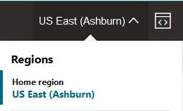
  Note: This lab can be completed in any OCI region. However, as you'll see in lab 2, we will use OCI CLI to connect to deployed private Compute Instances. That functionality is only available in the Home Region. If you want to use a different region, make sure you have connectivity to the private instances via other means.

2. On the Oracle Cloud Infrastructure Console Home page, go to the Burger menu (on top left), select Networking and click on **Virtual cloud networks**. Press **Create VCN**, making sure you have the correct Compartment selected. Give the VCN a name and assign an IPv4 CIDR Block. For this LiveLab, I will use the LAB Compartment and the VCN CIDR 10.0.0.0/16. Leave everything else on default settings and press **Create VCN**.
  
  
3. After you press **Create VCN**, you will be redirected to the VCN Details page, with the Subnets menu selected. Press **Create Subnet**. In the subnet creation menu, give it a name, assign a CIDR (I will use 10.0.0.0/27) and make it a **Private** subnet. Leave everything else with default settings.
  

## Task 2: VCN Route table and Subnet Security List

  Now that we have a VCN and a Subnet, we need to add a VCN Route Table and a Security List to that subnet. While the default ones, deployed automatically by OCI, can be used, it is recommended to have dedicated ones.

1. On the VCN Details page, on the left menu, click **Route Tables** and then click on **Create Route Table**.
  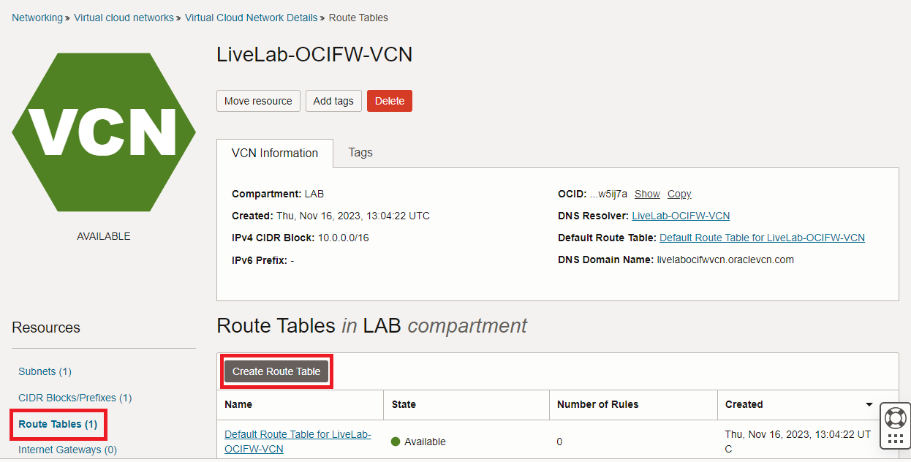

   In the menu that opens, give this route table a name and press **Create**. No routes are needed at this step of the lab.
  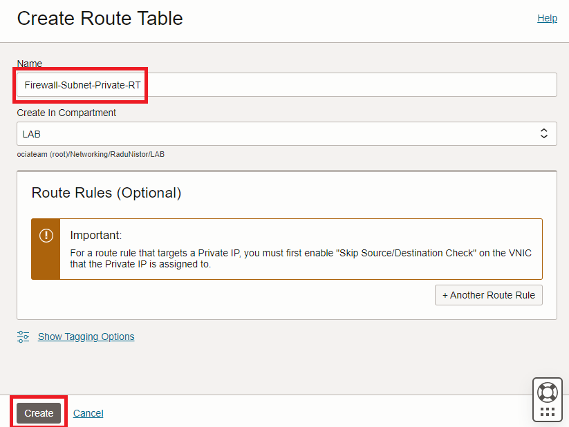

2. On the VCN Details page, on the left menu, click **Subnets** and then click on the Firewall subnet created earlier.
  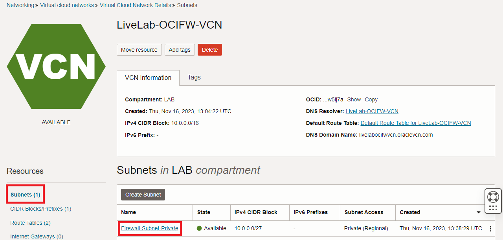

   In the menu that opens (subnet details), click **Edit**. In the new menu, replace the default Route Table with the one previously created and save the changes.
  

3. On the VCN Details page, on the left menu, click **Security Lists** and then click on **Create Security List**.
  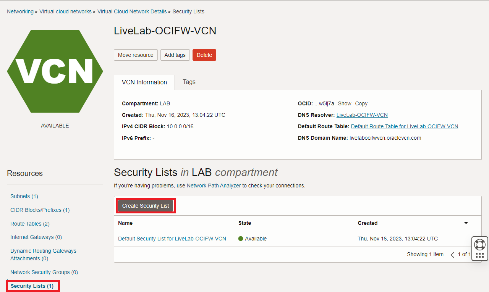

   In the menu that opens, give it a name and press **+Another Ingress Rule** and **+Another Egress Rule**.
  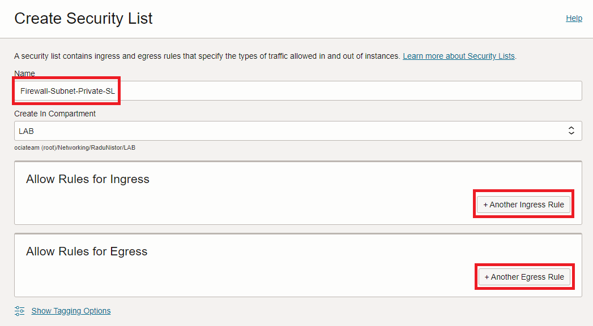

   In the rule menus that open, create an entry that allows **0.0.0.0/0** on Ingress and Egress, respectively. 
  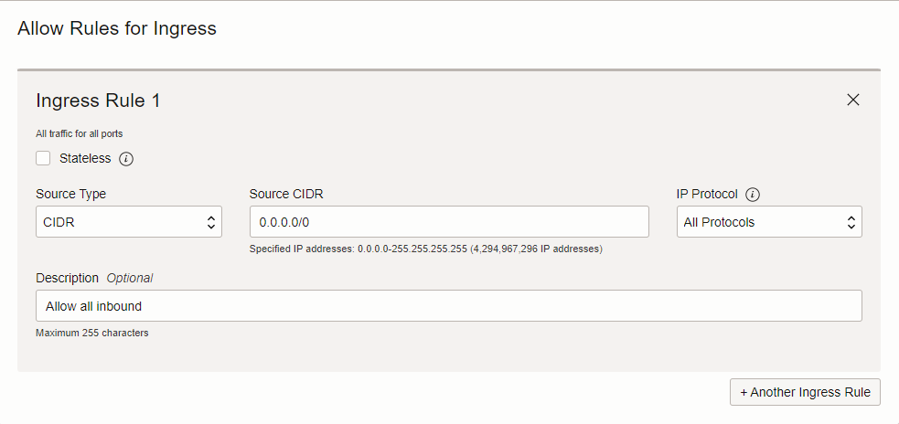
  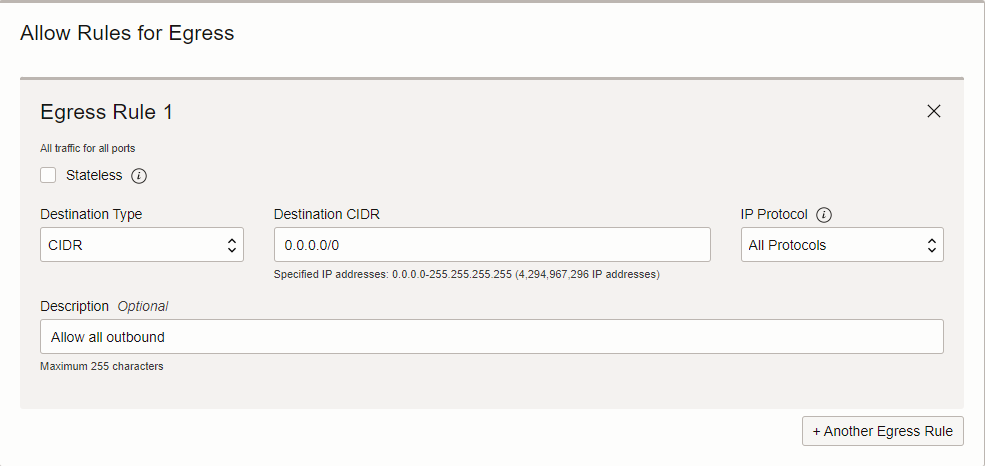
  
  Press **Create Security List**. 

4. On the VCN Details page, on the left menu, click **Subnets** and then click on the Firewall subnet created earlier.
  

   In the menu that opens (subnet details), click **Add Security List** and add the new one we created.
  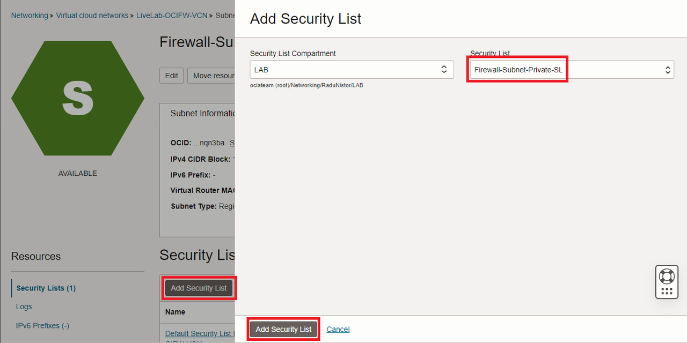

   Next, remove the Default Security List by clicking on the 3 **dots** at the end of the row, and clicking **Remove**.
  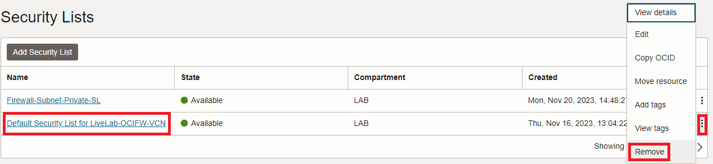

## Task 3: Deploy an OCI Network Firewall

  Now that we prepared the VCN and the Subnet, it is time to focus on the OCI Network Firewall. To deploy a Firewall we need to give it a policy. We will start by deploying an empty Firewall Policy and then use it to deploy an OCI Network Firewall.

1. On the Oracle Cloud Infrastructure Console Home page, go to the Burger menu (on top left), select **Identity and Security** and click on **Network firewall policies**.
  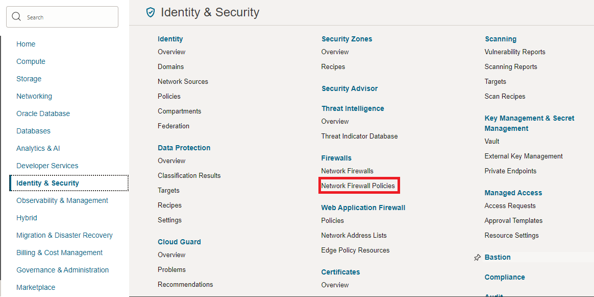

   In the menu that opens, click **Create network firewall policy**. In the next menu, give it a name and press Create...
  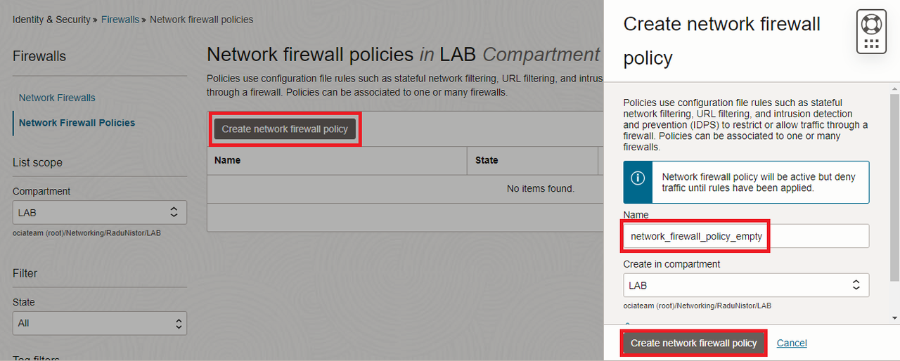

   The Firewall policy that gets created will be empty of any configuration but we can use it to deploy a Network Firewall.

2. On the Oracle Cloud Infrastructure Console Home page, go to the Burger menu (on top left), select **Identity and Security** and click on **Network firewalls**. In the menu that opens, click **Create Network firewall**.
  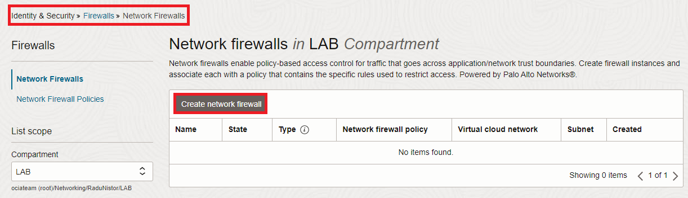

   In the menu that opens, give the firewall a name, select the empty policy we previously created and select the correct VCN and subnet, created earlier in this lab. Then press Create.
  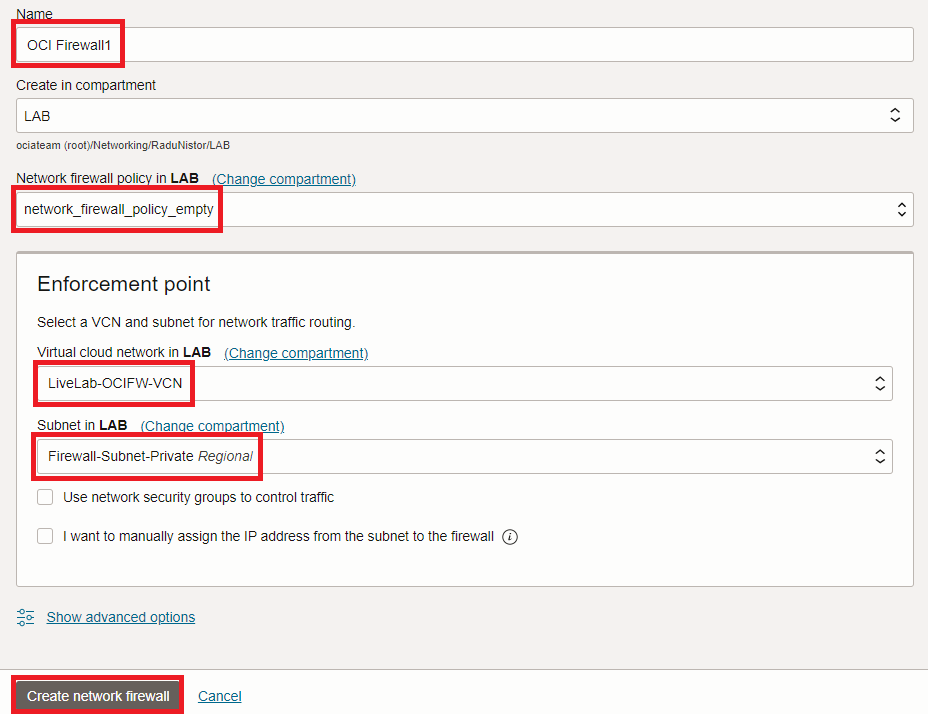

   Wait for the Firewall to become **ACTIVE** before moving on to the next step.

  Note: OCI Network Firewall creation can take up to 30 minutes. Consider taking a break!

3. Once the firewall is **ACTIVE**, click on the left hand menu on **Logs** and enable both Traffic and Threat Logs by using the toggle.
  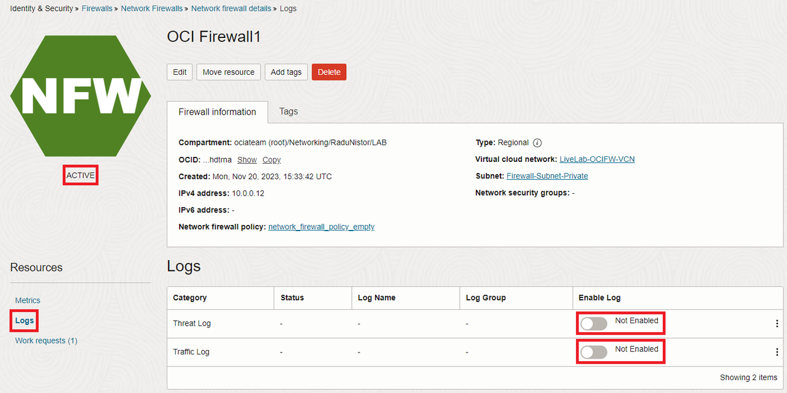

**Congratulations!** You have successfully deployed an OCI Network Firewall and completed this lab. You may now **proceed to the next lab**.

## Acknowledgements

* **Author** - Radu Nistor, Principal Cloud Architect, OCI Networking
* **Last Updated By/Date** - Radu Nistor, November 2023
