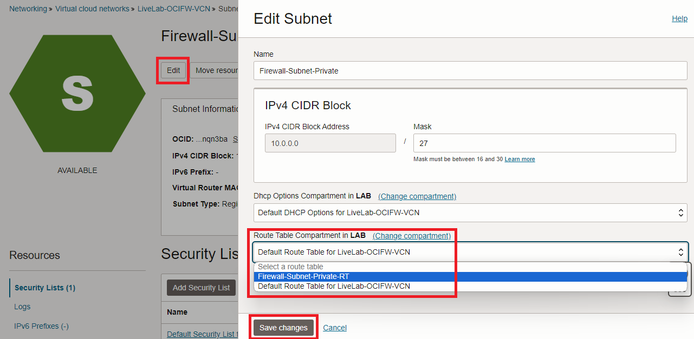

# OCI Network Firewall deployment

## Introduction

Estimated Time: 60 minutes

### About Virtual Cloud Networks and the OCI Network Firewall

Virtual Cloud Networks (VCNs) provide customizable and private cloud networks in Oracle Cloud Infrastructure (OCI). Just like a traditional data center network, the VCN provides customers with complete control over their cloud networking environment. This includes assigning private IP address spaces, creating subnets and route tables, and configuring stateful firewalls. [Visit our documentation](https://docs.oracle.com/en-us/iaas/Content/Network/Tasks/Overview_of_VCNs_and_Subnets.htm) for more information on Virtual Cloud Networks.
OCI Network Firewall is a next-generation managed network firewall and intrusion detection and prevention service for your Oracle Cloud Infrastructure virtual cloud network (VCN), powered by Palo Alto Networks®. [Visit our documentation](https://docs.oracle.com/en-us/iaas/Content/network-firewall/home.htm) for more information on the Network Firewall service.

### Objectives

In this lab, you will:

* Build a Virtual Cloud Network (VCN) and a firewall dedicated subnet.
* Create a Route table and a Security List for the firewall dedicated subnet.
* Create a basic OCI Network firewall policy.
* Deploy an OCI Network Firewall.

## Task 1: Deploy a VCN (Virtual Cloud Network) and a dedicated firewall subnet (private)

We will start with a basic VCN deployment. One of the goals of this livelab is also to provide an understanding of OCI routing and gateways, in relation to the OCI Network Firewall service. For this reason, we will not use the VCN Wizard which deploys all OCI Gateways and creates basic routing rules. Instead, we will manually create each artifact as needed.

1. Log into the Oracle Cloud console and select the **HOME** region.
  
  Note: This Lab can be completed in any OCI region. However, as explained in the **Get Started** chapter, we will use OCI CLI to connect to deployed private Compute Instances. That functionality is only available in the Home Region. If you want to use a different region, make sure you have connectivity to the private instances.
2. On the Oracle Cloud Infrastructure Console Home page, go to the Burger menu (on top left), select Networking and click on **Virtual cloud networks**. Press **Create VCN**, making sure you have the correct Compartment selected. Give the VCN a name and assign an IPv4 CIDR Block. For this LiveLab, I will use the LAB Compartment and the VCN CIDR 10.0.0.0/16. Leave everything else on default settings and press **Create VCN**.
  
3. After you press **Create VCN**, you will be redirected to the VCN Details page, with the Subnets menu selected. Press **Create Subnet**. In the subnet creation menu, give it a name, assign a CIDR (I will use 10.0.0.0/27) and make it a **Private** subnet. Leave everything else with default settings.
  

4. You may now **proceed to the next task**.

## Task 2: VCN Route table and Subnet Security List

Now that we have a VCN and a Subnet, we need to add a VCN Route Table and a Security List to that subnet. While the default ones, deployed automatically by OCI, can be used, it is recommended to have dedicated ones.

1. On the VCN Details page, on the left menu, click **Route Tables** and then click on **Create Route Table**.
  

On the menu that opens, give this route table a name and press **Create**. No routes are needed at this step of the Lab.
   

2. On the VCN Details page, on the left menu, click **Subnets** and then click on the Firewall subnet created earlier.
   

On the menu that opens (subnet details) , click **Edit**. In the new menu, replace the default Route Table with the one previously created and save the changes.
   

3.  

## Task 3: Create a basic OCI Network firewall policy

## Task 4: Deploy an OCI Network Firewall

## Acknowledgements

* **Author** - Jake Bloom, Principal Solution Architect, OCI Networking
* **Last Updated By/Date** - Jake Bloom, August 2023
