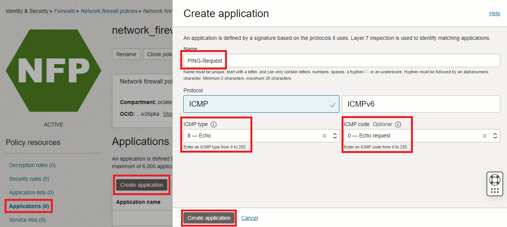
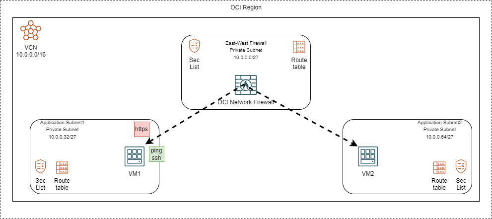
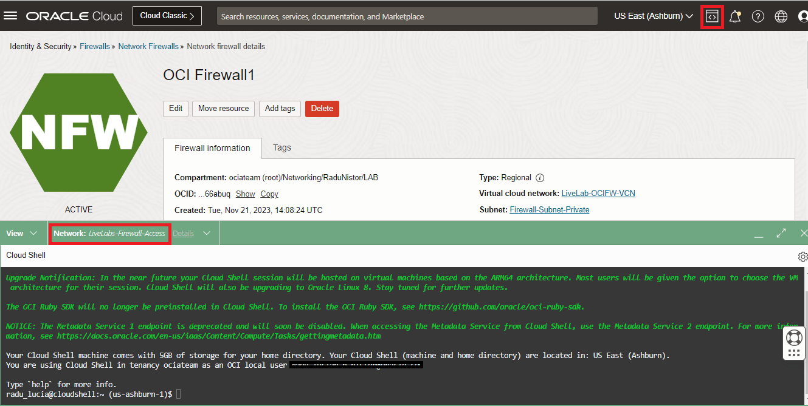
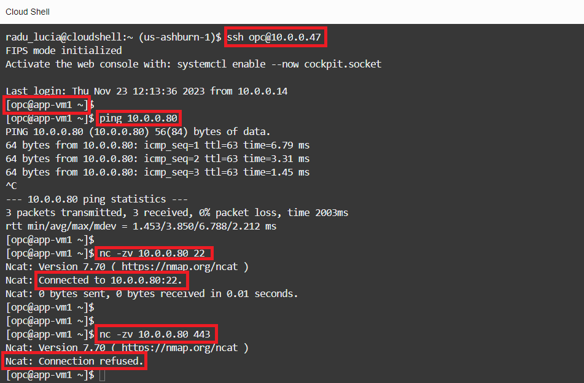
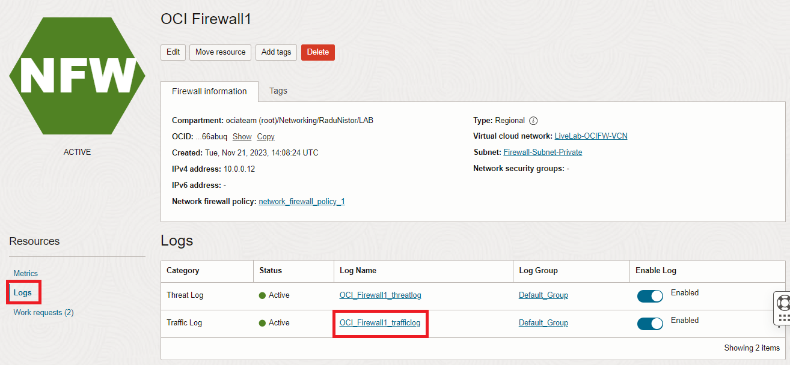
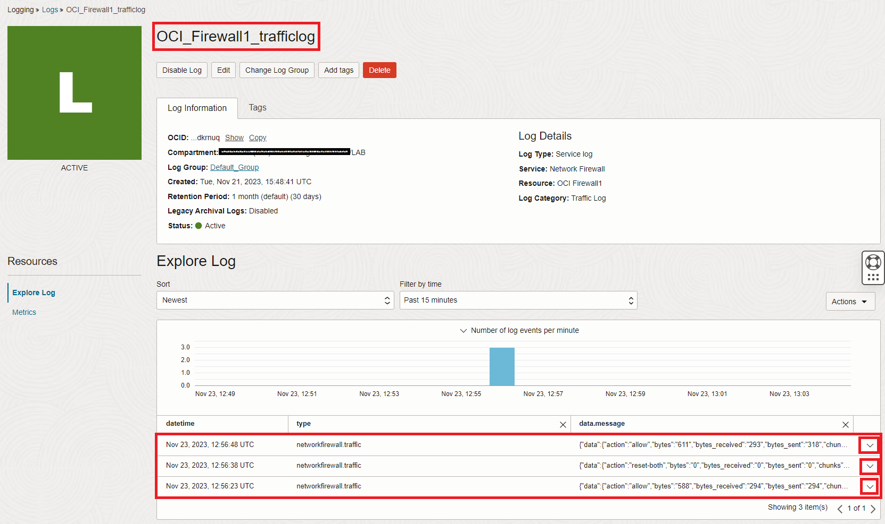
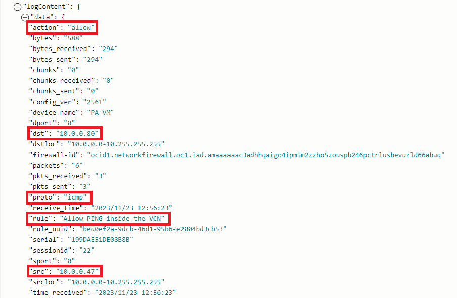
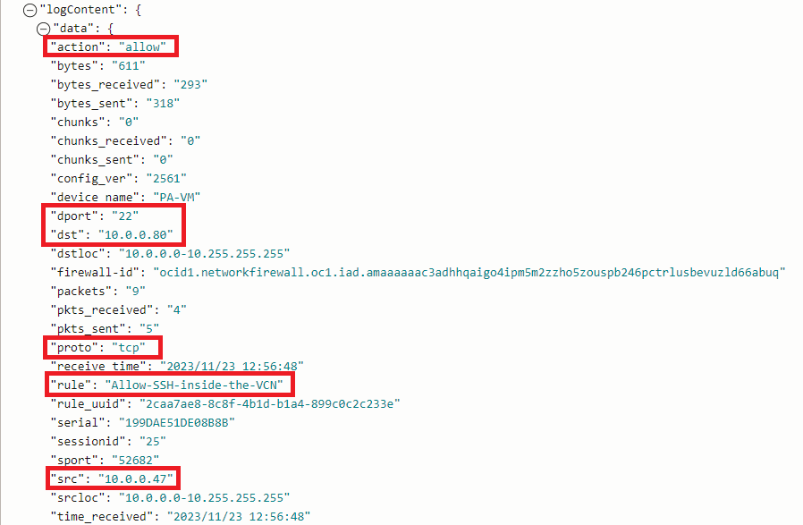
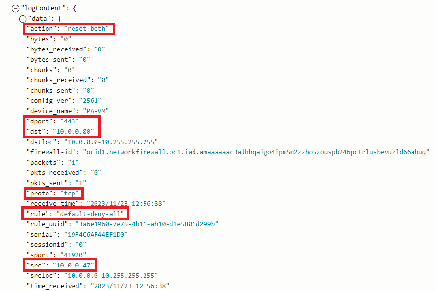

# East-West Traffic Inspection

### Introduction

Estimated Time: 30-45 minutes

### About East-West Traffic Inspection

East-West Traffic Inspection is done when two or more hosts from the same environment (in our case, OCI) communicate with each other and there is a Network Firewall on the path that is policing the traffic. 

### Objectives

In this lab, you will:

* Configure OCI Cloud Shell for management access to private Compute Instances.
* Deploy two application subnets in the same VCN as the OCI Network Firewall
* Deploy two private OCI Compute Instances, one in each application subnet.
* Adjust VCN routing so the traffic between the two Instances passes through the OCI Network Firewall.
* Modify the OCI Firewall policy to allow some connectivity between the two hosts.
* Test both allowed and denied traffic and observe the Firewall Traffic Log. 

## Task 1: Configure the OCI Cloud Shell

  In this lab and the next ones, we will need to connect to test Compute Instances to generate traffic and test connectivity. While this can be accomplished in any way, one of the easiest is to use the **Cloud Shell** embedded in the OCI Console. We will configure the service to run in a **private** mode so that we can use it to connect to private resources. In private mode we will have to give it a VCN and Subnet to be deployed in so we will use the Firewall Subnet created in the previous lab. This functionality is only available in the **HOME** region of your account.

1. Log into the Oracle Cloud console. Make sure you are in the **HOME** region of the tenancy. On the top right side, start **Cloud Shell**.
  

   If you have never used Cloud Shell before, Oracle will start the Instance with a **Public** network.
  

  **Note:**This tutorial works on the assumption that you don't have a custom setup for your Cloud Shell deployment. If you do, adjust the guide below to not interfere with your existing setup.

2. On the Cloud Shell deployment, click on the down arrow next to **Network:Public** and click **Private network definition list**.
  

3. In the menu that opens, click **Create private network definition** and, in the next menu, give it a name and select the existing Firewall VCN and subnet.
  

  Next, select it as the default network for Cloud Shell.
  . 

  Next, **close** the Cloud Shell and **open** it again. It should now show the Cloud Shell instance deployed in the private firewall subnet.
  . 

4. With the Cloud Shell instance deployed in the private subnet, we will now need to generate **SSH keys** that we will use to connect to private Instances. Just issue the **ssh-keygen** command and press **Enter** until the keys are generated. Next, view the public key that was generated. We will use that **Public Key** on each private Compute instance that we will deploy.
  

  **Note:** Even if you close Cloud Shell and log out of the OCI Console, the files on the Instance (like the SSH keys) are kept and will be available next time you start Cloud Shell.

## Task 2: Deploy two application subnets with Route Tables and Security Lists

  We are now ready to deploy two application subnets, in the Firewall VCN deployed in the previous lab. The procedure is identical to the one described in **Lab 1 - Tasks 1 and 2**. 

1. Application subnet1 will have the following configuration:

    * Name: App-Subnet1
    * CIDR: 10.0.0.32/27
    * Subnet Access: Private
    * Route table: new Route Table called "App-Subnet1-RT" with no entries
    * Security List: new Security List called "App-Subnet1-SL" with a single "Allow all-0.0.0.0/0" rule on both Ingress and Egress.

  

2. Application subnet2 will have the following configuration:

    * Name: App-Subnet2
    * CIDR: 10.0.0.64/27
    * Subnet Access: Private
    * Route table: new Route Table called "App-Subnet2-RT" with no entries
    * Security List: new Security List called "App-Subnet2-SL" with a single "Allow all-0.0.0.0/0" rule on both Ingress and Egress.

  

   In the end, on the VCN Details page, you should see three subnets.
  

## Task 3: Deploy two private OCI Compute Instances

  Now that we have the subnets, we can go ahead and deploy Compute Instances.

1. On the Oracle Cloud Infrastructure Console Home page, go to the Burger menu (on top left), select Compute and click on **Instances**. In the menu that opens, click **Create Instance**
  

2. In the menu that opens, we need to input data into multiple fields. Unless specified otherwise in this tutorial, leave the fields with the **Default** input.

    * Compute Name: APP-VM1
    * Everything else until **Primary VNIC information** remains on default
    * Network details: select the VCN and the APP-Subnet1 subnet

  

  In the **Add SSH keys** menu, select **Paste Public Keys** and paste the Public SSH Key created at **Task 1**, in the Cloud Shell instance.

  

  Leave everything else on **Default** and press **Create**.

  Wait for the Instance to go into the **Running** state and note the private IP it was assigned.

  

3. Repeat the procedure and deploy a second Compute Instance. Name it **APP-VM2** and make sure you select **APP-Subnet2** as the target.

  

4. Start the **Cloud Shell** instance and try to SSH to both Compute Instances. The user is **opc**.

  

## Task 4: Adjust VCN routing

  With VCN Default Routing, any Compute Instance in the VCN will be routed directly to any other Compute Instance from the same VCN. To change that and add the Network Firewall on the path, we will need to modify the subnet Route Tables.

1. On the Oracle Cloud Infrastructure Console Home page, go to the Burger menu (on top left), select **Identity and Security** and click on **Network firewalls**. In the menu that opens, click on the Network firewall deployed in the previous lab. In the details page that opens, note the Firewall's Private IP.
  

2. On the Oracle Cloud Infrastructure Console Home page, go to the Burger menu (on top left), select Networking and click on **Virtual cloud networks**. Next, click the VCN named **LiveLab-OCIFW-VCN**. On the VCN Details page, on the left menu, click **Route Tables**. We will modify the APP-Subnet Route tables.
  

3. Click on the Route table named **App-Subnet1-RT**. In the menu that opens, click **Add Route Rules**. We will add a route for APP-Subnet2 (10.0.0.64/27) with next hop the Firewall.
  

4. Go back to the Route Tables overview and click on the route table named **App-Subnet2-RT**. In the menu that opens, click **Add Route Rules**. We will add a route for APP-Subnet1 (10.0.0.32/27) with the next hop as the Firewall.
  

  And that's it! Communication between the two Application Subnets will now be forced through the OCI Network Firewall.   

## Task 5: Modify the OCI Firewall policy

  In a previous **Lab** we deployed a Network Firewall with an empty Firewall Policy. As we've create the new subnets and Compute Instances, we need to adjust the Firewall Policy to allow traffic between those subnets. 
Since we cannot modify a Firewall Policy that is **IN-USE** by a Firewall, the usual procedure follows this workstream: we clone the existing Policy that is in use -> we add or remove any configuration from the new, cloned Policy -> we modify the OCI Network Firewall to use the Cloned Policy. 

1. On the Oracle Cloud Infrastructure Console Home page, go to the Burger menu (on top left), select **Identity and Security** and click on **Network firewalls**. In the menu that opens, click on the Network firewall deployed in the previous lab. In the details page that opens, click the Policy that is in use.
  

2. In the menu that opens, click **Clone Policy** and give the new Policy a name. I will name it **network_firewall_policy_1**.
  

3. Go back to the **Network Firewall policies** and click on the newly cloned policy called **network_firewall_policy_1**.
  

  In the Network Firewall Policy we will create the following:

    * One Application that defines PING
    * One Application List that contains the Application above
    * One Service that defines SSH
    * One Service List that contains the SSH Service
    * One Address list that contains the two application subnets CIDRs
    * One Firewall Security Rule that allows SSH between the Application subnets.
    * One Firewall Security Rule that allows PING between the Application subnets.
 
  Note: Any Firewall Policy contains an implicit **deny-any** rule, not seen in the Console. Traffic not specifically allowed will be denied.

4. In the **Network firewall policy details** menu, click on **Applications** on the left menu and click **Create application**. Create an application that allows **Echo requests**.

  

5. In the **Network firewall policy details** menu, click on **Application lists** on the left menu and click **Create application list**. Create an application list that contains the Application created in the previous step.
  

6. In the **Network firewall policy details** menu, click on **Services** on the left menu and click **Create service**. Create a service that allows **SSH / TCP on port 22**.
  

7. In the **Network firewall policy details** menu, click on **Service lists** on the left menu and click **Create service list**. Create a service list that contains the SSH service created at the previous step.
  

8. In the **Network firewall policy details** menu, click on **Address lists** on the left menu and click **Create address list**. Create an address list that contains the CIDRs of the two application subnets.
  

  **NEXT**, let's create our first firewall rules.

9. In the **Network firewall policy details** menu, click on **Security rules** on the left menu and click **Create security rule**. 
  

10. In the menu that opens, give the rule a name -> **Allow-SSH-inside-the-VCN**. In the **Match condition**, under Source addresses, click **Select address lists** and add the previously created address list.
  

  For this rule we will use the same address list for both source and destination so **repeat** the procedure above to add the same address list as a destination. In the end, the source and destination fields should look like this:
  

  For applications we will click **Any application** and for service, we will add the service list created in step 7, named **Service-list1**. For URL, we will let **Any URL**.
  

  Last, for the **Rule action**, we will select **Allow traffic**. Press **Create Security Rule**.
  

11. Next, repeat the procedure above to create a second firewall rule, called **Allow-PING-inside-the-VCN**. The Source, Destination, and URLs will be the same as before but the Application will be the **Application list** created at step 5 while the **Services** will remain with **Any service**. 
  

  The reason we create two security rules is because it is not supported to have both Applications and Services inside the same rule. In the end, you should have two **Security Rules** in the Policy, one that allows **SSH** inside the VCN and the other one that allows **PING**.
  

12. Now that we have finished configuring the policy, it is time to modify the firewall to use this new policy. Go to **Identity and Security** and click on **Network firewalls**. Next, click on the Network Firewall we deployed. Click **Edit** and configure it to use the new policy, called **network_firewall_policy_1**.
    

  The firewall will change from the **ACTIVE** state to **UPDATING**. Wait for it to become **ACTIVE** again before moving to the next task.

## Task 6: Test traffic and observe logs

  With the configuration created within this *Lab**, in the previous tasks, between the two private Compute Instances deployed in the VCN we allowed **PING** and **SSH**. Let's test this and observe the firewall logs. We will connect to one of the Instances and:
  * **PING** the other Compute to test the Ping Rule.
  * Test TCP port 22 to see that it is allowed
  * Test TCP port 443 to see that it is **not** allowed.
  

1. Start the **Cloud Shell** Instance from the top-right menu. Make sure it starts with the **Private Network** configured under task 1 of this lab.
  

2. The two Compute Instances I deployed in the previous tasks have the following IP address:

    * APP-VM1 : 10.0.0.47, in subnet App-Subnet1 (10.0.0.32/27).
    * APP-VM2 : 10.0.0.80, in subnet App-Subnet2 (10.0.0.64/27).

  Note: When running your lab, you will probably get different IPs for your hosts. Adapt the commands below to reflect that. 

  From the Cloud Shell Instance, issue the following commands:

    * ssh opc@10.0.0.47  -> this will connect you to APP-VM1.
    * ping 10.0.0.80  -> this will test ping between APP-VM1 and APP-VM2 and it should work.
    * nc -zv 10.0.0.80 22  -> this will test connectivity to port 22 between APP-VM1 and APP-VM2 and it should work.
    * nc -zv 10.0.0.80 443  -> this will test connectivity to port 443 between APP-VM1 and APP-VM2 and it should **not** work.

  

3. Now let's check the firewall **Traffic** Log. Go to the Firewall Detail page and click on **Logs** on the left side menu. In the menu that opens, click on the Traffic Log.
  

  You will be directed to OCI's Logging service. Wait for ~5 minutes for the log to be updated and refresh the page. You should see the tests performed recently as 3 lines in the log. Click on the most right arrow to expand them.
  

  One of the log lines shows the Ping allowed by the dedicated rule.
  

  One of the log lines shows the SSH allowed by the dedicated rule.
  

  One of the log lines shows the HTTPS denied by the **default deny all** rule.

   

**Congratulations!** You have completed this lab. You may now **proceed to the next lab**.

## Acknowledgements

* **Author** - Radu Nistor, Principal Cloud Architect, OCI Networking
* **Last Updated By/Date** - Radu Nistor, November 2023
