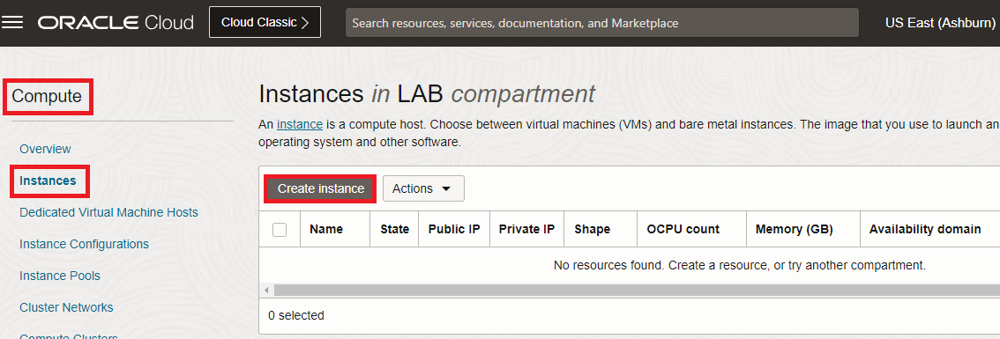

# East-West Traffic Inspection

## Introduction

Estimated Time: 30-45 minutes

### About East-West Traffic Inspection

East-West Traffic Inspection is done when two or more hosts from the same environment(in our case, OCI) communicate with each other and there is a Network Firewall on the path that is policing the traffic. 

### Objectives

In this lab, you will:

* Configure OCI Cloud Shell for management access to private Compute Instances.
* Deploy two application subnets in the same VCN as the OCI Network Firewall
* Deploy two private OCI Compute Instances, one in each application subnet.
* Adjust VCN routing so the traffic between the two Instances passes through the OCI Network Firewall.
* Modify the OCI Firewall policy to allow some connectivity between the two hosts.
* Test both allowed and denied traffic and observe the Firewall Traffic Log. 

## Task 1: Configure the OCI Cloud Shell

In this lab and the next ones, we will need to connect to test Compute Instances to generate traffic and test connectivity. While this can be acomplished in any ways, one of the easiest is to use the **Cloud Shell** embedded in the OCI Console. We will configure the service to run in a **private** mode so that we can use it to connect to private resources. In private mode we will have to give it a VCN and Subnet to be deployed in so we will use the Firewall Subnet created in the previous lab. This functionality is only available in the **HOME** region of your account.

1. Log into the Oracle Cloud console. Make sure you are in the **HOME** region of the tenancy. On the top right side, start **Cloud Shell**.
  

   If you have never used Cloud Shell before, Oracle will start the Instance with a **Public** network.
  

  **Note:**This tutorial works on the asumption you don't have a custom setup for your Cloud Shell deployment. If you do, adjust the guide below to not interfere with your existing setup.

2. On the Cloud Shell deployment, click on the down arrow next to **Network:Public** and click **Private network definition list**.
  

3. In the menu that opens, click **Create private network definition** and, in the next menu, give it a name and select the existing Firewall VCN and subnet.
  

  Next, select it as the default network for Cloud Shell.
  . 

  Next, **close** the Cloud Shell and **open** it again. It should now show the Cloud Shell instance deployed in the private firewall subnet.
  . 

4. With the Cloud Shell instance deployed in the private subnet, we will now need to generate **SSH keys** that we will use to connect to private Instances. Just issue the **ssh-keygen** command and press **Enter** until the keys are generated. Next, view the public key that was generated. We will use that **Public Key** on each private Compute instance that we will deploy.
  

**Note:** Even if you close Cloud Shell and log out of the OCI Console, the files on the Instance (like the SSH keys) are kept and will be available next time you start Cloud Shell.

## Task 2: Deploy two application subnets with Route Tables and Security Lists

We are now ready to deploy two application subnets, in the Firewall VCN deployed in the previous lab. The procedure is identical to the one described in **LAB 1 - Tasks 1 and 2**. 

1. Application subnet1 will have the following configuration:

* Name: App-Subnet1
* CIDR: 10.0.0.32/27
* Subnet Access: Private
* Route table: new Route Table called "App-Subnet1-RT" with no entries
* Security List: new Security List called "App-Subnet1-SL" with a single "Allow all-0.0.0.0/0" rule on both Ingress and Egress.

  

1. Application subnet2 will have the following configuration:

* Name: App-Subnet2
* CIDR: 10.0.0.64/27
* Subnet Access: Private
* Route table: new Route Table called "App-Subnet2-RT" with no entries
* Security List: new Security List called "App-Subnet2-SL" with a single "Allow all-0.0.0.0/0" rule on both Ingress and Egress.

  

   In the end, in the VCN Details page, you should see three subnets.
  

## Task 3: Deploy two private OCI Compute Instances

Now that we have the subnets, we can go ahead and deploy Compute Instances.

1. On the Oracle Cloud Infrastructure Console Home page, go to the Burger menu (on top left), select Compute and click on **Instances**. In the menu that opens, click **Create Instance**
  

2. In the menu that opens, we need to input data into multiple fields. Unless specified otherwise in this tutorial, leave the fields with the **Default** input.

* Compute Name: APP-VM1
* Everything else until **Primary VNIC information** remains on default
* Network details: select the VCN and the APP-Subnet1 subnet

  

* In the **Add SSH keys** menu, select **Paste Public Keys** and paste the paste the Public SSH Key created at **Task 1**, in the Cloud Shell instance.
  

* Leave everything else on **Default** and press **Create**.

* Wait for the Instance to go into the **Running** state and note the private IP it was assigned.
  

3. **Repeat** the procedure and deploy a second Compute Instance. Name it **APP-VM2** and make sure you select **APP-Subnet2** as the target.
  

4. Start the **Cloud Shell** instance and try to SSH to both Compute Instances. The user is **opc**.
  

## Task 4: Adjust VCN routing

## Task 5: Modify the OCI Firewall policy

## Task 6: Test traffic and observe logs

## Acknowledgements

* **Author** - Radu Nistor, Principal Cloud Architect, OCI Networking
* **Last Updated By/Date** - Radu Nistor, November 2023
