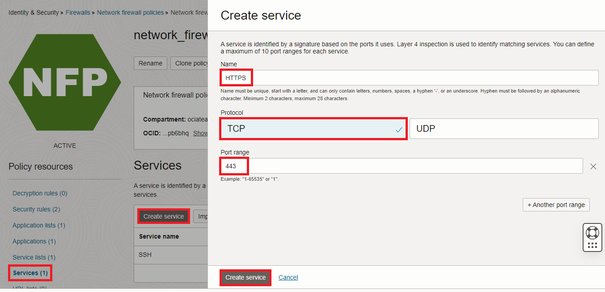
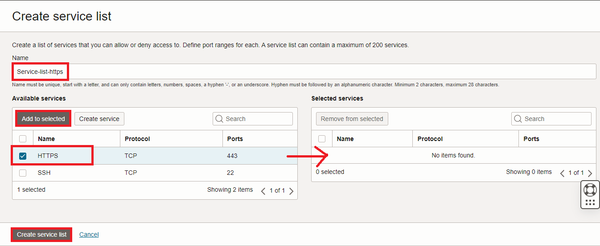

# Inspect outbound Internet traffic

### Introduction

Estimated Time: 30-45 minutes

### About Outbound Internet Traffic Inspection

The OCI Network firewall can be used to filter traffic initiated inside OCI with target the Internet. With the native URL filtering capabilities, the Network Firewall will look into the Server Name Identifier part of the HTTPS header and decide if the traffic can pass.

### Objectives

In this lab, you will:

* Deploy a VCN NAT Gateway for outbound Internet connectivity
* Adjust VCN routing so the traffic to the Internet goes through the OCI Network Firewall and the NAT Gateway.
* Modify the OCI Firewall policy to allow outbound Internet traffic and filter URLs.
* Test both allowed and denied traffic and observe the Firewall Traffic Log. 

## Task 1: Deploy a VCN NAT Gateway with a dedicated Route Table

  In OCI, private Compute Instances need a NAT Gateway to exit to the Public Internet. Since we will add the Network Firewall on the path, we need to add a Route Table to the NAT Gateway so we can reroute the traffic. 

1. On the Oracle Cloud Infrastructure Console Home page, go to the Burger menu (on top left), select Networking and click on **Virtual cloud networks**. Next, click the VCN named **LiveLab-OCIFW-VCN**. On the VCN Details page, on the left menu, click **Route Tables**. Press **Create Route Table**. In the menu that opens, give it a name - **NAT-GW-RT**. No entries for the moment, we will do that at a later step.
  
 
2. In the VCN Details page, click **NAT Gateways** on the left menu then click **Create NAT Gateway**. In the menu that opens, give it a name and attach the Route table previously created.
  

## Task 2: Adjust VCN routing

  Now that we have a **NAT Gateway**, we need to adjust VCN routing to use it. 
  

  We will modify all **Route Tables** in the VCN, that we deployed in the previous labs, with the following rules:

* The Application Subnets route tables, called **App-Subnet1-RT** and **App-Subnet2-RT**, will each get the default route (0.0.0.0/0) next-hop the firewall's IP (10.0.0.12).
* The Network Firewall route table, called **Firewall-Subnet-Private-RT**, will get the default 0.0.0.0/0 route next-hop the NAT Gateway.
* Finally, the NAT Gateway Route table will need return routes for 10.0.0.32/27 (App-Subnet1) and 10.0.0.64/27 (App-Subnet2) next-hop the firewall's IP (10.0.0.12).

1. On the VCN Details page, on the left menu, click **Route Tables** and then click on **App-Subnet1-RT**. In the menu that opens, click on **Add Route Rules** and add 0.0.0.0/0 with next-hop the firewall's IP.
  

2. **Repeat** the procedure and add the same route rule to **App-Subnet2-RT**
  
3. Next, click on **Firewall-Subnet-Private-RT** and add the default route with next-hop the NAT Gateway.
  

4. Next, click on **NAT-GW-RT** and add routes for 10.0.0.32/27 (App-Subnet1) and 10.0.0.64/27 (App-Subnet2) next-hop the firewall's IP (10.0.0.12)
  

  Note: the image shows the route for 10.0.0.32/27. Repeat the procedure and add 10.0.0.64/27 too.

## Task 3: Modify the OCI Firewall policy

  In a previous **lab** we created a Firewall Policy that inspects traffic between subnets inside the VCN. Now we want to add a **Security Rule** that inspects traffic destined for the World Wide Web. 
Since we cannot modify a Firewall Policy that is **IN-USE** by a Firewall, the usual procedure follows this workstream: we clone the existing Policy that is in use -> we add or remove any configuration from the new, cloned Policy -> we modify the OCI Network Firewall to use the Cloned Policy. 

1. On the Oracle Cloud Infrastructure Console Home page, go to the Burger menu (on top left), select **Identity and Security** and click on **Network firewalls**. In the menu that opens, click on the Network firewall deployed in the previous lab. In the details page that opens, click the Policy that is in use.
  

2. In the menu that opens, click **Clone Policy** and give the new Policy a name. I will name it **network_firewall_policy_2**.
  

3. Go back to the **Network Firewall policies** and click on the newly cloned policy called **network_firewall_policy_2**.
  

  In the new Network Firewall Policy we will use the existing configuration but we will also add the following:

    * One Service that defines HTTPS
    * One Service List that contains the HTTPS Service
    * One URL list that contains allowed destinations. We will only allow traffic to **www.oracle.com** and **www.ateam-oracle.com**.
    * One Firewall Security Rule that allows HTTPS traffic to any target with the URL filter **ON**.

  Note: Any Firewall Policy contains an implicit **deny-any** rule, not seen in the Console. Traffic not specifically allowed will be denied.

4. In the **Network firewall policy details** menu, click on **Services** on the left menu and click **Create service**. Create a service that allows **HTTPS / TCP on port 443**.
  

5. In the **Network firewall policy details** menu, click on **Service lists** on the left menu and click **Create service list**. Create a service list named **Service-list-https** that contains the HTTPS service created in the previous step.
  

  

6. In the **Network firewall policy details** menu, click on **URL Lists** on the left menu and click **Create URL List**. In the menu that opens, name it **Allowed-FQDNs** and add **www.oracle.com** and **www.ateam-oracle.com**.
  

  **NEXT,** let's create the firewall rule.

7. In the **Network firewall policy details** menu, click on **Security rules** on the left menu and click **Create security rule**. 
  

8. In the menu that opens, give the rule a name -> **Allow-Internet-OUT**. In the **Match condition**, under Source addresses, click **Select address lists** and add the previously created address list.
  

  For destination, we will allow **Any**.
  

  For applications we will allow **Any applications** and for service, we will add the service list created in step 5, named **Service-list-https**. For URL, we will add the URL List created at step 6 **Allowed-FQDNs**.
  

  Last, for the **Rule action**, we will select **Allow traffic**. Press **Create Security Rule**.
  

11. Now that we have finished configuring the policy, it is time to modify the firewall to use this new policy. Go to **Identity and Security** and click on **Network firewalls**. Next, click on the Network Firewall we deployed. Click **Edit** and configure it to use the new policy, called **network_firewall_policy_2**.
    

  The firewall will change from the **ACTIVE** state to **UPDATING**. Wait for it to become **ACTIVE** again before moving to the next task.

## Task 4: Test traffic and observe logs

  With the configuration created within this **lab**, in the previous tasks, we are providing Internet access to the hosts inside the VCN, only for certain domains. Let's test this and observe the firewall logs. We will connect to one of the Instances and:
  
  * Connect with HTTPS to **www.oracle.com** and **www.ateam-oracle.com** and observe that is allowed.
  * Connect with HTTPS to **www.wikipedia.org** and observe that it is **not** allowed.
  
  

1. Start the **Cloud Shell** Instance from the top-right menu. Make sure it starts with the **Private Network** configured under task 1 of lab 2.
  

2. The two Compute Instances I deployed in the previous lab have the following IP address:

    * APP-VM1 : 10.0.0.47, in subnet App-Subnet1 (10.0.0.32/27).
    * APP-VM2 : 10.0.0.80, in subnet App-Subnet2 (10.0.0.64/27).

  Note: When running your lab, you will probably get different IPs for your hosts. Adapt the commands below to reflect that. 

  From the Cloud Shell Instance, issue the following commands:

    * ssh opc@10.0.0.47  -> this will connect you to APP-VM1.
    * host www.oracle.com  -> this shows us the IP of the website.
    * curl -kI https://www.oracle.com/  -> we will attempt to get the headers of www.oracle.com.
    
  

    * host www.ateam-oracle.com  -> this shows us the IP of the website.
    * curl -kI https://www.ateam-oracle.com/  -> we will attempt to get the headers of www.ateam-oracle.com.

  

    * host www.wikipedia.org  -> this shows us the IP of the website.
    * curl -kI https://www.wikipedia.org/  -> we will attempt to get the headers of www.wikipedia.org.
    
  

3. Now let's check the firewall **Traffic** Log. Go to the Firewall Detail page and click on **Logs** on the left side menu. In the menu that opens, click on the Traffic Log.
  

  You will be directed to OCI's Logging service. Wait for ~5 minutes for the log to be updated and refresh the page. You should see the tests performed recently as lines in the log. Click on the most right arrow to expand them.
  

  We should be seeing traffic **Allowed** to **23.46.235.95** for **www.oracle.com** and **www.ateam-oracle.com** by the new firewall rule we created and traffic denied to **208.80.154.224** for **www.wikipedia.org** by the default deny rule.
  
  

  

**Congratulations!** You have successfully completed this lab. You may now **proceed to the next lab**.

## Acknowledgements

* **Author** - Radu Nistor, Principal Cloud Architect, OCI Networking
* **Last Updated By/Date** - Radu Nistor, November 2023
