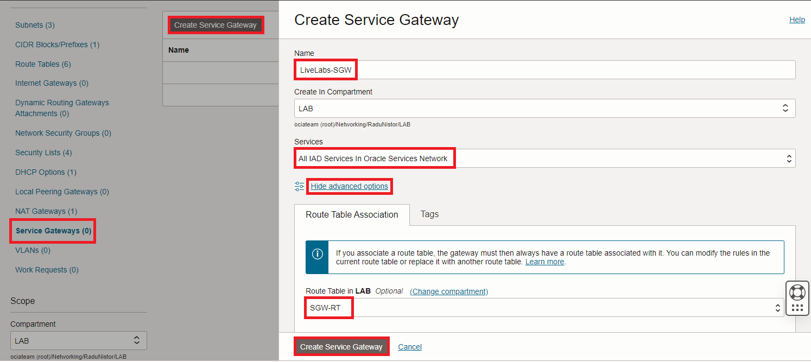

# Inspect outbound traffic to OCI Services

### Introduction

Estimated Time: 30-45 minutes

### About inspecting traffic to Oracle Cloud Services

This lab is very similar to the previous one. Instead of the NAT Gateway we used in lab 3, we will now focus on the **Service Gateway** which allows private access to OCI Public Services. 

Note: In general, it is not necessary to put a firewall between OCI resources inside a VCN and OCI Services as the Services Network can be considered a trusted one. Also, traffic to the Object Storage can be quite large so a firewall might have impact on throughput. Nevertheless, there are security compliance reason that might force you to do so. If that is the case, this lab shows how to do it.

### Objectives

In this lab, you will:

* Deploy a VCN Service Gateway for outbound connectivity to Oracle Services.
* Adjust VCN routing so the traffic to Services goes through the Service Gateway.
* Deploy a Public Object Storage Bucket with a simple test file inside.
* Modify the OCI Firewall policy to allow outbound traffic to Oracle Cloud Object Storage.
* Test the new Firewall Rule and observe the Firewall Traffic Log. 

## Task 1: Deploy a Service Gateway with a dedicated Route Table

  In OCI, private Compute Instances can use a Service Gateway to connect to Oracle Services such as Object Storage. Since we will add the Network Firewall on the path, we need to add a Route Table to the Service Gateway so we can reroute the traffic. 

1. On the Oracle Cloud Infrastructure Console Home page, go to the Burger menu (on top left), select Networking and click on **Virtual cloud networks**. Next, click the VCN named **LiveLab-OCIFW-VCN**. On the VCN Details page, on the left menu, click **Route Tables**. Press **Create Route Table**. In the menu that opens, give it a name - **SGW-RT**. No entries for the moment, we will do that at a later step.
  
 
2. In the VCN Details page, click **Service Gateways** on the left menu then click **Create Service Gateway**. In the menu that opens, give it a name and attach the Route table previously created. 
  

## Task 2: Adjust VCN routing

  Now that we have a **Service Gateway**, we need to adjust VCN routing to use it. 
  

  We will modify only two of the **Route Tables** in the VCN, that we deployed in the previous labs.

  * The Application Subnets route tables, called **App-Subnet1-RT** and **App-Subnet2-RT**, **remain unchanged** because they already have the default route (0.0.0.0/0) to the next-hop the firewall's IP (10.0.0.12). The default route will also cover Oracle Services.
  * The Network Firewall route table, called **Firewall-Subnet-Private-RT**, will get **ALL Services** route next-hop the Service Gateway.
  * Finally, the Service Gateway Route table will need return routes for 10.0.0.32/27 (App-Subnet1) and 10.0.0.64/27 (App-Subnet2) next-hop the firewall's IP (10.0.0.12).

1. On the VCN Details page, on the left menu, click **Route Tables** and then click on **Firewall-Subnet-Private-RT** and add the **All Services** route with next-hop the Service Gateway.
  

2. Next, click on **SGW-RT** and add routes for 10.0.0.32/27 (App-Subnet1) and 10.0.0.64/27 (App-Subnet2) next-hop the firewall's IP (10.0.0.12)

  

  Note: the image shows the route for 10.0.0.32/27. Repeat the procedure and add 10.0.0.64/27 too.

## Task 3: Deploy a Public Object Storage Bucket
  In order to test reachability to an OCI Service we will deploy a Public Bucket in the Object Storage Service. Then we will add an empty test file and try to retrieve it from an OCI private Compute Instance.

1. On the Oracle Cloud Infrastructure Console Home page, go to the Burger menu (on top left), select Storage and click on **Buckets** under **Object Storage & Archive Storage**.
  

2. In the menu that opens, click **Create Bucket** and, in the next menu, give it a name - **lab** - and press Create. Leave everything else on default.
  

3. Next, click the 3 dots at the end of the row and change the visibility of the bucket.
  .

  

4. Next, click on the Bucket. On the Bucket Details Page, click Upload. In the menu that opens, drag a test file. I created an empty file called **lab.txt** which I will use.
  

5. Once you have a file there, click on the 3 dots at the end of the row and click **View Object Details**.
  

  

  Take note of the Object's URL, that is what we will use in our test, later in this lab. For this file, the URL is **https://objectstorage.us-ashburn-1.oraclecloud.com/n/ociateam/b/lab/o/lab.txt**.

## Task 4: Modify the OCI Firewall policy

  In a previous **lab** we created a Firewall Policy that inspects traffic destined for the World Wide Web. We also enabled **URL Filtering** and are allowing only certain domains to be reached. Since this new traffic to Oracle Services will match the same Rule (Source: VCN Subnets, Destination: Any, HTTPS), we will simply modify the URL Lists to allow an Oracle Services FQDN. Most Oracle Services are deployed under the **oraclecloud.com** domain, including Object Storage so we will add an entry in the existing URL List for **objectstorage.us-ashburn-1.oraclecloud.com**.

  Since we cannot modify a Firewall Policy that is **IN-USE** by a Firewall, the usual procedure follows this workstream: we clone the existing Policy that is in use -> we add or remove any configuration from the new, cloned Policy -> we modify the OCI Network Firewall to use the Cloned Policy. 

1. On the Oracle Cloud Infrastructure Console Home page, go to the Burger menu (on top left), select **Identity and Security** and click on **Network firewalls**. In the menu that opens, click on the Network firewall deployed in the previous lab. In the details page that opens, click the Policy that is in use.
  

2. In the menu that opens, click **Clone Policy** and give the new Policy a name. I will name it **network_firewall_policy_3**.
  

3. Go back to the **Network Firewall policies** and click on the newly cloned policy called **network_firewall_policy_3**.
  

  In the new Network Firewall Policy we will simply modify the URL list to allow Oracle Services.

4. In the **Network firewall policy details** menu, click on **URL Lists** on the left menu and edit the list **Allowed-FQDNs** by adding **objectstorage.us-ashburn-1.oraclecloud.com**.
  

  

  No other change is needed to the policy. VCN routing will make sure Services flows are being sent to the Service Gateway.

5. Now that we have finished configuring the policy, it is time to modify the firewall to use this new policy. Go to **Identity and Security** and click on **Network firewalls**. Next, click on the Network Firewall we deployed. Click **Edit** and configure it to use the new policy, called **network_firewall_policy_3**.
    

  The firewall will change from the **ACTIVE** state to **UPDATING**. Wait for it to become **ACTIVE** again before moving to the next task.

## Task 5: Test traffic and observe logs

  To test the new policy I will try to download the **lab.txt** file I uploaded to the Public Object Storage Bucket. The URL for the item is https://objectstorage.us-ashburn-1.oraclecloud.com/n/ociateam/b/lab/o/lab.txt. The firewall should allow the traffic, which will take the Service Gateway path. 
  

1. Start the **Cloud Shell** Instance from the top-right menu. Make sure it starts with the **Private Network** configured under task 1 of lab2.
  

2. The two Compute Instances I deployed in the previous lab have the following IP address:

    * APP-VM1 : 10.0.0.47, in subnet App-Subnet1 (10.0.0.32/27).
    * APP-VM2 : 10.0.0.80, in subnet App-Subnet2 (10.0.0.64/27).

  Note: When running your lab, you will probably get different IPs for your hosts. Adapt the commands below to reflect that. 

  From the Cloud Shell Instance, issue the following commands:

    * ssh opc@10.0.0.47  -> this will connect you to APP-VM1.
    * wget https://objectstorage.us-ashburn-1.oraclecloud.com/n/ociateam/b/lab/o/lab.txt --> this will attempt to download the file.

  

3. Now let's check the firewall **Traffic** Log. Go to the Firewall Detail page and click on **Logs** on the left side menu. In the menu that opens, click on the Traffic Log.
  

  You will be directed to OCI's Logging service. Wait for ~5 minutes for the log to be updated and refresh the page. You should see the tests performed recently as lines in the log. Click on the most right arrow to expand them.
  We should be seeing traffic **Allowed** to one of the IPs of the Object Storage Service.
  
  

 
**Congratulations!** You have successfully completed this lab. You may now **proceed to the next lab**.

## Acknowledgements

* **Author** - Radu Nistor, Principal Cloud Architect, OCI Networking
* **Last Updated By/Date** - Radu Nistor, November 2023
