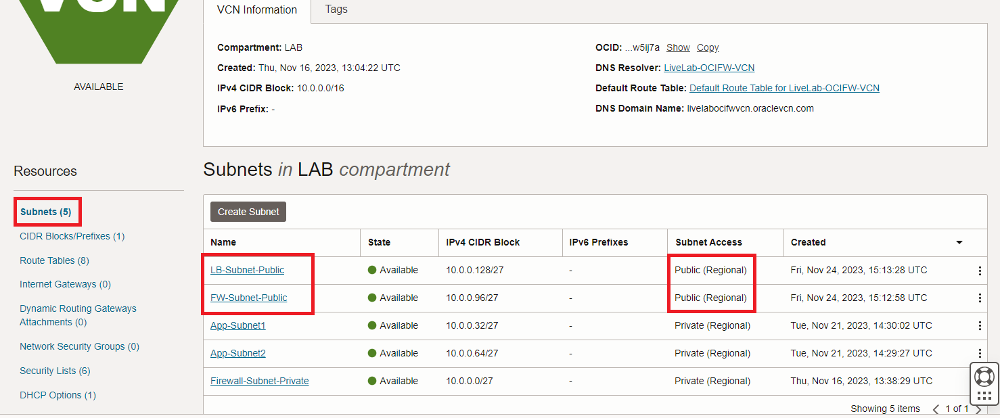
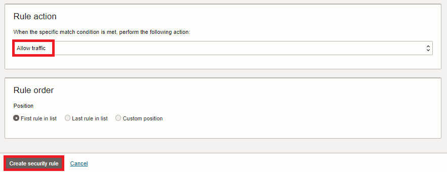
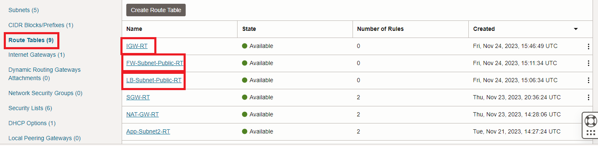
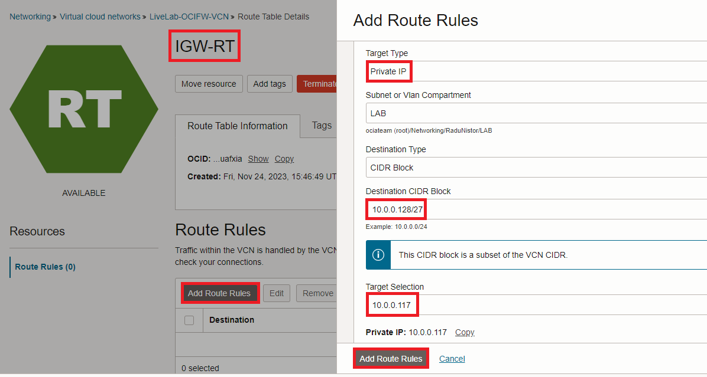

# Inspect inbound Internet traffic

### Introduction

Estimated Time: 60-90 minutes

### About this lab

In the previous labs, we looked into how we can inspect east-west (subnet to subnet) traffic inside an OCI VCN and how we can inspect **oubound** traffic to either the Internet or Oracle Services with various VCN Gateways. In this lab, we will focus on **Inbound** traffic from the Internet. As the most common Internet service is **web** we will deploy a Public Web Load Balancer which will use one of the previously deployed Compute Instances as the backend. To inspect this traffic we need a new OCI Network Firewall, deployed in a Public Subnet. 

### Objectives

In this lab, you will:

* Deploy new subnets inside the existing VCN, for a new Network Firewall and a Load Balancer.
* Deploy a new Network Firewall, dedicated to inspecting inbound Internet traffic
* Deploy an Application Load balancer. 
* Configure and start a webserver on one of the private Compute Instances. 
* Deploy a VCN Internet Gateway with a dedicated route table.
* Adjust VCN routing to enable the new flows.
* Configure the new OCI Network Firewall to inspect inbound traffic.
* Test the new Firewall and observe the Firewall Traffic Log

## Task 1: Deploy new VCN subnets

  We will start by preparing the VCN for the new deployments. We need to:
* deploy a new firewall subnet with a dedicated route table and security list
* deploy a new load balancer subnet with a dedicated route table and security list

  The exact procedure to do this is detailed under **lab 1** so I will not repeat it here. In the end, you should have:
* Firewall Subnet:
    - name: FW-Subnet-Public
    - Subnet Access: Public
    - CIDR: 10.0.0.96/27
    - Route table: FW-Subnet-Public-RT with no entries
    - Security List: FW-Subnet-Public-SL with allow 0.0.0.0/0 on both ingress and egress
* Load balancer Subnet:
    - name: LB-Subnet-Public
    - Subnet Access: Public
    - CIDR: 10.0.0.128/27
    - Route table: LB-Subnet-Public-RT with no entries
    - Security List: LB-Subnet-Public-SL with allow 0.0.0.0/0 on both ingress and egress

  

  
 
  

## Task 2: Deploy a new Network Firewall for Inbound Internet traffic

  The existing Network Firewall (used in the previous labs) can only be used for Egress traffic to Internet via the NAT Gateway. For **Inbound** traffic we need a new Firewall, deployed in the Public Subnet we created in the previous task. We will also need a new Firewall Policy.

1. On the Oracle Cloud Infrastructure Console Home page, go to the Burger menu (on top left), select **Identity and Security** and click on **Network firewall policies**. You should see the list of the Policies we used in the previous labs. Let's create a new policy, dedicated to Ingress traffic. Name it *network_firewall_policy_ingress*.
  

2. After you press create, you will be directed to the policy configuration menu. Let's start by creating two services, one for HTTP and one for HTTPS. Click on **Services** and click on **Create service**. Add a **TCP 80** service for HTTP. 
  

  Repeat the procedure to create the HTTPS service (TCP 443).
  

3. Next, go to **Service lists** and press **Create Service List**.
  

  In the menu that opens, add both HTTP and HTTPS to the **Selected** Services.
  

4. Next, go to **Address lists** and press **Create Address List**. Add the Public Load Balancer subnet created at task 1.
  

5. Now we are ready for the **Security Rule**. Go to **Security rules** and press **Create security rule**.
  

6. The menu for Security Rule creation opens. Give it a name - **Inbound-Web-Services**. Source will be **ANY**, destination will be the Load Balancer subnet.
  

  Further down, select the Service list we created earlier but leave **Applications** and **URLs** with **ANY**. 
  

  Finally, **Allow** the traffic and press Create.
  

7. On the Oracle Cloud Infrastructure Console Home page, go to the Burger menu (on top left), select **Identity and Security** and click on **Network firewalls**. In the menu that opens, click **Create Network firewall**. Select the Policy we created in the previous task.
  

  Under **Enforcement point**, make sure you select the new **public** subnet.
  

  It might take up to 30 minutes for the Firewall to get created. Make sure you note down the Firewall's Private IP, we will need it for routing adjustments in the VCN.
  

  After the firewall is **ACTIVE**, enable LOGS.
  

## Task 3: Deploy an Application Load balancer.

  We will deploy an Application Load Balancer with a basic HTTP listener and with APP-VM2 as a backend.

1. On the Oracle Cloud Infrastructure Console Home page, go to the Burger menu (on top left), select **Networking** and click on **Load balancer**.
  

   In the menu that opens, click **Create load balancer**. 
  

2. The Load Balancer creation wizard starts. Give it a name - **lab-Public-LB** and make it Public. 
  

   Leave everything else on defaults and scroll down until the networking details menu. There, input the correct VCN and Subnet and press Next.
  

3. In the next menu, press **Add backends** and add one of the existing Compute Instances.
  

  In the same tab, configure the health checks to use TCP and press Next.
  

4. In the next menu, select an HTTP listener and press Next.
  

5. In the next menu, select **Default Group** for the logs and press Submit.
  

  After the LB finishes the deployment, you will see the Public IP assigned to it. Take a note of it as we will use it for tests in the upcoming tasks and labs.
  

  For the moment, the LB will remain in an **unhealthy** state as the backend does not have the web service enabled. We will fix that in the next task.

## Task 4: Configure and start a webserver on one of the private Compute Instances. 

  In the previous labs we deployed two private Compute Instances to generate various traffic and observe firewall logs. Now we will use one of them (I chose APP-VM2) as a backend for the Load Balancer. In order to install a Web server on the compute we will first need to modify the Firewall Policy that inspects its outbound connectivity to the Internet. We will allow unrestricted URL access so we can connect to the Yum Repositories and install Apache.

1. On the Oracle Cloud Infrastructure Console Home page, go to the Burger menu (on top left), select **Identity and Security** and click on **Network firewalls**. Select **OCI Firewall1** which is the firewall inspecting outbound traffic for the private instances. There, click on its running Policy - **network_firewall_policy_3**.
  

2. In the Policy details page, click **Clone** and give the clone a new name - **network_firewall_policy_4**.
  

3. Now go to the Burger menu (on top left), select **Identity and Security** and click on **Network firewall policies**. Click on **network_firewall_policy_4**. Make sure it is in **ACTIVE** state. 
  

4. In the Policy details menu, click on **Security Rules**. You should have three security rules. Edit the one called **Allow-Internet-OUT**.
  

  Under **URLs**, switch to **Any URL**. No other change is needed so click **Save changes**.
  

5. On the Oracle Cloud Infrastructure Console Home page, go to the Burger menu (on top left), select **Identity and Security** and click on **Network firewalls**. Click **OCI Firewall1** which controls outbound Internet and click **Edit**. Make it use the new policy called **network_firewall_policy_4**.
  

  The firewall will go into the **Updating** state. Wait for it to become **ACTIVE** before moving on.

6. Now that we have unrestricted Internet outbound access, let's install Apache. Open **Cloud shell** and connect to the VM that is used as a Load Balancer backend. In my case, that is APP-VM2 with the IP 10.0.0.80.
  

7. We will do a series of commands to install and start a basic Apache Web Server.

    * sudo yum install -y httpd
    * sudo systemctl enable --now httpd.service
    * sudo firewall-cmd --add-service=http --permanent
    * sudo firewall-cmd --reload
    * sudo systemctl status httpd

  

  Note: All subsequent tasks on this lab rely on Apache running on the Compute. Do not move further if you encounter any issues.

8. Now go to **Networking** -> **Load balancers** and make sure the Load Balancer deployed under task 3 is in a **good** state.
   

## Task 5: Deploy a VCN Internet Gateway with a dedicated route table.

  In OCI, Public resources (such as Load Balancers or Compute Instances) need an **Internet Gateway** to exchange packets with the Internet. Since we will add the Network Firewall on the path, we need to add a Route Table to the Internet Gateway so we can reroute the traffic. 

1. On the Oracle Cloud Infrastructure Console Home page, go to the Burger menu (on top left), select Networking and click on **Virtual cloud networks**. Next, click the VCN named **LiveLab-OCIFW-VCN**. On the VCN Details page, on the left menu, click **Route Tables**. Press **Create Route Table**. In the menu that opens, give it a name - **IGW-RT**. No entries for the moment, we will do that at a later step.
  
 
2. In the VCN Details page, click **Internet Gateways** on the left menu then click **Create Internet Gateway**. In the menu that opens, give it a name and attach the Route table previously created.
  

## Task 6: Adjust VCN routing to enable the new flows.

  We are almost ready with testing. The last piece is to modify some routing tables, for Internet traffic.

1. On the VCN Details page, on the left menu, click **Route Tables**. We will modify:

    * LB-Subnet-Public-RT
    * FW-Subnet-Public-RT
    * IGW-RT

  

2. Click on **LB-Subnet-Public-RT**. In the menu that opens, click **Add Route Rules**. Add the Default (0.0.0.0/0) route with next-hop the Internet Firewall IP, deployed at task 2. In my case, the IP is 10.0.0.117.
  

3. Back at the Route tables list, click on **FW-Subnet-Public-RT**. Add the 0.0.0.0/0 route with next-hop the Internet Gateway.
  

4. Back at the Route tables list, click on **IGW-RT**. Add a route for the Public Load Balancer subnet (10.0.0.128/27) with next-hop the Firewall's IP 10.0.0.117.
  

  And that's it, we can now move to testing.

## Task 7: Test the new Firewall and observe the Firewall Traffic Log

1. The test is very simple. From any browser on your computer just try an HTTP request to the Load Balancer's Public IP. For the LB I deployed, the public IP is 129.80.19.55. (http://129.80.19.55/)
  

  **SUCCESS**, the traffic is working. Let's observe the Firewall Log.

2. Go to the Firewall Detail page and click on **Logs** on the left side menu. In the menu that opens, click on the Traffic Log. Because the Public IP of the Load balancer is exposed to the Internet you should see a lot of traffic in the Log, mostly denied. Look for a log entry that contains your source IP. 

  

**Congratulations!** You have successfully completed this lab. You may now **proceed to the next lab**. The next lab will deal with HTTPS, decrypting and Intrusion Detection.

## Acknowledgements

* **Author** - Radu Nistor, Principal Cloud Architect, OCI Networking
* **Last Updated By/Date** - Radu Nistor, November 2023
