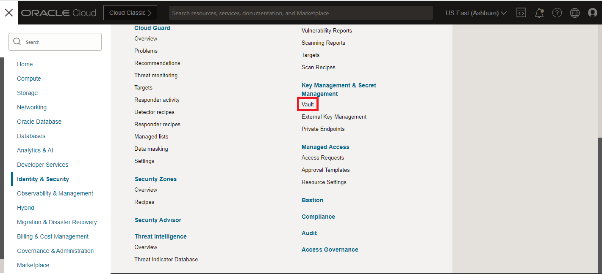

# SSL Decryption and Intrusion Detection

## Introduction

Estimated Time: 60 minutes

### About this lab

  In this LAB we will focus on HTTPS, as this is the most common way to expose **web** services. To be able to complete this lab you will need the following:
  * SSL Certificate
  * SSL Certificate Chain
  * SSL Private Key for the certificate

  This lab will not cover the procedure to obtain these items. If you own a DNS Domain, you may be able to get them from the Registrar or you can use **openssl** on any Linux system and create a self-signed certificate. Regardless of the method, proceed with this LAB only after you have the three components.

### Objectives

In this lab, you will:

* Deploy an OCI Vault Service to store the SSL Certificate.
* Enable an Inbound SSL Decryption policy on the OCI Network Firewall.
* Enable Intrusion Detection in the OCI Network Firewall.
* Enable SSL Offloading in the OCI Load Balancer.
* Test and observe Firewall Logs.

## Task 1: Deploy and configure the OCI Vault

  The OCI Network Firewall can decrypt incoming SSL traffic. For that, it needs a copy of the SSL certificates and the only place it can store them is the OCI Vault.

1. Log into the Oracle Cloud console and go to the Burger menu (on top left), select **Identity and Security** and click on **Vault**
  
  
2. In the menu that opens, click **Create Vault** and, in the next menu, give it a name and press Create.
  

3. You will be redirected to the Vault Details Page. Select **Master Encryption Keys** on the left and click **Create Key**. In the new menu, give it a name (LAB-Master-Key) and make sure you select the **symmetric**  algorithm. Any protection mode is fine.
  

4. The next step is to create a Vault **Secret** using the Certificate, Certificate Chain and Certificate Private Key. The Vault Secret has a very specific format that you need to follow in order for the firewall to be able to read it.
  

  Open any text editor, such as Notepad, and create the Secret in the specified format. Use the following links for reference:

  [Official documentation](https://docs.public.oneportal.content.oci.oraclecloud.com/en-us/iaas/Content/network-firewall/setting-up-certificate-authentication.htm#network-firewall-setting-up-certificate-authentication) 

  [Example Secret](images/vault_secret_example.txt)

  After you prepared the **text** file with the proper format, go to the OCI Vault, click **Secrets** and click **Create Secret**. In the new menu, add the contents of the text file. 
  

5. As a final step, we need an **IAM Policy** to allow the OCI Network Firewall access to the OCI Vault. On the Oracle Cloud console, go to the Burger menu (on top left), select **Identity and Security** and click on **Policies** under the **Indentity** service.
  

  In the menu that opens, click **Create Policy**. In the new menu, select "**Show manual editor** and input the following IAM rule: 

  *allow service ngfw-sp-prod to read secret-family in compartment LAB*

  Note: **LAB** is the Compartment I worked with in this Workshop. Change that policy to the Compartment you used.
  

## Task 2: OCI Network Firewall - enable inbound SSL decryption and Intrusion Detection 

Now that we have a VCN and a Subnet, we need to add a VCN Route Table and a Security List to that subnet. While the default ones, deployed automatically by OCI, can be used, it is recommended to have dedicated ones.

1. On the VCN Details page, on the left menu, click **Route Tables** and then click on **Create Route Table**.
  

   In the menu that opens, give this route table a name and press **Create**. No routes are needed at this step of the Lab.
  

2. On the VCN Details page, on the left menu, click **Subnets** and then click on the Firewall subnet created earlier.
  

   In the menu that opens (subnet details), click **Edit**. In the new menu, replace the default Route Table with the one previously created and save the changes.
  

3. On the VCN Details page, on the left menu, click **Security Lists** and then click on **Create Security List**.
  

   In the menu that opens, give it a name and press **+Another Ingress Rule** and **+Another Egress Rule**.
  

   In the rule menus that open, create an entry that allows **0.0.0.0/0** on Ingress and Egress, respectively. 
  
  
  
  Press **Create Security List**. 

4. On the VCN Details page, on the left menu, click **Subnets** and then click on the Firewall subnet created earlier.
  

   In the menu that opens (subnet details), click **Add Security List** and add the new one we created.
  

   Next, remove the Default Security List by clicking on the 3 **dots** at the end of the row, and clicking **Remove**.
  

## Task 3: Enable SSL Offloading on the Load Balancer

Now that we prepared the VCN and the Subnet, it is time to focus on the OCI Network Firewall. To deploy a Firewall we need to give it a policy. We will start by deploying an empty Firewall Policy and then use it to deploy an OCI Network Firewall.

1. On the Oracle Cloud Infrastructure Console Home page, go to the Burger menu (on top left), select **Identity and Security** and click on **Network firewall policies**.
  

   In the menu that opens, click **Create network firewall policy**. In the next menu, give it a name and press Create...
  

   The Firewall policy that gets created will be empty of any configuration but we can use it to deploy a Network Firewall.

2. On the Oracle Cloud Infrastructure Console Home page, go to the Burger menu (on top left), select **Identity and Security** and click on **Network firewalls**. In the menu that opens, click **Create Network firewall**.
  

   In the menu that opens, give the firewall a name, select the empty policy we previously created and select the correct VCN and subnet, created earlier in this lab. Then press Create.
  

   Wait for the Firewall to become **ACTIVE** before moving on to the next step.

3. Once the firewall is **ACTIVE**, click on the left hand menu on **Logs** and enable both Traffic and Threat Logs by using the toggle.
  

## Task 4: Tests and Logs. - TO DO

**Congratulations!** You have successfully deployed an OCI Network Firewall.

## Acknowledgements

* **Author** - Radu Nistor, Principal Cloud Architect, OCI Networking
* **Last Updated By/Date** - Radu Nistor, November 2023
