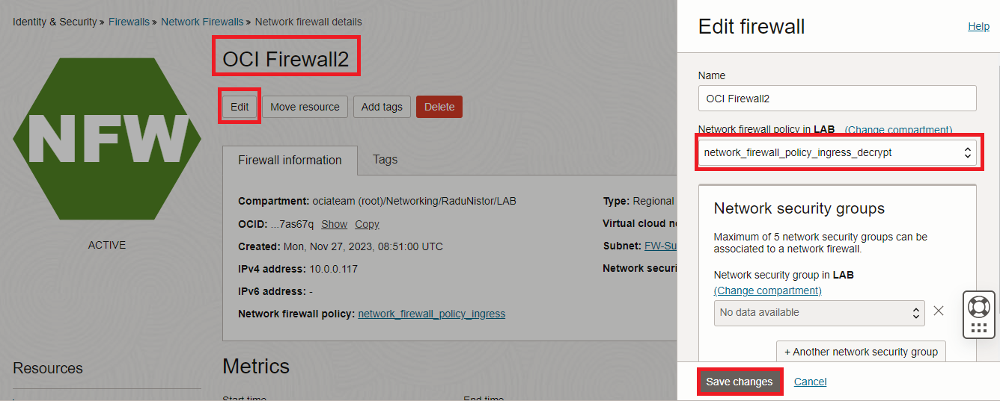

# SSL Decryption and Intrusion Detection

### Introduction

Estimated Time: 60 minutes

### About this lab

  In this lab we will focus on HTTPS, as this is the most common way to expose **web** services. To be able to complete this lab you will need the following:
  * SSL Certificate
  * SSL Certificate Chain
  * SSL Private Key for the certificate

  This lab will not cover the procedure to obtain these items. If you own a DNS Domain, you may be able to get them from the Registrar or you can use **openssl** on any Linux system and create a self-signed certificate. Regardless of the method, proceed with this lab only after you have the three components.

### Objectives

In this lab, you will:

* Deploy an OCI Vault Service to store the SSL Certificate.
* Enable an Inbound SSL Decryption policy on the OCI Network Firewall.
* Enable Intrusion Detection in the OCI Network Firewall.
* Enable SSL Offloading in the OCI Load Balancer.
* Test and observe Firewall Logs.

## Task 1: Deploy and configure the OCI Vault

  The OCI Network Firewall can decrypt incoming SSL traffic. For that, it needs a copy of the SSL certificates and the only place it can store them is the OCI Vault.

1. Log into the Oracle Cloud console and go to the Burger menu (on top left), select **Identity and Security** and click on **Vault**
  
  
2. In the menu that opens, click **Create Vault** and, in the next menu, give it a name and press Create.
  

3. You will be redirected to the Vault Details Page. Select **Master Encryption Keys** on the left and click **Create Key**. In the new menu, give it a name (lab-Master-Key) and make sure you select the **symmetric**  algorithm. Any protection mode is fine.
  

4. The next step is to create a Vault **Secret** using the Certificate, Certificate Chain and Certificate Private Key. The Vault Secret has a very specific format that you need to follow in order for the firewall to be able to read it.
  

  Open any text editor, such as Notepad, and create the Secret in the specified format. Use the following links for reference:

  [Official documentation](https://docs.public.oneportal.content.oci.oraclecloud.com/en-us/iaas/Content/network-firewall/setting-up-certificate-authentication.htm#network-firewall-setting-up-certificate-authentication) 

  [Example Secret](images/vault_secret_example.txt)

  After you prepared the **text** file with the proper format, go to the OCI Vault, click **Secrets** and click **Create Secret**. In the new menu, add the contents of the text file. 
  

5. As a final step, we need an **IAM Policy** to allow the OCI Network Firewall access to the OCI Vault. On the Oracle Cloud console, go to the Burger menu (on top left), select **Identity and Security** and click on **Policies** under the **Identity** service.
  

  In the menu that opens, click **Create Policy**. In the new menu, select "**Show manual editor** and input the following IAM rule: 

  *allow service ngfw-sp-prod to read secret-family in compartment lab*

  Note: **lab** is the Compartment I worked with in this Workshop. Change that policy to the Compartment you used.
  

## Task 2: OCI Network Firewall - enable inbound SSL decryption and Intrusion Detection 

  We finished preparing the Vault so we now need to modify the Firewall Policy to add Decryption.

1. On the Oracle Cloud Infrastructure Console Home page, go to the Burger menu (on top left), select **Identity and Security** and click on **Network firewalls**. Select **OCI Firewall2** which is the firewall inspecting **Inbound** traffic from the Internet. There, click on its running Policy - *network_firewall_policy_ingress*.
  

2. In the Policy details page, click **Clone** and give the clone a new name - *network_firewall_policy_ingress_decrypt*.
  

3. Now go to the Burger menu (on top left), select **Identity and Security** and click on **Network firewall policies**. Click on **network_firewall_policy_ingress_decrypt**. Make sure it is in **ACTIVE** state. 
  
  
4. In the Policy details menu, on the left, click on **Decryption profiles**. Click **Create decryption profile** and create an **SSL Inbound Inspection** profile.
  
 
5. In the Policy details menu, on the left, click on **Decryption rules**. Click **Create decryption rule**.
  

  In the menu that opens, for Source select **Any** and for Destination select the Load Balancer subnet address list.
  

  Next, under **Rule action**, select SSL Inbound Inspection, select the Profile created at point 4 and press Create Secret.
  

  In the Secret creation menu, make sure you choose the Vault, the Secret and the correct **Secret Version**. The Secret Version will increase if you edit the Secret.
  

  

6. In the Policy details menu, on the left, click on **Security rules**. There should be only one. Click Edit.
  

  Under **Rule action** switch from Allow to Intrusion Detection.
  

  Note: Enabling Intrusion Detection will make the firewall send a log entry to the **Threat Log** each time an attack is detected. However, the attack will not be stopped, only logged. If you want to stop the attack, select **Intrusion Prevention** instead.

7. On the Oracle Cloud Infrastructure Console Home page, go to the Burger menu (on top left), select **Identity and Security** and click on **Network firewalls**. Click **OCI Firewall2** which is the firewall inspecting **Inbound** traffic from the Internet and click **Edit**. Make it use the new policy called **network_firewall_policy_ingress_decrypt**.
  

  The firewall will go into the **Updating** state. Wait for it to become **ACTIVE** before moving on.

## Task 3: Enable SSL Offloading on the Load Balancer

  After we enabled HTTPS and Inbound Decryption on the Firewall, let's enable HTTPS on the Load Balancer. 

1. On the Oracle Cloud Infrastructure Console Home page, go to the Burger menu (on top left), select **Networking** and click on **Load balancer**. Click on the LB we deployed in the previous lab.
  

2. In the menu that opens, scroll down and click **Certificates**, on the left side menu. Next, select **Load Balancer Managed Certificate** and click **Add certificate**. In the menu that opens, add the three certificate files ( certificate, chain and private key).
  

  Note: the Firewall certificate used in the OCI Vault and the LB certificate must be the same or decryption will fail.

3. Next, go to **Listeners** on the left and press **Create Listener**. Use HTTPS, add the certificate created earlier and use the same backend set as the HTTP Listener (most likely there will be only one backend set configured)
  

## Task 4: Tests and Logs

  1. To test, do a simple HTTPS request to the Load Balancer's Public IP. Note that, depending on the certificate type, you may need a DNS entry to match the hostname. The firewall should allow the traffic and you should see it in the **Traffic Log**.
  

  2. There is no easy way to see if the traffic was decrypted by the firewall. However, once decryption is in place and Intrusion Detection/Prevention is enabled, we will start to see entries in the **Threat Log**.
   

   

**Congratulations!** You have successfully completed this lab and this **Workshop**. 

## Acknowledgements

* **Author** - Radu Nistor, Principal Cloud Architect, OCI Networking
* **Last Updated By/Date** - Radu Nistor, November 2023
