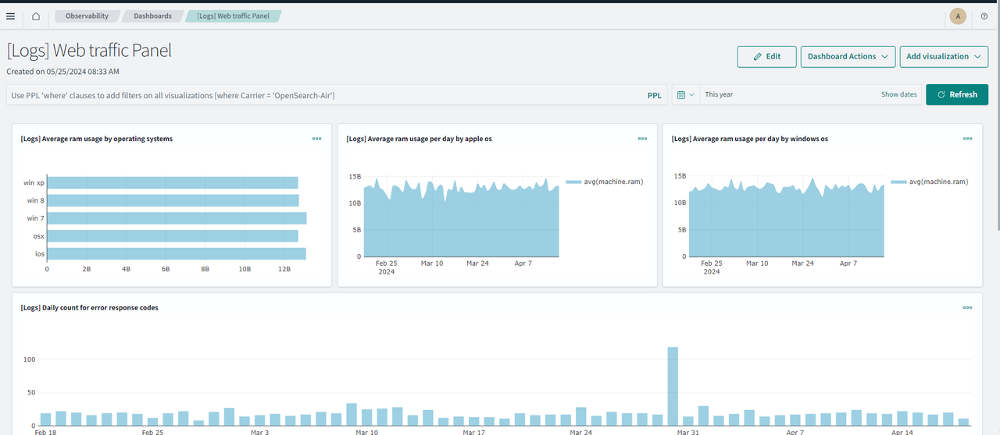
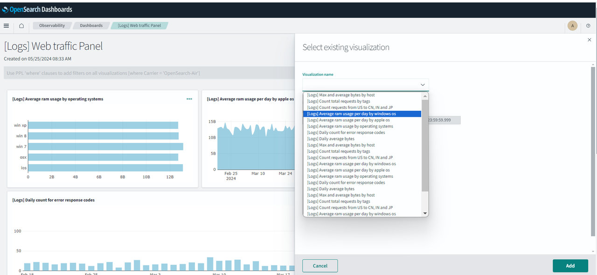

# Learn about the Observabiity module in OpenSearch 

## Introduction

In this lab, you will explore the Observability function in OpenSearch.

Estimated Time: 15 minutes

### Objectives

In this lab, you will:
- Connect to the OpenSearch Dashboard
- Search data using the Discover interface
- Create a simple pie chart for the sample data

## Step 1: Prerequisites
Confirm that the OpenSearch cluster is version 2.11 or higher.  This is the latest version. To create a cluster, see Creating an OpenSearch Cluster (LABs 1,2). You will have to connect to the OpenSearch Dashboard.
Please refer to **LAB2** **Task3** on how to connect to the OpenSearch Dashboard.

## Step 2: Review the strucure of the logs
First connect to the OpenSearch Dashboard (you have to provide the username/password) and go to **Discover** and select the following index opensearch_dashboards_sample_data_logs (this is a default set) in the right upper corner. Make sure to specify the time correctly on the top of the screen. Click on the document deaatils in one of the rows.  
   
Analyze the fields in the docoument.


## Step 3: Review the Logs section in Observability 
In the OpenSearch Dashboard  go to **Observabilityr** \ **Logs**. You will see the default list of Queries and Visualizations. Select 
"Show all hosts with errors aggregated by response, count of ips and tags"
 You will see the query details on this page.Analyze the qury written in PPL.  
   

In the PPL query section add:
```html
   <copy>source=opensearch_dashboards_sample_data_logs |  where match(request,'filebeat')</copy>
   ```
 You will see the results with filebeat in the request field.  
   
You can save this Query buy specifying a name and clicking on **Save** in the right upper corner.

In the PPL query section add:
```html
   <copy>source=opensearch_dashboards_sample_data_logs |  where response='503' or response='404' |  stats count() by span(timestamp,1d)</copy>
   ```
Also click on visualizations and the follwing grpah will show.
 
You can save this as a Visualization.

## Step 4: Review Dashboards
First connect to the OpenSearch Dashboard (you have to provide the username/password) and go to **Observability** \ **Dashboards**. Click on **[Logs] Web traffic Panel** (this is a default dashboard). 

   
This dashboard can be used for dev-ops.YOu can **Add Visualization** in the right upper corner. This can be an exisitng visualization, or you can create a new one.
   

The added viualization will appear in the Dashboard.

## Acknowledgements

* **Author** - Nirav Kalyani
* **Last Updated By/Date** - George Csaba, June 2024