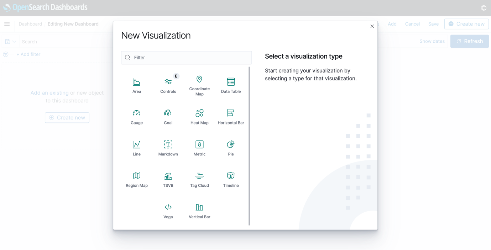

# Learn about the Observabiity module in OpenSearch 

## Introduction

In this lab, you will explore the Observability function in OpenSearch.

Estimated Time: 15 minutes

### Objectives

In this lab, you will:
- Connect to the OpenSearch Dashboard
- Search data using the Discover interface
- Create a simple pie chart for the sample data

## Step1: Prerequisites
Confirm that the OpenSearch cluster is version 2.11 or higher.  This is the latest version. To create a cluster, see Creating an OpenSearch Cluster (LABs 1,2)
Please refer to **LAB4** **Task1** on how to connect to the OpenSearch Dashboard.

## Task 1: Connect to OpenSearch Dashboards
First connect to the OpenSearch Dashboard (you have to provide the username/password) and go to **Management** and click on **Dev Tools**. You wil be able to type the commands in the Console.

## Task 2: Search and visualize data in OpenSearch Dashboards

1. With the port forwarding connection in place, access https://localhost:5601 in your browser.
2. Open the OpenSearch Dashboards navigation menu.
3. Click **Management**, then click **Dashboard Management**, and then click **Index Patterns**. Create an index pattern, with name = `oci`.

   

4. Open the OpenSearch Dashboards menu, and then click **Discover** to use the OpenSearch Dashboards UI to search your data. Make sure to specify the right index in the right upper corner. Also pay attention to the timeline on the top. Enter a sample keyword, such as `kubernetes`, and click **Refresh**.

   

5. Open the OpenSearch Dashboards menu, click **Dashboards** and follow these steps to create a sample pie chart.

      1. Click **Create new**, then click **New Visualization**, and then click **Pie**.

      

      2. Choose `oci` as source.

      3. In **Buckets**, click **Add**, and then click **Split slices**. Provide the parameters as shown in the following image and click **Update**.

      

## Acknowledgements

* **Author** - Nuno Gonçalves
* **Last Updated By/Date** - George Csaba, June 2024