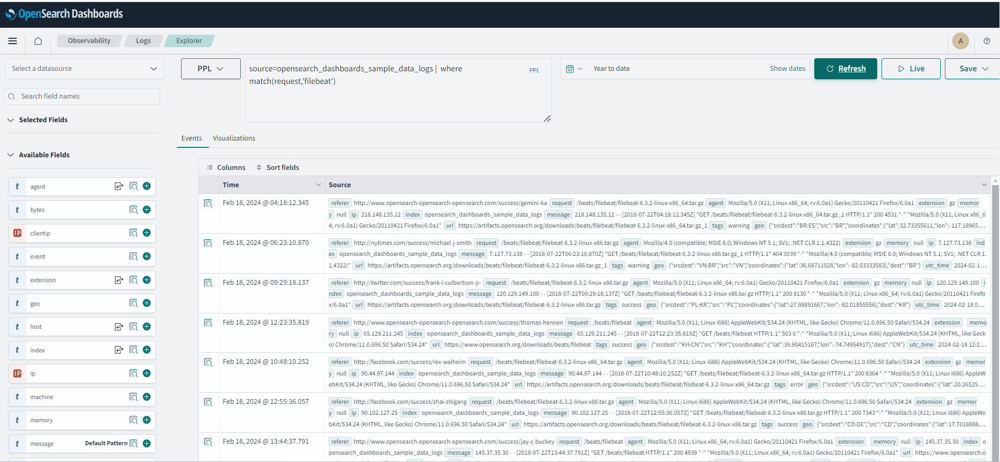
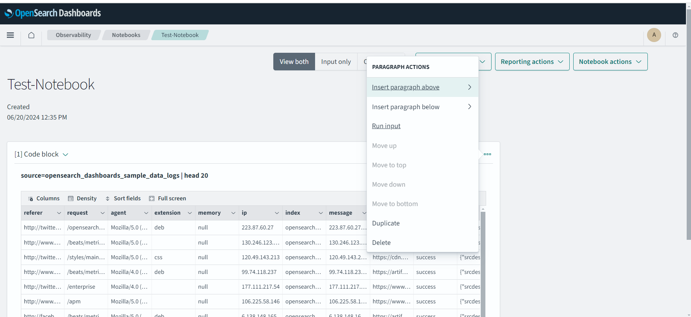
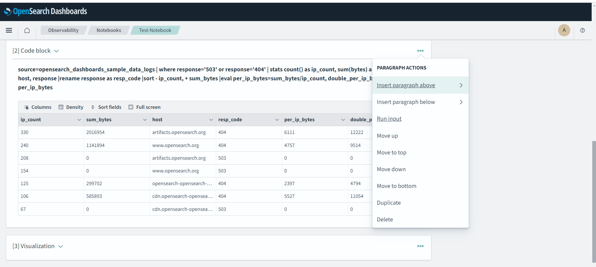
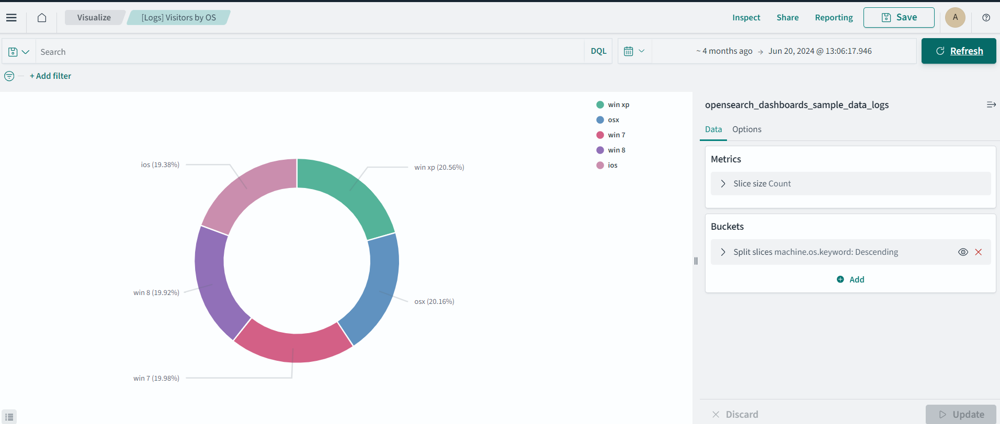

# Learn about the Observabiity module in OpenSearch 

## Introduction

In this lab, you will explore the Observability function in OpenSearch.

Estimated Time: 15 minutes

### Objectives

In this lab, you will:
- Connect to the OpenSearch Dashboard
- Search data using the Discover interface
- Create a simple pie chart for the sample data
- Create a notebook which you can share with others

## Step 1: Prerequisites
Confirm that the OpenSearch cluster is version 2.11 or higher.  This is the latest version. To create a cluster, see Creating an OpenSearch Cluster (LABs 1,2). You will have to connect to the OpenSearch Dashboard.
Please refer to **LAB2** **Task3** on how to connect to the OpenSearch Dashboard.

## Step 2: Review the structure of the logs
First connect to the OpenSearch Dashboard (you have to provide the username/password) and go to **Discover** and select the following index opensearch_dashboards_sample_data_logs (this is a default set) in the right upper corner. Make sure to specify the time correctly on the top of the screen. Click on the document dedetails in one of the rows.  
   
Analyze the fields in the document.


## Step 3: Review the Logs section in Observability 
In the OpenSearch Dashboard  go to **Observability** \ **Logs**. You will see the default list of Queries and Visualizations. Select 
"Show all hosts with errors aggregated by response, count of ips and tags"
 You will see the query details on this page. Analyze the query written in PPL.  
   

In the PPL query section add:
```html
   <copy>source=opensearch_dashboards_sample_data_logs |  where match(request,'filebeat')</copy>
   ```
 You will see the results with filebeat in the request field.  
   
You can save this Query by specifying a name and clicking on **Save** in the right upper corner.

In the PPL query section add:
```html
   <copy>source=opensearch_dashboards_sample_data_logs |  where response='503' or response='404' |  stats count() by span(timestamp,1d)</copy>
   ```
Also click on visualizations and the following graph will show.
 
You can save this as a Visualization.


## Step 4: Create a notebook
An OpenSearch Dashboards notebook is an interface that lets you easily combine code snippets, live visualizations, and narrative text in a single notebook interface. Notebooks let you interactively explore data by running different visualizations that you can share with team members to collaborate on a project.


First, connect to the OpenSearch Dashboard (you have to provide the username/password) and go to **Observability** \ **Notebooks**. 
Click on **Create notebook** and provide a name. 
Click on "Add Code block", afterwards you will be able to add additional Paragraphs, which can be Code blocks or visualizations. 

Enter the following code to retrieve the latest logs:

```html
   <copy>%ppl source=opensearch_dashboards_sample_data_logs | head 20</copy>
```
You can run the code by clicking on "Run Input". The result will be something like the following:

 

Click on Add Paragraph, to add a new Code blocks. 

Enter the following code:

```html
   <copy>%ppl source=opensearch_dashboards_sample_data_logs | where response='503' or response='404' | stats count() as ip_count, sum(bytes) as sum_bytes by host, response |rename response as resp_code |sort - ip_count, + sum_bytes |eval per_ip_bytes=sum_bytes/ip_count, double_per_ip_bytes = 2 * per_ip_bytes</copy>
```
You can run the code by clicking on "Run Input". The result will be something like the following:

 

Click on "Add Paragraph", to add a new Visualization. Specify the following **[Logs]Visitors by OS**
Make sure that the time range is correct.
You should see a graph similar to the following one.
   

You can add more Code blocks and visualizations to the notebook.


## Acknowledgements

* **Author** - Nirav Kalyani
* **Last Updated By/Date** - George Csaba, June 2024