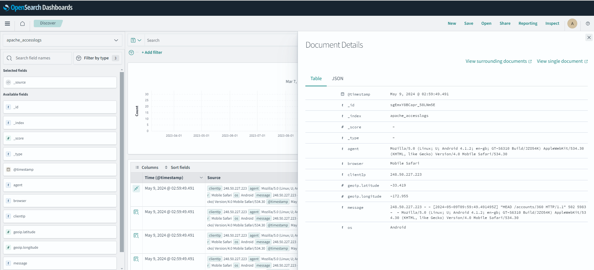
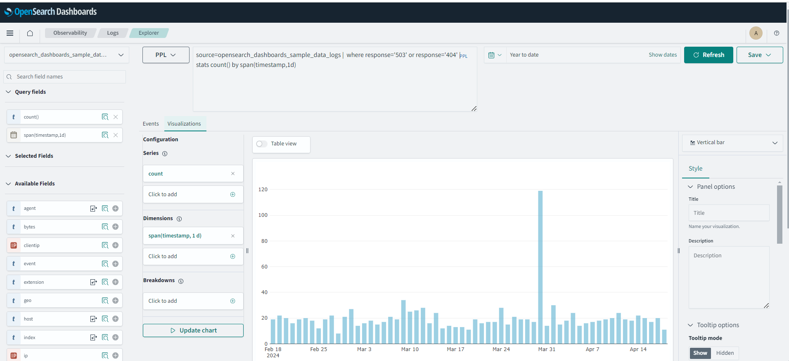
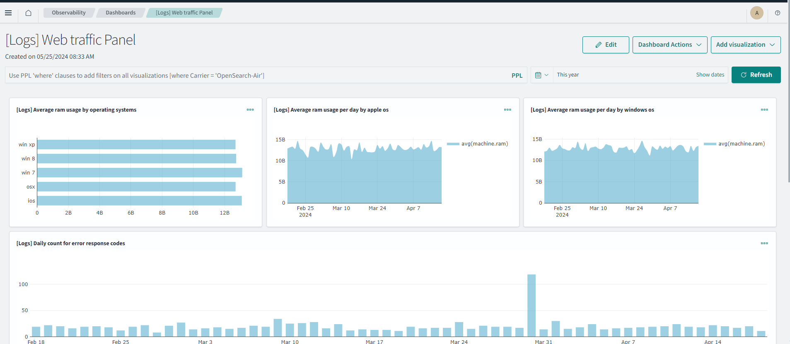
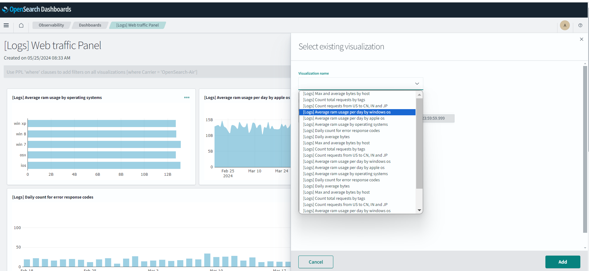

# Learn about the Observabiity module in OpenSearch 

## Introduction

In this lab, you will explore the Observability function in OpenSearch.

Estimated Time: 15 minutes

### Objectives

In this lab, you will:
- Connect to the OpenSearch Dashboard
- Search data using the Discover interface
- Create a simple pie chart for the sample data

## Step1: Prerequisites
Confirm that the OpenSearch cluster is version 2.11 or higher.  This is the latest version. To create a cluster, see Creating an OpenSearch Cluster (LABs 1,2). You will have to connect to the OpenSearch Dashboard.
Please refer to **LAB4** **Task1** on how to connect to the OpenSearch Dashboard.

## Step 2: Review the strucure of the Apache access logs
First connect to the OpenSearch Dashboard (you have to provide the username/password.Go to the **Management**\**Dev Tools** section.
Upload the Apache access logs data ulizing the command:
```html
   <copy>POST apache_accesslogs/_bulk
{ "create" : {} }
{"clientIp": "248.50.227.223", "agent": "Mozilla/5.0 (Linux; U; Android 4.1.2; en-gb; GT-S6310 Build/JZO54K) AppleWebKit/534.30 (KHTML, like Gecko) Version/4.0 Mobile Safari/534.30", "geoip": {"latitude": -33.418581069654735, "longitude": -172.95534758140695}, "browser": "Mobile Safari", "os": "Android", "message": "248.50.227.223 - - [2024-05-09T09:59:49.491495Z] \"HEAD /accounts/360 HTTP/1.1\" 502 5983 -  - Mozilla/5.0 (Linux; U; Android 4.1.2; en-gb; GT-S6310 Build/JZO54K) AppleWebKit/534.30 (KHTML, like Gecko) Version/4.0 Mobile Safari/534.30", "@timestamp": "2024-05-09T09:59:49.491495Z"}
{ "create" : {} }
{"clientIp": "248.50.227.223", "agent": "Mozilla/5.0 (Linux; U; Android 4.1.2; en-gb; GT-S6310 Build/JZO54K) AppleWebKit/534.30 (KHTML, like Gecko) Version/4.0 Mobile Safari/534.30", "geoip": {"latitude": -33.418581069654735, "longitude": -172.95534758140695}, "browser": "Mobile Safari", "os": "Android", "message": "248.50.227.223 - - [2024-05-09T09:59:49.491495Z] \"HEAD /accounts/360 HTTP/1.1\" 502 5983 -  - Mozilla/5.0 (Linux; U; Android 4.1.2; en-gb; GT-S6310 Build/JZO54K) AppleWebKit/534.30 (KHTML, like Gecko) Version/4.0 Mobile Safari/534.30", "@timestamp": "2024-05-09T09:59:49.491495Z"}
{ "create" : {} }
{"clientIp": "137.245.250.228","agent": "Mozilla/5.0 (Macintosh; Intel Mac OS X 10_9_0) AppleWebKit/600.1.25 (KHTML, like Gecko) Version/7.1 Safari/537.85.10","geoip": {"latitude": -79.46682477955724, "longitude": 175.87280243376205},"browser": "Safari","os": "Unknown", "message": "137.245.250.228 - - [2024-05-09T09:59:49.491438Z] \"POST /users/958 HTTP/1.1\" 500 9751 -  - Mozilla/5.0 (Macintosh; Intel Mac OS X 10_9_0) AppleWebKit/600.1.25 (KHTML, like Gecko) Version/7.1 Safari/537.85.10","@timestamp": "2024-05-09T09:59:49.491438Z" }
{ "create" : {} }
{"clientIp": "248.50.227.223", "agent": "Mozilla/5.0 (Linux; U; Android 4.1.2; en-gb; GT-S6310 Build/JZO54K) AppleWebKit/534.30 (KHTML, like Gecko) Version/4.0 Mobile Safari/534.30", "geoip": {"latitude": -33.418581069654735,"longitude": -172.95534758140695}, "browser": "Mobile Safari","os": "Android", "message": "248.50.227.223 - - [2024-05-09T09:59:49.491495Z] \"HEAD /accounts/360 HTTP/1.1\" 502 5983 -  - Mozilla/5.0 (Linux; U; Android 4.1.2; en-gb; GT-S6310 Build/JZO54K) AppleWebKit/534.30 (KHTML, like Gecko) Version/4.0 Mobile Safari/534.30","@timestamp": "2024-05-09T09:59:49.491495Z"}
{ "create" : {} }
{"clientIp": "137.245.250.228","agent": "Mozilla/5.0 (Macintosh; Intel Mac OS X 10_9_0) AppleWebKit/600.1.25 (KHTML, like Gecko) Version/7.1 Safari/537.85.10","geoip": {"latitude": -79.46682477955724,"longitude": 175.87280243376205 },"browser": "Safari","os": "Unknown", "message": "137.245.250.228 - - [2024-05-09T09:59:49.491438Z] \"POST /users/958 HTTP/1.1\" 500 9751 -  - Mozilla/5.0 (Macintosh; Intel Mac OS X 10_9_0) AppleWebKit/600.1.25 (KHTML, like Gecko) Version/7.1 Safari/537.85.10","@timestamp": "2024-05-09T09:59:49.491438Z" }
{ "create" : {} }
{"clientIp": "170.104.146.42","agent": "Mozilla/5.0 (Macintosh; U; Intel Mac OS X 10.7; en-US; rv:1.9.2.13) Gecko/20101203 Firefox/3.6.13","geoip": {"latitude": -71.52346838187906,"longitude": -55.60822088329088},"browser": "Firefox","os": "Unknown", "message": "170.104.146.42 - - [2024-05-09T09:59:49.491195Z] \"HEAD /products/349 HTTP/1.1\" 200 177 -  - Mozilla/5.0 (Macintosh; U; Intel Mac OS X 10.7; en-US; rv:1.9.2.13) Gecko/20101203 Firefox/3.6.13", "@timestamp": "2024-05-09T09:59:49.491195Z" }
{ "create" : {} }
{"clientIp": "39.142.212.40","agent": "Mozilla/5.0 (iPhone; CPU iPhone OS 7_0 like Mac OS X) AppleWebKit/537.51.1 (KHTML, like Gecko) Version/7.0 Mobile/11A466 Safari/9537.53", "geoip": {"latitude": 50.919954279324,"longitude": -21.190578406461327}, "browser": "Safari","os": "iPhone",    "message": "39.142.212.40 - - [2024-05-09T09:59:49.491152Z] \"HEAD /dummy/814 HTTP/1.1\" 404 1806 -  - Mozilla/5.0 (iPhone; CPU iPhone OS 7_0 like Mac OS X) AppleWebKit/537.51.1 (KHTML, like Gecko) Version/7.0 Mobile/11A466 Safari/9537.53","@timestamp": "2024-05-09T09:59:49.491152Z" }
{ "create" : {} }
{"clientIp": "3.5.104.253", "agent": "CCBot","geoip": {"latitude": 74.64804375619079,"longitude": 13.626794374087439},"browser": "Unknown",     "os": "Unknown", "message": "3.5.104.253 - - [2024-05-09T09:59:49.491122Z] \"GET /accounts/811 HTTP/1.1\" 200 1257 -  - CCBot",     "@timestamp": "2024-05-09T09:59:49.491122Z" }
{ "create" : {} }
{"clientIp": "2.4.103.252","agent": "AlphaBot","geoip": {"latitude": 29.13283264301174,"longitude": -160.40921726422212},"browser": "Unknown",    "os": "Unknown","message": "2.4.103.252 - - [2024-05-09T09:59:49.491113Z] \"GET /select/668 HTTP/1.1\" 201 2943 -  - AlphaBot","@timestamp":"2024-05-09T09:59:49.491113Z"}
{ "create" : {} }
{"clientIp": "2.5.104.252","agent": "WebBandit","geoip": {"latitude": -78.49962500098437,"longitude": 141.93740308899078}, "browser": "Unknown",    "os": "Unknown","message": "2.5.104.252 - - [2024-05-09T09:59:49.491057Z] \"GET /assets/76 HTTP/1.1\" 500 4145 -  - WebBandit", "@timestamp": "2024-05-09T09:59:49.491057Z"}
{ "create" : {} }
{"clientIp": "137.93.52.66","agent": "Mozilla/5.0 (BlackBerry; U; BlackBerry 9800; en-US) AppleWebKit/534.8+ (KHTML, like Gecko) Version/6.0.0.701 Mobile Safari/534.8+","geoip": {"latitude": 89.01522753515539,"longitude": 74.11769854595008}, "browser": "Mobile Safari",    "os": "Unknown","message": "137.93.52.66 - - [2024-05-09T09:59:49.491135Z] \"PUT /ssn/45 HTTP/1.1\" 403 4788 -  - Mozilla/5.0 (BlackBerry; U; BlackBerry 9800; en-US) AppleWebKit/534.8+ (KHTML, like Gecko) Version/6.0.0.701 Mobile Safari/534.8+","@timestamp": "2024-05-09T09:59:49.491135Z"}
</copy>
```

Now go to **Discover** and select the following index **apache_accesslogs**  in the right upper corner. Make sure to specify the time correctly on the top of the screen. Click on the document deatails in one of the rows.  
   
Analyze the fields in the docoument.


## Step 3: Review the Logs section in Observability 
In the OpenSearch Dashboard  go to **Observabilityr** \ **Logs**. You will see the default list of Queries and Visualizations. Select 
"Show all hosts with errors aggregated by response, count of ips and tags"
 You will see the query details on this page.Analyze the qury written in PPL.  
   

In the PPL query section add:
```html
   <copy>source=opensearch_dashboards_sample_data_logs |  where match(request,'filebeat')</copy>
   ```
 You will see the results with filebeat in the request field.  
   
You can save this Query buy specifying a name and clicking on **Save** in the right upper corner.

In the PPL query section add:
```html
   <copy>source=opensearch_dashboards_sample_data_logs |  where response='503' or response='404' |  stats count() by span(timestamp,1d)</copy>
   ```
Also click on visualizations and the follwing grpah will show.
 
You can save this as a Visualization.

## Step 4: Review Dashboards
First connect to the OpenSearch Dashboard (you have to provide the username/password) and go to **Observability** \ **Dashboards**. Click on **[Logs] Web traffic Panel** (this is a default dashboard). 

   
This dashboard can be used for dev-ops.YOu can **Add Visualization** in the right upper corner. This can be an exisitng visualization, or you can create a new one.
   

The added viualization will appear in the Dashboard.

## Acknowledgements

* **Author** - Nuno Gonçalves
* **Last Updated By/Date** - George Csaba, June 2024