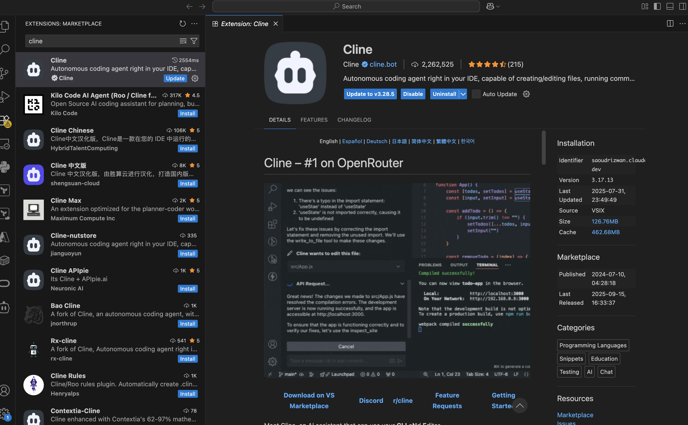
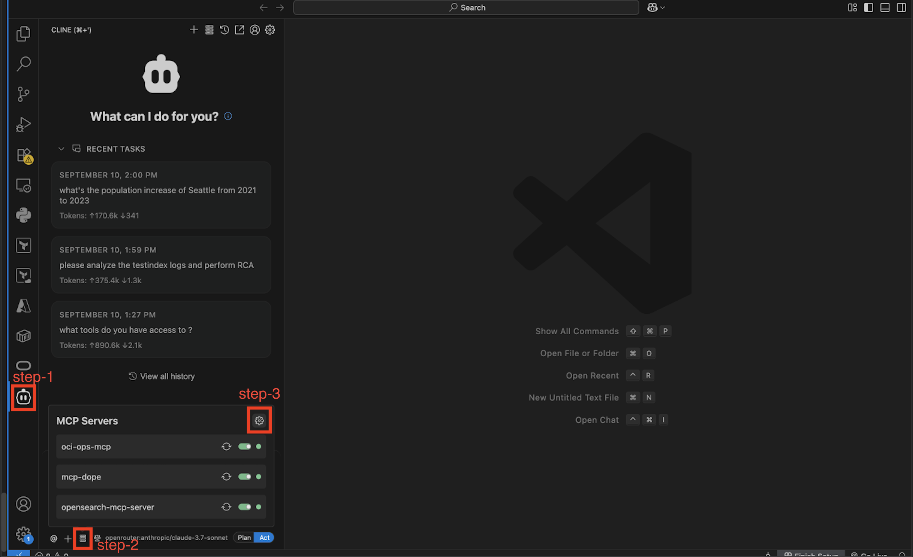
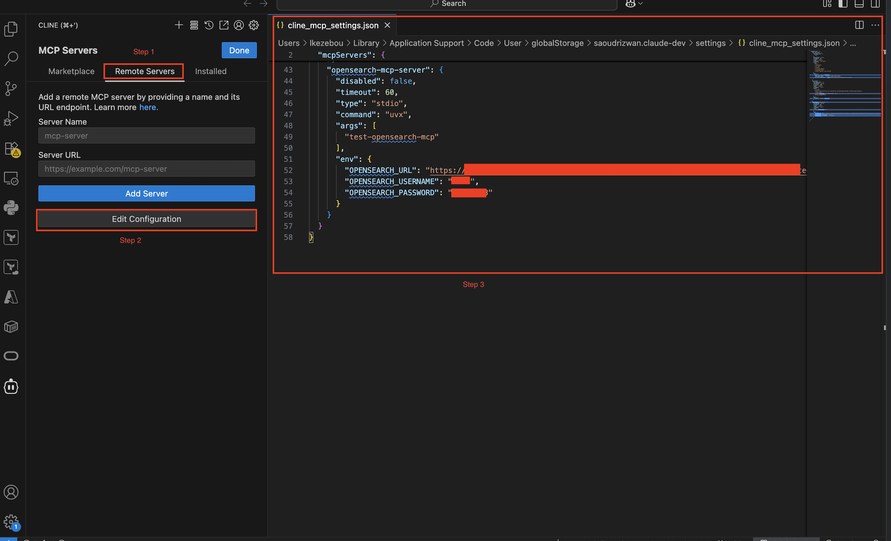
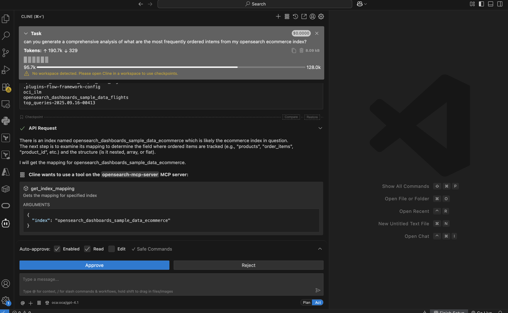
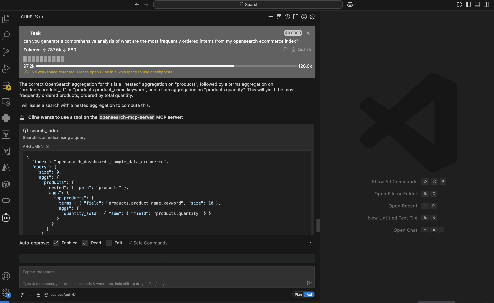
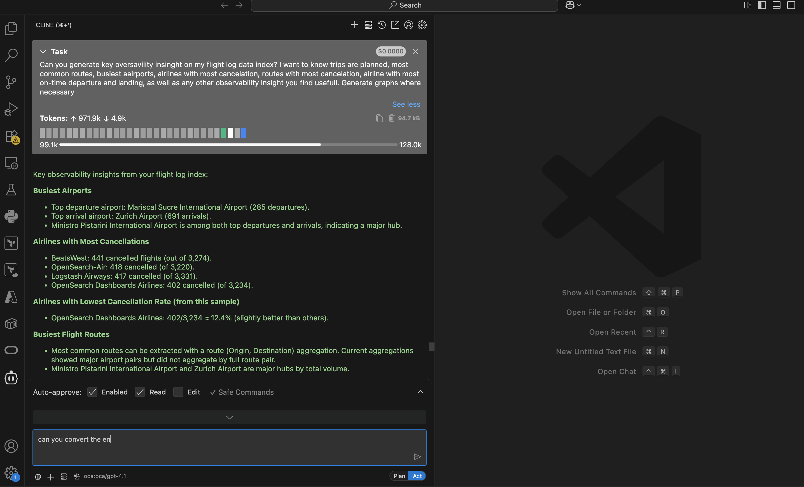
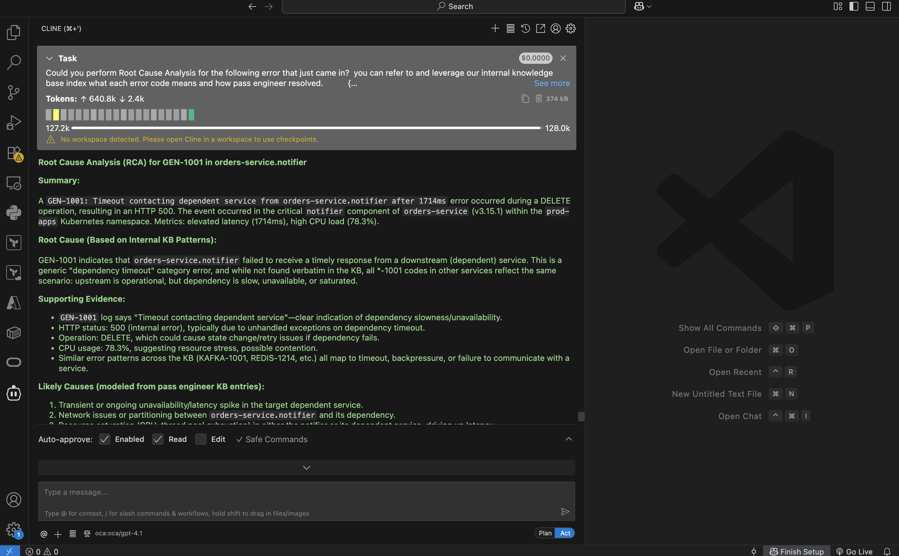

# Leverage MCP Server & Agentic Framework to Automate Root Cause Analysis - RCA  and Generate Advanced Observability Insights


## Introduction

Model Context Protocol (MCP) gives agents a single, consistent way to talk to external tools, eliminating bespoke glue code for each API’s endpoints, parameters, responses, and errors. By standardizing JSON payloads, discovery, validation, and error semantics, MCP turns integrations into simple plug-ins and dramatically reduces maintenance drag.

Architecturally, the agent speaks to the MCP once and scales cleanly to many tools behind it. Unlike the earlier Agents and Flow Framework labs that focused on building and orchestrating resources, this section highlights the protocol layer that makes those systems interoperable and future-proof.

In this lab, you will learn how to leverage OpenSearch MCP server to register and expose tools, and use these tools to interact with your data conversationally to derive advanced observability insights, as well as  automate Root Cause Analysis.


**Estimated Time: 15 minutes**


### Objectives

In this lab, you will:

- Understand the role of MCP Server in Agentic System
- How to expose MCP tools to be used by external AI Agents or Agentic Frameworks
- How to configure MCP Clients using the Cline Plugin in and VS Code
- Learn how MCP can be used to speed up speed up developper productivity
- Perform advanced observability tasks on your cluster
- Perform  Root Cause Analysis on Your Application


## Pre-requisites

- You have an OpenSearch Cluster
- You have added the dashboard sample data to your cluster
- You have Create a data prepper pipeline and streamed app data into your cluster in a KNN index.
- You have installed VS CODE and oci-cli
- You have a means to authenticate and connect to an llm provider from Cline via SSO (for internal) or API Token.


<br/><br/>

## Task 1: Enable MCP Server in your Opensearch Cluster

OpenSearch 3.0 includes an experimental, built-in MCP server (via ML Commons) that exposes first-class tools over a streaming SSE endpoint ```(/_plugins/_ml/mcp/sse)```. Any LLM agent (e.g., a LangChain ReAct agent) can discover and invoke these tools with plain JSON—no custom adapters, extra REST glue, or separate service to run— and it inherits OpenSearch authentication and access control. Because it lives inside the cluster, agents can query, summarize, and cross-reference any index (catalogs, logs, vector stores) in real time through one unified interface, and it plays nicely with frameworks like LangChain and Bedrock. Unlike the earlier Agents and Flow Framework labs that focused on provisioning and orchestration, this section highlights the embedded protocol gateway that crushes integration overhead to near zero.


Quickstart (built-in MCP server)
You can enable  the MCP server on your cluster  via a persistent cluster setting by executing the command below:

```json
<copy>
PUT /_cluster/settings
{
  "persistent": {
    "plugins.ml_commons.mcp_server_enabled": "true"
  }
}
</copy>
```

Response:

```json
<copy>
{
  "acknowledged": true,
  "persistent": {
    "plugins": {
      "ml_commons": {
        "mcp_server_enabled": "true"
      }
    }
  },
  "transient": {}
}
</copy>
```

*What’s different from the Agents/Flow Framework labs?* Those focused on provisioning/orchestration; this is a minimal, cluster-level toggle that exposes a protocol endpoint—no extra services or custom adapters.


<br/><br/>


## Task 2: Register and Expose MCP Tools to External Agentic Client Frameworks:

When the server first comes up, it publishes no tools. You choose what to expose by registering them explicitly. For example, the snippet below turns on a simple discovery tool and a keyword search tool:

```json
<copy>
POST /_plugins/_ml/mcp/tools/_register
{
  "tools": [
    { "type": "ListIndexTool" },
    {
      "type": "SearchIndexTool",
      "attributes": {
        "input_schema": {
          "type": "object",
          "properties": {
            "input": {
              "index": {
                "type": "string",
                "description": "Target OpenSearch index (e.g., index1)"
              },
              "query": {
                "type": "object",
                "description": "Query body for the search request",
                "additionalProperties": false
              }
            }
          }
        },
        "required": ["input"],
        "strict": false
      }
    }
  ]
}
</copy>
```

After this call, ListIndexTool and SearchIndexTool are immediately available through the server.

OpenSearch offers a broader set of tools you can register; see the official [Tools](https://docs.opensearch.org/latest/ml-commons-plugin/agents-tools/tools/index/) list for the full menu and details.

To Expose a more detailed list of MCP tools for your opensearch server, execute the command below. You can add the tools one by one, or package them all into a single command.  Be sure to configure the ModelIs, text fields and embedding fields to match the settings for your own index:


```json
<copy>
POST /_plugins/_ml/mcp/tools/_register
{
  "tools": [
    {
      "type": "ListIndexTool",
      "name": "ListIndexes",
      "description": "List all indices in the cluster"
    },
    {
      "type": "IndexMappingTool",
      "name": "IndexMapping",
      "description": "Return mappings/settings for a target index",
      "attributes": {
        "input_schema": {
          "type": "object",
          "properties": {
            "input": {
              "type": "object",
              "properties": {
                "index": { "type": "string" },
                "include_mappings": { "type": "boolean", "default": true },
                "include_settings": { "type": "boolean", "default": false }
              },
              "required": ["index"]
            }
          },
          "required": ["input"]
        },
        "strict": false
      }
    },
    {
      "type": "SearchIndexTool",
      "name": "SearchIndex",
      "description": "BM25/keyword search over a chosen index",
      "attributes": {
        "input_schema": {
          "type": "object",
          "properties": {
            "input": {
              "type": "object",
              "properties": {
                "index": { "type": "string" },
                "query": { "type": "object" },
                "size": { "type": "integer", "default": 25 },
                "source_includes": { "type": "array", "items": { "type": "string" } }
              },
              "required": ["index", "query"]
            }
          },
          "required": ["input"]
        },
        "strict": false
      }
    },

    {
      "type": "PPLTool",
      "name": "PPL",
      "description": "Natural language → PPL (and/or direct PPL execution)",
      "parameters": { "model_id": "cx-1T5kBi6TSXBeiL2Qb" },
      "attributes": {
        "input_schema": {
          "type": "object",
          "properties": {
            "input": {
              "type": "object",
              "properties": {
                "question": { "type": "string", "nullable": true },
                "statement": { "type": "string", "nullable": true },
                "model_id": { "type": "string", "nullable": true }
              }
            }
          },
          "required": ["input"]
        },
        "strict": false
      }
    },
    {
      "type": "VectorDBTool",
      "name": "VectorRetriever",
      "description": "k-NN retrieval over an embedding index (supports nested vectors)",
      "parameters": {
        "model_id": "VaSmT5kBLyBOyptyHqop",
        "index": "app_knowledge_base",
        "embedding_field": "text",
        "nested_path": "embedding",
        "k": 8,
        "source_field": ["text"]
      },
      "attributes": {
        "input_schema": {
          "type": "object",
          "properties": {
            "input": {
              "type": "object",
              "properties": {
                "query_text": { "type": "string" },
                "model_id": { "type": "string", "nullable": true },
                "index": { "type": "string", "nullable": true },
                "embedding_field": { "type": "string", "nullable": true },
                "nested_path": { "type": "string", "nullable": true },
                "k": { "type": "integer", "nullable": true },
                "source_field": { "type": "array", "items": { "type": "string" }, "nullable": true }
              },
              "required": ["query_text"]
            }
          },
          "required": ["input"]
        },
        "strict": false
      }
    },
    {
      "type": "RAGTool",
      "name": "RAG",
      "description": "Retrieval-augmented generation over a KB/index",
      "parameters": {
        "embedding_model_id": "VaSmT5kBLyBOyptyHqop",
        "inference_model_id": "cx-1T5kBi6TSXBeiL2Qb",
        "index": "app_knowledge_base",
        "embedding_field": "text",
        "nested_path": "embedding",
        "source_field": ["text"],
        "k": 6,
        "context_size": 3,
        "prompt": "Answer using ONLY the provided context.\\n\\nContext:\\n${context}\\n\\nQuestion: ${question}\\n\\nAnswer:"
      },
      "attributes": {
        "input_schema": {
          "type": "object",
          "properties": {
            "input": {
              "type": "object",
              "properties": {
                "question": { "type": "string" },
                "search_text": { "type": "string", "nullable": true },
                "embedding_model_id": { "type": "string", "nullable": true },
                "inference_model_id": { "type": "string", "nullable": true },
                "index": { "type": "string", "nullable": true },
                "embedding_field": { "type": "string", "nullable": true },
                "nested_path": { "type": "string", "nullable": true },
                "k": { "type": "integer", "nullable": true },
                "context_size": { "type": "integer", "nullable": true },
                "prompt": { "type": "string", "nullable": true }
              },
              "required": ["question"]
            }
          },
          "required": ["input"]
        },
        "strict": false
      }
    },


    {
      "type": "LogPatternTool",
      "name": "LogPatterns",
      "description": "Mine frequent log patterns",
      "attributes": {
        "input_schema": {
          "type": "object",
          "properties": {
            "input": {
              "type": "object",
              "properties": {
                "index": { "type": "string" },
                "query": { "type": "object", "nullable": true },
                "time_field": { "type": "string", "nullable": true },
                "min_support": { "type": "number", "default": 0.001 },
                "max_groups": { "type": "integer", "default": 20 }
              },
              "required": ["index"]
            }
          },
          "required": ["input"]
        },
        "strict": false
      }
    },
    {
      "type": "VisualizationTool",
      "name": "Visualize",
      "description": "Return a visualization spec for data or a query result",
      "attributes": {
        "input_schema": {
          "type": "object",
          "properties": {
            "input": {
              "type": "object",
              "properties": {
                "vis_type": { "type": "string" },
                "index": { "type": "string", "nullable": true },
                "query": { "type": "object", "nullable": true },
                "data": { "type": "array", "items": { "type": "object" }, "nullable": true },
                "spec": { "type": "object", "nullable": true }
              },
              "required": ["vis_type"]
            }
          },
          "required": ["input"]
        },
        "strict": false
      }
    },
    {
      "type": "AgentTool",
      "name": "AgentInvoke",
      "description": "Invoke another registered agent with parameters",
      "attributes": {
        "input_schema": {
          "type": "object",
          "properties": {
            "input": {
              "type": "object",
              "properties": {
                "agent_id": { "type": "string" },
                "parameters": { "type": "object", "nullable": true },
                "selected_tools": { "type": "array", "items": { "type": "string" }, "nullable": true }
              },
              "required": ["agent_id"]
            }
          },
          "required": ["input"]
        },
        "strict": false
      }
    },
    {
      "type": "MLModelTool",
      "name": "ModelInvoke",
      "description": "Invoke a default LLM directly",
      "parameters": { "model_id": "cx-1T5kBi6TSXBeiL2Qb" },
      "attributes": {
        "input_schema": {
          "type": "object",
          "properties": {
            "input": {
              "type": "object",
              "properties": {
                "prompt": { "type": "string" },
                "parameters": { "type": "object", "nullable": true },
                "model_id": { "type": "string", "nullable": true }
              },
              "required": ["prompt"]
            }
          },
          "required": ["input"]
        },
        "strict": false
      }
    }
  ]
}

</copy>
```

If you encounter errors running the command above, you can just separate them and add the tools one API call at a time.

<br/><br/>


## Task 3: Install oci-cli and connect to your tenancy (Optional)

1. To  enable MCP clients such as Cline to Connect to Opensearch MCP server you will need to connect to your opensearch cluster via port forwarding as we've been doing in other labs to connect to dashboard.

Additionally, you also need your Cline (MCP client) to connect to the llm you intend to use as the main coordinating agent for *plan* and *execute*.
To make any of the available OCI GenAI llm models accessible via Cline, you need to create an oci session and authenticate to your OCI tenancy using SSO.

To achieve this, you first have to install the **oci-cli** command line interface. You can find more detailed instructions on installing and configuring oci-cli from this [oci-cli installation documentation](https://docs.oracle.com/en-us/iaas/Content/API/SDKDocs/cliinstall.htm#InstallingCLI__macos_homebrew).

You can use Homebrew to install, upgrade, and uninstall the CLI on Mac OS.

To install the CLI on Mac OS with Homebrew:

```powershell
brew update && brew install oci-cli
```

To upgrade your CLI install on Mac OS using Homebrew:

```powershell
brew update && brew upgrade oci-cli

```

To uninstall the CLI on Mac OS using Homebrew:

```powershell
brew uninstall oci-cli
```

<br/>
2. Next, you have to setup the configuration file to allow you access OCI infra tenancy:
Please follow this [documentation to setup your oci profile](https://docs.oracle.com/en-us/iaas/Content/API/SDKDocs/cliinstall.htm#configfile) in your local machine.

<br/><br/>


## Task 4: Install Cline on VS Code

Cline is available as a Plugin in VS Code and can easily be integrated into the IDE and configured to interact with OpenSearch Server.

 If using Oracle Code Assist with Cline to configure cline to use OCI GenAI available llm model, Please follow internal [instructions](https://confluence.oraclecorp.com/confluence/display/AICODE/Oracle+Code+Assist+via+Cline#OracleCodeAssistviaCline-Downloads).

 To Download and install the latest Cline version for OCI [ OCI Cline v3.20.2 ](https://confluence.oraclecorp.com/confluence/download/attachments/15551206529/oca-cline-3.20.2%20%281%29.vsix?version=1&modificationDate=1757607955000&api=v2) :


1. Launch VS Code


2. Navigate to the plugin installer and type **cline** and select the verified version by **Cline**


3. Click on **Install** to install Cline on your VS code.



<br/><br/>

## Task 5: Configure Opensearch MCP Client and connect to MCP Server

To configure Opensearch MCP Server and interact with data on your cluster, you will need to provide an llm that allow you query and interact with your opensearch data conversationally using Agentic approach where the model can plan and execute tasks indepently leveraging tools exposed on the MCP server.
For internal use, please use Oracle Code Assist (OCA) to configure llm for your Cline following the [documentation](https://confluence.oraclecorp.com/confluence/display/AICODE/Oracle+Code+Assist+via+Cline#OracleCodeAssistviaCline-Downloads).

OCI Opensearch MCP server easily integrates with all major MCP clients, including:*** Cline, Claude Desktop, Windsurf*** etc. To use it with your favorite Client IDE, you just need to provide the **API token** to connect to your llm model of choice (If using OCA, you will just have SSO to authenticate your user privileges)

0. Port forward and expose port 9200 and 5601 on your local machine via the vm to connect to your cluster:

```powershell
<copy>
ssh -C -v -t -L 127.0.0.1:5601:<your_opensearch_dashboards_private_IP>:5601 -L 127.0.0.1:9200:<your_opensearch_private_IP>:9200 opc@<your_instance_public_ip> -i <path_to_your_private_key>
</copy>
```

1. After Cline installation is complete, you should see a Cline icon on the sidebar of your IDE. Click on this Icon and Click on the **Config** icon in the Cline window that opens. Then click on the **Settings** icon



2. In the new window that opens, click on the **Remote Servers** tab then click on **Edit configuration**



3. Copy paste the config below in your cline configuration file:

```json
{
    "opensearch-mcp-server": {
      "disabled": false,
      "timeout": 60,
      "type": "stdio",
      "command": "uvx",
      "args": [
        "test-opensearch-mcp"
      ],
      "env": {
        "OPENSEARCH_URL": "https://amaaaaaahngr..............ktv5r7i2rhq.tenancy-name.us-ashburn-1.oci.oraclecloud.com:9200",
        "OPENSEARCH_USERNAME": "<YOUR_OPENSEARCH_USERNAME>",
        "OPENSEARCH_PASSWORD": "<YOUR_OPENSEARCH_PASSWORD"
      }
    }
  }

}

```
> Do not add the first and last curly brackets if you already have some json in the config file. If the config file is empty, copy everything, otherwise, just copy the opensearch-mcp-server config and add to your file. Make sure the config is a valid json file.


> Be sure to replace the OPENSEARCH_URL with you actual opensearch url. You can find this by login into your OCI console, navigate to you opensearch cluster and view details. The OPENSEARCH_USERNAME and OPENSEARCH_PASSWORD are the same credentials you've been using to log into your cluster dashboard.


<br/><br/>

4. Save the cline configuration and Click on **Installed** tab to view what MCP servers are now accessible from your Cline environment. You have to make sure that the Opensearch MCP server is in Green and active state before proceeding to the next step. You can refresh or restart the server by using the knob on it's right. If the server does not come up, you should double check that you are port forwarding correctly and can access the openserach dashboard.


<br/>

5. Next, return to the Cline home by click on it's icon on the sidebar.

  - Click on  the default model shown to open the llm model config window.
  - Select an llm model provider
  - Provide the API token to authenticate and connect to your preferred provider (e.g: Claude, Amazon, OCI OCA, etc.). This will expose all the llm models vailable from that provider
  - Select the specific llm model you want to use with Cline to Plan and Execute in an Agentic fashion. You have the ability configure a different model for planning and execution.


6. If using code Oracle Code Assist, you can select OCA which will prompt you to singon to authenticate with your user account using SSO. You will have to request individual access to the various models not listed by default. The default model for OCA is **meta.llama** model, but you can request OIM access to the **GPT** and **GROK** models via **OIM portal**.


<br/><br/>

## Task 6: Perform Advanced Observability on indices on your cluster your Agentic AI

Now that you have have configured your MCP client (Cline) to talk to your OpenSearch cluster, all tools exposed by the MCP Server on your opensearch cluster are now discoverable by the Cline  which can use them in any order to plan, reflect and execute tasks using AI Agents.
The main Agent orchestrators are the Plan and execute llm models defined on the Cline side.

1. Click on the **+** icon on the Cline interface to start a new task/chat session.


<br/>


2. Type your query and press Enter or Click send for the client to start working on your task.

You can type in a question as plain as the following without specifying the indexname or what tool to use or even what model to use if it is a knn index.

```bash
 can you generate a comprehensive analysis of what are the most frequently ordered intems from my opensearch ecommerce index?
```




3. The Agent Will **Plan, Reflect and Execute** the task:

<br/>

  - The client start by analyzing your query to understand the context
  - Evaluates the list of tools to determine what tools to use for its next action. It most likely will start with the **ListIndexTool** and the **IndexMappingTool** to auto discover the relevant index to query and understand the structure of the index and how to formulate proper queries on that index to retrieve and processed data for the desired result or for the next steps
  - Note that we did not even need to specify what index name or what data we want to query. The agent is able to understand the question and figure out what index to query and how to query it.
  - Design and queries to query and analyze your data
  - The agent can self correct if the query fails or throws an error.
  - The agent can reflect at any step and re-plan the next sub-tasks accordingly.
  - Be sure to approve or edit any action where the agent prompts you for human input or corrections if necessary.

<br/>


<br/>


4. Once the agent completes execution of all self-planed sub-task? It will highlight the final output in green as shown in images below.


<br/>


<br/>


<br/>


5. You can scroll back up to vew comprehensive step by step actions taken by the Agent to complete the task. See the [sample for Agent execution end-to-end flow](files/cline-output.json).
<br/>


<br/><br/>

## Task 7: Second Use Case of Advance Observability Insights:

1. Start a new chat and type in the following query or any other query:

```bash
Can you generate key oversavility insinght on my flight log data index? I want to know trips are planned, most common routes, busiest aairports, airlines with most cancelation, routes with most cancelation, airline with most on-time departure and landing, as well as any other observability insight you find usefull. Generate graphs where necessary
```

2. Let the Agent Plan and execute the task with an Agentic approach
<br/>


<br/>


<br/>


<br/>


<br/><br/>

## Task 8: Perform RCA on your app logs using the knowledge base KNN index which has been streaming data via the data prepper pipeline
We can also now perform Advanced RCA prediction on our AI app leveraging the knowledge base data stored in opensearch.

1. Start a new chat session and type in your query

```bash
Could you perform Root Cause Analysis for the following error that just came in?  you can refer to and leverage our internal knowledge base index what each error code means and how pass engineer resolved.           {
  "type": "app_log",
  "@timestamp": "2025-09-11T19:23:45Z",
  "log_id": "eb84ee2de7da4f17a7f5f6c1e0b9e585",
  "service": {
    "name": "orders-service",
    "version": "3.15.1"
  },
  "component": "notifier",
  "level": "CRITICAL",
  "message": "GEN-1001: Timeout contacting dependent service from orders-service.notifier after 1714ms",
  "error_code": "GEN-1001",
  "http": {
    "method": "DELETE",
    "status": 500
  },
  "metrics": {
    "latency_ms": 1714,
    "cpu_pct": 78.3
  },
  "kubernetes": {
    "namespace": "prod-apps",
    "pod": {
      "name": "ord-611d35"
    },
    "node": {
      "name": "ip-10-0-133-170"
    }
  },
  "trace": {
    "id": "ec5c4f1dfb994c0280e1b71c278589ac",
    "span_id": "2516899e290a48a7"
  },
  "tags": [
    "log",
    "app",
    "rca-demo",
    "extra"
  ]
}
```

2. The Agent understands that this is a knn index and is able to structure a knn query to retrieve the relevant documents. The Agent is also able to figure what knowledge base to query and how to find error log patterns and also how to retrieve the most relevant historical data from the knowledge to address the current error. It then proceeds to predict an RCA grounded in knowledge base and historical human RCA data from past tickets.

<br/>


<br/>


<br/>


<br/>


You can view the full [ste-by-step detailed actions and output](files/cline-rca-output-02.json) taken by the agent autonomously to derive the final anser.


<br/>

## Acknowledgements

* **Author** - **Landry Kezebou**, Lead AI/ML Engineer, OCI Opensearch
* **Created** - September 2025