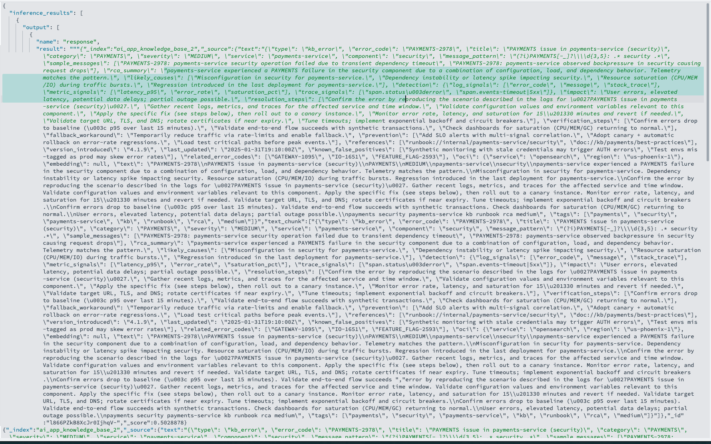

# AI Agents & Agent Tools


## Introduction

The widespread adoption and success of Agentic AI systems has had a transformative impact on industry standards in the past couple years, shifting from static agents with preset instructions and tasks definition, to dynamic AI agents capable of planning, making decisions, and executing a range of tasks using an arsenal of tools put at their disposal.

With a mission to keep the AI momentum growing stronger while simplifying AI app development, Opensearch now has built-in support for  **AI Agents**,  **Agent Tools**—reusable, declarative capabilities like keyword search, aggregations, schema introspection, RAG, etc..

An **agent** orchestrates perform a set of actions depending on tools configured. For a list of supported agents, see [Agents](https://docs.opensearch.org/latest/ml-commons-plugin/agents-tools/agents/index/).

A tool provides support for the agent to perform specific tasks. Some examples of tools are the VectorDBTool, which supports vector search, and the ListIndexTool, which executes the List Indices API. For a list of supported tools, see [Tools](https://docs.opensearch.org/latest/ml-commons-plugin/agents-tools/tools/index/).

A **flow agent** on the other hand, runs a sequence of tools in order a specific preset order and returns the last tool’s output.

In this lab, you will learn how AI agents execute actions using assigned agent tools. The lab starts with **non‑vectorized** OpenSearch sample datasets (eCommerce and Flights). You’ll build an AI agent that utilizes tools like PPL Tool, and SearchIndex Tool to automate data aggregation, and generate observability insights. Then optionally you can also test an agent with vector/RAG tool on the vectorized index you created in earlier lab.


**Estimated Time: 15 minutes**

### Objectives
1. Register **utility tools** (list indices, describe mappings)
2. Register **BM25 search tools** for eCommerce & Flights (non‑vector)
3. Register **aggregation tools** for quick insights (top-k, trends)
4. Create an **Explorer Agent** that orchestrates these tools with fallbacks
5. Execute example prompts that traverse both datasets
6. (Optional) Extend with a **RAG** tool over a vectorized KB

## Pre-requisites
This Lab assumes that you already:
- Created an opensearch cluster
- Added opensearch sample data from dashboard such as the sample eCommerce data and the sample flight data.
- Created You KNN index and streamed data into from Data Pepper pipeline


## Task 1: Register and Test The ListIndexTool with a Simple Flow Agent
The **ListIndexTool** retrieves index information for the OpenSearch cluster

1. Register a Flow Agent that will run the ListIndexTool

```json
<copy>
POST /_plugins/_ml/agents/_register
{
    "name": "Test_Agent_For_ListIndex_tool",
    "type": "flow",
    "description": "this is a test agent for the ListIndexTool",
    "tools": [
        {
        "type": "ListIndexTool",
        "name": "DemoListIndexTool",
        "parameters": {
            "input": "${parameters.question}"
        }
        }
    ]
}
</copy>
```

Response :

```json
{
"agent_id": "wd71RZkBwL_MpPtE4iJ6"
}
```

2. Run the Agent

```json
<copy>
POST /_plugins/_ml/agents/wd71RZkBwL_MpPtE4iJ6/_execute
{
"parameters": {
    "question": "How many indices do I have?"
}
}
</copy>
```

Response:

```json
<copy>
{
"inference_results": [
{
"output": [
    {
    "name": "response",
    "result": """row,health,status,index,uuid,pri(number of primary shards),rep(number of replica shards),docs.count(number of available documents),docs.deleted(number of deleted documents),store.size(store size of primary and replica shards),pri.store.size(store size of primary shards)
    1,green,open,.plugins-ml-model-group,lSn5PV9VSf-AF1ep8bKOkQ,1,0,4,0,14.5kb,14.5kb
    2,green,open,otel-v1-apm-service-map-sample,Rt43HqsrSQqbBEev2bx5rA,1,0,49,0,17.7kb,17.7kb
    3,green,open,.plugins-ml-memory-meta,UuI6_-mPT0mDLn9xjGv4Yg,1,0,22,0,39.1kb,39.1kb
    4,yellow,open,my_test_data-ch,xCvfAZ_3Q9S1kw4nANpMFw,1,1,30915,0,136.1mb,136.1mb
    5,green,open,.ql-datasources,8rGWS9jFQgWEh0xkrLintQ,1,0,0,0,208b,208b
    6,green,open,.plugins-ml-task,Y11w7fEWRJ6Ic11WVCDVkg,1,0,19,3,49kb,49kb
    7,green,open,ss4o_metrics-otel-sample,KgYgrwoKQrqJ44iwo2Nesw,1,0,39923,0,4.4mb,4.4mb
    8,green,open,top_queries-2025.09.08-00384,f-FFwDqeT4eJl22HZqa_pw,1,0,204,8,198.8kb,198.8kb
    ...............
    """
            }
        ]
        }
    ]
}
</copy>
```


<br/><br/>

## Task 2: Index Mapping tool
The **IndexMappingTool** is used by the agent to retrieve index mapping and setting information for indices in your cluster.

1. Register the agent with the **IndexMappingTool**

```json
<copy>
POST /_plugins/_ml/agents/_register
{
  "name": "Test_Agent_For_IndexMapping_tool",
  "type": "flow",
  "description": "this is a test agent for the IndexMappingTool",
  "tools": [
      {
      "type": "IndexMappingTool",
      "name": "DemoIndexMappingTool",
      "parameters": {
        "index": "${parameters.index}",
        "input": "${parameters.question}"
      }
    }
  ]
}
</copy>
```

Response:

```json
{
  "agent_id": "wt4dRpkBwL_MpPtEDyJ6"
}
```

2. Run the  Agent to test the Tool

```json
<copy>
POST /_plugins/_ml/agents/wt4dRpkBwL_MpPtEDyJ6/_execute
{
  "parameters": {
    "index": [ "opensearch_dashboards_sample_data_ecommerce" ],
    "question": "What fields are in the sample-ecommerce index?"
  }
}
</copy>
```

Response:

```json
<copy>
{
  "inference_results": [
    {
      "output": [
        {
          "name": "response",
          "result": """index: opensearch_dashboards_sample_data_ecommerce

mappings:
properties={category={type=text, fields={keyword={type=keyword}}}, currency={type=keyword}, customer_birth_date={type=date}, customer_first_name={type=text, fields={keyword={type=keyword, ignore_above=256}}}, customer_full_name={type=text, fields={keyword={type=keyword, ignore_above=256}}}, customer_gender={type=keyword}, customer_id={type=keyword}, customer_last_name={type=text, fields={keyword={type=keyword, ignore_above=256}}}, customer_phone={type=keyword}, day_of_week={type=keyword}, day_of_week_i={type=integer}, email={type=keyword}, event={properties={dataset={type=keyword}}}, geoip={properties={city_name={type=keyword}, continent_name={type=keyword}, country_iso_code={type=keyword}, location={type=geo_point}, region_name={type=keyword}}}, manufacturer={type=text, fields={keyword={type=keyword}}}, order_date={type=date}, order_id={type=keyword}, products={properties={_id={type=text, fields={keyword={type=keyword, ignore_above=256}}}, base_price={type=half_float}, base_unit_price={type=half_float}, category={type=text, fields={keyword={type=keyword}}}, created_on={type=date}, discount_amount={type=half_float}, discount_percentage={type=half_float}, manufacturer={type=text, fields={keyword={type=keyword}}}, min_price={type=half_float}, price={type=half_float}, product_id={type=long}, product_name={type=text, fields={keyword={type=keyword}}, analyzer=english}, quantity={type=integer}, sku={type=keyword}, tax_amount={type=half_float}, taxful_price={type=half_float}, taxless_price={type=half_float}, unit_discount_amount={type=half_float}}}, sku={type=keyword}, taxful_total_price={type=half_float}, taxless_total_price={type=half_float}, total_quantity={type=integer}, total_unique_products={type=integer}, type={type=keyword}, user={type=keyword}}


settings:
index.auto_expand_replicas=0-1
index.creation_date=1757003699245
index.number_of_replicas=0
index.number_of_shards=1
index.provided_name=opensearch_dashboards_sample_data_ecommerce
index.replication.type=DOCUMENT
index.uuid=T4_HlfkxQHiS9o3Auyuiew
index.version.created=137217827


"""
        }
      ]
    }
  ]
}
</copy>
```


<br/><br/>


## Task 3: Search Index tool
The **SearchIndexTool** searches an index using a query written in query domain-specific language (DSL) and returns the query results.

1. Register the Agent to run to SearchIndex Tool

```json
<copy>
POST /_plugins/_ml/agents/_register
{
  "name": "Test_Agent_For_Search_Index_Tool",
  "type": "flow",
  "description": "this is a test for search index tool",
  "memory": {
    "type": "demo"
  },
  "tools": [
    {
      "type": "SearchIndexTool"
    }
  ]
}
</copy>
```

Response:

```json
{
  "agent_id": "w94jRpkBwL_MpPtEYSJY"
}
```


2. Run the Flow Agent to test the SearchIndexTool

```json
<copy>
POST /_plugins/_ml/agents/w94jRpkBwL_MpPtEYSJY/_execute
{
  "parameters": {
    "input": "{\"index\": \"opensearch_dashboards_sample_data_ecommerce\", \"query\": {\"size\": 20,  \"_source\": \"email\"}}"
  }
}
</copy>
```

Reponse:

```json
<copy>
{
  "inference_results": [
    {
      "output": [
        {
          "name": "response",
          "result": """{"_index":"opensearch_dashboards_sample_data_ecommerce","_source":{"email":"eddie@underwood-family.zzz"},"_id":"a9yUFZkBwL_MpPtE1TEN","_score":1.0}
{"_index":"opensearch_dashboards_sample_data_ecommerce","_source":{"email":"mary@bailey-family.zzz"},"_id":"bNyUFZkBwL_MpPtE1TEN","_score":1.0}
{"_index":"opensearch_dashboards_sample_data_ecommerce","_source":{"email":"gwen@butler-family.zzz"},"_id":"bdyUFZkBwL_MpPtE1TEN","_score":1.0}
{"_index":"opensearch_dashboards_sample_data_ecommerce","_source":{"email":"diane@chandler-family.zzz"},"_id":"btyUFZkBwL_MpPtE1TEN","_score":1.0}
{"_index":"opensearch_dashboards_sample_data_ecommerce","_source":{"email":"eddie@weber-family.zzz"},"_id":"b9yUFZkBwL_MpPtE1TEN","_score":1.0}
{"_index":"opensearch_dashboards_sample_data_ecommerce","_source":{"email":"diane@goodwin-family.zzz"},"_id":"cNyUFZkBwL_MpPtE1TEN","_score":1.0}
{"_index":"opensearch_dashboards_sample_data_ecommerce","_source":{"email":"oliver@rios-family.zzz"},"_id":"cdyUFZkBwL_MpPtE1TEN","_score":1.0}
{"_index":"opensearch_dashboards_sample_data_ecommerce","_source":{"email":"abd@sutton-family.zzz"},"_id":"ctyUFZkBwL_MpPtE1TEN","_score":1.0}
{"_index":"opensearch_dashboards_sample_data_ecommerce","_source":{"email":"wilhemina st.@tran-family.zzz"},"_id":"c9yUFZkBwL_MpPtE1TEN","_score":1.0}
{"_index":"opensearch_dashboards_sample_data_ecommerce","_source":{"email":"rabbia al@baker-family.zzz"},"_id":"dNyUFZkBwL_MpPtE1TEN","_score":1.0}
{"_index":"opensearch_dashboards_sample_data_ecommerce","_source":{"email":"rabbia al@romero-family.zzz"},"_id":"ddyUFZkBwL_MpPtE1TEN","_score":1.0}
{"_index":"opensearch_dashboards_sample_data_ecommerce","_source":{"email":"eddie@gregory-family.zzz"},"_id":"dtyUFZkBwL_MpPtE1TEN","_score":1.0}
{"_index":"opensearch_dashboards_sample_data_ecommerce","_source":{"email":"sultan al@pratt-family.zzz"},"_id":"d9yUFZkBwL_MpPtE1TEN","_score":1.0}
{"_index":"opensearch_dashboards_sample_data_ecommerce","_source":{"email":"eddie@wolfe-family.zzz"},"_id":"eNyUFZkBwL_MpPtE1TEN","_score":1.0}
{"_index":"opensearch_dashboards_sample_data_ecommerce","_source":{"email":"sultan al@thompson-family.zzz"},"_id":"edyUFZkBwL_MpPtE1TEN","_score":1.0}
{"_index":"opensearch_dashboards_sample_data_ecommerce","_source":{"email":"sultan al@boone-family.zzz"},"_id":"etyUFZkBwL_MpPtE1TEN","_score":1.0}
{"_index":"opensearch_dashboards_sample_data_ecommerce","_source":{"email":"george@hubbard-family.zzz"},"_id":"e9yUFZkBwL_MpPtE1TEN","_score":1.0}
{"_index":"opensearch_dashboards_sample_data_ecommerce","_source":{"email":"boris@maldonado-family.zzz"},"_id":"fNyUFZkBwL_MpPtE1TEN","_score":1.0}
{"_index":"opensearch_dashboards_sample_data_ecommerce","_source":{"email":"yahya@rivera-family.zzz"},"_id":"fdyUFZkBwL_MpPtE1TEN","_score":1.0}
{"_index":"opensearch_dashboards_sample_data_ecommerce","_source":{"email":"brigitte@morris-family.zzz"},"_id":"ftyUFZkBwL_MpPtE1TEN","_score":1.0}
"""
        }
      ]
    }
  ]
}
</copy>
```


<br/><br/>


## Task 4: Vector DB tool (Optional)
The VectorDBTool performs dense vector retrieval. To use the Vector DB Tool, you need to register and deploy an embedding model. You already did this in the previous Labs.
Just navigate to you Opensearch Dashboard, and click on the  Machine Learning option in the menu. This should open a board where you can view all the models deployed on your cluster as well as their current status and model details such as ModelId. Simply locate what model you want the **VectorDBTool** to use substitute the model_id in the payload below.

> Note that to avoid any type of mismatch between query vector and document vector during search, you need to use the exact same modelId that you use in your data ingestion pipeline to ingest data into your index.

1. Register the Agent to Run the Vector DB Tool:

be sure to replace the *-d2kFZkBwL_MpPtEZDes* with your *model_id* and replace *"chunking_embedding"* and *["text"]* with the correct vector embedding field name and corresponding text field name, in your index, respectively. Also provide the correct indexname to point the agent to focus on a specific index.

```json
<copy>
{
  "name": "Test_Agent_For_VectorDB",
  "type": "flow",
  "description": "this is a test agent",
  "tools": [
    {
      "type": "VectorDBTool",
      "parameters": {
        "model_id": "-d2kFZkBwL_MpPtEZDes",
        "index": "app_knowledge_base",
        "embedding_field": "embedding",
        "source_field": ["text"],
        "input": "${parameters.question}"
      }
    }
  ]
}
</copy>
```

If using you create an index with auto chunking use the command below instead:

```json
<copy>
POST /_plugins/_ml/agents/_register
{
  "name": "KB_Vector_Search",
  "type": "flow",
  "description": "Vector search over KB with nested vectors",
  "tools": [
    {
      "type": "VectorDBTool",
      "parameters": {
        "model_id": "-d2kFZkBwL_MpPtEZDes",
        "index": "app_knowledge_base",
        "embedding_field": "chunk_embedding.knn",
        "nested_path": "chunk_embedding",
        "source_field": ["text", "text_chunk"],
        "k": 10,
        "doc_size": 3,
        "input": "${parameters.question}"
      }
    }
  ]
}
</copy>
```

Response:

```json
{
  "agent_id": "yN5URpkBwL_MpPtEYiJ-"
}
```

2. Execute the agent:

```json
<copy>
POST /_plugins/_ml/agents/yN5URpkBwL_MpPtEYiJ-/_execute
{
  "parameters": {
    "question": "what type of issues are in the payments services"
  }
}}
</copy>
```

Response:



<br/><br/>


## Task 6: RAG tool  (Optional)

The RAGTool performs retrieval-augmented generation (RAG). The RAG Agent will invoke and llm model and supplement its knowledge with relevant documents retrieved from an opensearch knowledge based index. For this, you need to provide an embedding model to facilitate search as well as the llm model to facilitate llm interpretation and response.

1. For quick recap we will deploy another llm model which we will use in the Agent framework:

- Create the Connector:

```json
<copy>
POST _plugins/_ml/connectors/_create
{
    "name": "cohere.command-a Agent llm",
    "description": "demo llm agent connector",
    "version": 2,
    "protocol": "oci_sigv1",
    "parameters": {
    "endpoint": "inference.generativeai.us-chicago-1.oci.oraclecloud.com",
      "auth_type": "resource_principal"
    },
    "credential": {
    },
    "actions": [
      {
        "action_type": "predict",
        "method": "POST",
        "url": "https://${parameters.endpoint}/20231130/actions/chat",
        "request_body": "{\"compartmentId\":\"<YOUR-COMPARTMENT-OCID>\",\"servingMode\":{\"modelId\":\"cohere.command-a-03-2025\",\"servingType\":\"ON_DEMAND\"},\"chatRequest\":{\"message\":\"${parameters.prompt}\",\"maxTokens\":600,\"temperature\":1,\"frequencyPenalty\":0,\"presencePenalty\":0,\"topP\":0.75,\"topK\":0,\"isStream\":false,\"chatHistory\":[],\"apiFormat\":\"COHERE\"}}",
        "post_process_function": "def text = params['chatResponse']['text'].replace('\n', '\\\\n').replace('\"','');\n return text"
    }
  ]
}
</copy>
```


Reponse:

```json
{
  "connector_id": "mN54RpkBwL_MpPtEjyN5"
}
```


- Register the connector:

```json
<copy>
POST /_plugins/_ml/models/_register
{
   "name": "oci-cohere-command-a-llm",
   "function_name": "remote",
   "model_group_id": "9N2VFZkBwL_MpPtESzcH",
   "description": "test-cohere-models",
   "connector_id": "mN54RpkBwL_MpPtEjyN5"
}
</copy>
```


Response:

```json
{
  "task_id": "md57RpkBwL_MpPtEXiM8",
  "status": "CREATED",
  "model_id": "mt57RpkBwL_MpPtEXiNU"
}
```

- Deploy the model

```json
<copy>
POST /_plugins/_ml/models/mt57RpkBwL_MpPtEXiNU/_deploy
</copy>
```

Response:
```json
{
  "task_id": "m958RpkBwL_MpPtE5yO0",
  "task_type": "DEPLOY_MODEL",
  "status": "COMPLETED"
}
```

- Test the llm model invocation:

```json
<copy>
 POST /_plugins/_ml/models/mt57RpkBwL_MpPtEXiNU/_predict
{
  "parameters": {
    "prompt": "\n\nHuman: how are you? \n\nAssistant:"
  }
}
</copy>
```

<br/>

2. Create a RAG Agent that uses the RAGTool:

Replace the **embedding-model-id** and **inference-model-id** values in your payload with correct embedding and llm model ID respectively.

```json
<copy>
POST /_plugins/_ml/agents/_register
{
  "name": "Test_Agent_For_RagTool",
  "type": "flow",
  "description": "RAG over nested knn vectors",
  "tools": [
    {
      "type": "RAGTool",
      "description": "Nested RAG over app_knowledge_base",
      "parameters": {
        "embedding_model_id": "-d2kFZkBwL_MpPtEZDes",
        "inference_model_id": "mt57RpkBwL_MpPtEXiNU",
        "index": "app_knowledge_base",
        "embedding_field": "embedding",
        "source_field": ["text"],
        "k":20,
        "context_size": 3,
        "query_type": "neural",

        "input": "${parameters.question}",
        "prompt": "You are a professional reliability engineer and you have access to the knowledge base of an app which contains error codes and RCA. Answer using the provided context. \n\nContext:\n${context}\n\nQuestion: ${parameters.question}\n\nAnswer:"
      }
    }
  ]
}}
</copy>
```


If using automated chunking:

```json
<copy>
POST /_plugins/_ml/agents/_register
{
  "name": "Test_Agent_For_RagTool",
  "type": "flow",
  "description": "RAG over nested knn vectors",
  "tools": [
    {
      "type": "RAGTool",
      "description": "Nested RAG over ai_app_knowledge_base_2",
      "parameters": {
        "embedding_model_id": "-d2kFZkBwL_MpPtEZDes",
        "inference_model_id": "mt57RpkBwL_MpPtEXiNU",
        "index": "ai_app_knowledge_base_2",

        "embedding_field": "chunk_embedding.knn",
        "nested_path": "chunk_embedding"

        "source_field": ["text","text_chunk"],
        "k":20,
        "context_size": 3,
        "query_type": "neural",

        "input": "${parameters.question}",
        "prompt": "You are a professional reliability engineer and you have access to the knowledge base of an app which contains error codes and RCA. Answer using the provided context. \n\nContext:\n${context}\n\nQuestion: ${parameters.question}\n\nAnswer:"
      }
    }
  ]
}}
</copy>
```

Response:

```json
{
  "agent_id": "nN6CRpkBwL_MpPtE0iOG"
}
```

3. Execute the RAG Agent Tool

```json
<copy>
POST /_plugins/_ml/agents/nN6CRpkBwL_MpPtE0iOG/_execute
{
  "parameters": {
    "question": "how to resolve error_code: IO-0001"
  }
}
</copy>
```

Response:

```json
<copy>
{
  "inference_results": [
    {
      "output": [
        {
          "name": "response",
          "result": """To resolve **error_code: IO-0001**, please refer to the following steps based on the provided knowledge base:\n\n1. **Identify the Root Cause (RCA):**  \n   According to the knowledge base, **IO-0001** typically indicates an I/O (Input/Output) operation failure, often due to issues like:  \n   - Disk or storage device failure.  \n   - Insufficient permissions to access the resource.  \n   - Network connectivity issues (if the I/O operation involves remote resources).  \n   - Corrupted file system or data.  \n\n2. **Resolution Steps:**  \n   - **Check Storage Device Health:** Verify the status of the disk or storage device using system tools (e.g., `smartctl` for Linux or Disk Management in Windows). Replace or repair the device if it is faulty.  \n   - **Verify Permissions:** Ensure the application has the necessary permissions to read/write to the resource. Adjust file or directory permissions if required.  \n   - **Test Network Connectivity:** If the I/O operation involves a remote resource, test network connectivity using tools like `ping` or `traceroute`. Resolve any network issues.  \n   - **Run File System Checks:** Use utilities like `fsck` (Linux) or `chkdsk` (Windows) to repair any corrupted file system or data.  \n   - **Restart the Application:** After addressing the root cause, restart the application to ensure the issue is resolved.  \n\n3. **Preventive Measures:**  \n   - Regularly monitor storage and network health.  \n   - Implement redundancy for critical storage systems.  \n   - Ensure proper backup and disaster recovery processes are in place.  \n\nIf the issue persists after following these steps, consult the detailed RCA documentation for **IO-0001** in the knowledge base or escalate to the infrastructure team for further investigation."""
        }
      ]
    }
  ]
}
</copy>
```

<br/><br/>


## Task 7:  PPL Tool
The PPL Tool is also another crucial agent that translates the user's input natural language query into PPL query.

1. To create a PPL tool, you also need an llm model to translate the natural language query into PPL. Let's just reuse the model we created in the previous task.

```json
<copy>
POST /_plugins/_ml/agents/_register
{
  "name": "Test_Agent_For_PPL",
  "type": "flow",
  "description": "this is a test agent",
  "memory": {
    "type": "demo"
  },
  "tools": [
    {
      "type": "PPLTool",
      "name": "TransferQuestionToPPLAndExecuteTool",
      "description": "Use this tool to transfer natural language to generate PPL and execute PPL to query inside. Use this tool after you know the index name, otherwise, call IndexRoutingTool first. The input parameters are: {index:IndexName, question:UserQuestion}",
      "parameters": {
        "model_id": "mt57RpkBwL_MpPtEXiNU",
        "model_type": "FINETUNE",
        "execute": true
      }
    }
  ]
}
</copy>
```

2. Execute Agent :

```json
<copy>
POST /_plugins/_ml/agents/wd71RZkBwL_MpPtE4iJ6/_execute
{
  "parameters": {
    "verbose": true,
    "question": "what is the error rate yesterday",
    "index": "opensearch_dashboards_sample_data_logs"
  }
}
</copy>
```

Response:

```json
<copy>
{
  "inference_results": [
    {
      "output": [
        {
          "name": "response",
          "result":"{\"ppl\":\"source\=opensearch_dashboards_sample_data_logs| where timestamp \> DATE_SUB(NOW(), INTERVAL 1 DAY) AND timestamp \< NOW() | eval is_error\=IF(response\=\'200\', 0, 1.0) | stats AVG(is_error) as error_rate\",\"executionResult\":\"{\\n  \\\"schema\\\": [\\n    {\\n      \\\"name\\\": \\\"error_rate\\\",\\n      \\\"type\\\": \\\"double\\\"\\n    }\\n  ],\\n  \\\"datarows\\\": [\\n    [\\n      null\\n    ]\\n  ],\\n  \\\"total\\\": 1,\\n  \\\"size\\\": 1\\n}\"}"
        }
      ]
    }
  ]
}
</copy>
```


<br/><br/>

## Task 8:  Flow Agents
The various Agents that we have looked at so far have each been endowed with a single tool only. However, Flow Agent is more powerful than that!
A flow agent has the ability to run a sequence of Agent Tools to achieve the desired result. When given a new task, the flow agent executes each tool in the sequence provided and returns the output of the last tool.

For example, we can create a flow agent tool that has access to a set of tools e.g   **[ListIndexTool, IndexMappingTool, SearchIndexTool, PPLTool, VectorDBTool, RAGTool]**. Whenever you execute the flow agent, it will use these tools in the sequence provided and return the answer from the RAGTool.
The workflow of a flow agent is fixed once defined, unless explicitly updated.

For example, we can combined the VectorDBTool and the MLModelTool to create a conversational flow agent

1. Register the Conversational Flow Agent:

```json
<copy>
POST /_plugins/_ml/agents/_register
{
  "name": "App KB analysis Agent",
  "type": "conversational_flow",
  "description": "This is a demo agent Knowledge Base error analysis",
  "app_type": "rag",
  "memory": {
    "type": "conversation_index"
  },
  "tools": [
    {
      "type": "VectorDBTool",
      "parameters": {
        "model_id": "-d2kFZkBwL_MpPtEZDes",
        "index": "app_knowledge_base",
        "embedding_field": "embedding",
        "nested_path": "embedding",
        "source_field": ["text"],
        "k": 10,
        "doc_size": 3,
        "input": "${parameters.question}"
      }
    },
    {
      "type": "MLModelTool",
      "name": "bedrock_claude_model",
      "description": "A general tool to answer any question",
      "parameters": {
        "model_id": "mt57RpkBwL_MpPtEXiNU",
        "prompt": """

Human:You are a professional data analyst. You will always answer question based on the given context first. If the answer is not directly shown in the context, you will analyze the data and find the answer. If you don't know the answer, just say don't know.

Context:
${parameters.ai_app_knowledge_base_2.output:-}

${parameters.chat_history:-}

Human:${parameters.question}


Your answer should be in the follow format:
{
  answer: final answer,
  reasoning: What reasoning you used to derrive the answer,
  evidence: the evidence from the contexts documents use to derive the final answer,
  contexts: the context documents retrieve by the VectorDBTool,
}
Please format your response in plain text and add multiple lines between the answer, reasoning, evidence and contexts fields for easy readability in kibana.
Assistant:"""
      }
    }
  ]
}
</copy>
```

Response:

```json
{
  "agent_id": "dKdNS5kBs59-bmX6TNET"
}
```


2. Execute the Agent:

```json
<copy>
POST /_plugins/_ml/agents/dKdNS5kBs59-bmX6TNET/_execute
{
  "parameters": {
    "question": "how to resolve error_code: IO-0001"
  }
}
</copy>
```


<br/><br/>


## Acknowledgements

* **Author** - **Landry Kezebou**, Lead AI/ML Engineer, OCI Opensearch
* **Created** - September 2025
