# Automate data streaming and ingestion using Data Prepper

## Introduction

In this lab, you will be creating a Data Prepper pipeline to automate data ingestion into you opensearch index.
 You will be creating 2 pipelines: one for processing a template app knowledge base, and another for streaming app live logs.

 The ultimate goal of the workshop is to be able to leverage Agentic framework to perform Root Cause Analysis (RCA) seamlessly without writing code. The RCA part will be demonstrated in the subsequent labs.

**Estimated Time: 15 minutes**

### Objectives

In this lab, you will:

1. Create a Data Prepper pipeline to continuously stream and ingest data into your cluster
2. Create an object Storage bucket to dump your logs or other data.
3. Verify that Data is getting ingested properly

<br/><br/>

## Task 1: Create Policies:
This lab assumes that you already created the opensearch cluster and already can connect to your opensearch dashboard.
To use the Data Prepper pipeline creation feature, you need to setup some required policies.

If you're a non-administrator in your tenancy, contact your tenancy administrators to grant these permissions to you. The administrator must update the following users permission to allow non-administrator users to perform CRUD operations such as creating a Data Pepper pipeline.

1. The following policy allows the administrator to grant permission for a group in a compartment (recommended)

```powershell
<copy>
Allow group USER_GROUP to manage opensearch-cluster-pipeline in compartment TARGET_COMPARTMENT
</copy>
```

This will grant access to all users assigned to the group <USER_GROUP> the permission to manage opensearch-cluster-pipeline resource in the specified target compartment.

2. The following policy allows user's OpenSearch pipelines to read the secrets from the Oracle Cloud Infrastructure Vault.

```powershell
<copy>
Allow group USER_GROUP to read secret-bundles in compartment TARGET_COMPARTMENT WHERE ALL {request.principal.type='opensearchpipeline', target.secret.id = 'TARGET_SECRET_OCID' }' }

Allow group USER_GROUP to read secrets in compartment TARGET_COMPARTMENT WHERE ALL {request.principal.type='opensearchpipeline', target.secret.id = 'TARGET_SECRET_OCID' }
</copy>
```

3. The following policy allows OpenSearch pipelines to use a bucket from Object Storage as the source coordination persistence:

```powershell
<copy>
Allow group USER_GROUP to manage objects in compartment TARGET_COMPARTMENT WHERE ALL {request.principal.type='opensearchpipeline', target.bucket.name='SOUCE_COORDINATION_BUCKET_NAME'}
</copy>
```

> Note: Visit Our Documentation for more information about [data prepper policy configuration](https://docs.oracle.com/en-us/iaas/Content/search-opensearch/Concepts/ociopensearchpipelines.htm#required-policies)


<br/><br/>

## Task 2:  Create Object Storage buckets

Data prepper supports both the **Pull** and the **Push** functionalities to pull/stream data from various sources into the opensearch cluster, and to push data from opensearch to other data consumers, respectively.  For the **Pull** we currently support multiple data sources including  **Object Storage Bucket, and Kafka**. Whereas for the Push we support **HTTP**, and **OpenTelemetry**.

In this Lab, we will focus the **Pull** from **Object Storage** bucket to stream data into our Opensearch cluster.

You need to create 2 buckets, 1 for dumping data to be ingested, and another which the pipeline will use to track unassigned, assigned, and completed tasks.

1. Navigate to OCI Console, Click on the main menu and type **bucket**, then click on **Bucket** This should open the Object Storage bucket page.

<br/>

2. Click on **Create Bucket** button to open the Bucket Creation wizard

<br/>

3. Enter your bucket name, in the Wizard, leave everything else default, then click **Create Bucket**. This should create the Object Storage bucket. Make sure the bucket is in the same compartment as your cluster.

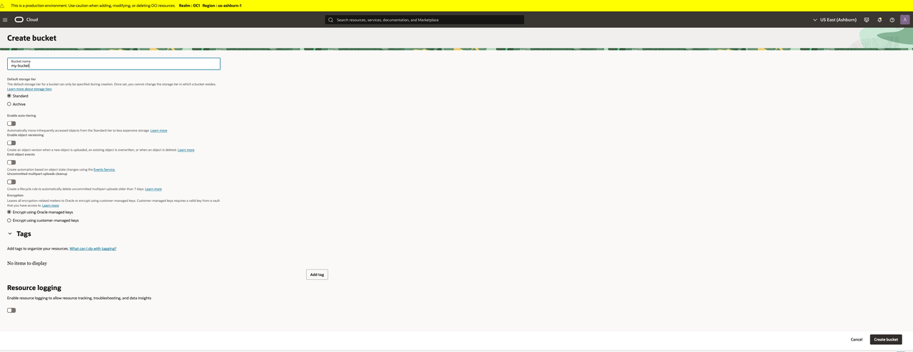

<br/>

4. Open the Bucket you just created and navigate to the **Details** tab to view the bucket namespace and OCID
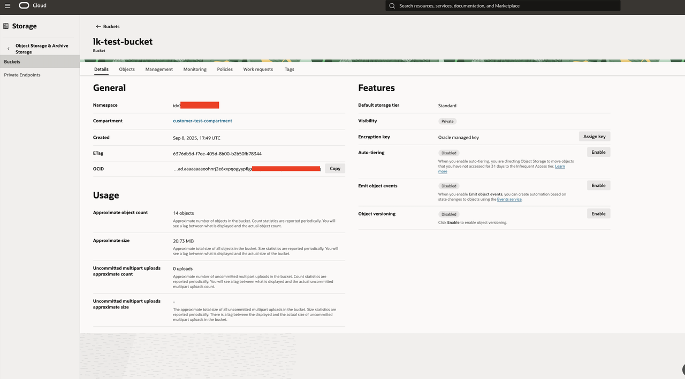

<br/>

5. Create 2 folders for the 2 pipelines we are going to be creating in the next task.

    - Navigate to your first object storage bucket
    - Click on **Actions** and click on **Create Folder**
    - Type a name for your folder but make sure it matches the folder name you used in the pipeline.

    > For this Lab you should create a folder called **knowledge_base** and another called **app-logs**. Make sure to use these names in your pipeline yaml file above.
    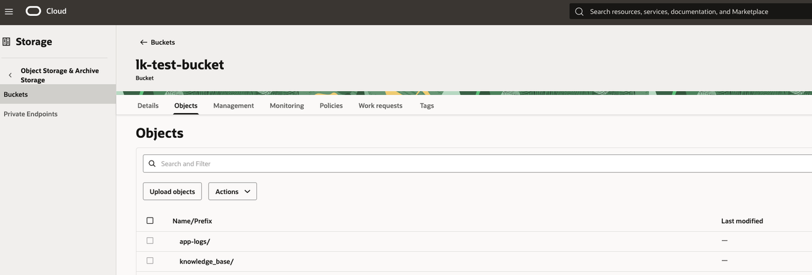


<br/><br/>

## Task 3:  Create Vault and Vault Secrets
The data prepper needs to access your cluster to stream data into your indices. When creating the pipeline, you must supply the Opensearch Credentials i.e **Username** and **password**.
These credentials need to be encrypted for security purposes. This is where the OCI Vault comes in! A vault allows your to create master encryption key to encrypt and store all your credentials which can be used by several consuming applications without compromising on security.
A vault can contain several secrets.

1. Create a Vault to store your secret credentials
    - Login to OCI console and navigate to **Vault** under **Key Management & Secret Management** service.
    <br/>

    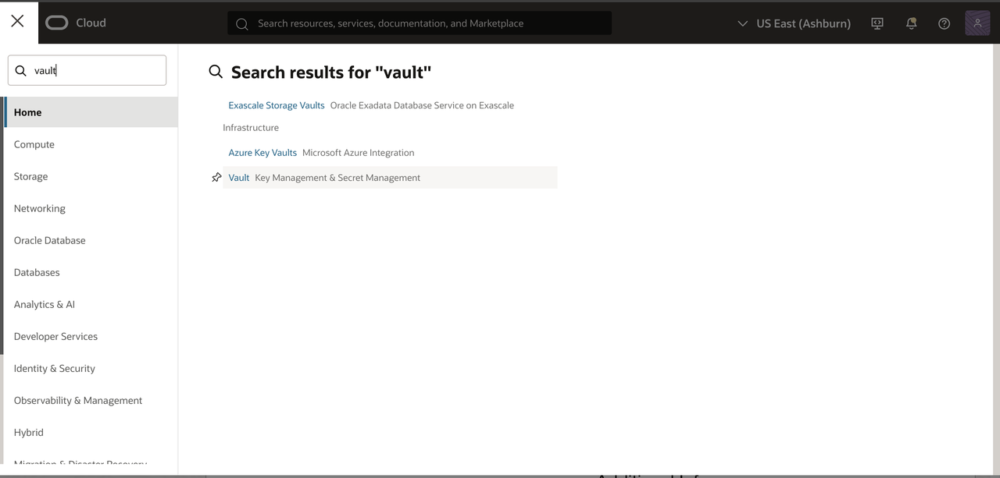
    <br/>
    - Click on **Vault** to open the Vault creation page, then Click on **Create Vault** to open the wizard.
    - Enter a Vault name and Choose the compartment, then Click **Create Vault**. Make sure to choose the same compartment as your cluster.
    <br/>

    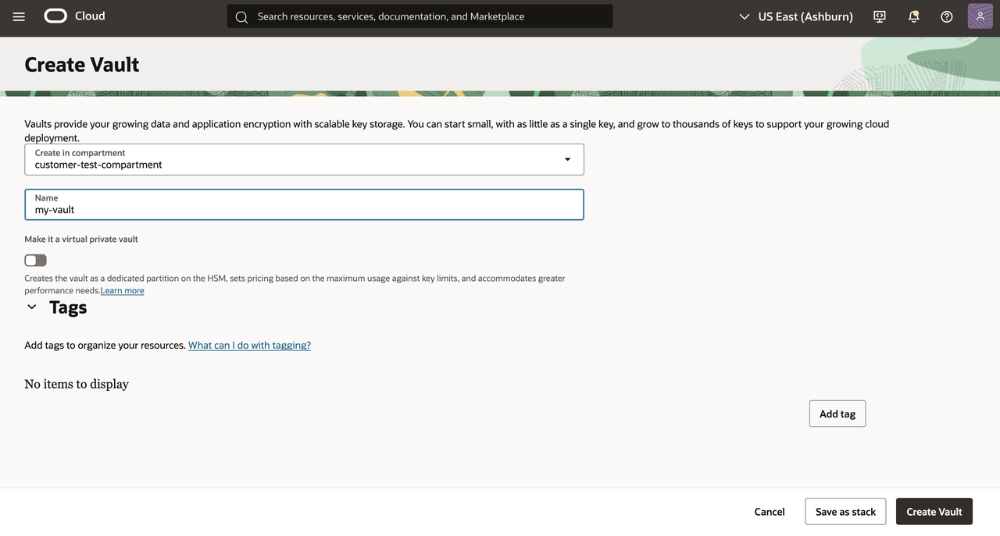

2. Create a master encryption Key to be used to encrypt your secret credentials:

    - Open the Vault you just created and navigate to the  **Master Encryption Key File** and then click on **Create Key**
    <br/>
    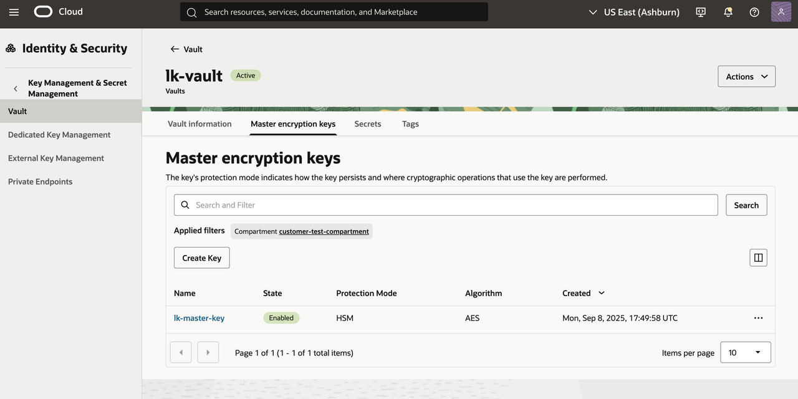
    <br/>

    - Enter the a name for your master encryption key and click **Create Key**
    <br/>
    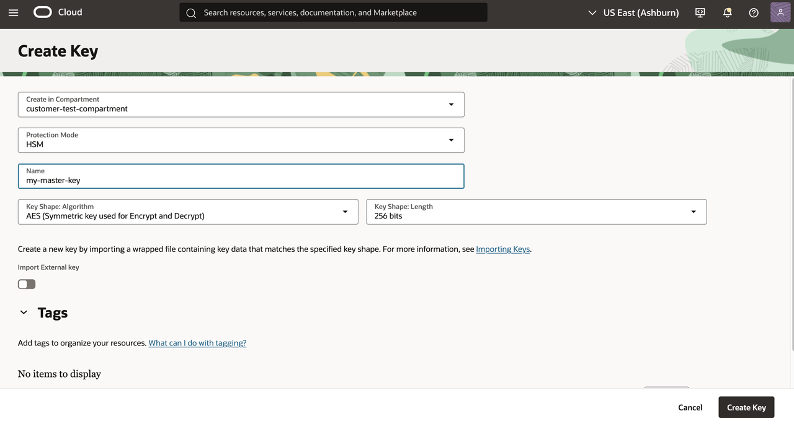
    <br/>

3. Create a  secret for your opensearch username name:

    - Open the Vault you just created  and navigate to the **Seceret** Tab
    - Click on **Create Secret** to open the Wizard
    <br/>

    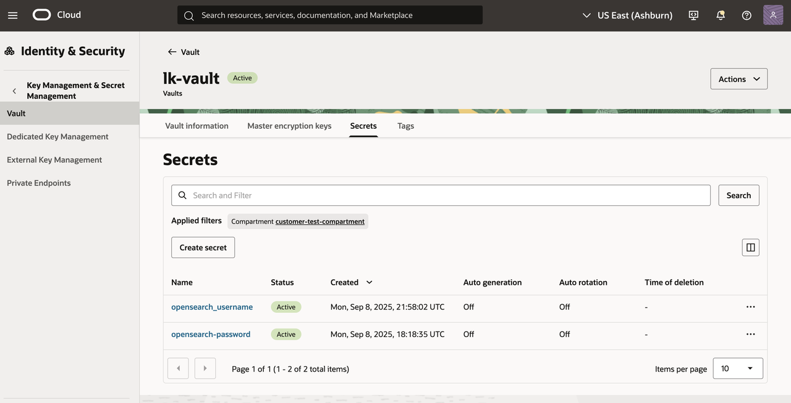

    <br/>

    - Enter a name for your secret e.g: **opensearch_username**.
    - Select **Manual Secret Generation**
    - Type your Opensearch actual username (e.g: admin1) in the **Secret Content** field. do not surround it with any quotes. This is the same username that you've been using to connect to opensearch dashboard.

    - Click **Create**

    <br/>

    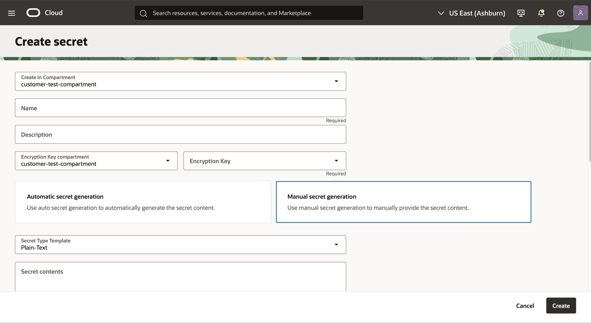

4. Create a secret for your opensearch password
Repeat step 3 above to create a secret for your opensearch password.

5. Open **opensearch-username** and **opensearch-password** secrets you just created and take note of the respective secret OCID. You will need this in the next task to create the Data Prepper Pipeline.

<br/><br/>

## Task 4:  Create A KKN index to Stream data from the Data Prepper Pipeline into your cluster
The Data Prepper requires you to specify an index into which data will be ingested. If you do not provide an index, the pipeline will by default create a simple index with the name provided in the yaml config file.

 For this Lab and for our use case, we will be creating 2 pipelines, one to stream knowledge base for a given app, and another to stream logs generate by said app so we can perform Root Cause Analysis in the subsequent Labs.

1. Create KNN index using the *simple-ingestion-pipeline* created in the previous lab. This KNN index will automatically generate embeddings for data streamed from the Data Prepper Pipeline.

```json
<copy>
PUT /app_knowledge_base
{
    "settings": {
        "index.knn": true,
        "default_pipeline": "simple-ingestion-pipeline"
    },
    "mappings": {
        "properties": {
            "embedding": {
                "type": "knn_vector",
                "dimension": 384,
                "method": {
                    "name":"hnsw",
                    "engine":"lucene",
                    "space_type": "l2",
                    "parameters":{
                        "m":512,
                        "ef_construction": 245
                    }
                }
            },
            "text": {
                "type": "text"
            }
        }
    }
}
</copy>
```

If in addition to automatically generating text embedding during ingestion, if you also want to automatically chunk your data for fine grain search, you should consider creating your index with the  *chunking-pipeline* created in the previous lab.

```json
<copy>
PUT app_knowledge_base
{
  "settings": {
    "index.knn": true,
    "default_pipeline": "chunking-pipeline"
  },
  "mappings": {
    "properties": {
      "text": {
        "type": "text"
      },
      "chunk_embedding": {
        "type": "nested",
        "properties": {
          "knn": {
            "type": "knn_vector",
            "dimension": 384
          }
        }
      }
    }
  }
}
</copy>
```

Feel free to change the  index name . You also need to be sure that the *dimension* parameter matches that of the embedding model you deployed and used in the ingestion pipeline creation.
For this Lab, we will be using the pre-trained **mini-L12** model deployed in the cluster.


<br/><br/>

## Task 5:  Create The Data Prepper Pipeline

1. Navigate to your opensearch cluster, scroll down and click on **Pipelines** in the left side bar
2. Click on **Create Pipeline**

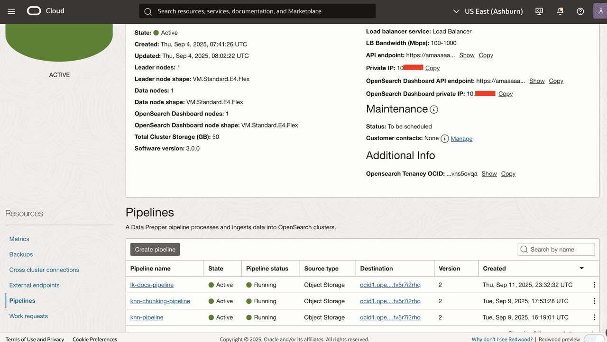

<br/>

3. Choose a name for your pipeline

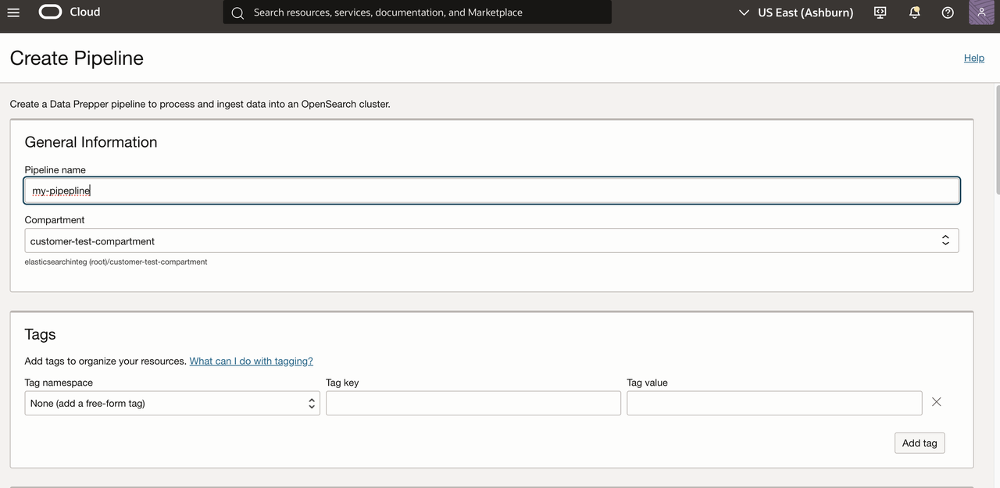
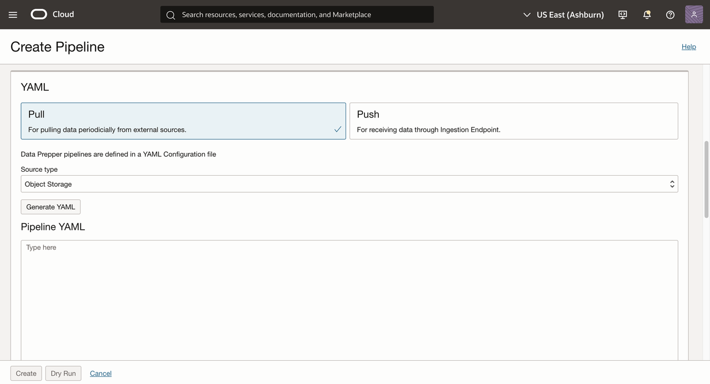


4. Scroll down and Select **Pull**, then select **Object Storage**
5. Copy & paste the following yaml config into the  **Pipeline YaML**
    field. Be sure to edit the config with the values for your **object storage bucket name, namespace, opensearch-password secret OCID, opensearch-usernane OCID** etc.

    Use the Object storage bucket where you created the 2 folders earlier. This is where you will be uploading the documents to ingest later.

<br/>

```bash
<copy>
version: 2
pipeline_configurations:
  oci:
    secrets:
      opensearch-username:
        secret_id: YOUR-OPENSERACH-USERNAME-SECRET-OCID
      opensearch-password:
        secret_id: YOUR-OPENSEARCH-PASSWORD-SECRET-OCID
simple-sample-pipeline:
  source:
    oci-object:
      codec:
        newline:
      acknowledgments: true
      compression: none
      scan:
        scheduling:
          interval: "PT30S"
        buckets:
          - bucket:
              namespace: YOUR-FIRST-BUCKET-NAMESPACE
              name: YOUR-FIRST-BUCKET-NAME
              region: REGION-KEY
              filter:
                include_prefix: ["knowledge_base"]
  processor:
    - rename_keys:
        entries:
        - from_key: "message"
          to_key: "text"
          overwrite_if_to_key_exists: true
  sink:
    - opensearch:
        hosts: [ YOUR-OPENSEARCH-OCID ]
        username: ${{oci_secrets:opensearch-username}}
        password: ${{oci_secrets:opensearch-password}}
        insecure: false
        index: app_knowledge_base

</copy>
```

> Note: If you used a different index name in the previous step, make sure you use the same index name in the yaml config.

5.  Scroll down to the **Source Coordination YAML** section and copy paste the yaml config below. Be sure to edit values for bucket-name and namespace . Note that this should be for the second bucket.

```bash
<copy>
source_coordination:
  store:
    oci-object-bucket:
      name: YOUR-SECOND-BUCKET-NAME
      namespace: YOUR-SECOND-BUCKET-NAMESPACE
</copy>
```


6. Create a second pipeline with the same yaml config as above. Only change the index name and the folder name. You can use first folder e.g **knowledge-base** for folder name in the Knowledge base pipeline and **app-logs** in the app-logs pipeline

```bash
<copy>
version: 2
pipeline_configurations:
  oci:
    secrets:
      opensearch-username:
        secret_id: YOUR-OPENSERACH-USERNAME-SECRET-OCID
      opensearch-password:
        secret_id: YOUR-OPENSEARCH-PASSWORD-SECRET-OCID
simple-sample-pipeline:
  source:
    oci-object:
      codec:
        newline:
      acknowledgments: true
      compression: none
      scan:
        scheduling:
          interval: "PT30S"
        buckets:
          - bucket:
              namespace: YOUR-FIRST-BUCKET-NAMESPACE
              name: YOUR-FIRST-BUCKET-NAME
              region: REGION-KEY
              filter:
                include_prefix: ["app-logs"]
  processor:
    - rename_keys:
        entries:
        - from_key: "message"
          to_key: "text"
          overwrite_if_to_key_exists: true
  sink:
    - opensearch:
        hosts: [ YOUR-OPENSEARCH-OCID ]
        username: ${{oci_secrets:opensearch-username}}
        password: ${{oci_secrets:opensearch-password}}
        insecure: false
        index: app_live_logs
</copy>
```


<br/>

```bash
<copy>
source_coordination:
  store:
    oci-object-bucket:
      name: YOUR-SECOND-OBJECT-STORAGE-BUCKET
      namespace: YOUR-BUCKET-NAMESPACE
</copy>
```

 <br/> <br/>

 The pipeline will take about 20min to get provisioned. Once it is completed you can upload documents into your index to trigger the pipeline.

## Task 5: Add data into your Object Storage Bucket.

1. Navigate to your first object storage bucket

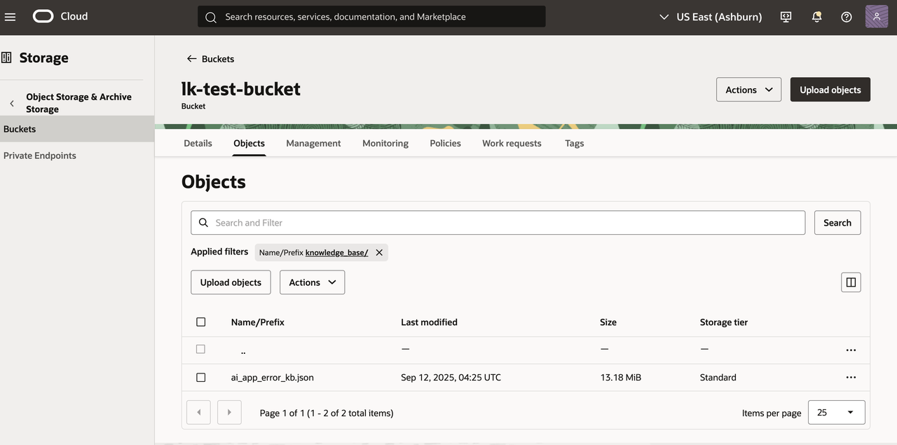

4. Download the [app-knowledge-base.ndjson](files/app_knowledge_base.ndjson) and the [app-live-logs.json](files/app-live-logs.json). Optionally download the [sample-logs.ndjson](files/sample_logs.ndjson) for additional test data.

5. Navigate to the **knowledge-base** folder in your object storage bucket, Click on **Upload Objects**  then drag and drop the *app-knowledge-base.ndjson*. Click **Next** to upload the json file in the folder. Then Click **Close** to return to the Folder.

6. Navigate to the **app-logs** folder, Click on **Upload Objects**  then drag and drop the *app-live-logs.json*. Click **Next** to upload the json file in the folder.

7. Uploading these documents into the respective folders should automatically trigger data ingestion into the index configured with the respective pipelines.


<br/><br/>

## Task 6:  Verify that the pipeline is automatically pulling data from your bucket and Ingesting it into opensearch

1. Login to your Opensearch cluster dashboard
2. Navigate to the **Dev Tools**
3. Run command below

```json
<copy>
GET app_knowledge_base/_search
{ "_source": {"excludes": ["chunk_embedding.knn","embedding"]},
  "size": 1000,
  "query": {
    "match_all": {}
  }
}
</copy>
```

You should a response like the following

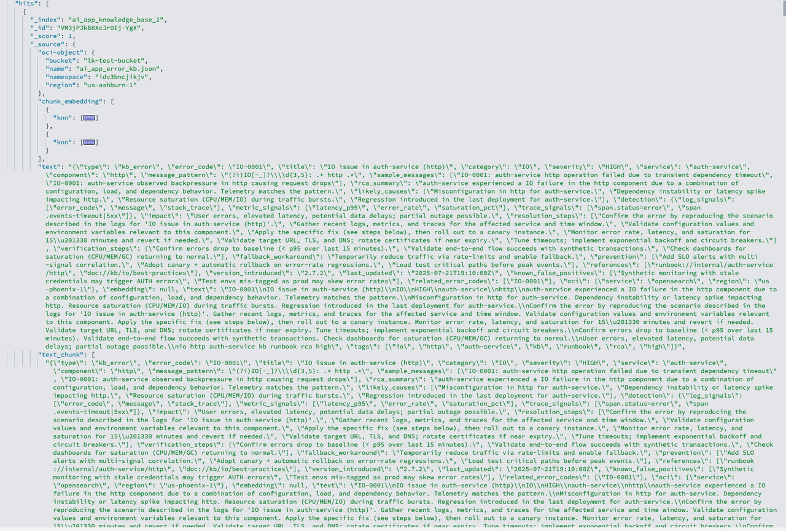


If data is not getting pulled into your index, verify that the Data Prepper is done getting provisioned.
Ideally the pipeline should be pulling the data at the frequency specified in the yaml config file. The command below indicates that the pipeline is scheduled to run every 30 Seconds.

```bash
scan:
        scheduling:
          interval: "PT30S"
```


## Acknowledgements

* **Author** - **Landry Kezebou**, Lead AI/ML Engineer, OCI Opensearch
* **Created** - September 2025
