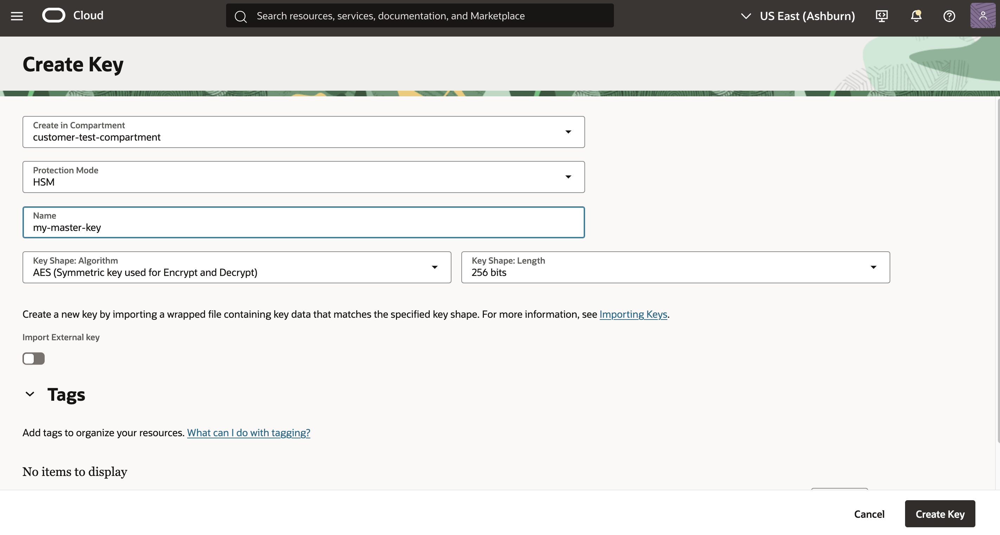
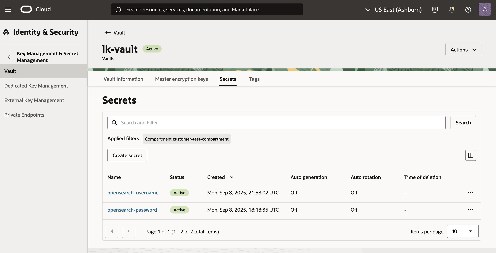

# Pre-requisites
You have to have an existing OpenSearch cluster and have to be able to connect to the Dashboard, to perform all of the steps.

## Introduction

In this lab, you will be creating a Data Prepper pipeline to automate data ingestion into you opensearch index. You can create index from scratch on re-use the KNN index created in the previous lab. You will be creating 2 pipelines. One for processing your app knowledge base, and another for streaming your app live logs. The Goal here is to be able to leverage Agentic framework to perform Root Cause Analysis (RCA) seemlessly without writing. The RCA part will be demonstrated in the next labs

Estimated Time: 30 minutes

### Objectives

In this lab, you will:

1. Create a Data Prepper pipeline to continously stream and ingest data into your cluster
2. Create an object Storage bucket to dump your logs or other data.
3. Verify that Data is getting ingested properly

<br/><br/>

## Prerequisite:
This lab assumes that you already created the opensearch index in which you will like to dump your logs.
To use the Data Prepper pipeline creation feature, you need to setup some required policies.

If you're a non-administrator in your tenancy, contact your tenancy administrators to grant these permissions to you. The administrator must update the following users permission to allow non-administrator users to manage and CRUD operations the pipelines

1. The following policy allows the administrator to grant permission for a group in a compartment (recommended)
```bash
Allow group <group> to manage opensearch-cluster-pipeline in compartment <compartment>
```
where <group> is all the users inside that group can access the resource.

2. The following policy allows OpenSearch pipelines to read the secrets from the Oracle Cloud Infrastructure Vault.

```bash
Allow group <group> to read secret-bundles in compartment <compartment> WHERE ALL {request.principal.type='opensearchpipeline', target.secret.id = '<target-secret-ocid>' }' }
Allow group <group> to read secrets in compartment <compartment> WHERE ALL {request.principal.type='opensearchpipeline', target.secret.id = '<target-secret-ocid>' }
```

3. The following policy allows OpenSearch pipelines to use a bucket from Object Storage as the source coordination persistence:

```bash
Allow group <group> to manage objects in compartment <compartment> WHERE ALL {request.principal.type='opensearchpipeline', target.bucket.name='<source-coordination-bucket-name>'}
```

> Note: Visit Our Documentation for more information about [data prepper policy configuration](https://docs.oracle.com/en-us/iaas/Content/search-opensearch/Concepts/ociopensearchpipelines.htm#required-policies)


<br/><br/>

## Task 2:  Create Object Storage buckets

Data prepper supports both the **Pull** and the **Push** functionalities to pull/stream data from various sources into the opensearch cluster, and stream data from opensearch to other sinks.  For the **Pull** we currently support multiple data sources including  Object Storage Bucket, and Kafka. Whereas for the Push we support HTTP, and OpenTelemetry.

In this Lab, we will focus the **Pull** from Object Storage bucket to stream data into our Opensearch cluster.

You need to create 2 buckets, 1 for dumping your application data, and another which the pipeline will use to track unassigned, assigned, and completed tasks.

1. Navigate to OCI Console, Click on the main menu and type **bucket**, then click on **Bucket** This should open the Object Storage bucket page.

<br/>

2. Click on **Create Bucket** button to open the Bucket Creation wizard

<br/>

3. Enter your bucket name, in the Wizard, leave everything else default, then click **Create Bucket**. This should create the Object Storage bucket.


<br/>

4. Open the Bucket you just created and navigate to the **Details** tab to view the bucket namespace and OCID


<br/><br/>

## Task 3:  Create Vault and Vault Secrets
The data prepper needs to access your cluster to stream data into your indices. When creating the pipeline, you must supply the Opensearch Credentials i.e Username and password.
These credentials need to be encrypted for security purposes. This is where the OCI Vault comes in! A vault allows your to create master encryption key to encrypt and store all your credentials which can be used by several consuming applications without compromising on security.
A vault can contain several secrets.

1. Create a Vault to store your secret credentials
    - Login to OCI console and navigate to **Vault** under **Key Management & Secret Management** service.
    
    - Click on **Create Vault**
    - Enter a Vault name and Choose the compartment and Click **Create Vault**. Make sure to choose the same compartment the compartment where the resource you want to access lives.
    

2. Create a master encryption Key to be used to encrypt your secret credentials
    - Open the Vault you just created and navigate to the  **Master Encryption Key File** and then click on **Create Key**
    

    - Enter the a name for your master encryption key and click **Create Key**
    

3. Create a username secret for your opensearch username name
    - Open the Vault you create and navigate to the **Seceret** Tab
    - Click on **Create Secret** to open the Wizard
    
    - Enter a name for your secret e.g: *opensearch_username*.
    - Select **Manual Secret Generation**
    - Type the actual username (e.g: admin1) in the **Secret Content** field. do not surround it content with any quotes.
    - Click **Create**
    

4. Create a passwrod secret for your opensearch password
Repeat step 3 above to create a secret for your opensearch password.


## Task 4:  Create The Data Prepper Pipeline


## Task 5: Add data into your Object Storage Bucket


## Task 6:  Verify that the pipeline is automatically pulling data from your bucket and Ingesting in into opensearch


## Acknowledgements

* **Author** - Landry Kezebou
* **Last Updated By/Date** - Landry Kezebou, September 2025
