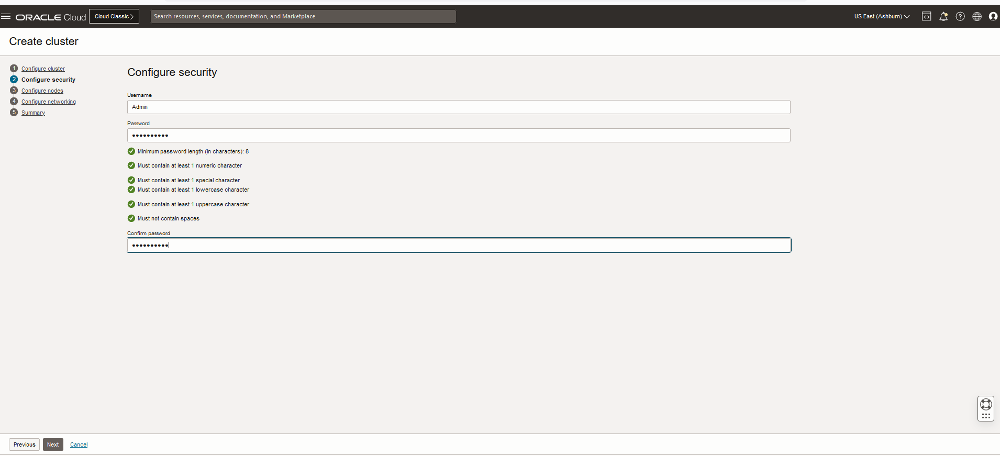
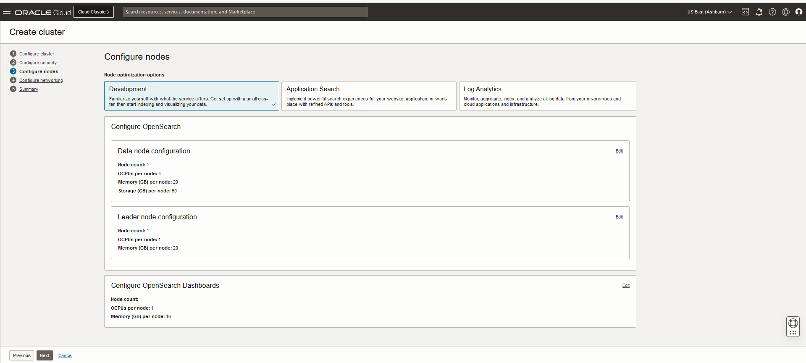
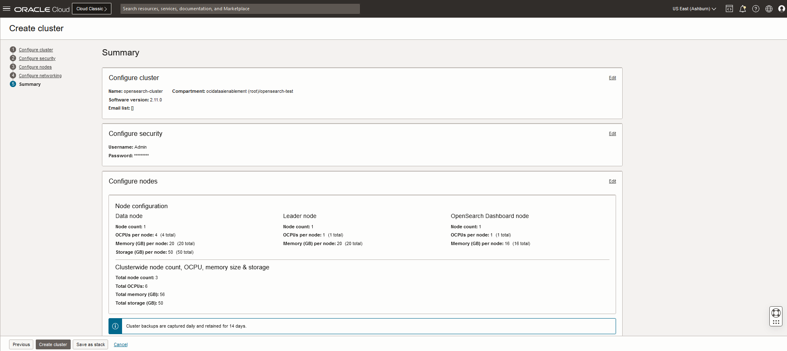
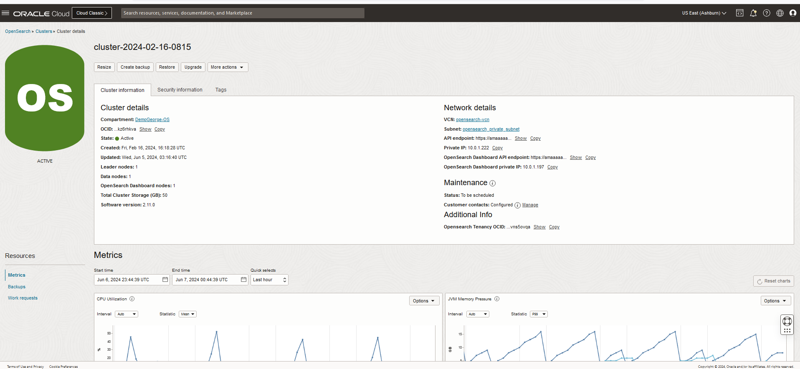

# Deploy an OCI OpenSearch cluster

## Introduction

In this lab, you will create an OCI OpenSearch cluster using the Oracle Cloud Console. 

Estimated Time: 15 minutes

### Objectives

In this lab, you will:
- Create an OCI OpenSearch cluster
- Test the connectivity to the cluster from the OCI Compute instance created in Lab 1.

## Task 1: Create an OCI Search Service cluster

1. Open the Oracle Cloud Console navigation menu. Click **Databases**, **OpenSearch**, and then click **Clusters**. Then, click **Create cluster**. Provide *opensearch-cluster* as name and select *opensearch-livelab* as the compartment where you want to create the cluster.

   

2. Click **Next**.
3. Specify Security information, and then click **Next**.

   
4. Choose the cluster sizing, and then click **Next**.

   

5. Select the VCN you created and then select the private subnet.

   

6. Review the summary and click **Create cluster**

   

7. Click **Next**, and then **Create**. You will be redirected to the OpenSearch cluster details page.

   

8. Copy your API Endpoint, as found in the cluster details page, in the Cluster information section. It will be needed in the following labs.

## Task 2: OCI OpenSearch cluster health check

1. Connect to the instance via SSH:
In oder to connec to the OpenSearch cluster, we have to crete an instance on the same subnet as the cluster and SSH to that instance first.

You can find more information [here] (https://docs.oracle.com/en-us/iaas/Content/GSG/Tasks/testingconnection.htm)

      ```bash
      <copy>ssh -i ~/.ssh/<your_ssh_key> opc@<your_VM_instance_public_IP></copy>
      ``` 

2. Run the following command, after replacing mycluster.opensearch.us.example.com with your search API endpoint:

      ```bash
      <copy>curl -XGET "https://<opensearch_private_IP>:9200/_cluster/health?pretty" -k -u <USERID:PASSWORD></copy>
      ```

   If all the steps were performed correctly you should see a response as follows:  

      ```json
{
  "cluster_name": "amaaaaaallb34niam4xh6njgo6bxsbj7qxbu6k6ojx5a73mu4mrrkz6rhkva",
  "status": "yellow",
  "timed_out": false,
  "number_of_nodes": 2,
  "number_of_data_nodes": 1,
  "discovered_master": true,
  "discovered_cluster_manager": true,
  "active_primary_shards": 41,
  "active_shards": 41,
  "relocating_shards": 0,
  "initializing_shards": 0,
  "unassigned_shards": 20,
  "delayed_unassigned_shards": 0,
  "number_of_pending_tasks": 0,
  "number_of_in_flight_fetch": 0,
  "task_max_waiting_in_queue_millis": 0,
  "active_shards_percent_as_number": 67.21311475409836
}
      ```

## Acknowledgements

* **Author** - Nuno Gonçalves
* **Last Updated By/Date** - George Csaba, June 2024
