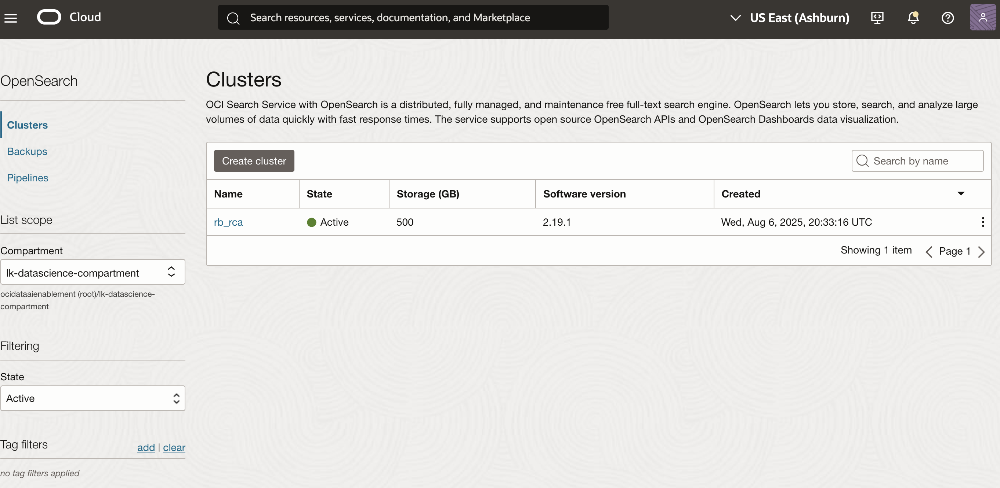
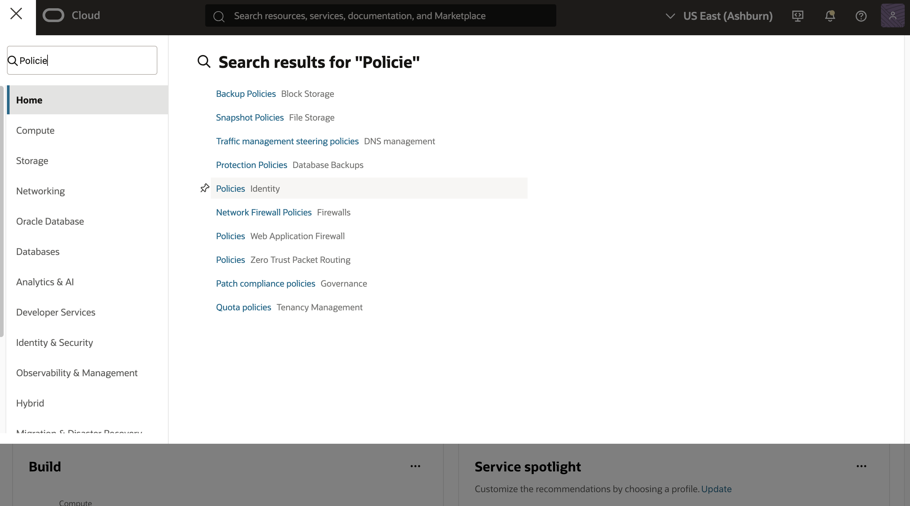
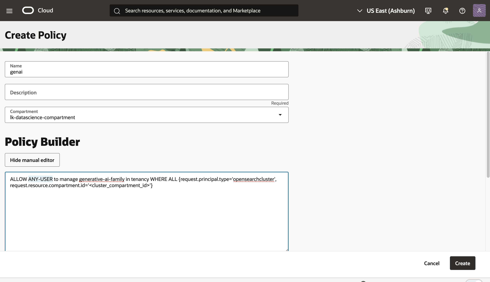

# Register & Deploy ML models, and setup NLP Ingestion Pipeline

## Introduction

In this lab, you will learn how to register and deploy both a pre-trained and remote models, and create an nlp ingestion pipelines


Estimated Time: 10 minutes

### Objectives

In this lab, you will:
1. Register and Deploy a pretrained model
2. Register and deploy a remote embedding model using GenAI connector
3. register and deploy an llm model using GenAI connector
4. Create a simple ingestion pipeline
5. Create an ingestion pipeline with automated chunking


## Task 1: Prerequisites
0. You already have to have an existing OpenSearch cluster and can connect to the Dashboard.

1. Log into OCI Console and navigate to the Opensearch Cluster. Confirm that the OpenSearch cluster is version is greater than 2.11. Ideally you want to have the latest available version.


<br/>

2. To use an OCI Generative AI connector with OCI Search with OpenSearch, you need to ensure your tenancy is subscribed to the **Chicago or Frankfurt Region**, and create policy to allow genAI manage resources in your compartment.
Create a policy to grant access to Generative AI resources:
    -  Login into console, click on the **menu** button and navigate to **Identity & Security**
    -  Select **Policies**. Click on **Create Policy**
    -  Type in policy name.
    - Click on **manual edit** type/copy paste policy below and edit accordingly.


 ```bash
   ALLOW ANY-USER to manage generative-ai-family in tenancy WHERE ALL {request.principal.type='opensearchcluster', request.resource.compartment.id='<cluster_compartment_id>'}
```

<br/>






3. Connect to Opensearch Dashboard and Update the cluster settings by running the command below. The following example command updates the applicable settings:
```bash
 PUT _cluster/settings
{
  "persistent": {
    "plugins": {
      "ml_commons": {
        "only_run_on_ml_node": "false",
        "model_access_control_enabled": "true",
        "native_memory_threshold": "99",
        "rag_pipeline_feature_enabled": "true",
        "memory_feature_enabled": "true",
        "allow_registering_model_via_local_file": "true",
        "allow_registering_model_via_url": "true",
        "model_auto_redeploy.enable":"true",
        "model_auto_redeploy.lifetime_retry_times": 10
      }
    }
  }
}
   ```

> Note: Refer to previous labs on how to access/connect to  OpenSearch dashboard


<br/><br/>

## Task 2: Register Model Group
A model group allows you to create logical grouping of ml models to control access.
You can register a model group be running the command below in your OpenSearch dashboard. Feel free to change the model Group name and description:

```bash
POST /_plugins/_ml/model_groups/_register
{
   "name": "public OCI GenAI model group",
   "description": "OCI GenAI group for remote models"
}

```

Make note of the model_group_id returned in the response:
```bash
{
  "model_group_id": "<model_group_ID>",
  "status": "CREATED"
}
```

<br/><br/>

## Task 3: [Register Pretrained model](https://docs.oracle.com/en-us/iaas/Content/search-opensearch/Tasks/semanticsearchwalkthrough.htm#register-deploy-model):

1. Register the model. You can select any model from the list of [available pre-trained models](https://docs.opensearch.org/2.19/ml-commons-plugin/pretrained-models/#sentence-transformers). Make note of the taskID

```bash
POST /_plugins/_ml/models/_register
{
  "name": "huggingface/sentence-transformers/all-MiniLM-L12-v2",
  "version": "1.0.1",
  "model_group_id": "<model_group_ID>",
  "model_format": "TORCH_SCRIPT"
}
```

Replace <model_group_ID> with the model_group_id you got from the previous step.

Expected response:
```bash
{
  "task_id": "<task_ID>",
  "status": "CREATED"
}
```
2.  Get the Task Id. Wait about 30seconds after running the command above to run the following. The below command to track the status of the model registration task. This should respond with a modelId  once registration complete.

```bash
GET /_plugins/_ml/tasks/<task_ID>
```
You can keep running the above GET command every 30 seconds until you see a response as below. Make note of the ModelID returned.
response

```bash
{
  "model_id": "<embedding_model_ID>",
  "task_type": "REGISTER_MODEL",
  "function_name": "TEXT_EMBEDDING",
  "state": "COMPLETED",
  "worker_node": [
    "f2b_8-mVRVyVqeKqsA7dcQ"
  ],
  "create_time": 1706831015570,
  "last_update_time": 1706831070740,
  "is_async": true
}
```

3. Deploy the model
run the command below to deploy the model. This should respond with a TaskID. Use this TaskID to track the model deployment task to verify that deployment is complete.
```bash
  POST /_plugins/_ml/models/<embedding_model_ID >/_deploy
```

```bash
{
  "task_id": "<task_ID>",
  "task_type": "DEPLOY_MODEL",
  "status": "CREATED"
}
```
```bash
GET /_plugins/_ml/tasks/<task_ID>
```

> Note: copy and save this model ID somewhere as you will use it later.

4. Test the model:
Once the model deployment is complete, you can test the model to make sure that embeddings are getting generated.

```bash
  POST /_plugins/_ml/_predict/text_embedding/<model_id>
    {
      "text_docs":["hellow world", "new message", "this too"]
    }

```

<br/><br/>

## Task 4: Register and Deploy Remote GenAI Embedding Model

Create the Generative AI connector as shown in the following example.
To use the Frankfurt region, simply change "endpoint": **```""endpoint": inference.generativeai.us-chicago-1.oci.oraclecloud.com"```** to
**"endpoint": "inference.generativeai.eu-frankfurt-1.oci.oraclecloud.com"** in the payload below.

**Cohere model:**

1. **[Create Connector ](https://docs.oracle.com/en-us/iaas/Content/search-opensearch/Concepts/semanticsearch.htm#register-model)**

 ```bash
POST /_plugins/_ml/connectors/_create
{
  "name": "<connector_name>",
  "description": "<connector_description>",
  "version": "2",
  "protocol": "oci_sigv1",

    "parameters": {
      "endpoint": "inference.generativeai.us-chicago-1.oci.oraclecloud.com",
      "auth_type": "resource_principal",
      "model": "<embedding_model_name>",
      "input_type":"search_document",
      "truncate": "END"
    },

     "credential": {
     },
     "actions": [
         {
             "action_type": "predict",
             "method":"POST",
             "url": "https://${parameters.endpoint}/20231130/actions/embedText",
             "request_body": "{ \"inputs\":[\"${parameters.passage_text}\"], \"truncate\": \"${parameters.truncate}\" ,\"compartmentId\": \"<compartment_ocid>\", \"servingMode\": { \"modelId\": \"${parameters.model}\", \"servingType\": \"ON_DEMAND\" } }",
             "pre_process_function": "return '{\"parameters\": {\"passage_text\": \"' + params.text_docs[0] + '\"}}';",
              "post_process_function": "connector.post_process.cohere.embedding"
         }
     ]
 }
```

Example: <embedding_model_name> the **cohere.embed-english-v3.0** model

Authentication is done using a resource principal. Specify the cluster's compartment ID in request_body.

Make note of the connector_id returned in the response:
```bash
{
  "connector_id": "<connector_ID>",
}
```

<br/>

2. **Register the Model**

Register the remote model using the Generative AI connector with the connector ID and model group ID from the previous steps, as shown in the following example:

```bash
POST /_plugins/_ml/models/_register
{
   "name": "oci-genai-conversation",
   "function_name": "remote",
   "model_group_id": "<model_group_ID>",
   "description": "test semantic",
   "connector_id": "<connector_ID>"
 }
```

Make note of the model_id returned in the response:
```bash
{
  "task_id": "<task_ID>",
  "status": "CREATED",
  "model_id": "<model_ID>"
}
```

<br/>

3.  **Deploy the Model**

Use the model ID from the previous step to deploy the model to the cluster so it can be used in any relevant subsequent tasks:

```bash
   <copy>POST /_plugins/_ml/models/<model_ID>/_deploy</copy>
```

A response similar to the following is returned:

```bash
{
  "task_id": "<task_ID>",
  "task_type": "DEPLOY_MODEL",
  "status": "COMPLETED"
}
```

4. **Test the model**

You can use the **_predict** endpoint to test remote embedding model, as shown in the following example:
```bash
POST /_plugins/_ml/models/<model_id>/_predict
  {
    "parameters":{
        "passage_text": "Testing the cohere embedding model"
    }
  }

```

<br/><br/>

## Task 6: Register and Deploy llm models
Take note of the llm model ID as this will be used in subsequent labs. Refer to[this documentation for options of model to choose from](https://docs.oracle.com/en-us/iaas/Content/search-opensearch/Concepts/ocigenaiconnector.htm#create-connector). Just copy the connector payload for the model of interest and follow steps  2 & 3 in the previous task.

1. Create Connector

```bash
POST _plugins/_ml/connectors/_create
{
     "name": "<connector_name>",
     "description": "<connector_description>",
     "version": 2,
     "protocol": "oci_sigv1",
     "parameters": {
         "endpoint": "inference.generativeai.us-chicago-1.oci.oraclecloud.com",
         "auth_type": "resource_principal"
     },
     "credential": {
     },
     "actions": [
         {
             "action_type": "predict",
             "method": "POST",
             "url": "https://${parameters.endpoint}/20231130/actions/chat",
             "request_body": "{\"compartmentId\":\"<compartment_OCID>\",\"servingMode\":{\"modelId\":\"<genai_cohere_model>\",\"servingType\":\"ON_DEMAND\"},\"chatRequest\":{\"message\":\"${parameters.prompt}\",\"maxTokens\":600,\"temperature\":1,\"frequencyPenalty\":0,\"presencePenalty\":0,\"topP\":0.75,\"topK\":0,\"isStream\":false,\"chatHistory\":[],\"apiFormat\":\"COHERE\"}}",
             "post_process_function": "def text = params['chatResponse']['text'].replace('\n', '\\\\n').replace('\"','');\n return '{\"name\":\"response\",\"dataAsMap\":{\"inferenceResponse\":{\"generatedTexts\":[{\"text\":\"' + text + '\"}]}}}'"

         }
     ]
 }
```

You can replace  <genai_cohere_model> with  **cohere.command-a-03-2025**.

<br/>

2. **Register the Model**

Register the remote model using the Generative AI connector with the connector ID and model group ID from the previous steps, as shown in the following example:

```bash
   <copy>POST /_plugins/_ml/models/_register
{
   "name": "oci-genai-conversation",
   "function_name": "remote",
   "model_group_id": "<model_group_ID>",
   "description": "test semantic",
   "connector_id": "<connector_ID>"
 }</copy>
   ```

Make note of the model_id returned in the response:
```bash
{
  "task_id": "<task_ID>",
  "status": "CREATED",
  "model_id": "<model_ID>"
}
```

<br/>

3.  **Deploy the Model**

Use the model ID from the previous step to deploy the model to the cluster.:

```bash
POST /_plugins/_ml/models/<model_ID>/_deploy
```
A response similar to the following is returned:
```bash
{
  "task_id": "<task_ID>",
  "task_type": "DEPLOY_MODEL",
  "status": "COMPLETED"
}
```


<br/><br/>

## Task 7: Create NLP Ingestion pipelines

To leverage hybrid search instead of BM25 to enrich the retriever part of the RAG pipeline, you need to setup an ingestion pipeline and specify which embedding model will be used to automatically generate vector embedding for your documents during ingestion and for your queries during search.
We will setup 2 ingestion pipelines, 1 with simple KNN index, and another with automated chunking.

1. Create simple ingestion pipeline

```bash
PUT _ingest/pipeline/simple-ingestion-pipeline
{
  "description": "pipeline for RAG demo index",
  "processors" : [
    {
      "text_embedding": {
        "model_id": "<embedding_model_ID>",
        "field_map": {
           "text": "embedding"
        }
      }
    }
  ]
}
```
This will create a pipeline called *simple-ingestion-pipeline*. For any KNN index using this pipeline, the pipeline will automatically generate vector embedding for the document's  **text** field and store the vector in a new field called **embeding** during ingestion.


2. Create Ingestion pipeline for index with automated chunking:

```bash
PUT _ingest/pipeline/chunking-pipeline
{
  "description": "A text chunking and embedding ingest pipeline",
  "processors": [
    {
      "text_chunking": {
        "algorithm": {
          "fixed_token_length": {
            "token_limit": 512,
            "overlap_rate": 0.2,
            "tokenizer": "standard"
          }
        },
        "field_map": {
          "text": "text_chunk"
        }
      }
    },
    {
      "text_embedding": {
        "model_id": "<embedding_model_ID>",
        "field_map": {
          "text_chunk": "chunk_embedding"
        }
      }
    }
  ]
}
```
replace <model_ID> with either the pre-trained modelId or the remote embedding modelID
This will create a pipeline called *chunking-pipeline* which you will use in the subsequent labs to create KNN index.

> Feel free to use any name for your NLP ingestion pipeline.

## Acknowledgements

* **Author** - **Landry Kezebou**, Lead AI/ML Engineer, OCI Opensearch
* **Last Updated By/Date** - Landry Kezebou, September 2025
