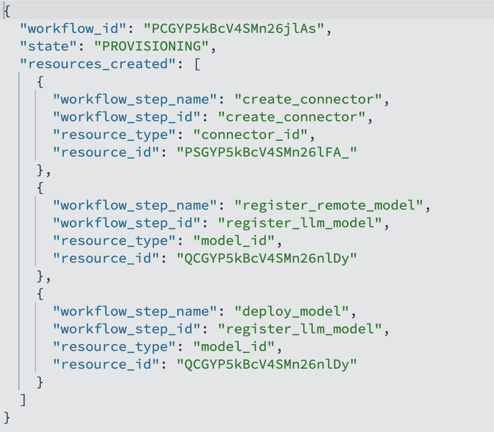

#  Flow Agents FrameWork


## Introduction

In this lab, you will learn how to leverage the flow framework to build AI agent in very simple steps with as minimal configurations as possible.

**Estimated Time: 15 minutes**

### Objectives

In this lab, you will:

- Understand what a Flow Framework is
- Create Various Flow Agent using Flow Framework
- Understand how Flow Framework can simplify Agentic app development


## Pre-requisites
- You have an OpenSearch Cluster
- You have Create a data prepper pipeline and streamed app data into a KNN index in your cluster. Or simply have a KNN index with any type of test data of your choice.


<br/><br/>

## Task 1: Creating a Flow Framework

Our latest Flow Framework provides **ready-made templates** that orchestrate multi-step ML provisioning. With minimal input, it assembles complex assets—like chat models and conversational flow agents —while still allowing experts users override default configurations.

In a manual setup, building a production-ready chat/RAG agent typically requires almost a dozen error-prone steps as you have experienced in all the previous labs leading to this one:

1. Create a model group

2. Deploy an embedding model

3. Create an ingestion pipeline

4. Create a k-NN index

5. Create a connector with the right payload for RAG (auth, endpoints, params)

6. Deploy an LLM model for RAG

7. Create a RAG pipeline

8. Create conversation memory (storage, retention, keys)

9. Deploy an LLM model with configurations for flow-agent pipelines

10. Register multiple agent tools e.g:** RAGTool, VectorDBTool, PPLTool, MLmodelTool, SearchIndexTool, ListIndexTool** etc.

11. Create a flow agent and select tools

12. Execute the agent

Every one of these steps has dozens of knobs (IDs, dimensions, index names, credentials, tokenizer limits, timeouts, post-processors). It’s easy to enter a wrong parameter or misconfigure a payload—leading to frustration and hours of debugging that slow development velocity.

The Flow Framework reduces this to a single POST using a template. It supplies sensible defaults for a working end-to-end pipeline, while allowing you to override any field when needed.

```json
<copy>
POST /_plugins/_flow_framework/workflow?use_case=<USE_CASE_NAME>&provision=true
{
  "<REQUIRED_FIELD_1>": "<VALUE>",
  "<REQUIRED_FIELD_2>": "<VALUE>",
  ...
  "<OVERRIDDEN_FIELD_1>": "<VALUE>",
  "<OVERRIDDEN_FIELD_2>": "<VALUE>"
}
</copy>
```

For example, if you want your Cohere chat model to use 1000 max tokens instead of the default 600, just include:

```json
"create_connector.parameters.max_tokens": 1000
```

After invoking the workflow, track progress and outputs with the status API:

```json
<copy>
GET /_plugins/_flow_framework/workflow/<WORKFLOW_ID>/_status
</copy>
```



<br/><br/>

## Task 2: Use Case 1 — RAG Agent with No Preexisting Index

#### What this provisions:

- Model Group
- Connector to OCI Generative AI
- Generative Model
- Embedding Model
- Ingest Pipeline
- Index (with embeddings)
- RAG Tool
- Agent

#### How it works:
The Agent calls the RAG Tool, which:
1. Uses the Embedding Model to embed the query,
2. Searches the newly created Index, and
3. Asks the Generative Model to answer using the retrieved context.

#### Minimal payload fields:
- Cluster compartment OCID
- The input field (document text) to embed into the new index
- The output field (vector field) to store embeddings in the new index

<br/>

#### Create the workflow:

```json
<copy>
POST /_plugins/_flow_framework/workflow?use_case=rag_agent_with_cohere_and_pretrained_model&provision=true
{
  "create_connector.compartment_id": "<COMPARTMENT_ID>",
  "text_embedding.field_map.input": "<INPUT_FIELD>",
  "text_embedding.field_map.output": "<OUTPUT_FIELD>"
}
</copy>
```

This provisions a minimal RAG Agent that searches the document input field and generates an answer grounded in the retrieved content.

Response:

```json
{
  "workflow_id": "Wh_NUJkBi6TSXBeiG2X8"
}
```

Get the Workflow Status

```json
<copy>
GET /_plugins/_flow_framework/workflow/Wh_NUJkBi6TSXBeiG2X8/_status
</copy>
```

Response:

```json
<copy>
{
  "workflow_id": "Wh_NUJkBi6TSXBeiG2X8",
  "state": "COMPLETED",
  "resources_created": [
    {
      "resource_type": "connector_id",
      "resource_id": "XR_NUJkBi6TSXBeiHWVI",
      "workflow_step_name": "create_connector",
      "workflow_step_id": "create_connector"
    },
    {
      "resource_type": "model_id",
      "resource_id": "YB_NUJkBi6TSXBeiHWWe",
      "workflow_step_name": "register_remote_model",
      "workflow_step_id": "register_llm_model"
    },
    {
      "resource_type": "model_id",
      "resource_id": "YB_NUJkBi6TSXBeiHWWe",
      "workflow_step_name": "deploy_model",
      "workflow_step_id": "register_llm_model"
    },
    {
      "resource_type": "model_id",
      "resource_id": "CFvNUJkByMGuFCObHU_s",
      "workflow_step_name": "register_local_pretrained_model",
      "workflow_step_id": "register_pretrained_embedding_model"
    },
    {
      "resource_type": "model_id",
      "resource_id": "CFvNUJkByMGuFCObHU_s",
      "workflow_step_name": "deploy_model",
      "workflow_step_id": "register_pretrained_embedding_model"
    },
    {
      "resource_type": "pipeline_id",
      "resource_id": "msmarco-distilbert-base-tas-b-ingest-pipeline",
      "workflow_step_name": "create_ingest_pipeline",
      "workflow_step_id": "create_ingest_pipeline"
    },
    {
      "resource_type": "index_name",
      "resource_id": "rag-search-index",
      "workflow_step_name": "create_index",
      "workflow_step_id": "create_index"
    },
    {
      "resource_type": "agent_id",
      "resource_id": "Yh_NUJkBi6TSXBei4WVa",
      "workflow_step_name": "register_agent",
      "workflow_step_id": "rag_agent"
    }
  ]
}
</copy>
```


#### Add data to the index
Since you choose the **template without pre-existing index**, the workflow will automatically create a knn index for you and you can directly add data into that index. You will see the indexname in the output of the workflow. You can control what name to give your index and what field name to give your input text and output embedding vector field.

```json
<copy>
POST _bulk
{"index": {"_index": "rag-search-index", "_id": "1"}}
{"input": "Chart and table of population level and growth rate for the Ogden-Layton metro area from 1950 to 2023. United Nations population projections are also included through the year 2035.\nThe current metro area population of Ogden-Layton in 2023 is 750,000, a 1.63% increase from 2022.\nThe metro area population of Ogden-Layton in 2022 was 738,000, a 1.79% increase from 2021.\nThe metro area population of Ogden-Layton in 2021 was 725,000, a 1.97% increase from 2020.\nThe metro area population of Ogden-Layton in 2020 was 711,000, a 2.16% increase from 2019."}
{"index": {"_index": "rag-search-index", "_id": "2"}}
{"input": "Chart and table of population level and growth rate for the New York City metro area from 1950 to 2023. United Nations population projections are also included through the year 2035.\\nThe current metro area population of New York City in 2023 is 18,937,000, a 0.37% increase from 2022.\\nThe metro area population of New York City in 2022 was 18,867,000, a 0.23% increase from 2021.\\nThe metro area population of New York City in 2021 was 18,823,000, a 0.1% increase from 2020.\\nThe metro area population of New York City in 2020 was 18,804,000, a 0.01% decline from 2019."}
{"index": {"_index": "rag-search-index", "_id": "3"}}
{"input": "Chart and table of population level and growth rate for the Chicago metro area from 1950 to 2023. United Nations population projections are also included through the year 2035.\\nThe current metro area population of Chicago in 2023 is 8,937,000, a 0.4% increase from 2022.\\nThe metro area population of Chicago in 2022 was 8,901,000, a 0.27% increase from 2021.\\nThe metro area population of Chicago in 2021 was 8,877,000, a 0.14% increase from 2020.\\nThe metro area population of Chicago in 2020 was 8,865,000, a 0.03% increase from 2019."}
{"index": {"_index": "rag-search-index", "_id": "4"}}
{"input": "Chart and table of population level and growth rate for the Miami metro area from 1950 to 2023. United Nations population projections are also included through the year 2035.\\nThe current metro area population of Miami in 2023 is 6,265,000, a 0.8% increase from 2022.\\nThe metro area population of Miami in 2022 was 6,215,000, a 0.78% increase from 2021.\\nThe metro area population of Miami in 2021 was 6,167,000, a 0.74% increase from 2020.\\nThe metro area population of Miami in 2020 was 6,122,000, a 0.71% increase from 2019."}
{"index": {"_index": "rag-search-index", "_id": "5"}}
{"input": "Chart and table of population level and growth rate for the Austin metro area from 1950 to 2023. United Nations population projections are also included through the year 2035.\\nThe current metro area population of Austin in 2023 is 2,228,000, a 2.39% increase from 2022.\\nThe metro area population of Austin in 2022 was 2,176,000, a 2.79% increase from 2021.\\nThe metro area population of Austin in 2021 was 2,117,000, a 3.12% increase from 2020.\\nThe metro area population of Austin in 2020 was 2,053,000, a 3.43% increase from 2019."}
{"index": {"_index": "rag-search-index", "_id": "6"}}
{"input": "Chart and table of population level and growth rate for the Seattle metro area from 1950 to 2023. United Nations population projections are also included through the year 2035.\\nThe current metro area population of Seattle in 2023 is 3,519,000, a 0.86% increase from 2022.\\nThe metro area population of Seattle in 2022 was 3,489,000, a 0.81% increase from 2021.\\nThe metro area population of Seattle in 2021 was 3,461,000, a 0.82% increase from 2020.\\nThe metro area population of Seattle in 2020 was 3,433,000, a 0.79% increase from 2019."}
</copy>
```


<br/>

#### Execute/Invoke the Agent:

The Agent_ID can be retrieved from the workflow by tracking the status using the WorkflowID as discussed above. Make sure to track the status of the workflow until it says **COMPLETE**.

```json
<copy>
POST /_plugins/_ml/agents/Yh_NUJkBi6TSXBei4WVa/_execute
{
  "parameters": {
    "search": "What was the population increase in 2023",
    "question": "Can you analyze population growth data and provide evidence for population increase in 2023?"
  }
}}
</copy>
```

Response:

```json
<copy>
{
  "inference_results": [
    {
      "output": [
        {
          "name": "response",
          "result": """Yes, according to the provided context, the metro area population of New York City in 2023 experienced a slight increase of 0.37% compared to the previous year, 2022. This growth is evident in the data, which shows a population of 18,937,000 in 2023, up from 18,867,000 in 2022.

Similarly, for Miami, the population data indicates a consistent growth trend. In 2023, Miami's metro area population reached 6,265,000, representing a 0.8% increase from the 2022 population of 6,215,000. This growth rate is higher than the previous year's 0.78% increase."""
        }
      ]
    }
  ]
}}
</copy>
```


<br/>

#### Separating search text from the user’s question (optional):

If you want the Agent to search with one string but ask the LLM a different question, add this parameter to the workflow and then provide both at agent execution time:

```json
<copy>
POST /_plugins/_flow_framework/workflow?use_case=rag_agent_with_cohere_and_pretrained_model&provision=true
{
  "create_connector.compartment_id": "<COMPARTMENT_ID>",
  "text_embedding.field_map.input": "input",
  "text_embedding.field_map.output": "output",
  "rag_tool.parameters.input": "${parameters.search}"
}
</copy>
```


<br/><br/>

## Task 3:    Use Case 2 — RAG Agent with Pre-existing Index

#### What this provisions:

- Model Group
- Connector to OCI Generative AI
- Generative Model
- RAG Tool
- Agent

#### When to use:
You already have a semantic/neural search index (with an embedding pipeline). This workflow layers a RAG Agent on top of it. In this use case you can use the *app-knowledge-base* knn index we created in the previous labs.
If using an existing KNN index, you should make sure that to pass the model embedding model ID that your used in the ingestion pipeline to ingest data into your index.
The embedding field name should also map the index configuration.

#### Required inputs (in addition to Case 1 fields):
- **rag-tool.index-name**: the existing index name used for RAG search
- **rag-tool.embedding-model-id**: the embedding model ID used by that index’s pipeline

#### Create the workflow:

```json
<copy>
POST /_plugins/_flow_framework/workflow?use_case=rag_agent_with_cohere_and_existing_index&provision=true
{
  "create_connector.compartment_id": "<COMPARTMENT_ID>",
  "text_embedding.field_map.input": "<INPUT_FIELD>",
  "text_embedding.field_map.output": "<OUTPUT_FIELD>",
  "rag_tool.index_name": "<INDEX_NAME>",
  "rag_tool.embedding_model_id": "<EMBEDDING_MODEL_ID>"
}
</copy>
```

Example for indexname=*app_knowledge_base*, text field =*text*, and output embedding field =*embedding*:


```json
<copy>
POST /_plugins/_flow_framework/workflow?use_case=rag_agent_with_cohere_and_existing_index&provision=true
{
  "create_connector.compartment_id": "<COMPARTMENT_ID>",
  "text_embedding.field_map.input": "text",
  "text_embedding.field_map.output": "embedding",
  "rag_tool.index_name": "app_knowledge_base",
  "rag_tool.embedding_model_id": "VaSmT5kBLyBOyptyHqop"
}
</copy>
```

You can similarly configure this template to separate search from question (add rag_tool.parameters.input like in Case 1 and pass parameters.search at agent execution).


Track the Workflow to make sure it completed successfully:

```json
<copy>
GET /_plugins/_flow_framework/workflow/vhD5UJkBvU0MbCzM3Qh0/_status
</copy>
```

Response:

```json

{
  "workflow_id": "vhD5UJkBvU0MbCzM3Qh0",
  "state": "COMPLETED",
  "resources_created": [
    {
      "resource_type": "connector_id",
      "resource_id": "vxD5UJkBvU0MbCzM3Qiy",
      "workflow_step_name": "create_connector",
      "workflow_step_id": "create_connector"
    },
    {
      "resource_type": "model_id",
      "resource_id": "wRD5UJkBvU0MbCzM3Qjr",
      "workflow_step_name": "register_remote_model",
      "workflow_step_id": "register_llm_model"
    },
    {
      "resource_type": "model_id",
      "resource_id": "wRD5UJkBvU0MbCzM3Qjr",
      "workflow_step_name": "deploy_model",
      "workflow_step_id": "register_llm_model"
    },
    {
      "resource_type": "agent_id",
      "resource_id": "wxD5UJkBvU0MbCzM3ggM",
      "workflow_step_name": "register_agent",
      "workflow_step_id": "rag_agent"
    }
  ]
}

```


Retrieve the AgentID from tracking the Workflow  and execute the Agent.

```json
<copy>
POST /_plugins/_ml/agents/wxD5UJkBvU0MbCzM3ggM/_execute
{
  "parameters": {
    "search": "how to resolve error_code: IO-0001",
    "question": "I'm seeing the following error in logs in my app, how can I resolve them?"
  }
}
</copy>
```


Response:

```json
{
  "inference_results": [
    {
      "output": [
        {
          "name": "response",
          "result": """The context you provided includes information about two types of errors:

**USER-0639: User issue in gateway-api (deserialization)**
- **Root Cause**: gateway-api experienced a USER failure in the deserialization component due to a combination of configuration, load, and dependency behavior.
- **Resolution Steps**:
    1. Confirm the error by reproducing the scenario described in the logs for 'USER issue in gateway-api (deserialization)'.
    2. Gather recent logs, metrics, and traces for the affected service and time window.
    3. Validate configuration values and environment variables relevant to this component.
    4. Apply the specific fix (see steps below), then roll out to a canary instance.
    5. Monitor error rate, latency, and saturation for 15–30 minutes and revert if needed.
    6. Validate target URL, TLS, and DNS; rotate certificates if near expiry.
    7. Tune timeouts; implement exponential backoff and circuit breakers.
- **Verification Steps**:
    1. Confirm errors drop to baseline (< p95 over last 15 minutes).
    2. Validate end-to-end flow succeeds with synthetic transactions.
    3. Check dashboards for saturation (CPU/MEM/GC) returning to normal.
- **Fallback Workaround**: Temporarily reduce traffic via rate-limits and enable fallback.

**API-2598: API issue in auth-service (cache)**
- **Root Cause**: auth-service experienced an API failure in the cache component due to a combination of configuration, load, and dependency behavior.
- **Resolution Steps**:
    1. Confirm the error by reproducing the scenario described in the logs for 'API issue in auth-service (cache)'.
    2. Gather recent logs, metrics, and traces for the affected service and time window.
    3. Validate configuration values and environment variables relevant to this component.
    4. Apply the specific fix (see steps below), then roll out to a canary instance.
    5. Monitor error rate, latency, and saturation for 15–30 minutes and revert if needed.
    6. Validate target URL, TLS, and DNS; rotate certificates if near expiry.
    7. Tune timeouts; implement exponential backoff and circuit breakers.
- **Verification Steps**:
    1. Confirm errors drop to baseline (< p95 over last 15 minutes).
    2. Validate end-to-end flow succeeds with synthetic transactions.
    3. Check dashboards for saturation (CPU/MEM/GC) returning to normal.
- **Fallback Workaround**: Temporarily reduce traffic via rate-limits and enable fallback.

To resolve these errors, you should follow the provided resolution steps for each issue. Start by confirming the errors, gathering relevant data, and validating configurations. Then, apply the specific fixes and monitor the system's behavior. The context does not provide the specific fixes,"""
        }
      ]
    }
  ]
}
```


<br/><br/>

## Task 4:  Use Case 3 - Conversational Agent over Cluster Data

### What this provisions:

- Model Group
- Connector to OCI Generative AI
- Generative Model
- PPLTool
- ListIndexTool
- Conversational Agent

#### What it does:
Creates an Agent that can discover indices and run PPL queries to answer natural-language questions about data already in the cluster.
Create the workflow (only needs the cluster compartment OCID):

```json
<copy>
POST /_plugins/_flow_framework/workflow?use_case=conversational_agent_with_cohere&provision=true
{
  "create_connector.compartment_id": "<YOUR_COMPARTMENT_OCID>"
}
</copy>
```

Response:

```json
{
  "workflow_id": "Yx8DUZkBi6TSXBeij2Ur"
}
```

Track the workflow using the Workflow ID


```json
{
  "workflow_id": "Yx8DUZkBi6TSXBeij2Ur",
  "state": "COMPLETED",
  "resources_created": [
    {
      "resource_type": "connector_id",
      "resource_id": "ZB8DUZkBi6TSXBeij2V_",
      "workflow_step_name": "create_connector",
      "workflow_step_id": "create_connector"
    },
    {
      "resource_type": "model_id",
      "resource_id": "Zh8DUZkBi6TSXBeij2W4",
      "workflow_step_name": "register_remote_model",
      "workflow_step_id": "register_llm_model"
    },
    {
      "resource_type": "model_id",
      "resource_id": "Zh8DUZkBi6TSXBeij2W4",
      "workflow_step_name": "deploy_model",
      "workflow_step_id": "register_llm_model"
    },
    {
      "resource_type": "agent_id",
      "resource_id": "aB8DUZkBi6TSXBeij2Xc",
      "workflow_step_name": "register_agent",
      "workflow_step_id": "register_conversational_agent"
    }
  ]
}

```


#### Execute the Agent:

```json
<copy>
POST /_plugins/_ml/agents/<AGENT_ID>/_execute
{
  "parameters": {
    "question": "Can you query index opensearch_dashboards_sample_data_ecommerce to find how many orders occurred between 4 AM and 9 PM on 3/24/2025?",
    "verbose": false,
    "selected_tools": ["PPLTool", "ListIndexTool"]
  }
}
</copy>
```

Response:

```json
{
  "inference_results": [
    {
      "output": [
        {
          "name": "memory_id",
          "result": "DT4GUZkBg7ITr_ywKJVl"
        },
        {
          "name": "parent_interaction_id",
          "result": "Dj4GUZkBg7ITr_ywKJWM"
        },
        {
          "name": "response",
          "dataAsMap": {
            "response": """```json\n{\n    thought: I need to use the PPLTool to query the index and find the number of orders within the specified time range.,\n    action: PPLTool,\n    action_input: { \index\: \opensearch_dashboards_sample_data_ecommerce\, \question\: \Select count of orders where order_date is between 2025-03-24T04:00:00 and 2025-03-24T21:00:00\ }\n}\n```""",
            "additional_info": {}
          }
        }
      ]
    }
  ]
}
```


<br/><br/>

## Task 5: Available Flow Framework Templates For Other Use Cases
To minimize friction, we’re providing you 12 ready-made template JSON files you can copy and run as-is. Each template wraps a full multi-step workflow behind a single POST call, while still letting you override key fields when needed.

In the templates, any placeholder like ${{input}} (or values referenced via ${parameters.*}) can be supplied at workflow invocation to override defaults.
Caution: Some fields are foundational and generally should not be changed, because they’re required for the underlying resources to interoperate correctly.
Below is a list of fields you can configure in your Flow Framework Template:

  1. 'create_connector.version'

  2. 'create_connector.protocol'

  3. 'create_connector.parameters.endpoint'

  4. 'create_connector.actions.url'

  5. 'create_connector.actions.request_body'

  6. 'create_connector.actions.pre_process_function'

  7. 'create_connector.actions.post_process_function'

  8. 'rag_tool.parameters.prompt'

  9. 'rag_tool.parameters.tenant_id'

  10. 'rag_agent.prompt'

  11. 'register_conversational_agent.memory.type'

  12. 'register_conversational_agent.type'

  13. 'register_conversational_agent.app_type'


If you need non-default behavior, prefer adding explicit override fields (e.g., max-tokens, temperature, index-name, embedding-field) rather than altering core wiring.


Flow Framework Templates:

1. [files/conversational-agent-with-cohere-model-template.json](files/conversational-agent-with-cohere-model-template.json)
2. [files/conversational-agent-with-llama-model-template.json](files/conversational-agent-with-llama-model-template.json)
3. [files/conversational-agent-with-openai-3-model-template.json](files/conversational-agent-with-openai-3-model-template.json)
4. [files/conversational-agent-with-openai-4-model-template.json](files/conversational-agent-with-openai-4-model-template.json)
5. [files/rag-agent-with-cohere-and-existing-index-template.json](files/rag-agent-with-cohere-and-existing-index-template.json)
6. [files/rag-agent-with-cohere-and-pretrained-embedding-model-template.json](files/rag-agent-with-cohere-and-pretrained-embedding-model-template.json)
7. [files/rag-agent-with-llama-and-existing-index-template.json](files/rag-agent-with-llama-and-existing-index-template.json)
8. [files/rag-agent-with-llama-and-pretrained-embedding-model-template.jsonxt](files/rag-agent-with-llama-and-pretrained-embedding-model-template.json)
9. [files/rag-agent-with-openai-3-and-existing-index-template.json](files/rag-agent-with-openai-3-and-existing-index-template.json)
10. [files/rag-agent-with-openai-3-and-pretrained-embedding-model-template.json](files/rag-agent-with-openai-3-and-pretrained-embedding-model-template.json)
11. [files/rag-agent-with-openai-4-and-existing-index-template.json](files/rag-agent-with-openai-4-and-existing-index-template.json)
12. [files/rag-agent-with-openai-4-and-pretrained-embedding-model-template.json](files/rag-agent-with-openai-4-and-pretrained-embedding-model-template.json)


<br/><br/>

## Why these templates matter

Manually assembling a production-ready chat/RAG agent often spans almost a dozen fragile steps (model group; embedding model; ingest pipeline; k-NN index; connector; RAG LLM; RAG pipeline; conversation memory; LLM for flow-agents; tool registration; agent creation; execution). Each step introduces dozens of parameters and surface area for mistakes—leading to frustration and hours of debugging.

Flow Framework templates compress all of that to a single POST per use case, with sensible defaults and targeted overrides so you can iterate faster and avoid the most common misconfigurations.


## Acknowledgements

* **Author** - **Landry Kezebou**, Lead AI/ML Engineer, OCI Opensearch
* **Co-Author** June Desai
* **Created** - September 2025
