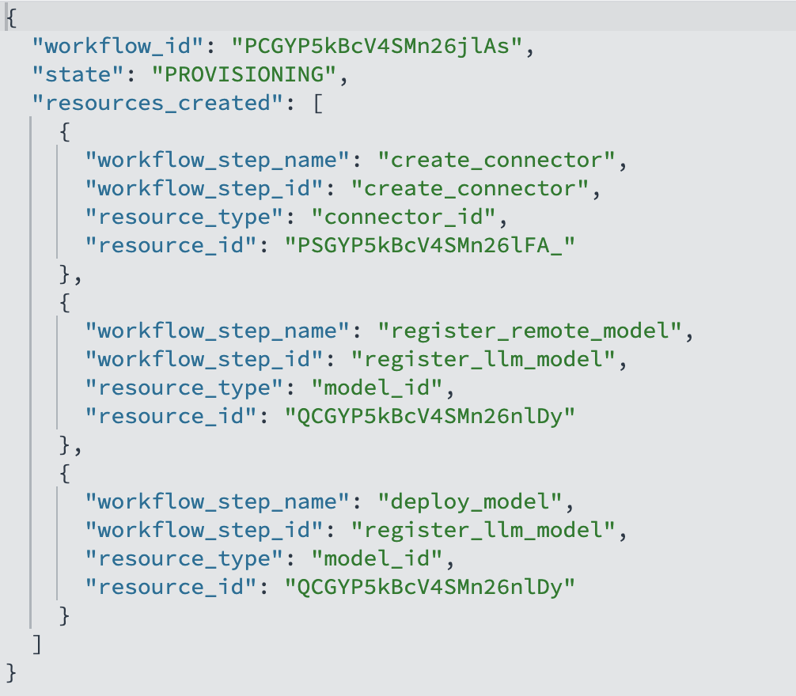

# Pre-requisites
- You have an OpenSearch Cluster
- You have Create a data prepper pipeline and streamed app data into your cluster in a KNN index. Or simply have a KNN index with any type of test data of your choice.

## Introduction


In this lab, you will learn how to leverage the flow framework to build AI agent in very simple steps with as minimal configurations as possible.

Estimated Time: 15 minutes

### Objectives

In this lab, you will:

- Understand what a Flow Framework is
- Create Various Flow Agent using Flow Framework
- Understand how Flow Framework can simplify Agentic app development


## Task 1: Creating a Flow Framework
Our latest Flow Framework provides **ready-made templates** that orchestrate multi-step ML provisioning. With minimal input, it assembles complex assets—like chat models and conversational flow agents —while still allowing experts users override default configurations.
In a manual setup, building a production-ready chat/RAG agent typically requires almost a dozen error-prone steps as you have experienced in all the previous labs leading to this one:

1. Create a model group

2. Deploy an embedding model

3. Create an ingestion pipeline

4. Create a k-NN index

5. Create a connector with the right payload for RAG (auth, endpoints, params)

6. Deploy an LLM model for RAG

7. Create a RAG pipeline

8. Create conversation memory (storage, retention, keys)

9. Deploy an LLM model with configurations for flow-agent pipelines

10. Register multiple agent tools e.g:** RAGTool, VectorDBTool, PPLTool, MLmodelTool, SearchIndexTool, ListIndexTool** etc.

11. Create a flow agent and select tools

12. Execute the agent

Every one of these steps has dozens of knobs (IDs, dimensions, index names, credentials, tokenizer limits, timeouts, post-processors). It’s easy to enter a wrong parameter or misconfigure a payload—leading to frustration and hours of debugging that slow development velocity.

The Flow Framework reduces this to a single POST using a template (use_case). It supplies sensible defaults for a working end-to-end pipeline, while allowing you to override any field when needed.

```bash
POST /_plugins/_flow_framework/workflow?use_case=<USE_CASE_NAME>&provision=true
{
  "<REQUIRED_FIELD_1>": "<VALUE>",
  "<REQUIRED_FIELD_2>": "<VALUE>",
  ...
  "<OVERRIDDEN_FIELD_1>": "<VALUE>",
  "<OVERRIDDEN_FIELD_2>": "<VALUE>"
}

```

For example, if you want your Cohere chat model to use 1000 max tokens instead of the default 600, just include:

```bash
"create_connector.parameters.max_tokens": 1000
```

After invoking the workflow, track progress and outputs with the status API:
```bash
GET /_plugins/_flow_framework/workflow/<WORKFLOW_ID>/_status
```



<br/><br/>

## Task 2: Use Case 1 — RAG Agent with No Preexisting Index

#### What this provisions:

- Model Group
- Connector to OCI Generative AI
- Generative Model
- Embedding Model
- Ingest Pipeline
- Index (with embeddings)
- RAG Tool
- Agent

#### How it works:
The Agent calls the RAG Tool, which:
1. uses the Embedding Model to embed the query,
2. searches the newly created Index, and
3. asks the Generative Model to answer using the retrieved context.

Minimal payload fields:
- Cluster compartment OCID
- The input field (document text) to embed into the new index
- The output field (vector field) to store embeddings in the new index

<br/>

#### Create the workflow:

```bash
POST /_plugins/_flow_framework/workflow?use_case=rag_agent_with_cohere_and_pretrained_model&provision=true
{
  "create_connector.compartment_id": "<COMPARTMENT_ID>",
  "text_embedding.field_map.input": "<INPUT_FIELD>",
  "text_embedding.field_map.output": "<OUTPUT_FIELD>"
}

```
This provisions a minimal RAG Agent that searches the document input field and generates an answer grounded in the retrieved content.

<br/>

#### Separating search text from the user’s question (optional):
If you want the Agent to search with one string but ask the LLM a different question, add this parameter to the workflow and then provide both at agent execution time:

Workflow (adds tool input indirection):

```bash
POST /_plugins/_flow_framework/workflow?use_case=rag_agent_with_cohere_and_pretrained_model&provision=true
{
  "create_connector.compartment_id": "ocid1.compartment.oc1..aaaaaaaayxkbos7zkio4jk7sawovt7phmz3plakrsvfyxcseewtbqbgvzrxq",
  "text_embedding.field_map.input": "input",
  "text_embedding.field_map.output": "output",
  "rag_tool.parameters.input": "${parameters.search}"
}

```

Invoke the Agent:

```bash
POST /_plugins/_ml/agents/<AGENT_ID>/_execute
{
  "parameters": {
    "search": "<CONTEXT_TO_SEARCH>",
    "question": "<QUESTION_FOR_LLM>"
  }
}
```


<br/><br/>

## Task 3: Case 2 — RAG Agent with Preexisting Index

#### What this provisions:

- Model Group
- Connector to OCI Generative AI
- Generative Model
- RAG Tool
- Agent

#### When to use:
You already have a semantic/neural search index (with an embedding pipeline). This workflow layers a RAG Agent on top of it.

#### Required inputs (in addition to Case 1 fields):
- rag_tool.index_name: the existing index name used for RAG search
- rag_tool.embedding_model_id: the embedding model ID used by that index’s pipeline

#### Create the workflow:

```bash
POST /_plugins/_flow_framework/workflow?use_case=rag_agent_with_cohere_and_existing_index&provision=true
{
  "create_connector.compartment_id": "<COMPARTMENT_ID>",
  "text_embedding.field_map.input": "<INPUT_FIELD>",
  "text_embedding.field_map.output": "<OUTPUT_FIELD>",
  "rag_tool.index_name": "<INDEX_NAME>",
  "rag_tool.embedding_model_id": "<EMBEDDING_MODEL_ID>"
}

```
You can similarly configure this template to separate search from question (add rag_tool.parameters.input like in Case 1 and pass parameters.search at agent execution).


<br/><br/>

## Task 4: Conversational Agent over Cluster Data

### What this provisions:

- Model Group
- Connector to OCI Generative AI
- Generative Model
- PPLTool
- ListIndexTool
- Conversational Agent

#### What it does:
Creates an Agent that can discover indices and run PPL queries to answer natural-language questions about data already in the cluster.

Create the workflow (only needs the cluster compartment OCID):

```bash
POST /_plugins/_flow_framework/workflow?use_case=conversational_agent_with_cohere&provision=true
{
  "create_connector.compartment_id": "ocid1.compartment.oc1..aaaaaaaayxkbos7zkio4jk7sawovt7phmz3plakrsvfyxcseewtbqbgvzrxq"
}
```

#### Invoke Agent:

```bash
POST /_plugins/_ml/agents/<AGENT_ID>/_execute
{
  "parameters": {
    "question": "Can you query index opensearch_dashboards_sample_data_ecommerce to find how many orders occurred between 4 AM and 9 PM on 3/24/2025?",
    "verbose": false,
    "selected_tools": ["PPLTool", "ListIndexTool"]
  }
}
```


<br/><br/>

## Task 5: Available Flow Framework Templates
To minimize friction, we’re providing you 12 ready-made template JSON files you can copy and run as-is. Each template wraps a full multi-step workflow behind a single POST call, while still letting you override key fields when needed.

In the templates, any placeholder like ${{input}} (or values referenced via ${parameters.*}) can be supplied at workflow invocation to override defaults.
Caution: Some fields are foundational and generally should not be changed, because they’re required for the underlying resources to interoperate correctly.
Below is a list of fields you can configure in your Flow Framework Template:

        - create_connector.version

        - create_connector.protocol

        - create_connector.parameters.endpoint

        - create_connector.actions.url

        - create_connector.actions.request_body

        - create_connector.actions.pre_process_function

        - create_connector.actions.post_process_function

        - rag_tool.parameters.prompt

        - rag_tool.parameters.tenant_id

        - rag_agent.prompt

        - register_conversational_agent.memory.type

        - register_conversational_agent.type

        - register_conversational_agent.app_type

If you need non-default behavior, prefer adding explicit override fields (e.g., max_tokens, temperature, index_name, embedding_field) rather than altering core wiring.


Flow Framework Templates:

1. [files/conversational-agent-with-cohere-model-template.json](files/conversational-agent-with-cohere-model-template.json)
2. [files/conversational-agent-with-llama-model-template.json](files/conversational-agent-with-llama-model-template.json)
3. [files/conversational-agent-with-openai-3-model-template.json](files/conversational-agent-with-openai-3-model-template.json)
4. [files/conversational-agent-with-openai-4-model-template.json](files/conversational-agent-with-openai-4-model-template.json)
5. [files/rag-agent-with-cohere-and-existing-index-template.json](files/rag-agent-with-cohere-and-existing-index-template.json)
6. [files/rag-agent-with-cohere-and-pretrained-embedding-model-template.json](files/rag-agent-with-cohere-and-pretrained-embedding-model-template.json)
7. [files/rag-agent-with-llama-and-existing-index-template.json](files/rag-agent-with-llama-and-existing-index-template.json)
8. [files/rag-agent-with-llama-and-pretrained-embedding-model-template.jsonxt](files/rag-agent-with-llama-and-pretrained-embedding-model-template.json)
9. [files/rag-agent-with-openai-3-and-existing-index-template.json](files/rag-agent-with-openai-3-and-existing-index-template.json)
10. [files/rag-agent-with-openai-3-and-pretrained-embedding-model-template.json](files/rag-agent-with-openai-3-and-pretrained-embedding-model-template.json)
11. [files/rag-agent-with-openai-4-and-existing-index-template.json](files/rag-agent-with-openai-4-and-existing-index-template.json)
12. [files/rag-agent-with-openai-4-and-pretrained-embedding-model-template.json](files/rag-agent-with-openai-4-and-pretrained-embedding-model-template.json)


<br/><br/>

## Why these templates matter

Manually assembling a production-ready chat/RAG agent often spans almost a dozen fragile steps (model group; embedding model; ingest pipeline; k-NN index; connector; RAG LLM; RAG pipeline; conversation memory; LLM for flow-agents; tool registration; agent creation; execution). Each step introduces dozens of parameters and surface area for mistakes—leading to frustration and hours of debugging.

Flow Framework templates compress all of that to a single POST per use case, with sensible defaults and targeted overrides so you can iterate faster and avoid the most common misconfigurations.


## Acknowledgements

* **Author** - Landry Kezebou
