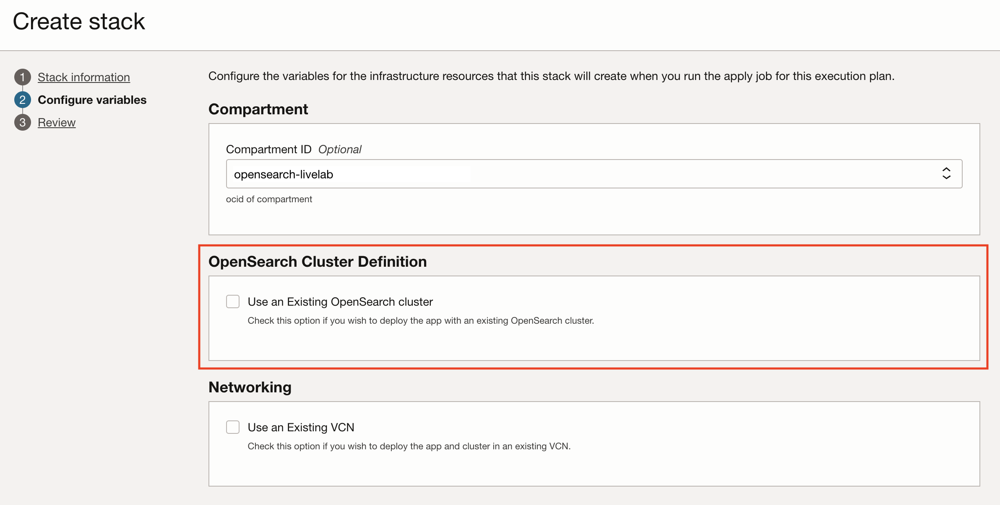
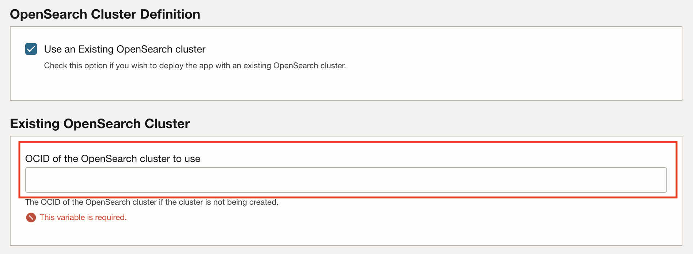
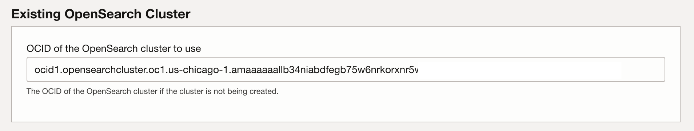
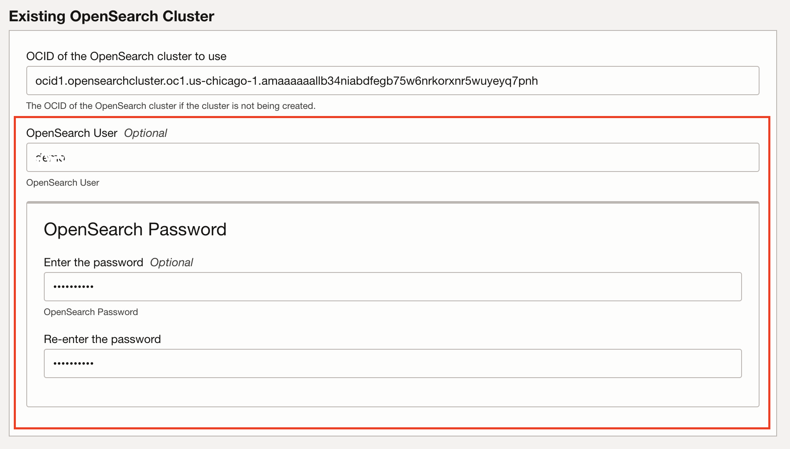
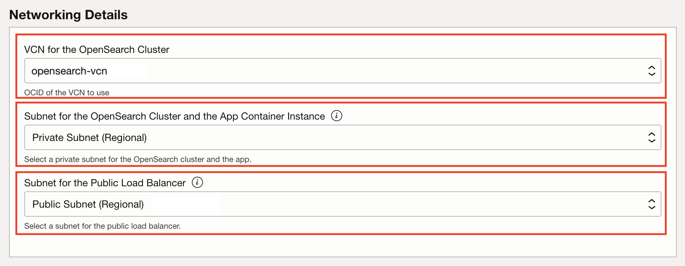
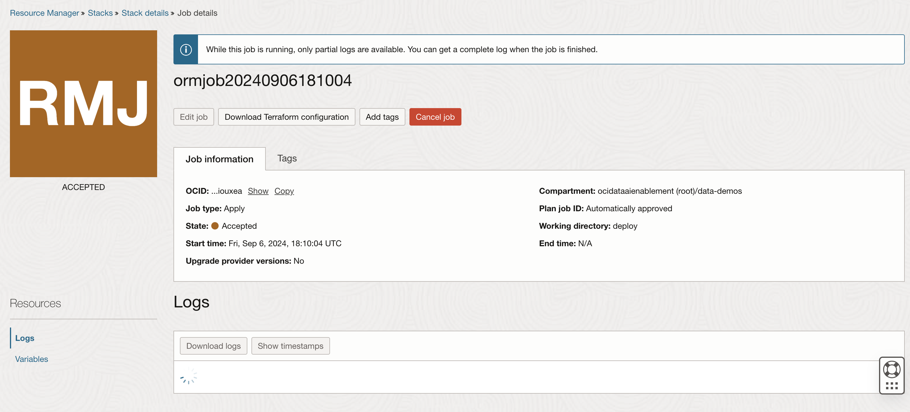
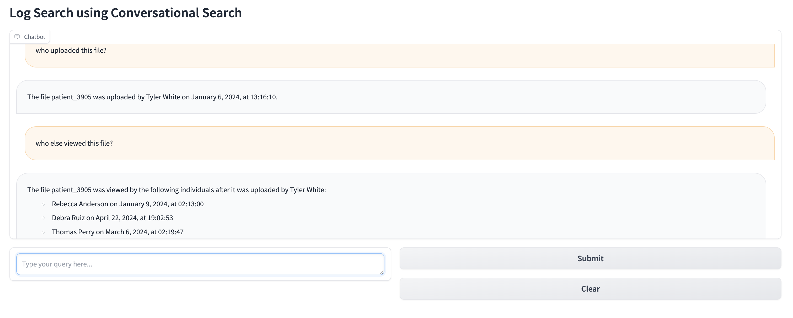

# Pre-requisites

## Introduction

In this lab, you can launch a pre-built demo of the semantic search and conversational search utilizing a RAG pipeline.
To build it yourself step-by-step, you can skip to the next lab.

Estimated Time: 15 minutes

### Objectives

In this lab, you will:

- Deploy the Conversational Search Demo application via the Resource Manager. 

The stack deploys a new VCN (if needed) a new cluster (if needed), the application (in a container inastance), and a load balancer.

## Step 1: Prerequisites

In this deployment, you can deploy a complete stack, creating a new VCN, new OpenSearch cluster, and deploying the app. The cluster takes some time to deploy, so if you already deployed the OpenSearch cluster in previous steps, you can opt to use the existing cluster.

Confirm that the OpenSearch cluster is version 2.11. 

To use an OCI Generative AI connector with OCI Search with OpenSearch, you need a cluster configured to use OpenSearch version 2.11. 

By default, new clusters are configured to use version 2.11. To create a cluster, see Creating an OpenSearch Cluster.

Please refer to **LAB2** **Task3** on how to connect to the OpenSearch Dashboard.

You will also need a subscription to the Chicago or Frankfurt regions, which host the OCI GenAI infrastructure.

## Step 2: Launch the Demo Stack

The stack consists in a terraform script launched via Resource Manager.

Click the following link to get started: 

<a href="https://cloud.oracle.com/resourcemanager/stacks/create?zipUrl=https://objectstorage.us-chicago-1.oraclecloud.com/p/pzndeC45z4x_hSvQXWbmHETsui97i7ihHYd0U-Uahhjb8UWjxpzGpzjk3iCAcJAv/n/idehhejtnbtc/b/opensearch-demo-code/o/opensearch-convo.zip">Conversation Search Demo App Stack</a>

## Step 3: Acknowledge Terms and Conditions

First, acknowledge the Terms and Conditions for using the stack.

## Step 4: Select the Compartment

Select the compartment to use. For this livelab, the `opensearch-livelab` compartment should be used, so the cluster can be re-used.

Click **Next** at the bottom of the page.

## Step 5: Select the OpenSearch Cluster

If you do not select any option, the stack will deploy a new VCN, a new OpenSearch cluster and the application. If you have stood up the OpenSearch cluster earlier, re-using will allow deploying the stack in a few minutes only, while a new cluster deployment may take up to 30min.

Here we will re-use the cluster.

**Click** the checkbox to **Use an Existing OpenSearch cluster***

You will be prompted to enter the OCID of the OpenSearch cluster.

## Step 6: Find the OpenSearch Cluster OCID

- Duplicate your browser tab so you can easily return to the stack configuration, and in the new tab go to **Databases -> OpenSearch -> Clusters** to find the already deployed cluster

- **Select** the cluster `opensearch_cluster` created earlier.

- **Copy** the OCID of the cluster from the **Cluster Details**.

- **Paste** the OCID in the Demo Stack configuration tab

## Step 7: Enter the Username and Password For the Cluster

- **Enter** the **user** and **password** you specified at the time of cluster creation.

## Step 8: Configure Networking Information

The application needs to be deployed in the same VCN and subnet as the cluster, so you will be prompted to enter the VCN and subnet information.

**Note: It is important to select the correct VCN for the cluster, and the proper private and public subnets.**

If you followed the labs from the start, you should only have 1 VCN in the compartment, as well as 1 private subnet and 1 public subnet.

- Select the VCN. Make sure this is the VCN where the OpenSearch cluster was deployed.

- Select the **private** subnet for the application.

- Select the **public** subnet for the load balancer.

## Step 9: Deploy

**Click** the **Next** button at the bottom of the page to start the deployment.

The Stack will deploy and show logs

## Step 10: Find the Application URL

- Once done, the stack switches to green.

- At this point, you can go look at the **outputs** to find the deployment URL

- Alternatively you can scroll all the way down the logs to find the URL, or look for the load balancer (under Network -> Load Balancers) to find the public IP.

- **Copy** the URL, and paste it in you browser

## Step 11: Interact With the Application

You should see the application interface in your browser. If it doesn't show right away, wait a minute or two. The application loads and embeds data at start up, which can take a couple minutes.

The dataset here consists of file events from object storage. Files were uploaded, viewed and/or deleted by various users. Use the search to find out what files were uploaded, viewed or deleted, when and by whom.

You can ask questions like:

- Tell me about the files that were deleted.
- Who uploaded file patient_3905?
- Who viewed it?
- Who deleted file patient_20926?
- etc...

To learn more about how this works, you can now proceed to the next lab, which guides you through the process the app uses step-by-step.

## Step 12: Troubleshooting the Deployment

- When accessing the URL, the page shows error 402 Bad Gateway:
    - Give it a minute or two before reloading the page: when the app loads, it ingests the demo data which may take a couple minutes, before the app is effectively started.

- After several minutes, the page still shows error 402 Bad Gateway:
    - Check the application logs: 
        - Search the menu for Container Instances
        - Look up the Container instance created by the stack, named `opensearch-demo-YYYY`.
        - Select the container `opensearch-demo-YYY` in the resources menu (bottom left)
        - Open the logs, and look for latest error if any.

        There may be auth error 401 trying to authenticate to the cluster: this indicates that wrong credentials were provided. You can open the stack and look at variables. There you can choose to Edit variables and update the credentials, then re-apply the stack.

        There may be 409 errors with rate limit exceeded. This is normal as long as the 500 demo data records get ingested. However if the startup process never finishes, and the last logs don't indicate the app was started, something went wrong during ingestion.

        Timeout during ingestion may indicate the VCN configuration is wrong. If the VN was created with the wizard, it should have a public and private subnets, with an Internet Gateway on the public subnet, and a Service Gateway and NAT gateway in the private subnet. You should also have created a security list to open port 9200 for OpenSearch API.

If you can't figure what may be wrong, feel free to contact us with the contact button, and please provide the full app log in your email.

## Acknowledgements

* **Author** - Emmanuel Leroy
* **Last Updated By/Date** - Emmanuel Leroy, September 2024
