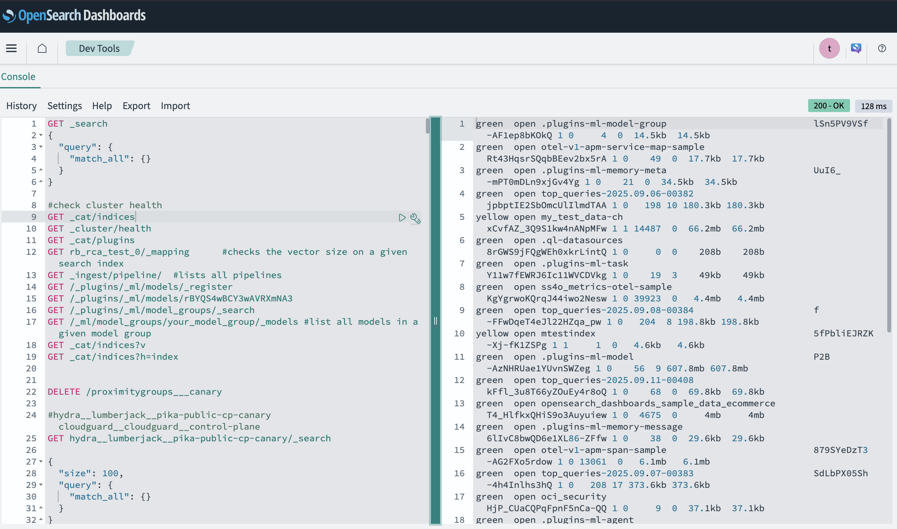
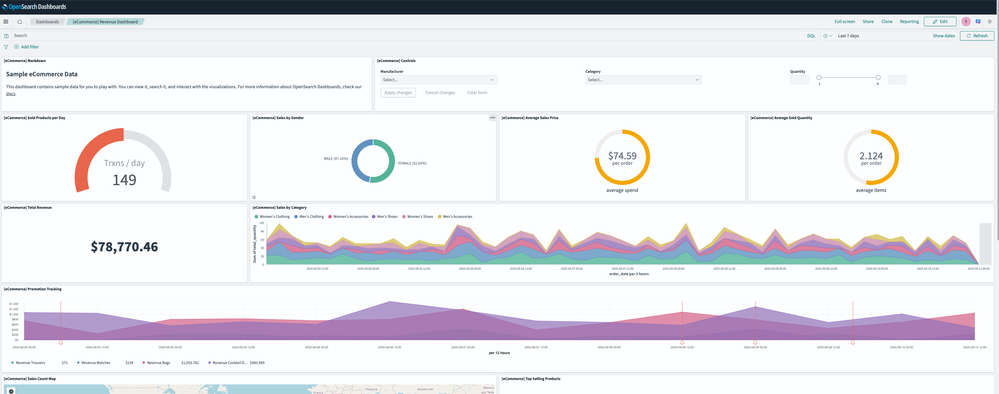
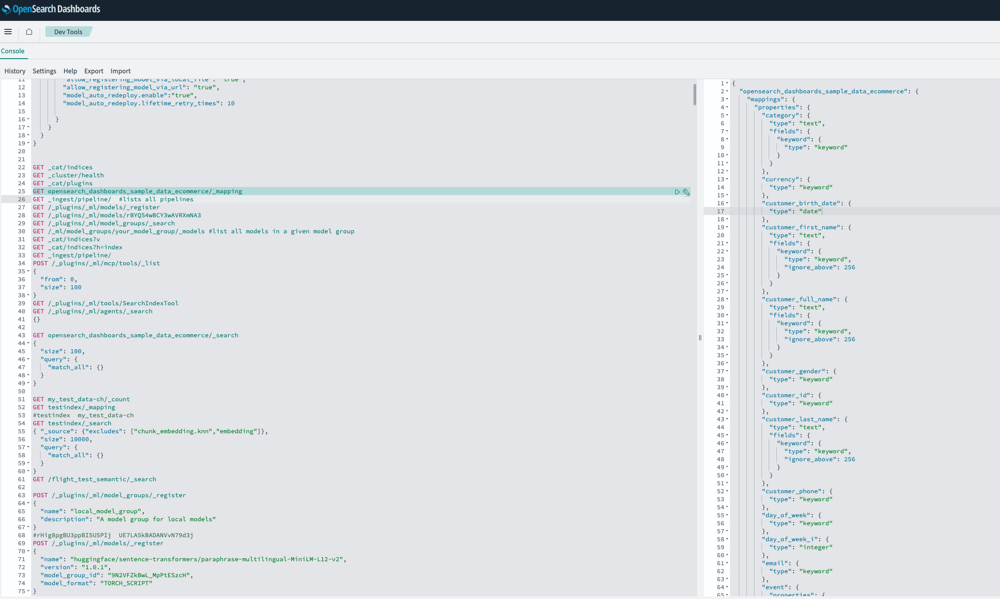

# Load & Visualize Opensearch Sample Data

## Introduction

In this lab you will learn how to ingest Opensearch Sample data from the Opensearch dashboard into your cluster and how to visualize the your data.
This data will also be used in subsequent labs to demonstrate other functionalities such as *Semantic Search*, *RAG*, *AI Agents*, *Flow Agents* and *advanced observability*.

**Estimated Time: 10 minutes**

### Objectives

In this lab, you will:

- Add data samples into your opensearch cluster
- Visualize the data
- Query the Data

## Prerequisites: Connect to OpenSearch Dashboards

1. From your local machine, establish port forwarding. Refer to the documentation on [how to connect to opensearch dashboard](https://docs.oracle.com/en/learn/oci-opensearch/index.html#task-3-test-the-connection-to-oci-search-service--opensearch-endpoint) for more information.


```powershell
<copy>
ssh -C -v -t -L 127.0.0.1:5601:<your_opensearch_dashboards_private_IP>:5601 -L 127.0.0.1:9200:<your_opensearch_private_IP>:9200 opc@<your_VM_instance_public_IP> -i ~/.ssh/id_rsa
</copy>
```
<br />

2. Access *https://localhost:5601* in your browser.
   > **Note:** Currently, depending on the browser, a warning message similar to "Your connection is not private" is displayed. Choose the option which allows you to proceed. The following screen is then displayed:

<br /><br />


## Task 1: Ingest/Load the Sample data into your cluster

1. Connect to Opensearch dashboard by port forwarding from you local via the compute instance as discussed in the previous labs.
<br/>


<br /><br />

2. Click on the **Add sample data** button on your dashboard. This will open a new page where you can see various data samples. Simply click on **Add** button to automatically create an index with the sample data name and  ingest this data into your opensearch cluster. Ingestion will only take a few seconds to complete. You can load any or all of the data samples into your cluster. You can also click on  **delete** to delete data sample index from your cluster.


3. To validate that the sample data indices you added are successfully created in your cluster, click on the **menu** button, then scroll down and Click on **Dev Tools** to open the dev environment where you can run commands. Run the commands below to list the indices on your cluster and verify that the data sample name is present in the list of indices.

```bash
<copy>
GET _cat/indices
<copy/>
```





<br /><br />

## Task 2: Visualize your data

To visualize the data
1. Click on the **Home** button on your dashboard
2. Click on **Add data**
3. Select the sample data of interest then Click  on **View Data** and this will load the visualization dashboard for that index.




> Tip: The visualization tool allows you to gain insights into your data and you can customize it to suit your needs. You can also create multiple visualization dashboards on the same index.


<br /><br />

## Task 3: Query The data

1. First view the Index mapping by running the command below. Feel free to replace `opensearch_dashboards_sample_data_ecommerce` with your index of choice

```bash
<copy>
GET opensearch_dashboards_sample_data_ecommerce/_mapping
</copy>
```




<br />

2. Perform a simple `match_all` query on the data

```bash
<copy>
GET opensearch_dashboards_sample_data_ecommerce/_search
    {
    "query": {
        "match_all": {}
    }
    }
</copy>
```


3. Perform Keyword/BM25 Search:
the BM25 Search allows you to perform keyword search on your data to retrieve relevant documents. BM25 can be configured to search on a single or multiple fields/metadata concurrently.

You can also apply *pre-filters* and *post-filters* to control the search output.

Examples:

- Simple BM25 query:

```bash
<copy>
GET opensearch_dashboards_sample_data_ecommerce/_search
{
"query": {
    "bool": {
    "should": [
        { "match": { "products.product_name": "Sweatshirt" } },
        {
        "match_phrase": {
            "products.product_name": {
            "query": "Sweatshirt",
            "slop": 2
            }
        }
        }
    ],
    "minimum_should_match": 1
    }
}
}
}
</copy>
```

- Complex BM25 Query:

```bash
<copy>
GET opensearch_dashboards_sample_data_ecommerce/_search
{
"size": 10,
"_source": [
    "order_id","order_date","customer_full_name",
    "products.product_name","manufacturer","category",
    "taxful_total_price","currency"
],
"query": {
    "bool": {
    "must": [
        {
        "multi_match": {
            "query": "wireless headphones",
            "type": "best_fields",
            "operator": "and",
            "fields": [
            "products.product_name^3",
            "category^2",
            "manufacturer^2",
            "customer_full_name"
            ]
        }
        }
    ],
    "filter": [
        { "term":  { "currency": "EUR" } },
        { "range": { "order_date": { "gte": "now-90d/d", "lte": "now" } } }
    ]
    }
},
"highlight": {
    "fields": {
    "products.product_name": {},
    "category": {},
    "manufacturer": {}
    }
}
}
</copy>
```

<br /><br />


## Acknowledgements

* **Author** - **Landry Kezebou**, Lead AI/ML Engineer, OCI Opensearch
* **Created** - September 2025
