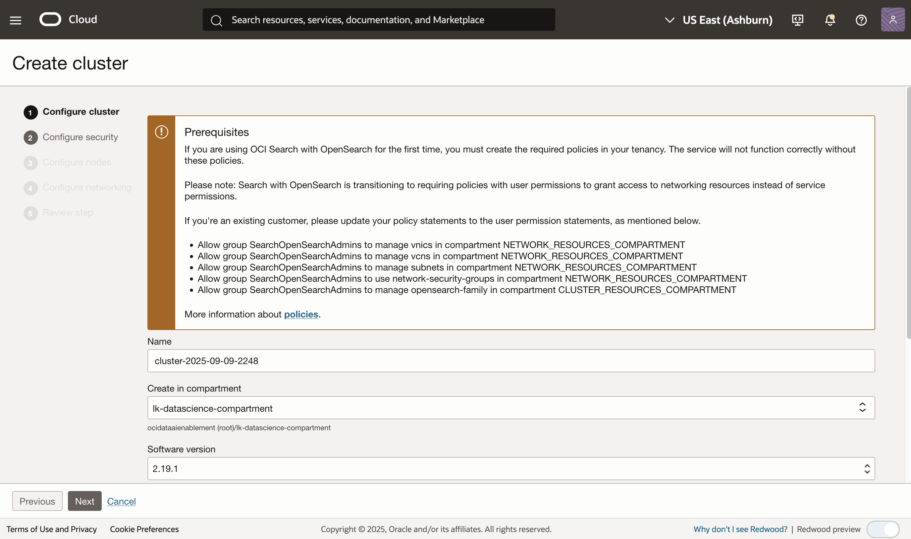

# Deploy an OCI OpenSearch cluster

## Introduction

In this lab, you will create an OCI OpenSearch cluster using the Oracle Cloud Console.

Estimated Time: 30 minutes

### Objectives

In this lab, you will:
- Create an OCI OpenSearch cluster in the same *compartment, vcn, and subnet* as the one created in the previous Lab
- Test the connectivity to the cluster from the OCI Compute instance created in Lab 1.

<br />

## Task 1: Create an OCI Search Service cluster

1. Open the Oracle Cloud Console navigation menu. Click **Databases**, **OpenSearch**, and then click **Clusters**. Alternatively, simply type *opensearch* in the search bar of the side menu that appears and click on **Cluster** Then, click **Create cluster**. Provide *opensearch-cluster* as name and select *opensearch-livelab* as the compartment where you want to create the cluster.
   

2. Click on **Create Cluster** to  open the Opensearch cluster creation wizard and follow the instruction.
3. Enter a Cluster **Name**; select the compartment created in previous steps; select the latest available opensearch version (**3.0**) and click **Next**


5. Enter cluser **Username** and **Password**. Be sure to note this somewhere as you will need to use these to access the cluster and it's dashboard


6. Choose the cluster sizing, and then click **Next**.

7. Select the VCN you created and then select the private subnet.

   
8. Review the summary and click **Create cluster**

   

9. Click **Next**, and then **Create**. You will be redirected to the OpenSearch cluster details page.


10. Copy your API Endpoint, as found in the cluster details page, in the Cluster information section. It will be needed in the following labs.


<br /><br />

## Task 2: Access the Opensearch Cluster and Check Health Status

In oder to connect to the OpenSearch cluster, we need to have a compute instance on the same subnet as the cluster and SSH to that instance first. We can simply re-use the compute instance created in the previous Lab.
You can find more information [here] (https://docs.oracle.com/en/learn/oci-opensearch/index.html#task-3-test-the-connection-to-oci-search-service--opensearch-endpoint)

1. **Option 1**: Port forward directly from your local machine and expose port 9200 and 5601 for data ingestion and dashboard access respectively

   - Run the following port forwarding SSH command in the terminal. Do not close the terminal to ensure that the connection remains active.

      ```bash
      <copy>ssh -C -v -t -L 127.0.0.1:5601:<your_opensearch_dashboards_private_IP>:5601 -L 127.0.0.1:9200:<your_opensearch_private_IP>:9200 opc@<your_VM_instance_public_IP> -i ~/.ssh/id_rsa</copy>
      ```

   - Open a new terminal window and run the following command.

      ```bash
      <copy>curl https://localhost:9200/_cluster/health?pretty --insecure</copy>
      ```
2. **Option 2**: Connect to cluster from inside the compute instance:
   - First access the compute instance
      ```bash
      <copy>ssh -i ~/.ssh/id_rsa opc@<your_VM_instance_public_IP></copy>
         ```

   - Run the following command, after replacing mycluster.opensearch.us.example.com with your search API endpoint:

      ```bash
      <copy>curl -XGET "https://<YOUR_OPENSEARCH_PRIVATE_IP>:9200/_cluster/health?pretty" -k -u <USERID:PASSWORD></copy>
      ```

If all the steps were performed correctly you should see a response as follows:

```json
{
  "cluster_name": "amaaaaaallb34niam4xh6njgo6bxsbj7qxbu6k6ojx5a73mu4mrrkz6rhkva",
  "status": "yellow",
  "timed_out": false,
  "number_of_nodes": 2,
  "number_of_data_nodes": 1,
  "discovered_master": true,
  "discovered_cluster_manager": true,
  "active_primary_shards": 41,
  "active_shards": 41,
  "relocating_shards": 0,
  "initializing_shards": 0,
  "unassigned_shards": 20,
  "delayed_unassigned_shards": 0,
  "number_of_pending_tasks": 0,
  "number_of_in_flight_fetch": 0,
  "task_max_waiting_in_queue_millis": 0,
  "active_shards_percent_as_number": 67.21311475409836
}
```


<br /><br />

## Task 3: Connect to OpenSearch Dashboards

1. From your local machine, establish port forwarding. You can find more information on how to connect to a cluster/dahboard You can find more information [here] (https://docs.oracle.com/en/learn/oci-opensearch/index.html#task-3-test-the-connection-to-oci-search-service--opensearch-endpoint)


      ```bash
      <copy>ssh -C -v -t -L 127.0.0.1:5601:<your_opensearch_dashboards_private_IP>:5601 opc@<your_instance_public_ip> -i <path_to_your_private_key></copy>
      ```

2. Access https://localhost:5601 in your browser. Whe prompted, enter the username and password to login into the dashboard
   > **Note:** Currently, depending on the browser, a warning message similar to "Your connection is not private" is displayed. Choose the option which allows you to proceed. The following screen is then displayed:

   


## Acknowledgements

* **Author** - Landry Kezebou
* **Last Updated By/Date** - Landry Kezebou, September 2025
