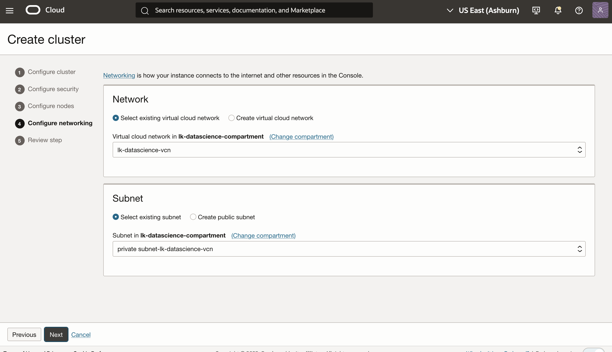
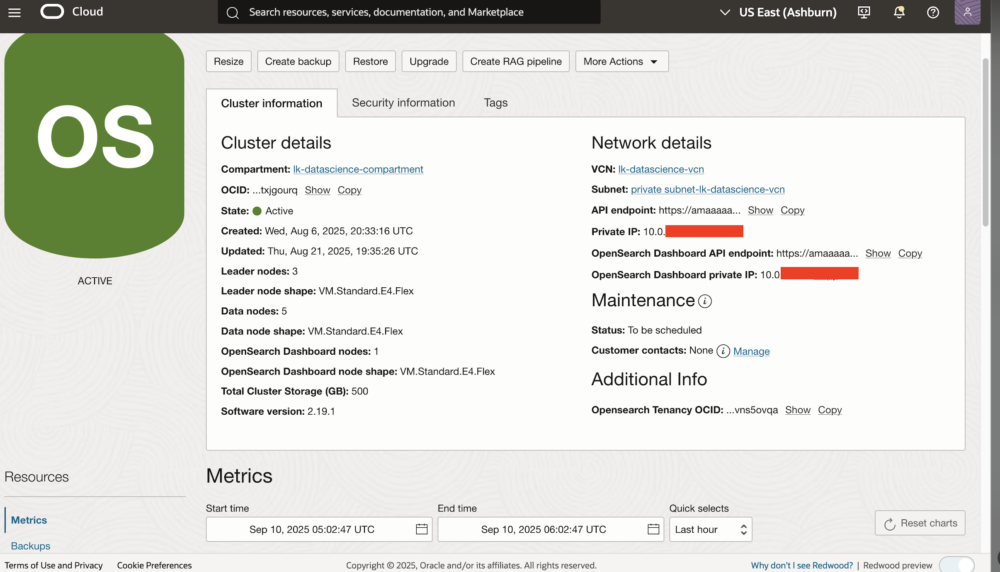
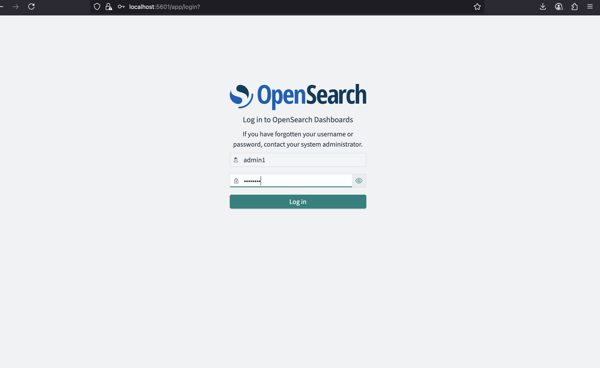

# Create and Access OpenSearch Cluster

## Introduction

In this lab, you will create an OCI OpenSearch cluster using the Oracle Cloud Console.

**Estimated Time: 10 minutes**

### Objectives

In this lab, you will:
- Create an OCI OpenSearch cluster in the same *compartment, vcn, and subnet* as the one created in the previous Lab
- Test the connectivity to the cluster from the OCI Compute instance created in Lab 1.

> Note: If you are using the LiveLab SandBox, Please verify that opensearch cluster is already present in your environment. If present, please skip to  **Task 2** to connect to your cluster.

<br />

## Task 1: Create an OCI Search Service cluster (Skip if cluster already provisioned in your compartment)
<br />

1. Open the Oracle Cloud Console navigation menu.
   - Click **Databases**, **OpenSearch**, then click **Clusters**. Alternatively, simply type *opensearch* in the sidebar search area and click on **Cluster**
   - Click **Create cluster**. Provide *opensearch-cluster* as name and select *opensearch-livelab* as the compartment where you want to create the cluster.
   <br />

   
<br />


2. Click on **Create Cluster** to  open the Opensearch cluster creation wizard and follow the instructions.
3. Enter a Cluster **Name**; select the compartment created in previous steps; select the latest available opensearch version (**3.0**) and click **Next**


<br />

5. Enter cluser **Username** and **Password**. Be sure to note this somewhere as you will need to use these to access the cluster and it's dashboard


6. Choose the cluster sizing, and then click **Next**.

7. Select the VCN you created and then select the private subnet.

   

<br />

8. Review the summary and click **Create cluster**

   

<br />

9. Click **Next**, and then **Create**. You will be redirected to the OpenSearch cluster details page.



10. Copy your API Endpoint, as found in the cluster details page, in the Cluster information section. It will be needed in the subsequent labs.


<br /><br />

## Task 2: Access the Opensearch Cluster and Check Health Status

In oder to connect to the OpenSearch cluster, we need to SSH into an existing compute instance on the same vcn and subnet as the cluster. This is the compute instance you created in the previous lab.  The compute instance created in the previous Lab.
You can find more information in the [connection-to-oci-search-service--opensearch-endpoint](https://docs.oracle.com/en/learn/oci-opensearch/index.html#task-3-test-the-connection-to-oci-search-service--opensearch-endpoint) documentation.

1. **Option 1**: Port forward directly from your local machine and expose port 9200 and 5601 for data ingestion and dashboard access respectively

   - Run the following port forwarding SSH command in the terminal. Do not close the terminal to ensure that the connection remains active.

      ```powershell
      <copy>
      ssh -C -v -t -L 127.0.0.1:5601:<your_opensearch_dashboards_private_IP>:5601 -L 127.0.0.1:9200:<your_opensearch_private_IP>:9200 opc@<your_VM_instance_public_IP> -i ~/.ssh/id_rsa
      </copy>
      ```

   - To test this connection, open a new terminal window and run the following command.

      ```powershell
      <copy>
      curl https://localhost:9200/_cluster/health?pretty --insecure
      </copy>
      ```
<br/>

2. **Option 2**: Connect to cluster from inside the compute instance:
   - First access the compute instance
      ```powershell
      <copy>
      ssh -i ~/.ssh/id_rsa opc@<your_VM_instance_public_IP>
      </copy>
      ```

   - Run the following command, after replacing *mycluster.opensearch.us.example.com* with your search API endpoint:

      ```powershell
      <copy>
      curl -XGET "https://<YOUR_OPENSEARCH_PRIVATE_IP>:9200/_cluster/health?pretty" -k -u <USERID:PASSWORD>
      </copy>
      ```

If all the steps were performed correctly you should see a response as follows:

```json
<copy>
{
  "cluster_name": "amaaaaaallb34niam4xh6njgo6bxsbj7qxbu6k6ojx5a73mu4mrrkz6rhkva",
  "status": "green",
  "timed_out": false,
  "number_of_nodes": 2,
  "number_of_data_nodes": 1,
  "discovered_master": true,
  "discovered_cluster_manager": true,
  "active_primary_shards": 61,
  "active_shards": 61,
  "relocating_shards": 0,
  "initializing_shards": 0,
  "unassigned_shards": 0,
  "delayed_unassigned_shards": 0,
  "number_of_pending_tasks": 0,
  "number_of_in_flight_fetch": 0,
  "task_max_waiting_in_queue_millis": 0,
  "active_shards_percent_as_number": 100.00
}
</copy>
```


<br /><br />

## Task 3: Connect to OpenSearch Dashboards

1. From your local machine, establish port forwarding. You can find more information on [how to connect opensearch dashboard](https://docs.oracle.com/en/learn/oci-opensearch/index.html#task-3-test-the-connection-to-oci-search-service--opensearch-endpoint)


```powershell
<copy>
ssh -C -v -t -L 127.0.0.1:5601:<your_opensearch_dashboards_private_IP>:5601 -L 127.0.0.1:9200:<your_opensearch_private_IP>:9200 opc@<your_VM_instance_public_IP> -i ~/.ssh/id_rsa
</copy>
```

<br/>

2. Access *https://localhost:5601* in your browser. When prompted, enter the **username** and **password** to login into the dashboard

   > **Note:** Currently, depending on the browser, a warning message similar to **"Your connection is not private"** is displayed. Choose the option which allows you to proceed.

   If done right, you should see the following screen displayed:
   <br/>

   
   


## Acknowledgements

* **Author** - **Landry Kezebou**, Lead AI/ML Engineer, OCI Opensearch
* **Created** - September 2025
