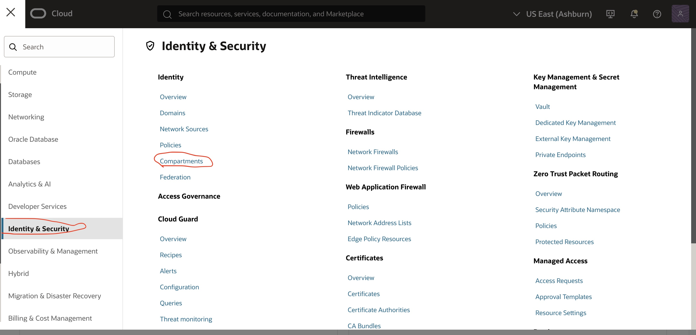
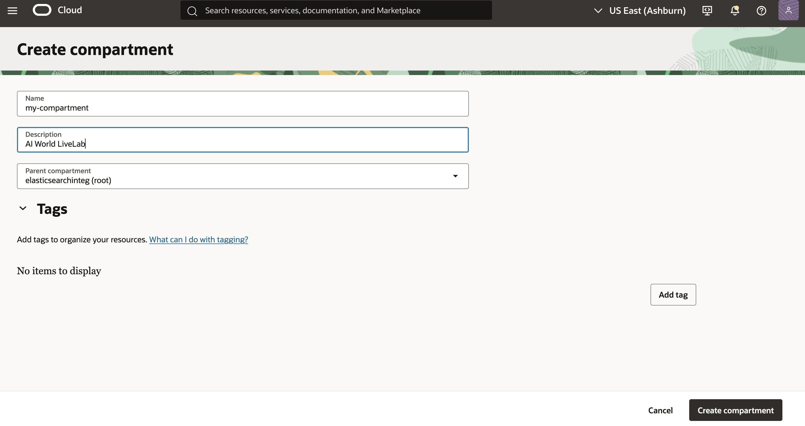
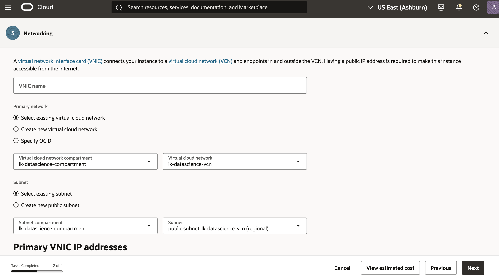
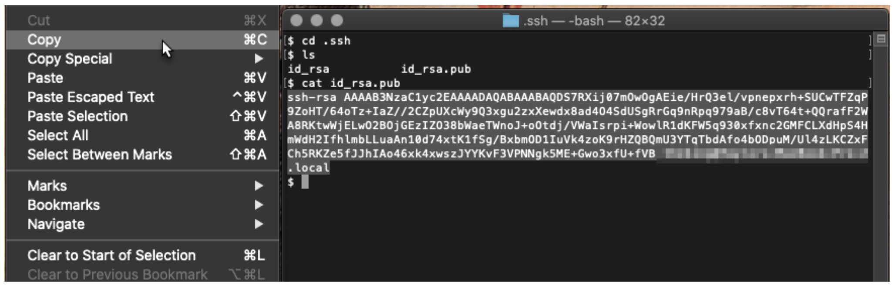

# Pre-requisites

## Introduction

In this lab, Your goal is to create an OCI Opensearch cluster  and  access the opensearch dashboard.

> **If using the LiveLab provided tenancy, first Login to OCI console and verify what resources are already auto-provisioned to save time. If Opensearch cluster and required policies already configured, please Skip to Task 5. Otherwise, follow instructions to only provision the missing resources.**

> **If using your own tenancy, please follow the instructions in this Lab step by step.**


**Estimated Time: 10 minutes**

### Objectives

In this lab, you will learn how to:

- Create a Compartment
- Create a (user) Group
- Create a Policy
- Create a VCN with internet connectivity and add Security List rules
- Create an Opensearch Cluster
- Create ssh key pair
- Create an OCI Compute instance in order to later access the OCI OpenSearch cluster Search API and Dashboards

## Task 1: Compartment creation

In this task, you will create a dedicated compartment for this live lab, if you haven't done so beforehand.

1. Login to tenancy
2. Click the **main menu** icon to open the side menu.
3. Click **Identity & Security** and select **Compartments** under the **Indenty** Group. Alternatively, just type **compartment** in the side menu search bar and click on **Compartment** option that apears.
4. Click on **Create Copartment** and Provide your compartment  **Name**, and **Description** in the respective fields, and select the root-parent.
5. Click **Create Compartment**.

   
   


<br /><br /><br />

## Task 2: User group creation

In this task, you will create a dedicated user group. This helps group users in a logical way such that privileges assigned to the group are by default inherited by all user members of that group.

1. Click the main menu icon to open the side menu.
2. Click **Identity & Security** and select **Domains** under the **Identity** Group.
3. In the page the opens, select an exiting Domain or Create a new one.
4. Under this Domain, navigate to the **User Management** Tab and Click **Create** to start creating a new User Group
5. Provide the **Name**, a **Description** of your choice.
6. Open the group you've created and click **Add User to Group**.
7. Select your current user and click **Add**.

   
   


<br /><br /><br />

## Task 3: Policy setup

In this task, you will create the required OCI IAM policy.

1. Click the **main menu icon** to open the side menu bar.
2. Click **Identity & Security** then select **Policies**.
3. Provide a policy **Name**, and a **Description** of your choice, and choose the correct compartment (should be the compartment name created earlier).
4. Click **Show manual editor** and paste the content below in the editor. Be sure to change **opensearch-group** and **os_compartment** with the correct name for your user group and compartment defined in steps 1 & 2

```bash
Allow group opensearch-group to manage opensearch-family in compartment os_compartment
Allow group opensearch-group to manage subnets in compartment os_compartment
Allow group opensearch-group to manage vcns in compartment os_compartment
Allow service opensearch to manage vcns in compartment os_compartment
Allow service opensearch to manage vnics in compartment os_compartment
Allow service opensearch to use subnets in compartment os_compartment
Allow service opensearch to use network-security-groups in compartment os_compartment
```

   


<br /><br /><br />

## Task 4: Networking setup

In this task, you will create a VCN with a public subnet and a private subnet.

1. Navigate to the OCI Console menu.
2. Click **Networking**. and then click **Virtual Cloud Networks**.
3. Click **Start VCN Wizard**, and then click **Create VCN with Internet Connectivity**.
4. Provide  as VCN Name and select the compartment you created earlier.
5. Leave the default values in the remaining fields, click **Next**, and then click **Create**
This action will automatically take you to the VCN details page.

   

6. Open your newly created vcn, navigate to the **Security** Tab, and click **CreateSecurity Lists** and follow the instructions to create a security list.
7. Once Security List created, click on it and then navigate to the **Security List** Tab, then click on **Add Ingress Rules**
8. In **Source CIDR**, add *10.0.0.0/16*, in **Destination Port Range**, type *9200,5601* and click **Add**.


   

   You should see the following as result.
   


<br /><br /><br />

## Task 5: Create SSH-KEY Pair
In this task, you will create an ssh key pairs which you will need to create and access a compute instance from your local machine

1. On MAC
      1. Open a Terminal window on your Mac . Start up Terminal and type in the command *ssh-keygen*. ssh-keygen will ask you where to save the key, accept the default of the .ssh folder in your home directory by pressing Enter. File name will be **id_rsa** or whatever you choose to name your key. Press Enter twice for no passphrase. Remember the directory where you saved your key **(~/.ssh)**, you will need to reference it later when you create your instance.
            ```
            ssh-keygen -b 2048 -t rsa
            ```
         
      2. Verify that the key has been generated
            ```
            cd .ssh
            ls
            cat id_rsa.pub
            ```
         

         Note in the output that there are two files, a private key: **id_rsa** and a public key: **id_rsa.pub**. Keep the private key safe and don’t share its content with anyone. The public key will be needed for various activities and can be uploaded to certain systems as well as copied and pasted to facilitate secure communications in the cloud.


2. On Windows:
    Click on the link below for a more comprehensive and detailed instruction on how to [configure ssh-key pair for both Windows and Mac computers](https://docs.oracle.com/en/learn/generate_ssh_keys/index.html#option-2--macos)


<br /><br /><br />

## Task 6: Compute instance setup

In this task, you will create an OCI Compute instance in the public subnet of the previously created VCN, in order to access the OpenSearch Search API and Dashboards, which are to be created in the private subnet of the same VCN.


1. Navigate to the control menu
2. Click **Compute**, and then click **Instances**.
3. Click **Create instance**.
4. Provide the instance **Name**, and select the compartment created earlier.
5. In the **Image and shape** area, use the default values.
6. In the **Networking** area, select *vcn and subnet you created in the previous steps* , for VCN and Subnet fields, respectively.


7. In the **Add SSH keys area**, Select the Option to **Paste public key**. Go back to the terminal from step above where you generated the ssh key. execute the ``` cat ~/.ssh/id_rsa.pub``` command to print the public key to your terminal. Copy this key and paste into your **SSH public Key** text bar in console then click next and follow the rest of the of the instrusctions to finish creating your instance.



8. Leave the remaining options with the default values and click **Create**.

> **Note:** If you run into permission issue Remember to run the following command or an equivalent one, to give proper permissions to your key.
```bash
chmod 600 ~/.ssh/id_rsa
```


9. Once instance creation successful, you need to verify that you can now test connecting to the instance from you local computer
      - Navigate to your newly created compute instance and copy the public IP address
      - Open a terminal window and run the command below:
      ```
      ssh opc@YOU_INSTANCE_PUBLIC_IP —i ~/.ssh/id_rsa
      ```


<br /><br /><br />
## Acknowledgements

* **Author** - **Landry Kezebou**, Lead AI/ML Engineer, OCI Opensearch
* **Created** - September 2025

