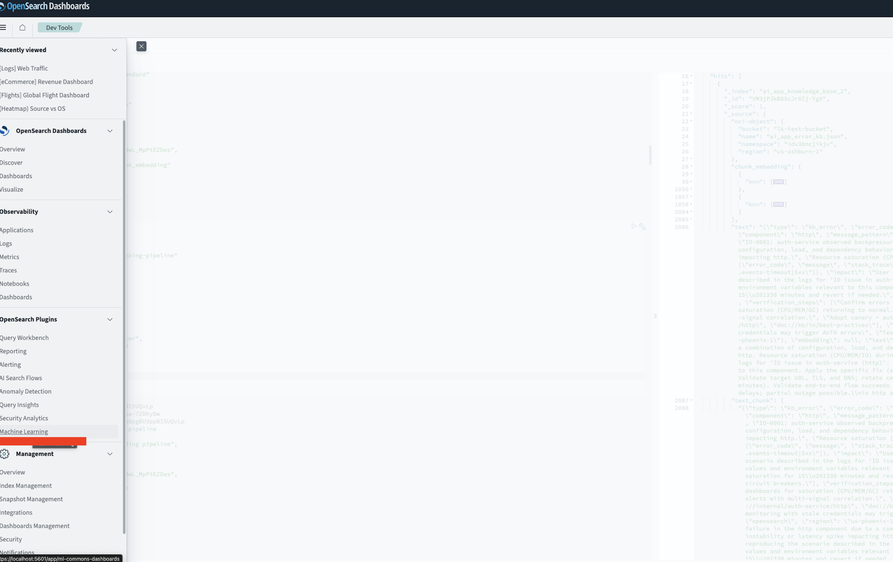
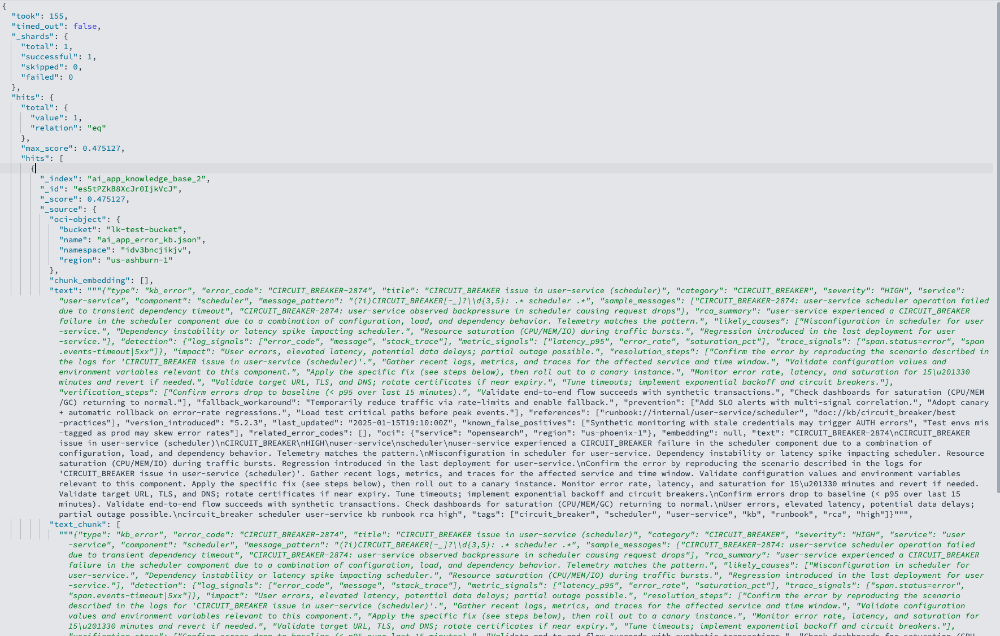
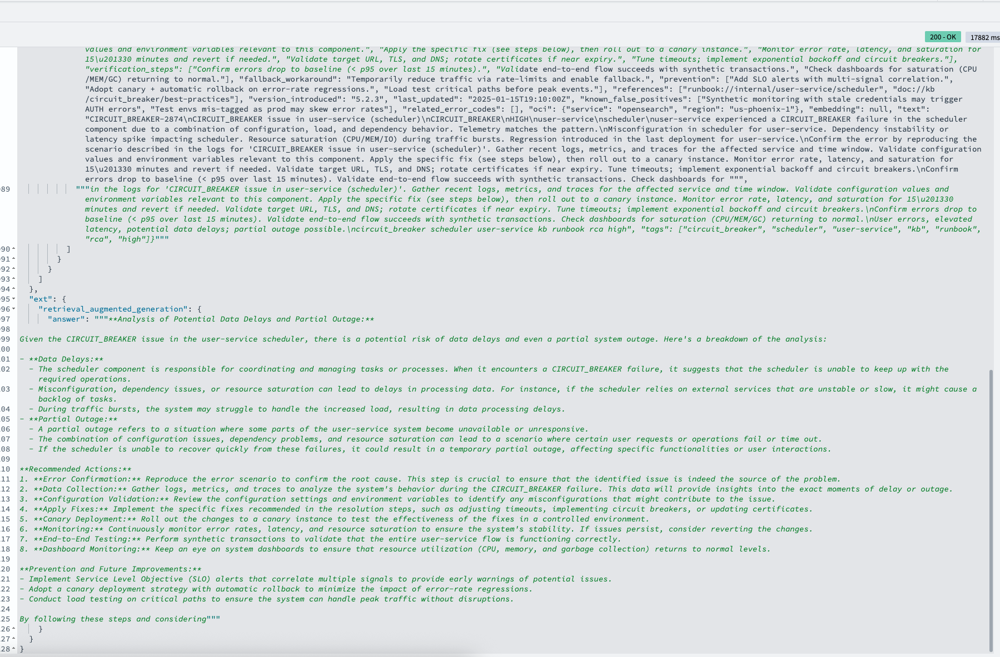

# Semantic Search & Conversational search


## Introduction

In this lab, you will perform perform Semantic Search and Conversational Search on the app knowledge base index we created in the previous lab which should be streaming data from your object storage bucket already.

**Estimated Time: 10 minutes**

### Objectives
In this lab, you will:
- Perform semantic search
- Perform Conversational Search

## Pre-requisites
- You have to have an existing OpenSearch cluster and have to be able to connect to the Dashboard, to perform all of the steps.
- You have complete the Lab on Deploying Models and Creating Ingestion Pipelines
- You have created you Ingestion pipeline and KNN index in the previous Labs
- You have successfully configured your data prepper pipeline
- You have uploaded documents in your object storage bucket for the data prepper pipeline to start streaming into your opensearch index.


## Task 1: Retrieve embedding Model ID and LLM model ID
In one of the previous Labs, we deployed a pre-trained embedding model, a cohere embedding model, and an llm model.
You will need the model ID for these models for the subsequent steps. If you forgot to note them down earlier, you can always Navigate to the **Machine Learning** Tab on Opensearch Dashboard  menu  to view what models are deployed, view the status of the model and copy the modelIds of interest.

1. Login into the Opensearch dashboard [https://localhost:5601](https://localhost:5601) from your local browser.
2. Click on the menu button then click on  **Machine Learning**
3. Locate the model of interest and click on the little copy icon near the model ID on the Model ID column.
<br/>




<br/><br/>


## Task 2: Perform Hybrid Search (Keyword + Semantic Search)
To perform Semantic Search on a given Index you can run the command below. The semantic search uses the engine specified in the index (luce, nmslib, faiss) as well as the ANN engine configurations to find the most relevant documents similar to the input query. Replace the **EMBEDDING_MODEL_ID** with the modelId for your pre-trained model.

```json
<copy>
GET app_knowledge_base/_search
{
  "query": {
    "bool" : {
      "should" : [
        {
          "script_score": {
            "query": {
              "neural": {
                "embedding": {
                  "query_text": "potential data delays; partial outage possible",
                  "model_id": "EMBEDDING_MODEL_ID",
                  "k": 2
                }
              }
            },
            "script": {
              "source": "_score * 1.5"
            }
          }
        }
      ]
    }
  },
  "fields": [
    "text"
  ],
  "_source": false
}
</copy>
```

If you created an index that uses automated Chunking, run the command below instead:

```json
<copy>
GET app_knowledge_base/_search
{
  "size": 10,
  "query": {
    "bool": {
      "must": [
        {
          "nested": {
            "path": "chunk_embedding",
            "query": {
              "neural": {
                "chunk_embedding.knn": {
                  "query_text": "potential data delays; partial outage possible",
                  "model_id": "EMBEDDING_MODEL_ID",
                  "k": 2
                }
              }
            },
            "score_mode": "max"
          }
        }
      ]
    }
  }
}
</copy>
```

Example response:



<br/>

Below is a more sophisticated hybrid search on KNN index with automated chunking:

```json
<copy>
GET app_knowledge_base/_search
{
  "size": 10,
  "query": {
    "match": { "text": "potential data delays; partial outage possible" }
  },
  "rescore": {
    "window_size": 200,
    "query": {
      "rescore_query": {
        "nested": {
          "path": "chunk_embedding",
          "score_mode": "max",
          "query": {
            "neural": {
              "chunk_embedding.knn": {
                "query_text": "potential data delays; partial outage possible",
                "model_id": "EMBEDDING_MODEL_ID",
                "k": 200
              }
            }
          }
        }
      },
      "query_weight": 0.25,
      "rescore_query_weight": 1
    }
  },
  "highlight": { "fields": { "text": {} } }
}
</copy>
```

> Note: You can refer to our [documentation](https://docs.oracle.com/en-us/iaas/Content/search-opensearch/Concepts/semanticsearch.htm#register-model) for more details on semantic search and hybrid search. You can follow the instructions on that page to create a  simple index and ingest a small sample data to play around with semantic search.

<br/><br/><br/>


## Task 2: Perform Conversational Search

We already registered and deployed an llm model in the previous lab. We will be using that llm model as well as the embedding model to perform RAG on the knowledge base.

1. Create Conversation ID for memory.

```json
<copy>
POST /_plugins/_ml/memory
{
  "name": "rag-conversation"
}
</copy>
```


Response:

```json
{
  "memory_id": "<conversation_ID>"
}
```


2. Create a RAG pipeline using your deployed llm modelID, as shown in the following example. replace <llm_model_ID> with your llm ModelID, <conversation_ID> with your conversationID from previous step. Replace the field ["text"] with the list of fields in your index that you want to consider in the llm context to augment knowledge. Replace *demo_rag_pipeline* with any name you want to call your pipeline.

```json
<copy>

PUT /_search/pipeline/demo_rag_pipeline
{
  "response_processors": [
    {
      "retrieval_augmented_generation": {
        "tag": "genai_conversational_search_demo",
        "description": "Demo pipeline for conversational search Using Genai Connector",
        "model_id": "<llm_model_ID>",
        "context_field_list": ["text"],
        "system_prompt":"hepfull assistant",
        "user_instructions":"generate concise answer"
      }
    }
  ]
}
</copy>
```

3. Run the following query to perform RAG on your index:

```json
<copy>

GET app_knowledge_base/_search?search_pipeline=demo_rag_pipeline
{
  "query": {
   "bool": {
      "must": [
        {
          "nested": {
            "path": "chunk_embedding",
            "query": {
              "neural": {
                "chunk_embedding.knn": {
                  "query_text": "please analyze potential data delays; partial outage possible",
                  "model_id": "EMBEDDING_MODEL_ID",
                  "k": 2
                }
              }
            },
            "score_mode": "max"
          }
        }
      ]
    },
    "ext": {
        "generative_qa_parameters": {
            "llm_model": "oci_genai/cohere.command.a",
            "llm_question": "please analyze potential data delays; partial outage possible",
            "context_size": 2,
            "interaction_size": 1,
            "timeout": 15
        }
    }
}
}

</copy>
```


If running on index with Chunking:

```json
<copy>

GET app_knowledge_base/_search?search_pipeline=demo_rag_pipeline
{
  "query": {
    "bool": {
      "must": [
        {
          "nested": {
            "path": "chunk_embedding",
            "query": {
              "neural": {
                "chunk_embedding.knn": {
                  "query_text": "potential data delays; partial outage possible",
                  "model_id": "EMBEDDING_MODEL_ID",
                  "k": 1
                }
              }
            },
            "score_mode": "max"
          }
        }
      ]
    }
  },
    "ext": {
        "generative_qa_parameters": {
            "llm_model": "oci_genai/cohere.command.a",
            "llm_question": "please analyze potential data delays; partial outage possible",
            "context_size": 2,
            "interaction_size": 1,
            "timeout": 15
        }
    }
}}

</copy>
```

Response:



For more details on RAG pipeline and conversational search, please refer to our [Tutorial Documentation](https://docs.oracle.com/en-us/iaas/Content/search-opensearch/Concepts/ocigenaiconnector.htm).


## Acknowledgements

* **Author** - **Landry Kezebou**, Lead AI/ML Engineer, OCI Opensearch
* **Created** - September 2025
