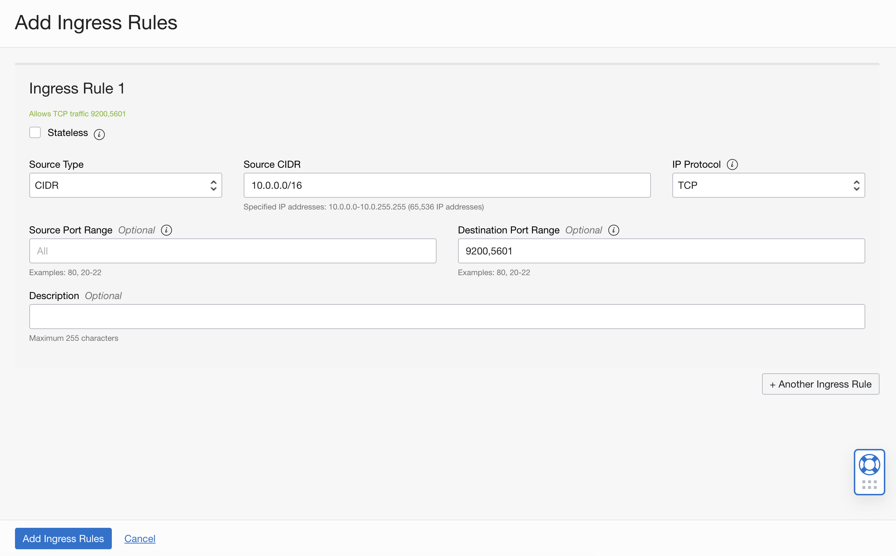

# Search and visualize data using OCI Search Service with OpenSearch

## Introduction

In this lab, you will focus on understanding the pre-requisites and setting up your tenancy for the subsequent creation of an OCI OpenSearch cluster.

Estimated Time: 15 minutes

### Objectives

In this lab, you will:
- Create a Compartment
- Create a (user) Group
- Create a Policy
- Create a VCN with internet connectivity and add Security List rules
- Create an OCI Compute instance in order to later access the OCI OpenSearch cluster Search API and Dashboards

## Task 1: Compartment creation

In this task, you will create a dedicated compartment for this live lab, if you haven't done so beforehand.

1. Click the main menu icon to open the side menu.
2. Click **Identity** and select **Compartments**.
3. Provide *opensearch-livelab* as **Name**, a **Description** of your choice, and leave the root level as Parent.
4. Click **Create Compartment**.

   

## Task 2: User group creation

In this task, you will create a dedicated user group.

1. Click the main menu icon to open the side menu.
2. Click **Identity** and select **Groups**.
3. Provide *opensearch-group* as **Name**, a **Description** of your choice.
4. Click **Create**.
5. Open the group you've created and click **Add User to Group**.
6. Select your current user and click **Add**.

   

## Task 3: Policy setup

In this task, you will create the required OCI IAM policy.

1. Click the main menu icon to open the side menu.
2. Click **Identity** and select **Policies**.
3. Provide *opensearch-policy* as **Name**, a **Description** of your choice, and choose *opensearch-livelab* as compartment.
4. Click **Show manual editor** and paste the content below in the editor.

   ```html
   <copy>Allow group opensearch-group to manage opensearch-family in compartment opensearch-livelab
   Allow service opensearch to manage vcns in compartment opensearch-livelab
   Allow service opensearch to manage vnics in compartment opensearch-livelab
   Allow service opensearch to use subnets in compartment opensearch-livelab
   Allow service opensearch to use network-security-groups in compartment opensearch-livelab</copy>
   ```

   

## Task 4: Networking setup

In this task, you will create a VCN with a public subnet and a private subnet.

1. Open the Oracle Cloud Console navigation menu.
2. Click **Networking**. and then click **Virtual Cloud Networks**.
3. Click **Start VCN Wizard**, and then click **Create VCN with Internet Connectivity**.  
4. Provide *opensearch-vcn* as VCN Name and select *opensearch-livelab* as compartment.
5. Leave the default values in the remaining fields, click **Next**, and then click **Create** 
This action will automatically take you to the VCN details page.

   

6. While on the VCN details page, click **Security Lists** on the left side of the screen.
7. Click **Security List for Private Subnet-opensearch-vcn**
8. Click **Add Ingress rules**
9. In **Source CIDR**, add *10.0.0.0/16*, in **Destination Port Range**, type *9200,5601* and click **Add**.

   

   You should see the following as result.
   

## Task 5: Compute instance setup

In this task, you will create an OCI Compute instance in the public subnet of the previously created VCN, in order to access the OpenSearch Search API and Dashboards, which are to be created in the private subnet of the same VCN.

1. Open the Oracle Cloud Console navigation menu.
2. Click **Compute**, and then click **Instances**.
3. Click **Create instance**.
4. Provide *opensearch-instance* as **Name**, and select *opensearch-livelab* as compartment.
5. In the **Image and shape** area, use the default values.
6. In the **Networking** area, select *opensearch-vcn* and *Public Subnet-opensearch-vcn*, for VCN and Subnet, respectively.
7. In the **Add SSH keys area**, decide whether you want to use an existing SSH key, or generate a new SSH key. If you choose to generate a new SSH key, remember to download the private key. 
8. Leave the remaining options with the default values and click **Create**.

> **Note:** Remember to run the following command or an equivalent one, to give proper permissions to your key.
```bash
<copy>chmod 600 <your_key></copy>
```

## Acknowledgements

* **Author** - Nuno Gonçalves
* **Last Updated By/Date** - Nuno Gonçalves, August 2022