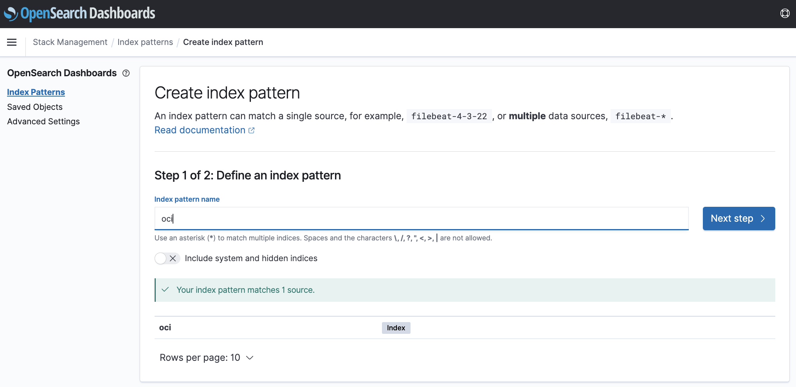
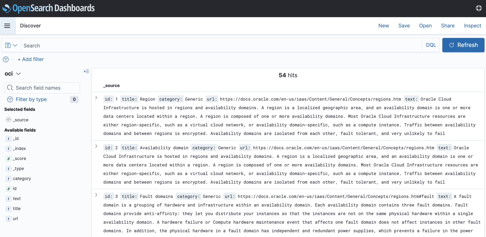

# Visualize data with OpenSearch Dashboards

## Introduction

In this lab, you will explore OpenSearch Dashboards, the OpenSearch visualization platform.

Estimated Time: 15 minutes

### Objectives

In this lab, you will:
- Establish port forwarding to ensure connectivity to the OpenSearch Dashboards from your local machine
- Search data using the Discover interface
- Create a simple pie chart for the sample data

## Task 1: Connect to OpenSearch Dashboards

1. From your local machine, establish port forwarding.

      ```bash
      <copy>ssh -C -v -t -L 127.0.0.1:5601:<your_opensearch_dashboards_private_IP>:5601 opc@<your_instance_public_ip> -i <path_to_your_private_key></copy>
      ```

2. Access https://localhost:5601 in your browser.  
   > **Note:** Currently, depending on the browser, a warning message similar to "Your connection is not private" is displayed. Choose the option which allows you to proceed. The following screen is then displayed:  

   

## Task 2: Search and visualize data in OpenSearch Dashboards

1. With the port forwarding connection in place, access https://localhost:5601 in your browser.
2. Open the OpenSearch Dashboards navigation menu.
3. Click **Management**, then click **Stack Management**, and then click **Index Patterns**. Create an index pattern, with name = `oci`.

   

4. Open the OpenSearch Dashboards menu, and then click **Discover** to use the OpenSearch Dashboards UI to search your data. Enter a sample keyword, such as `kubernetes`, and click **Refresh**.

   

5. Open the OpenSearch Dashboards menu, click **Dashboards** and follow these steps to create a sample pie chart.

      1. Click **Create new**, then click **New Visualization**, and then click **Pie**.

      

      2. Choose `oci` as source.

      3. In **Buckets**, click **Add**, and then click **Split slices**. Provide the parameters as shown in the following image and click **Update**.

      

## Acknowledgements

* **Author** - Nuno Gonçalves
* **Last Updated By/Date** - Nuno Gonçalves, September 2022