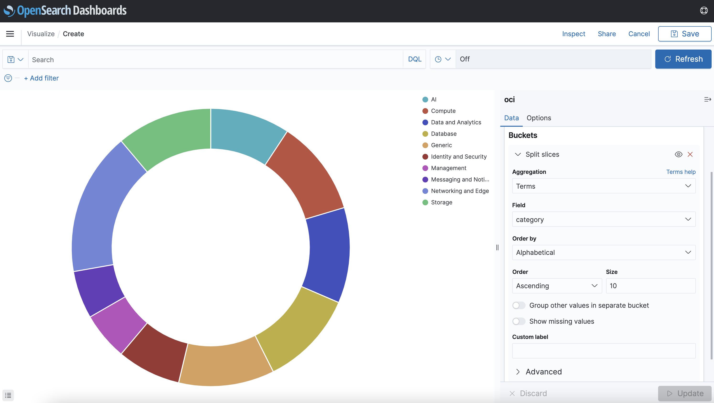

## Introduction

In this session, you will focus on data visualization via OpenSearch Dashboards.

Estimated Time: 15 minutes

### Objectives

In this lab, you will:
- Establish port forwarding to ensure connectivity to the OpenSearch Dashboards from your local machine
- Search data using the Discover interface
- Create a simple pie chart for the sample data

## Task 1: Connect to OpenSearch Dashboards

1. From your local machine, through port forwarding.
   > **Note:** Ignore this step if you’ve executed it in the previous steps and the connection is still open.

   ```
   ssh -C -v -t -L 127.0.0.1:5601:<your_opensearch_dashboards_private_IP>:5601 opc@<your_instance_public_ip> -i <path_to_your_private_key>
   ```

2. Access https://localhost:5601 in your browser.  
   > **Note:** Currently, depending on the browser, a warning message similar to "Your connection is not private" is displayed. Choose the option which allows you to proceed. The following screen is then displayed:  

   


## Task 2: Search and visualize data in OpenSearch Dashboards

1. With the port forwarding connection in place, access https://localhost:5601 in your browser.
2. Open the OpenSearch Dashboards navigation menu.
3. Click **Management**, then click **Stack Management**, and then click **Index Patterns**. Create an index pattern, with name = `oci`.

   

3. Open the OpenSearch Dashboards menu, and then click **Discover** to use the OpenSearch Dashboards UI to search your data.  

   

4. Open the OpenSearch Dashboards menu, click **Dashboards** and follow these steps to create a sample pie chart.

   1. Click **Create new**, then click **New Visualization**, and then click **Pie**.

   

   2. Choose `oci` as source.

   3. In **Buckets**, click **Add**, and then click **Split slices**. Provide the parameters as shown in the following image and click **Update**.

   
