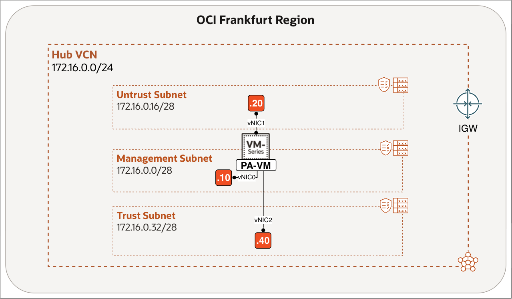

# Introduction

## About this Workshop

Modern cloud architectures often require advanced network security capabilities beyond traditional security lists and network security groups. While Oracle Cloud Infrastructure (OCI) provides built-in controls, such as OCI Network Firewall, organisations may prefer to extend their existing security posture by using trusted third-party appliances, like Palo Alto Networks Next-Generation Firewalls (NGFW).

This workshop demonstrates how to deploy a Palo Alto NGFW virtual appliance inside OCI and integrate it into a Virtual Cloud Network (VCN) to provide deep packet inspection, threat prevention, and traffic segmentation across workloads.

The deployment adheres to standard OCI network design principles and can serve as a foundation for more advanced architectures, such as centralised inspection hubs or hybrid cloud security integrations.

Estimated Workshop Time: 50 minutes

### Objectives

In this workshop, you will:
1. Deploy and initialise a Palo Alto Networks VM-Series firewall instance from Oracle Cloud Marketplace.
2. Configure the VCN, subnets, and dedicated management, untrust (public), and trust (private) interfaces.
3. Access and implement baseline firewall configuration, including security policies.
4. Understand the single-VCN inspection topology as the baseline for future workshops in this series.

This knowledge will help you design and implement secure OCI network topologies that incorporate third-party firewall appliances, adhering to best practices for segmentation and observability.

### Prerequisites

Before you begin, ensure you have the following:

#### OCI Environment

- An active OCI tenancy with required permissions to create VCNs, subnets, route tables, and compute instances.
- A VCN with at least three subnets (Management, Untrust, and Trust).
- Access to public Internet for the management interface, or a private Bastion host to reach it securely.

> **Note:** If you select the BYOL image, each VM-Series firewall requires outbound internet access to Palo Alto Networks licensing services to activate an authorization code and retrieve its licenses. Offline licensing is supported, but it is not covered in this workshop.

Ensure that each subnet is associated with its own route table and security list, as shown below.

|                   | Route Table     | Security List   |
| ----------------- | --------------- | --------------- |
| Management Subnet | `rt-management` | `sl-management` |
| Untrust Subnet    | `rt-untrust`    | `sl-untrust`    |
| Trust Subnet      | `rt-trust`      | `sl-trust`      |

#### Palo Alto Resources

- A valid Palo Alto Networks support account (for licensing and activation).
- Access to the Palo Alto Networks VM-Series image in the Oracle Cloud Marketplace.

## Learn More

- [Overview of VCNs and Subnets](https://docs.oracle.com/en-us/iaas/Content/Network/Tasks/Overview_of_VCNs_and_Subnets.htm)
- [Prepare to Set Up the VM-Series Firewall on OCI](https://docs.paloaltonetworks.com/vm-series/deployment/public-cloud/set-up-the-vm-series-firewall-on-oracle-cloud-infrastructure/prepare-to-set-up-the-vm-series-firewall-on-oci)

## Acknowledgements

- **Authors** - Anas Abdallah, Iwan Hoogendoorn (Cloud Networking Black Belts)
- **Contributor** - Antonio Gámir (Cloud Networking Black Belt)
- **Last Updated By/Date** - Anas Abdallah, July 2026
